# 编写更干净的代码(有示例)

> 原文：<https://levelup.gitconnected.com/writing-cleaner-code-with-examples-69be2160b4c1>

## 实用编程建议

## 无论何时编写代码，提高信噪比都应该是最重要的。

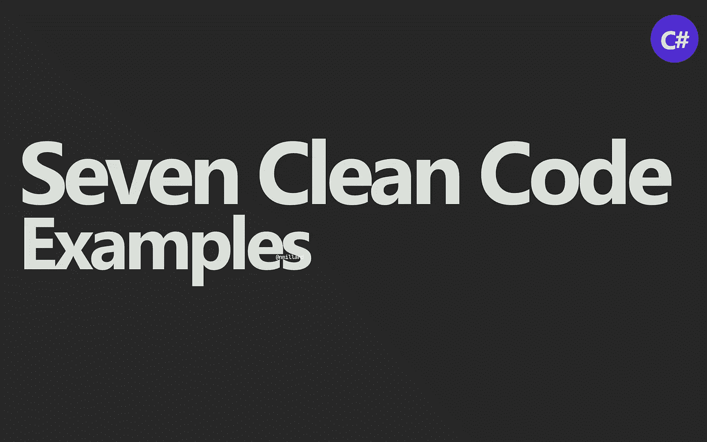

尼克拉斯·米勒德拍摄的图片

代码经常引起“WTF”——每当读者不理解一段代码的目的、目标或者代码过于冗长时。

我想你很清楚我在说什么。

阅读代码，理解语法，应用的模式等。，不是问题。但是，你仍然想知道，“wtf”是怎么回事？他为什么这样写？什么是*即*有条件检查，而*为什么是*？问题的清单还在继续。

干净的代码就是尽可能清晰地传达你的意图。

有时这意味着写更多的代码，有时则意味着写更少的代码。但是，最重要的是，您的代码应该简单、可读性高、可维护，并且清楚地传达意图。

> “WTF”时刻越少越好。

顺便说一下，当我提到“简单”时，我绝对不是在谈论为最小分母(团队中最低级的人)编写代码。

> 快速补充:编写最简单的代码只是为了确保团队中最菜鸟的人能读懂它，这实际上是在给那个人抹黑。

# 没有“意外的”干净代码。

你不会意外地写出干净的代码。这不是你碰巧写的东西。它需要深思熟虑的行动。这需要练习。你甚至可能需要忘记一些过去的做法。

这甚至可能挫伤你的自尊心。

尤其是如果你刚从大学毕业，拥有一个很棒的计算机科学学位，准备单枪匹马地重新实现曾经创建的每一个库。

“好了，说够了。让我们看看一些代码！”…

但是首先，让我来确定这篇文章的范围。我绝对不可能涵盖干净代码的每一个细节，为什么它是重要的，以及它可能采取的所有不同的变化。所以，我挑选了 7 个我经常遇到的场景。

🔔[想要更多这样的文章？在这里签名。](https://nmillard.medium.com/subscribe)

## 多态性带来的清晰性。

任何一直关注我的文章的人都知道，我不可能不抨击那些散布 if-else 的花括号应用程序编码者，他们对多态性或可扩展性没有欣赏力。

花点时间看看下面这个庞然大物的代码片段。

“怎么了？”你可能会问…简单地说*一切*。

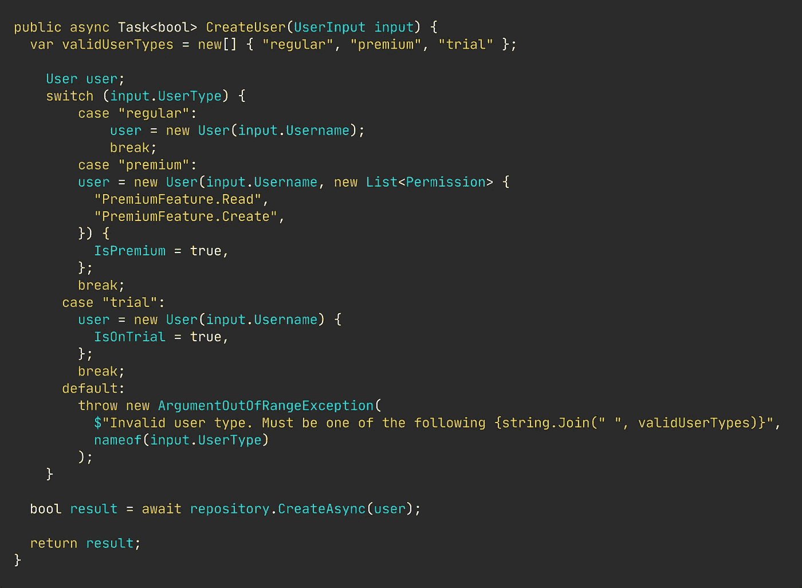

当然，它是为 CPU 和诸如此类的东西优化的。但是清晰却被浪费了。

我们想要达到的目标一点都不清楚。没有明确的责任。同一段代码重复了三次。开闭原则已经过时了。方圆几英里内绝对看不到一行面向对象的代码。可维护性 1/10。可读性-1/10。

但是有一个非常简单的方法。

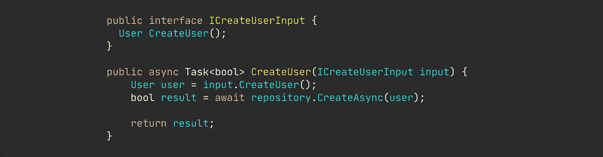

简单明了的代码。

我们走吧。一个“搞什么鬼”的时刻都没有。

## 过于冗长和僵尸代码。

如果说*有一种*类型的代码让我烦透了，那么它就是被僵尸化的代码。

你几乎可以在任何代码库中找到类似的东西。

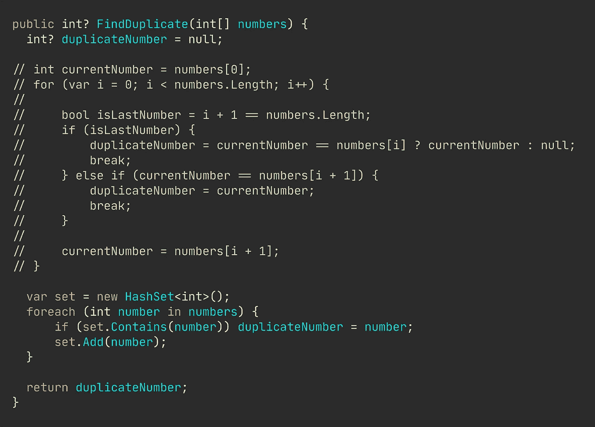

僵尸评论

你经常会看到代码被僵尸化，因为有人试图展示他们的“疯狂技能”，编写过于冗长、复杂和错误的代码——所有这些都是任何一个刚出校门的初级开发人员都非常推崇的品质。

当你看到注释掉的代码时，删除它。使用源代码管理的历史记录来跟踪代码，而不是注释。

## 清理复杂的代码。

偶然发现深度嵌套的代码是很常见的。每一个嵌套都使阅读变得更加困难，意图也变得模糊不清。

这段代码唯一值得一提的积极方面是使用了 mayfly 变量。也就是说，短期变量是在使用之前声明的。

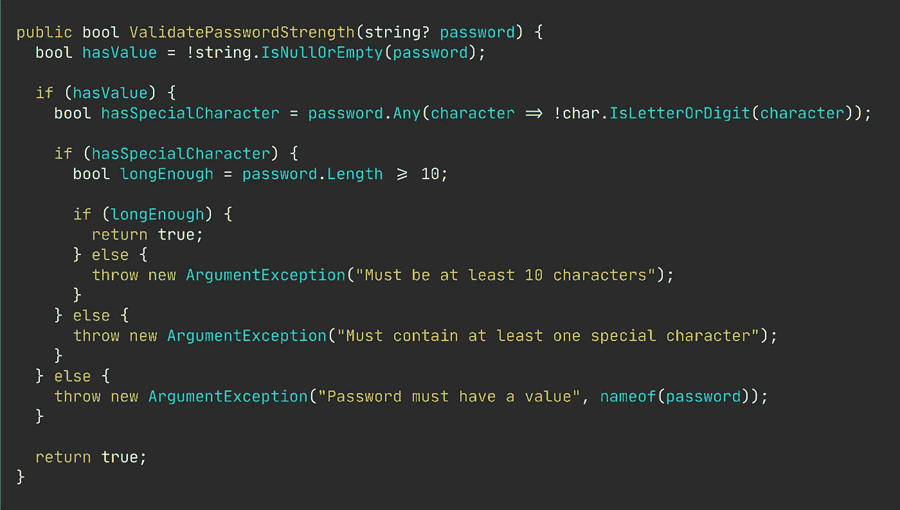

讨厌的分支代码。

我知道一些开发人员很大程度上反对应用久经考验的设计模式。但是，设计模式确实解决了常见的问题、代码味道和其他讨厌的东西。

我们可以很容易地将这个庞然大物重构为使用 guard 子句，使我们的意图更加清晰。

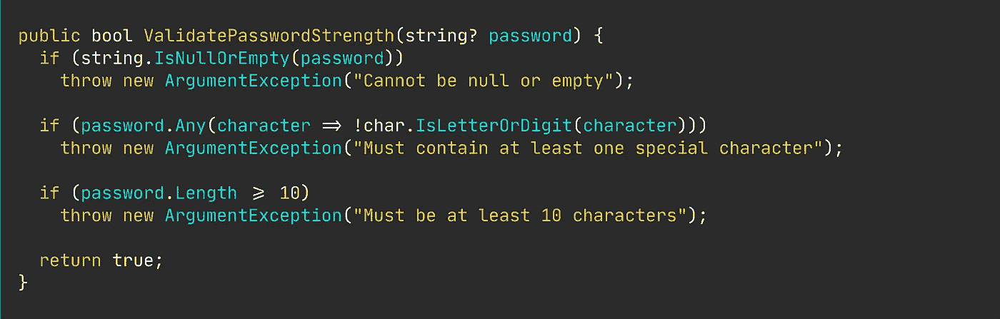

带有保护条款的更干净的方法。

假设你是那种相信异常是邪恶的开发人员，那么不要哭。只是用`return false`替换异常或者返回一个`Result`。问题解决了。

## 详细布尔赋值。

我经常看到这样的代码。它本身并不“糟糕”，但它极其冗长，你像个疯子一样在重复自己的话。

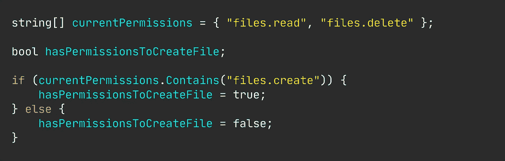

超级详细布尔赋值。

通过这个简单的改动，让你的意图昭然若揭。

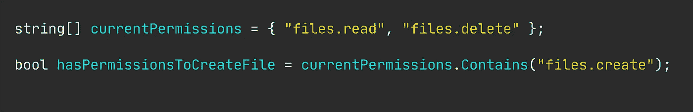

简单，整洁，干净。

## 详细值分配。

好的，这个例子和上面的基本相同。然而，现在我们不仅仅对检查条件感兴趣；我们还想根据这个条件赋值。

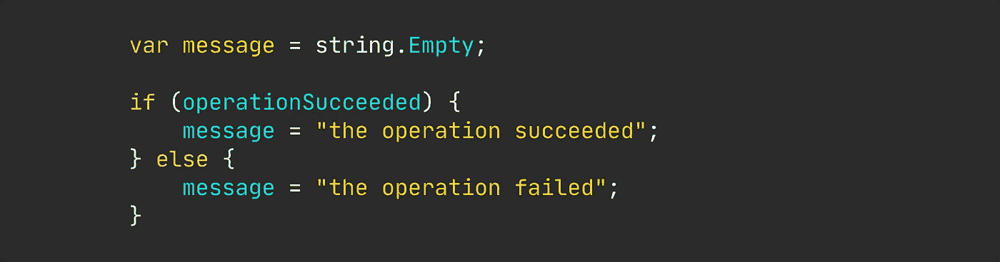

误用 if-else。

我想现在大家都知道 if-else 语句被滥用了。使用 if-else 进行二进制赋值仍然很常见，但是很容易重构为更简单、可读性更好的代码，如下所示。

三元值赋值。

## 猜测条件的意图。

对，还有一个如果-否则。你开始注意到这里的模式了吗？

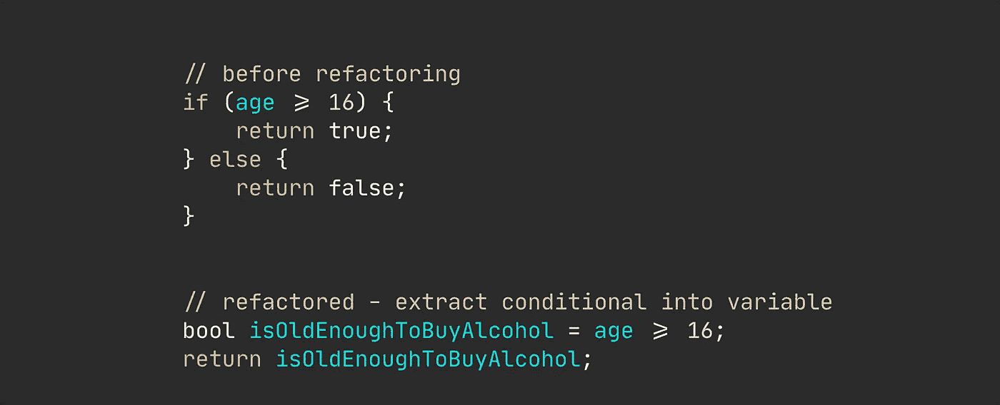

你经常会看到到处都是条件句，你经常需要在原始开发者的脑袋里面去理解*什么*和*为什么*一些条件句存在。

在上面的例子中，你不知道 16 这个神奇的数字代表什么。但是，通过一个简单的重构，将条件提取到一个命名良好的变量中，现在传达了理解*这里测试什么*所需的所有含义。

## 有条件地访问成员。

在试图访问变量的成员之前，通常需要评估变量是否为 null。“典型的”方法包括使用`!=`或字符串`string.IsNullOrEmpty`(或您选择的语言中的等效语言)来检查变量。

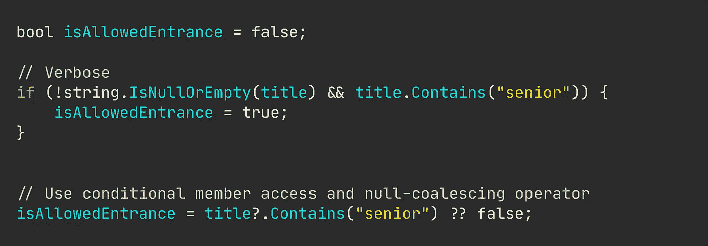

任何现代编程语言都提供(或者应该提供——谢谢 C#)条件访问操作符。

这可能看起来微不足道，不是问题。你是对的。但是，对于一个企业规模的代码库，比方说+30 万行代码，当有一个更简洁的选项可用时，阅读这样的冗长很快就会变得很麻烦。

# 离别词。

您可能已经知道我演示的所有“干净代码”的例子。如果没有，我希望你能得到一些关于如何清晰写作的灵感。

所有的例子都很简单，琐碎，也许还有点做作，但无论如何，反映了真实代码库的现实以及如何清理某些部分。

一段冗长的代码不会造成太大的损害。但是，复合效应可能是严重的，并对其读者产生“精神负担”。

# 让我们保持联系！

[点击这里](https://nmillard.medium.com/subscribe)订阅时事通讯，获得类似文章的通知，并查看新的 YouTube 频道[*(@ Nicklas Millard)*](https://www.youtube.com/channel/UCaUy83EAkVdXsZjF3xGSvMw)

*连接上*[*LinkedIn*](https://www.linkedin.com/in/nicklasmillard/)

# 好奇者的资源

*   [。NET C#干净代码](https://www.youtube.com/watch?v=goVjlWLY9NQ)作者[尼可拉斯·米勒德](https://medium.com/u/7c7a43b3d9de?source=post_page-----69be2160b4c1--------------------------------)