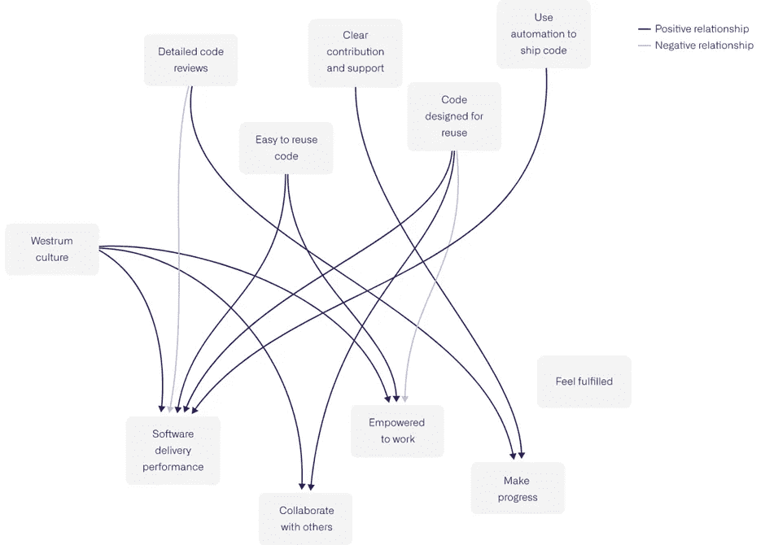
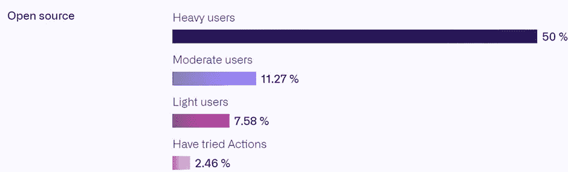
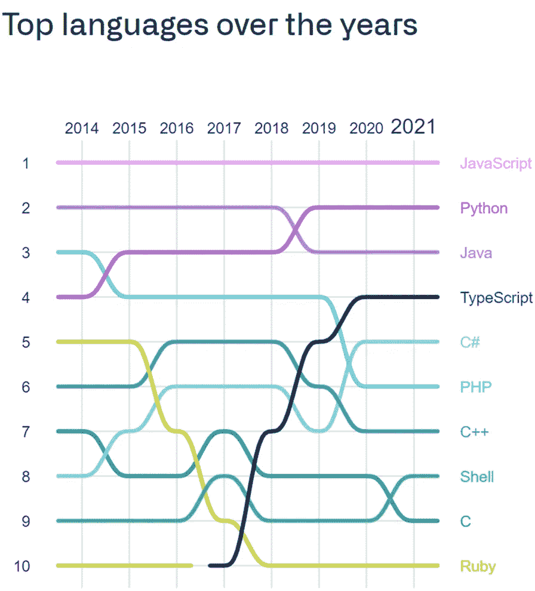

# 更快地编写代码

> 原文：<https://levelup.gitconnected.com/writing-code-faster-e4eae74045a6>

GitHub 目前拥有超过 8300 万用户。Octoverse 的状态是基于 GitHub 拥有的数据每年发布的总结报告。他们的统计数据有助于开发人员或团队通过开发良好的代码、创建良好的代码文档以及更明智地成为社区的一部分来提高他们的性能。

**详细报道:**

**你可以从上面的链接中阅读详细的报告，这个博客突出了直接取自官方报告的关键点，这将有助于开发人员在团队或个人编码项目中更高效地工作。**

**我们开始吧！**

## **生产力来自更好的编码和自动化，而不是速度**

****数据显示:**更强的信息流对更好的文化至关重要，良好的自动化有助于更好、更清晰的团队沟通。改进的工具也为开发人员提供了完成任务和感受内容的更大信心。**

****利用数据:**利用这些图表，找出一个你可以改进的地方，让你的工作做得更好！选择底部的任何东西(箭头结束的点)，然后向后进行，以确定什么有很大的影响。**

****

**彩色线表示正关系，灰色线表示负关系。例如，详细的代码审查积极地影响了取得进展的感觉，使开发人员感觉在控制之中，并推进他们的项目。然而，详细的代码审查会对软件交付性能产生负面影响，因此团队必须考虑权衡。**

## **团队可以使用自动化更快地运作**

****数据显示:**根据 GitHub 上的开发人员模式，自动化软件交付是开源中的一个至关重要的使能因素，并加速团队的大规模进展。与中小型存储库相比，大型存储库中使用动作的频率更高。**

************

**团队每天合并的拉请求几乎是以前的两倍(多 61%)，在大型存储库开始利用操作后，他们合并的速度快了 31%。使用 Actions 将合并时间减少了 33%,并将所有开源存储库中合并的 pull 请求数量提高了 36%。**

****使用数据:**团队受益于自动化。要提高团队的效率，请尝试围绕您的拉取请求实现流程自动化。**

## **无摩擦代码重用提高了开发人员的效率和生产力**

****数据显示:**授权程序、访问限制或信息分割可能会给代码重用带来障碍，当重用他人的代码简单且无摩擦时，工作效率可能会提高 87%。对于开源项目来说，无摩擦代码重用的优势也是显而易见的；摩擦较少的项目，如缓慢的流程或几个审批级别，也能执行 2 倍。**

****使用数据:**当你和你的团队重用来自其他团队和存储库的代码时，找出摩擦点。是否存在任何障碍，如冗长的访问批准、索引不足或未记录的依赖关系？**

## **搜索的容易程度被低估了**

****数据显示:**当开发人员能够快速找到他们所需要的东西时，他们会有大约 60%的可能性感到准备好履行他们的职责。此外，拥有一个易于搜索的团队存储库可以提高 11%的生产率。**

****使用数据:**考虑团队程序；它们是否有助于简单的索引和交叉引用，使信息更容易找到？**

## **开发工作就是使用合适的工具进行团队合作**

****数据显示:**只有 11%的受访者表示，他们计划恢复搭配就业，低于之前在办公室工作的 41%。因此，我们看到远程和混合工作越来越受欢迎，成为标准的工作方式。**

****使用数据:**考虑你的团队、你目前的工作场所和你预期的未来工作场所。你能做些什么来帮助你的团队和你自己？您是否支持使用程序和工具的有效协作？**

## **你学的是正确的编程语言吗？**

****

**JavaScript 和 Python 都是过去几年中最广为人知的语言。Tensforflow.js 和 ml5.js 创造了用 JavaScript 做机器学习的可能性。TypeScript(JavaScript 的超集)的流行和社区也在逐年增加。**

## **代码需要文档才能成为项目**

**开源项目的秘方是通过阅读材料、贡献指南和问题共享信息；它们吸引了新的贡献者，并将开发人员的生产率提高了 55%。**

***许多其他的统计数据仍然需要与你分享，但是上面提到的是每个开发者必须知道的最重要的。可以阅读官方报告，深入了解如何成为一名优秀的开发者。***

## **如果你有任何疑问，随时问我！**