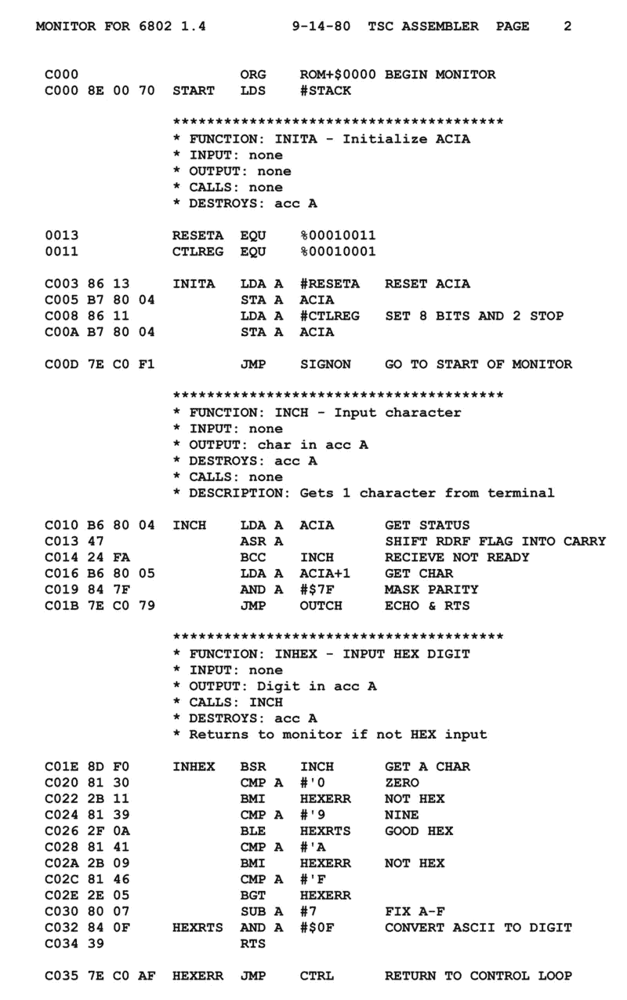

# 在程序集中编写代码

> 原文：<https://levelup.gitconnected.com/writing-code-in-assembly-7898a3492561>



大声喊出来到维基百科了解早期计算的所有细节

到目前为止，我的每周媒体文章中的几乎所有代码都是用 JavaScript 编写的。这有几个原因——在我的训练营中，JavaScript 是函数式编程的主要语言，所以我每天都很熟悉它。另一个同样重要的原因是，Google 的 DevTools 使得在浏览器中运行 JavaScript 代码变得非常容易。我经常创建函数和变量，并在将代码片段粘贴到我的文章之前测试我的代码。

另一个原因是，坦率地说，JavaScript 是一种非常简单的语言。这可能是最简单的 OOP 语言了。这些命令是自描述的。处理数据非常容易，因为您不必声明变量的数据类型(不像 C、C++和其他语言)，并且您可以轻松地操作数组和对象，而不必调用可怕的(至少对于像我这样的非 CS 专业的笨蛋来说)指针。这使得它成为编写训练营代码的理想语言；一个没有编码知识的人，在几个小时的教程后，可以编写带有循环、条件语句、映射…的函数，这些函数真的能做事情！用 JavaScript(或者 Python、Ruby、R……)编程并不需要什么天赋。

对于低级汇编语言来说就不一样了。老实说，我认为你必须是某种天才才能用汇编语言编程。

根据维基百科…

> [凯瑟琳·布斯](https://en.wikipedia.org/wiki/Kathleen_Booth)“被认为发明了汇编语言”基于她 1947 年开始的理论工作，当时她在伦敦大学[伯克贝克](https://en.wikipedia.org/wiki/Birkbeck,_University_of_London)从事 [ARC2](https://en.wikipedia.org/wiki/APEXC) 的研究，咨询了[安德鲁·布斯](https://en.wikipedia.org/wiki/Andrew_Donald_Booth)(后来她的丈夫)和[高级研究所](https://en.wikipedia.org/wiki/John_von_Neumann)的数学家约翰·冯·诺依曼[和物理学家](https://en.wikipedia.org/wiki/Herman_Goldstine)赫尔曼·戈德斯汀。

是的，约翰·冯·诺依曼，世界历史上最杰出的人的热门候选人——也就是真正的天才。当强尼五世牵涉其中时，你知道你在处理一些令人兴奋的事情！

这里有一个 20 世纪 70 年代中期摩托罗拉 6800 微处理器使用的[装配示例](https://en.wikipedia.org/wiki/Motorola_6800):

```
*; memcpy --*
*; Copy a block of memory from one location to another.*
*; Called as a subroutine, note return to saved PC addr on exit*
*; Entry parameters*
*;      cnt - Number of bytes to copy*
*;      src - Address of source data block*
*;      dst - Address of target data block*

cnt         dw      $0000       *; sets aside space for memory addr*
src         dw      $0000       *; sets aside space for memory addr*
dst         dw      $0000       *; sets aside space for memory addr*

memcpy      public
            ldab    cnt+1       *;Set B = cnt.L*
            **beq**     check       *;If cnt.L=0, goto check*
loop        **ldx**     src         *;Set IX = src*
            **lda**     ix          *;Load A from (src)*
            **inx**                 *;Set src = src+1*
            **stx**     src
            **ldx**     dst         *;Set IX = dst*
            **sta**     ix          *;Store A to (dst)*
            **inx**                 *;Set dst = dst+1*
            **stx**     dst
            decb                *;Decr B*
            **bne**     loop        *;Repeat the loop*
            stab    cnt+1       *;Set cnt.L = 0*
check       tst     cnt+0       *;If cnt.H=0,*
            **beq**     done        *;Then quit*
            **dec**     cnt+0       *;Decr cnt.H*
            *; loop back and do 256*(cnt.H+1) more copies (B=0)* 
            bra     loop        *;Repeat the loop*
done        **rts**                 *;Return*
```

显然，这个子程序把一块内存从一个地方转移到另一个地方。如果没有这些有用的评论，我会猜测这是百万只猴子和它们的百万台打字机中的一只试图重现莎士比亚的作品。如果我用 JavaScript 重新创建它，它可能看起来像这样…提前为不可理解性道歉，但是我自己几乎不能理解这个代码！

```
function memcpy(cnt, src, dst) {
    let B = cnt.L;
    while (true) {
        let ix = src;
        src++;
        ix = dst;
        A = dst;
        dst++;
        B--;
        if (cnt.L===0) {
            if (cnt.H===0) return;
            cnt.H--;
        }
    }
    return;
}
```

显然，这个循环执行了 256*(cnt。H+1)次。256 = 2⁸ =一个字节可能值的个数，对吗？谁知道呢。

虽然这个例子完全不连贯，但这里还有一个汇编代码的例子，比较容易理解，它的输出(字符串“Hello，world！”)要明智得多。感谢 TutorialsPoint.com 的[片段](https://www.tutorialspoint.com/compile_assembly_online.php):

```
section .text
 global _start       ;must be declared for using gcc
_start:                     ;tell linker entry point
 mov edx, len    ;message length
 mov ecx, msg    ;message to write
 mov ebx, 1     ;file descriptor (stdout)
 mov eax, 4     ;system call number (sys_write)
 int 0x80        ;call kernel
 mov eax, 1     ;system call number (sys_exit)
 int 0x80        ;call kernelsection .datamsg db 'Hello, world!',0xa ;our dear string
len equ $ - msg   ;length of our dear string
```

所以基本上，程序接受消息的长度(len)、消息本身(msg)、几个“系统调用号”,然后循环并打印消息的每个字符，循环的长度等于消息的长度，如 len 所指定的。

## 结论

我希望您喜欢这次简短的汇编编程尝试。与低级语言一样，这些关键字远不如高级语言直观。尽管你可以浏览一下 JS、C++、Java 或 Python 代码片段，或多或少地了解正在发生的事情，但是汇编语言即使是逐行注释也完全令人困惑。感谢所有杰出的数学家、物理学家和计算机科学家，这些年来，他们让编程变得更加容易理解和用户友好。为天才们干杯！

附注[这里有](https://www.madwizard.org/programming/snippets)一个非常好的更具挑战性的汇编代码库。警告程序设计员！