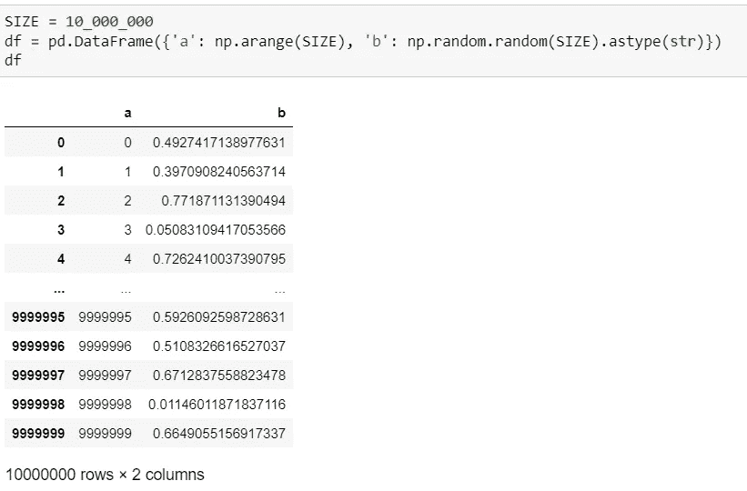
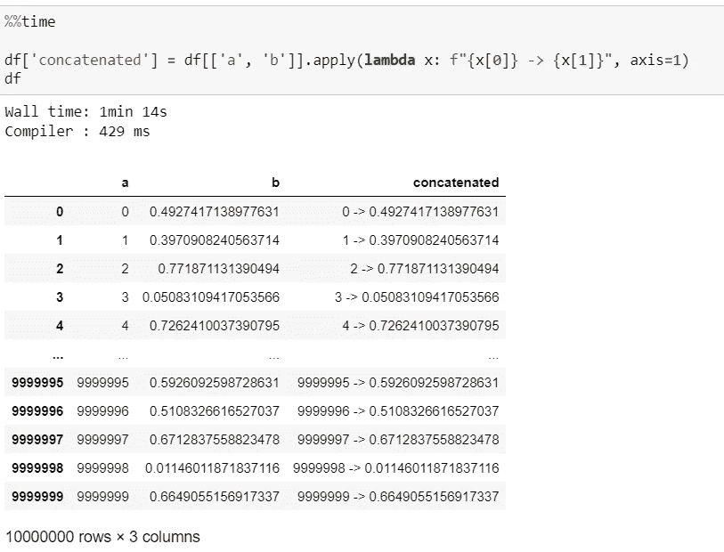
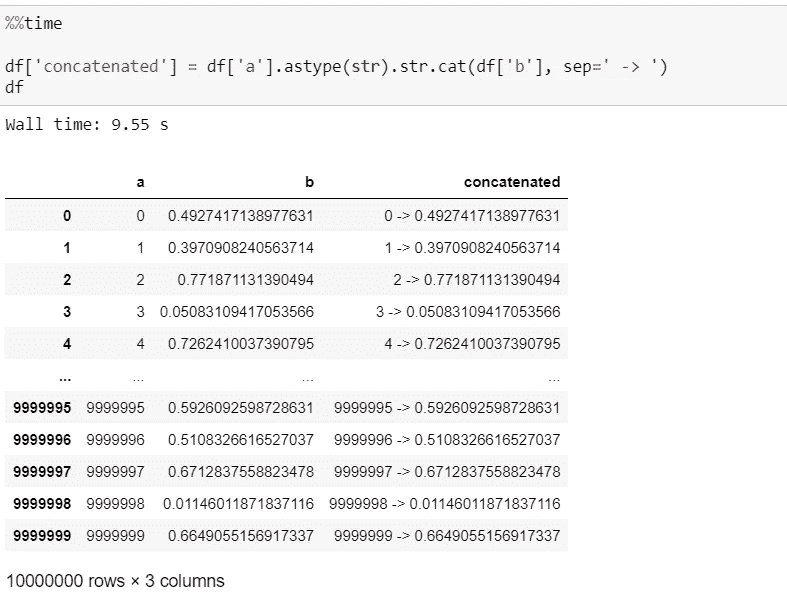
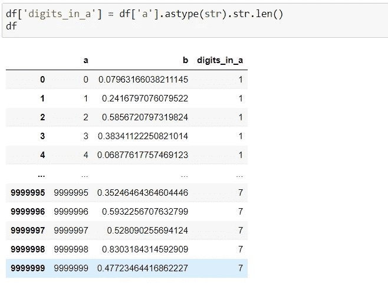
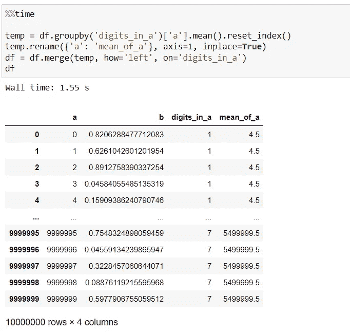
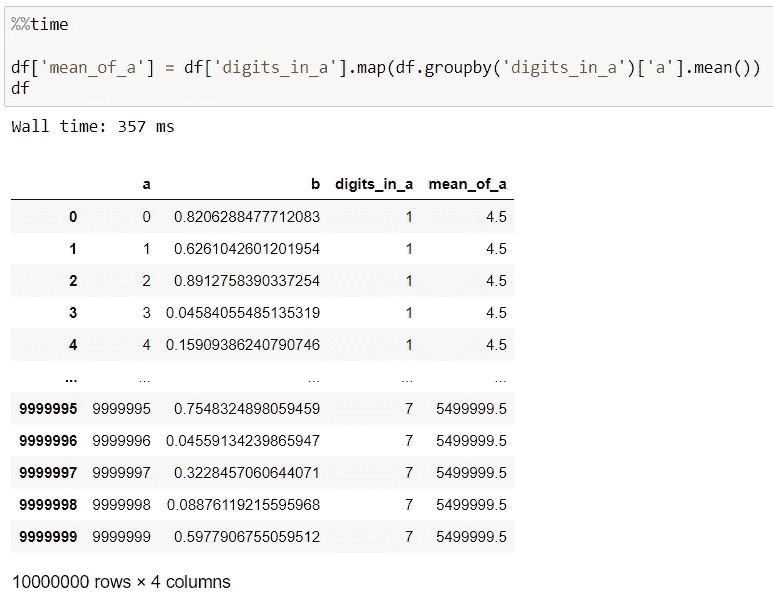

# 编写有效的熊猫代码

> 原文：<https://levelup.gitconnected.com/writing-effective-pandas-code-553f1bad921c>

编程中的每一件事都可以用多种方式来完成。有些方式比其他方式更好。有些方式更糟糕。一个好的程序员应该选择一个好的方法来解决任务。不一定总是最好的方式，但绝对至少不是最差的方式。


由 [Unsplash](https://unsplash.com?utm_source=medium&utm_medium=referral) 上的 [CHUTTERSNAP](https://unsplash.com/@chuttersnap?utm_source=medium&utm_medium=referral) 拍摄

先说用熊猫写有效代码，熊猫是数据科学中应用最广泛的 Python 库之一。

在这篇文章中，我将通过几个例子来比较一个好的做事方法和一个稍微差一点的做事方法。

让我们从定义我们的测试*数据帧*开始，我们将在本文的例子中使用它。



作者举例

我们的示例 *DataFrame* 非常简单，只包含两列——一个整数列和一个字符串列(即使它看起来像浮点数)。我们的数据结构的大小相当大，包含 1000 万行，因为我们想要测量处理这个*数据帧*的代码的性能。

## 字符串矢量化运算

首先，我们来谈谈如何使用字符串。

熊猫*系列*对象包含一个特殊属性*。str* 提供了使用字符串的各种功能。使用*的一个有用的例子。str* 是两个 *DataFrame* 列的串联。

假设我们想要连接示例 *DataFrame* 的两列中的值，中间有一个箭头符号。因此，我们希望第一个结果行的值为“0->0.47138977631”。

有多种方法可以做到这一点。我不会考虑最简单的方法，比如遍历循环中的值并用串联的结果填充一个新列表。一种非常优雅的方法是使用*应用*函数:



作者举例

这不是最糟糕的方法，因为它是可以理解的，并且不仅可以连接值，还可以进行更复杂的格式化。然而，这种方法的问题是执行时间慢。通过使用 *.str.cat()* 方法，我们可以更快地进行连接。



作者举例

正如您所看到的，连接的结果是相同的，但是执行时间现在只有 9.55 秒，而不是以前的一分多钟。

用于连接的 *cat()* 方法并不是 *str* 下唯一有用的字符串方法。存取器。它包含许多与 Python 中内置的*字符串*方法具有相同名称和参数的方法。

*字符串。*访问器不仅适用于*系列*对象，也适用于*索引*。这对于转换一个*数据帧的列名很有用。*

```
df**.**columns **=** df**.**columns**.**str**.**lower**().**str**.**replace**(**" "**,** "_"**)**
```

## 映射序列中的值

数据科学任务中的一个常见情况是获取一个组的一些聚合值。例如，有一个雇员工资的数据集，我们可能希望每一行都获得相应月份所有雇员的平均工资。


马库斯·斯皮斯克在 [Unsplash](https://unsplash.com?utm_source=medium&utm_medium=referral) 上拍摄的照片

让我们回到我们的示例 *DataFrame* 中，我们将引入一个新的列——group，表示列“a”中的值有多少位。就像我们现在知道的*。str* 访问器，将使用它通过取值字符串表示的长度来获得位数。



作者举例

这个新列将指定每一行所属的组。现在，您将如何创建一个列，包含按列“digits_in_a”分组的列“a”的平均值？最简单的方法是首先用每个组的计算平均值创建一个临时的*数据帧*，然后将其合并到原始的*数据帧*中。让我们看看它是如何工作的。



作者举例

它确实起作用，但是，时间又相当长。幸运的是，这次我们也能更快地得到它。这里的技巧是进行映射，而不是合并*数据帧。*



作者举例

如您所见，映射值的方法要快得多。此外，它需要更少的内存，这在处理大型数据集时可能是更重要的考虑因素。

在某些情况下，当需要在没有足够内存(RAM)的机器上合并两个巨大的*数据帧*时，另一种方法是将一个*数据帧*的所有列映射到另一个*数据帧*中。如果有很多列，这种方法不会很快，但是与简单的合并相比，它需要的内存要少得多。

## 更多提示？

是的，有更多的最佳实践和技巧来编写有效的熊猫代码，但我将在我的下一篇文章中分享这些，所以不要忘记按下 Follow 按钮。

感谢阅读！