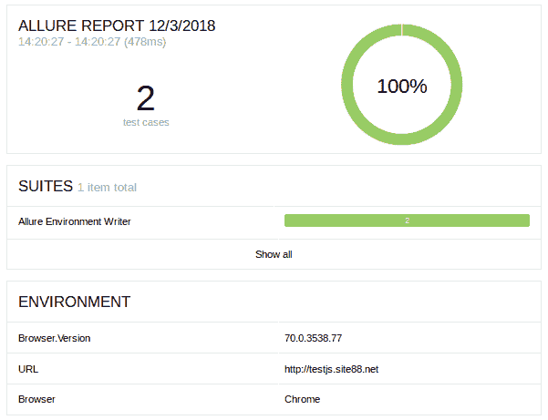

# 用 Java 编写 Allure 报表的环境值

> 原文：<https://levelup.gitconnected.com/writing-environment-values-to-allure-report-in-java-47ab4d681fc4>

为了用一个好的功能扩展 Allure 框架，我开发了 [Java 库](https://github.com/AutomatedOwl/allure-environment-writer)，它允许在运行时使用 allure-results 目录将键/值对写入 environment.xml 文件。目前，该库支持带有 JUnit 或 TestNG 的 Allure report。它将允许您:

*   在测试的任何阶段，轻松地将 environment.xml 文件的键/值集写入 allure-results 目录。
*   定义“allure-results”目录的可配置路径。
*   使用 ImmutableMap 对象为环境创建一组不可变的值。
*   GitHub 链接:【https://github.com/AutomatedOwl/allure-environment-writer 

# 常见用法示例(默认路径是 target/allure-results):

在下面的 TestNG 方法中，我们制作了一个 ImmutableMap 对象，它包含一组硬编码的所需键/值，出现在 allure 报告的“环境”部分下。我们使用 allure-results 文件夹的默认路径。在幕后，一个工厂方法迭代映射，并将每个键/值对写入 XML 文件的指定标记中。

```
import static com.github.automatedowl.tools.AllureEnvironmentWriter.allureEnvironmentWriter;public class SomeTests { @BeforeSuite
    void setAllureEnvironment() {
        allureEnvironmentWriter(
                ImmutableMap.<String, String>builder()
                        .put("Browser", "Chrome")
                        .put("Browser.Version", "70.0.3538.77")
                        .put("URL", "http://testjs.site88.net")
                        .build());
    } @Test
    void sanityOneTest() {
        Assert.assertTrue(true);
    } @Test
    void sanityTwoTest() {
        Assert.assertTrue(true);
    }
}
```

# 定制 allure 的使用示例-结果路径:

下面的 TestNG 方法与关于的示例相同，只是使用了可配置的 allure-results 路径，作为“可选”参数传递给 allureEnvironmentWriter 方法。

```
import static com.github.automatedowl.tools.AllureEnvironmentWriter.allureEnvironmentWriter;public class SomeTests { @BeforeSuite
    void setAllureEnvironment() {
        allureEnvironmentWriter(
                ImmutableMap.<String, String>builder()
                        .put("Browser", "Chrome")
                        .put("Browser.Version", "70.0.3538.77")
                        .put("URL", "http://testjs.site88.net")
                        .build(), System.getProperty("user.dir")
                        + "/allure-results/");
    } @Test
    void someTest() {
        Assert.assertTrue(true);
    }
}
```

# Allure 报告中收到的环境数据的快照:



# Maven 依赖性

```
<dependency>
<groupId>com.github.automatedowl</groupId>
<artifactId>allure-environment-writer</artifactId><version>1.0.0</version>
</dependency>
```