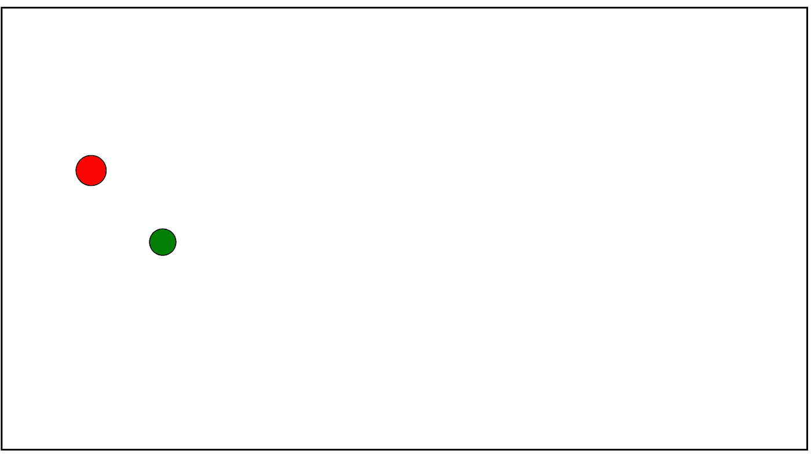

# 用 React 写落点游戏

> 原文：<https://levelup.gitconnected.com/writing-falling-dots-game-with-react-8b2884fa683d>


让我们抛开一般的教程，在 ReactJS 库中尝试一个有趣的应用程序。在本教程中，我们将创建一个遵循以下规则的游戏。

*   游戏场是一个矩形，具有相应的宽度和固定的高度
*   每秒钟都会有一个点随机出现在这片区域的顶部边缘
*   每个点可以有不同的大小和颜色(从列表中随机挑选)
*   每个点每秒下降 X 个像素
*   速度可以在游戏过程中随时改变
*   如果你成功点击圆点，它就会消失，你就可以得分了
*   圆点越小，你得到的分数就越多
*   当一个点离开棋盘，它就消失了(没有得分)
*   游戏可以随时暂停，以停止下降和产卵点
*   游戏区域可以被清空以完全重置该过程

给你一个小引子，游戏过程看起来是这样的:


为了使我们的任务更有趣，我们将遵循函数式编程概念，使用现代的 React 钩子和函数式组件方法。

# 技术栈

在本教程中，我们将使用一个简单的技术堆栈。

*   React JS —用于重新渲染优化和基于组件的结构
*   [反冲](https://recoiljs.org/)——作为一个简单的状态管理库。你可以在我的[上一篇文章](https://medium.com/swlh/a-quick-glance-at-recoil-d276c22c7efe)中看到关于这个闪亮的新库的教程。
*   CSS —对于样式，这里没有魔法:)
*   create-react-app —用于引导应用程序

你可以在 [GitHub 库](https://github.com/KilroggD/dots-game-react-recoil)中跟随源代码。

# 创建应用程序和定义配置

首先，我们创建一个框架式的 react 应用程序

```
npx create-react-app dots-game
```

然后，通过导航到 app 文件夹并运行以下命令，安装新的闪亮的[反冲](https://recoiljs.org/)库:

```
npm install recoil
```

之后可以运行`npm start`看教程 app 运行。然后清理 App.js 文件，进入下一步。

让我们创建一个`game`文件夹来存放我们的游戏组件。然后用我们需要定义的主要参数定义一个[常量](http://Let's create a game folder to put our game components there.)文件。

```
// color for dots to pick from list
export const COLORS = ['red', 'green', 'blue', 'orange'];// size vales for dots to pick from list
export const SIZES = [10, 15, 20, 25, 30, 35, 40, 45];// step to control speed px/sec
export const SPEED_STEP = 10;// Max value of points - each dot will cost MAX - size points
export const MAX_POINTS = 50;// Interval to spawn a new dot
export const SPAWN_INTERVAL = 1000;
```

# 国家结构

正如我之前提到的，在本教程中，我们使用[反冲](https://recoiljs.org/)作为一个简单的状态管理库。我们可以用 Redux / MobX 甚至简单的 *useState* 钩子来完成这个任务，但是获得更多使用新库的经验可能会很有用。这也给了我们一个机会将状态从组件中分离出来，而不需要安装一个巨大的附加模板(参见我对反冲的想法[那里](https://medium.com/swlh/a-quick-glance-at-recoil-d276c22c7efe))。对于这个游戏，我们将只需要[基本功能](https://recoiljs.org/docs/introduction/core-concepts)的后坐力。

[这里](https://github.com/KilroggD/dots-game-react-recoil/blob/master/src/game/atom.js)是我可以建议的简单状态结构:

```
import  { atom } from 'recoil';// Control params - if game is launched and current speed
export const controlOptions = atom({
    key: 'controlOptions',
    default: {
        isRunning: false,
        speed: 5,
    },
});// List of dots in the game - empty by default
export const dotsState = atom({
    key: 'dotsState',
    default: [],
});// Current score - zero by default
export const scoreState = atom({
    key: 'scoreState',
    default: 0,
});
```

不要忘记将`RecoilRoot`导入到您的 [App.js](https://github.com/KilroggD/dots-game-react-recoil/blob/master/src/App.js) 中，以便在所有游戏组件中访问您的反冲状态。

```
import React from "react";
import { RecoilRoot } from "recoil";// import Game from './game/Game';import './App.css';function App() {
    return (
      <RecoilRoot>
          {/*<Game />*/}
      </RecoilRoot>
  );
}export default App;
```

# 主要组件和样式

让我们将组件的结构定义为[跟随](https://github.com/KilroggD/dots-game-react-recoil/tree/master/src/game):

*   [Game.js](https://github.com/KilroggD/dots-game-react-recoil/blob/master/src/game/Game.js) —渲染游戏领域的主要组件和所有其他组件。包含与游戏领域相关的主要逻辑和钩子。我们将在下一节回到这个组件。现在，让我们制作一个虚拟游戏场

```
const Game = () => {
   return (
        <div className="main">
            <div className="panel">
                {/* <Control/> */}
                {/* <Score /> */ }
            </div>
            <div className="field">
            </div>
        </div>
    );
}export default Game;
```

*   [Control.js](https://github.com/KilroggD/dots-game-react-recoil/blob/master/src/game/Control.js) —处理控制(启动/停止/清除、速度变化)的组件。我们稍后也会回到这个问题。
*   [Score.js](https://github.com/KilroggD/dots-game-react-recoil/blob/master/src/game/Score.js) —表示当前得分的组件—此处不变:)
*   [Dot.js](https://github.com/KilroggD/dots-game-react-recoil/blob/master/src/game/Dot.js) —表示落点的组件

我想展示关于最后一个的更多细节。为了能够使点“下落”,我们应该在我们的场中沿 Y 轴移动它。此外，每个点应该有它的 X 坐标，以便能够水平扩展它们。对于坐标表示，我们可以使用*左侧*和*顶部*的 CSS 属性。点的宽度应该等于它的大小。为了简单起见，让我们用 React 中的[内嵌样式](https://reactjs.org/docs/dom-elements.html#style)来做。我们还需要为 dot 定义一个 *onClick* 处理程序，因为这是我们游戏的主要目标:)

```
const Dot = (props) => {
    const {color, x, y, size, index, onClick} = props;    
    const dotStyle = {
        backgroundColor: color,
        height: `${size}px`,
        width: `${size}px`,
        left: `${x}px`,
        top: `${y}px`,
    };return (
        <div 
            className="dot"
            style={dotStyle}
            onClick={() => onClick(index)}
        />
    );
};export default Dot;
```

我忘了什么吗？哦，点必须是圆，我们的领域必须尊重其坐标。这是在 [App.css](https://github.com/KilroggD/dots-game-react-recoil/blob/master/src/App.css) 文件中完成的

```
/* Generic padding */
.main {
    text-align: center;
    padding: 25px 50px 25px 50px;
}/* Field params */
.field {
    height: 500px;
    border: 2px solid black;
    position: relative;
    overflow-y: hidden;
}/* Dot positioning */
.dot {
    border: 1px solid #000;
    border-radius: 50%;
    position: absolute;
}
```

我们需要隐藏溢出-y 字段，以防止点离开边缘。圆点是圆形的，并且*绝对-* 位于视场内。你可以通过在字段中添加几个点来检查它是如何工作的。

```
return (
        <div className="main">
            <div className="panel">
                {/*<Control onClear={clear} />*/}
                {/*<Score />*/}
            </div>
            <div className="field">
                <Dot 
                    color="red" 
                    x="100" y="200" 
                    onClick={() => {}} 
                    size="40" 
                />
                <Dot 
                    color="green" 
                    x="200" y="300" 
                    onClick={() => {}} 
                    size="35" />
            </div>
        </div>
    );
```



# 主逻辑—用点操纵

因为落点是游戏中的主要对象，我们需要围绕它们建立逻辑。首先，我们需要能够在字段上添加/删除点。

为了不把所有东西都放在我们的游戏组件中，我们定义了[*utils*](https://github.com/KilroggD/dots-game-react-recoil/blob/master/src/game/utils.js)*一组帮助器，它们具有游戏逻辑所需的一些有用的功能。*

```
*import { MAX_POINTS, COLORS, SIZES } from './constants';export const createDot = () => {
    // pick random color and size
    const color = COLORS[Math.floor(Math.random() * COLORS.length)]
    const size = SIZES[Math.floor(Math.random() * SIZES.length)]

    let x = Math.floor(Math.random() * 100); return {
        color,
        size,
        x,
        y: 0,
      }
};export const removeDot = (dots, index) => {
    const newDots = [...dots];
    newDots.splice(index, 1);
    return newDots;    
};export const calculatePoints = (dot) => {
    return MAX_POINTS - dot.size;
};*
```

*第一个 *createDot* 函数是一个工厂函数，返回一个带有点参数(颜色、大小、坐标)的对象。下一个 *removeDot* 方法是从主状态列表中删除给定索引处的点的实用方法。另一个效用函数 *calculatePoints* 将返回一个点的数量，计算方式为常量 MAX_POINTS 值减去一个点的大小。*

*与 dots 相关的主要逻辑位于主组件 [*Game.js*](https://github.com/KilroggD/dots-game-react-recoil/blob/master/src/game/Game.js) 中的回调函数中。*

*   *产生一个新的点*

```
*const spawnDot = useCallback(() => {
    updateDots((oldDots) => [...oldDots, createDot()]);
}, [updateDots]);*
```

*   *成功点击时删除点并添加点*

```
*const onDotClick = (index) => {
    setScore(score + calculatePoints(dots[index]));
    updateDots(removeDot(dots, index));
};*
```

*现在我们需要考虑如何在球场上放置我们的点。我们有一个从 1 到 100 随机选取的 X 坐标，但假设我们有一个可变的屏幕或设备宽度，我们如何将它映射到实际的字段？为了解决这个问题，我们使用[*offsetWidth*](https://developer.mozilla.org/en-US/docs/Web/API/HTMLElement/offsetWidth)*属性，根据从 1 到 100 的 X 值和当前的 *offsetWidth* 值计算我们的实际 X 值，这样我们的 X 值总是与当前宽度成比例。因为我们需要引用实际的 HTML 属性，[*useRef*](https://reactjs.org/docs/hooks-reference.html#useref)React hook 将在这里帮助我们。**

```
**const [dots, updateDots] = useRecoilState(dotsState);const fieldRef = useRef();**
```

**在我们的 Game.js 组件中定义 Ref，稍后:**

```
**<div className="field" ref={fieldRef}>
    {dots.map((dot, index) => {
        const x = (
            fieldRef.current.offsetWidth - dot.size
        ) * dot.x / 100
        return <Dot
            key={`dot-${index}`} 
            {...dot}
            x={x}
            index={index} 
            onClick={onDotClick} 
        />;
     })}
</div>**
```

**计算 X 值的公式将我们的实际像素值定义为总*偏移量*的百分比，从 1%到 100%，因此我们模拟了一个正确的坐标轴。如果 X 值接近 100%,`— dot.size`部分确保圆点不会偏离右边。因此，我们可以基于 *offsetWidth* 、点的索引和回调函数(用于正确的 *onClick* 处理)以及其他点属性来传递 X 值，从而保持点组件从我们的状态中抽象出来。**

# **使其移动(requestAnimationFrame)**

**现在是时候考虑实际的游戏过程了——我们如何让整个游戏动起来？**

**首先，我们需要每秒产生一个新的点，或者常量文件中定义的间隔来产生点。**

```
**import { SPEED_STEP, SPAWN_INTERVAL } from './constants';**
```

**然后在我们的 Game.js 组件中，我们为 spawn dots interval 定义了 ref。**

```
**const intervalRef = useRef();**
```

**这个引用将保存我们的超时点生成方法。然后，创建一个 spawn dot 函数来创建新的点。**

```
**const spawnDot = useCallback(() => {
        updateDots((oldDots) => [...oldDots, createDot()]);
}, [updateDots]);**
```

**还记得我们的 *createDot* 函数吗？我们在回调中使用它。**

**但是产生新的点还不够，我们还希望它们以给定的速度沿 Y 轴向下移动。让我们为此定义一个函数。为了让这个方法以或多或少优化的方式执行移动动画，我们将使用[*request animation frame*](https://developer.mozilla.org/en-US/docs/Web/API/window/requestAnimationFrame)*方法，该方法通常每秒调用我们的回调 60 次。***

```
***const requestRef = useRef();const advanceStep = useCallback(() => {
        updateDots((oldDots) => {
            const newDots = [];
            for (let dot of oldDots) {
                const newY = dot.y + SPEED_STEP * controlState.speed / 60;
                if (newY <= fieldRef.current.offsetHeight - dot.size / 2) {
                    newDots.push(
                        {
                            ...dot,
                            y: newY,
                        }
                    );
                }
            }
            return newDots;
        });
        requestRef.current = requestAnimationFrame(advanceStep);
    }, [controlState.speed, updateDots]);***
```

***那么这个函数是干什么用的呢？首先，它遍历所有现有的点。然后，它试图将每个点沿 Y 轴向下移动*SPEED _ STEP * current _ SPEED/60px*，因为我们的 *SPEED_STEP* 常量表示每速度单位每秒的像素数，回调每秒被调用 60 次。***

**如果一个点落在当前 [*偏置场的高度*](https://developer.mozilla.org/en-US/docs/Web/API/HTMLElement/offsetHeight) 一半或更多——我们认为该点已经消失并删除它(不包括在*新点*数组中)。ref *requestRef* 保持超时回调。**

**最后，我们的主 *useEffect* 钩子将根据游戏控制状态下的 *isRunning* 标志处理生成点和移动点逻辑。**

```
**useEffect(() => {
    const stop = () => {
        intervalRef.current &&         
            clearInterval(intervalRef.current);
        requestRef.current && 
           cancelAnimationFrame(requestRef.current);
    }
    if (controlState.isRunning) {
        intervalRef.current = setInterval(
            spawnDot, SPAWN_INTERVAL
        );
        requestRef.current = requestAnimationFrame(advanceStep);
    } else {
            stop();
    }
    return () => stop();
}, [controlState.isRunning, advanceStep, spawnDot])**
```

**如果*正在运行*标志变为真，我们启动两种超时方法。我们调用 *stop* 函数作为钩子的清理效果，如果 *controlState isRunning* 标志变为 false，我们也调用它。请不要忘记，之前定义的裁判对于停止比赛/清理我们的间隔非常有用。**

**最后，我们定义一个*清除*函数传递给*清除*控制按钮。**

```
**const clear = useCallback(() => {
    setControlState({...controlState, isRunning: false, speed: 5});
    updateDots([]);
    setScore(0);
}, [setControlState, setScore, updateDots, controlState]);**
```

**它停止执行，清除场上所有的点，并清除当前得分。**

# **让游戏控制发挥作用**

**[控制](https://github.com/KilroggD/dots-game-react-recoil/blob/master/src/game/Control.js)组件连接到*控制状态*，允许我们开始/暂停游戏或改变速度。**

**渲染部分非常简单——它包括 2 个按钮和一个控制速度的*范围*输入。**

```
**return (
        <div className="control">
            <div className="control__buttons">
                {
                    isRunning ? 
                        (
                            <button onClick={togglePause}>
                                PAUSE
                            </button>
                        ) : (
                            <button onClick={onStart}>
                                START
                            </button>
                        )                        
                }
                <button onClick={onClear}>CLEAR</button>
            </div>
            <div className="control__speed">
                <p>{`Current speed: ${speed}`}</p>
                <input
                    type="range"
                    min="1"
                    max="10"
                    value={speed}
                    onChange={onChangeSpeed}
                />
            </div>
        </div>
    )**
```

****

**除了 Clear 按钮之外，每个按钮都有一个回调处理程序，这个处理程序是从游戏组件传递过来的。**

```
**const onChangeSpeed = useCallback((event) => {
        setControlState(
             {...controlState, speed: event.target.value}
        );
    }, [setControlState, controlState]);**
```

**请注意非常特殊的*使用效果*逻辑。我注意到一个非常严重的性能问题。每当玩家在浏览器中切换到一个新标签时，游戏就会以一种中断的方式继续在后台运行(新的点继续产生，但没有移动发生)。它会导致该选项卡的行为中断和潜在的内存泄漏，因为点可以无限繁殖。为了防止这种情况，我们想在当前标签不可见时使用[文档可见性 API](https://developer.mozilla.org/en-US/docs/Web/API/Page_Visibility_API) 停止游戏。**

```
**useEffect(() => {
    document.addEventListener("visibilitychange", () => {
        setControlState(oldState => {
            return {...oldState, isRunning: false};
        });
     });
     return () => document.removeEventListener("visibilitychange");        
}, [setControlState]);**
```

**当可见性状态改变时，我们暂停游戏，这样当用户回到游戏标签页时可以继续游戏。**

**我们还需要创建一个可视化组件来显示当前的[分数](https://github.com/KilroggD/dots-game-react-recoil/blob/master/src/game/Score.js)。**

```
**import React from 'react';
import {useRecoilValue} from 'recoil';import {scoreState} from './atom';const Score = () => {
    const score = useRecoilValue(scoreState);return (
        <div className="score">
            <p>{`Score: ${score}`}</p>
        </div>
    );
};export default Score;**
```

****

# **测试一下！**

****

**要测试游戏的运行，只需克隆[库](https://github.com/KilroggD/dots-game-react-recoil)，转到它的根文件夹并运行我们可能都知道的命令:**

```
**npm installnpm start**
```

**之后，您可以导航到`http://localhost:3000`并看到它的工作！**

****

**GG WP:)**

# **下一步是什么？要考虑的其他挑战**

**我希望这个教程是有用的，或者至少你对这个非常不寻常的反作用和反冲堆栈的应用有一些兴趣。**

**我想强调一些额外的食物想法:**

*   **我们没有考虑到我们的圈子可能会重叠。如果我们想改善整体体验，开发一个更复杂的点生成算法来考虑“繁忙”点并且不在那里放置任何点是有意义的**
*   **我们可以通过使用变换属性和一些动画缓动特性来进行 CSS 优化**
*   **最后，我们可以使用[画布](https://developer.mozilla.org/en-US/docs/Web/API/Canvas_API)来代替 React 渲染，但在这种情况下，这并不是一个 React 教程，因为我们将所有的视觉渲染移动到画布上，并将 React 仅用作状态容器**

**感谢阅读这篇长文:)在我的下一个教程中再见**