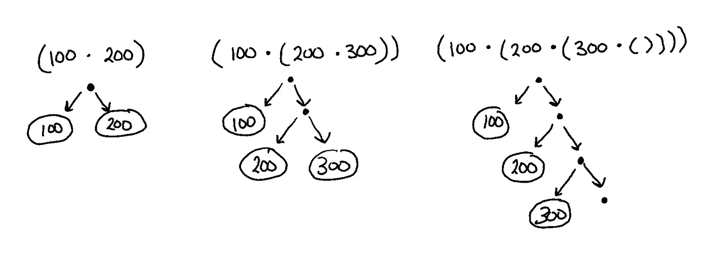

# 编写我的第一个 Chia 区块链程序(第三部分)——智能币

> 原文：<https://levelup.gitconnected.com/writing-my-first-chia-blockchain-program-part-3-smart-coin-a9a4c3983dd1>

我最近开始学习 Chialisp。加入我，我写我的第一个程序到区块链，并随时提问。


照片由 Hitesh Choudhary 在 Unsplash 上拍摄

如果您喜欢直接阅读代码，您可以在下面的资源库中找到它。

[](https://github.com/Kygandomi/chia-password-coin) [## GitHub-Kygandomi/chia-password-coin:使用官方 chia 学习 chia lisp 的项目…

### 使用 chia 官方教程学习 chia lisp 的项目

github.com](https://github.com/Kygandomi/chia-password-coin) 

# 介绍

在第 1 部分中，我们回顾了 Chialisp 和 Chia 区块链的高级概念。

[](https://thepaulo.medium.com/writing-my-first-chia-blockchain-program-part-1-introduction-a10cd8eddece) [## 编写我的第一个 Chia 区块链程序—第 1 部分—简介

### 我最近开始学习 Chialisp。请和我一起将我的第一个程序部署到 Chia 区块链，并随时提问…

thepaulo.medium.com](https://thepaulo.medium.com/writing-my-first-chia-blockchain-program-part-1-introduction-a10cd8eddece) 

在第 2 部分中，我们介绍了如何设置我们将在本系列的这一部分中使用的开发环境。

[](https://thepaulo.medium.com/writing-my-first-chia-blockchain-program-part-2-setup-fda79486248) [## 编写我的第一个 Chia 区块链程序—第 2 部分—设置

### 我最近开始学习 Chialisp。请和我一起将我的第一个程序部署到 Chia 区块链，并随时提问…

thepaulo.medium.com](https://thepaulo.medium.com/writing-my-first-chia-blockchain-program-part-2-setup-fda79486248) 

现在我们将创造我们的第一枚智能硬币！

# **Chialisp 基础知识**

关于 CLVM 首先要知道的是，一切都是由[原子](https://chialisp.com/docs/#atoms)、[容器](https://chialisp.com/docs/#cons-boxes)、[列表](https://chialisp.com/docs/#lists)构建而成的。

原子是一串字节。它可以是十进制、十六进制或字符串值，因此`100`、`"hello”`和`0x100`都是原子。也可以用空原子`()`来表示。原子可以是运算符，这使得我们可以编写程序。

一个[弊框](https://chialisp.com/docs/#cons-boxes)是一个圆括号，两个元素之间用句号分隔，所以`(0x100 . “cat”)`或`( 100 . 200 )`。

Cons 框可以嵌套`(100 . ( 200 . 300 ))`或`( 100 . ( 200 . ( 300 . () )))`。Cons 盒可以表示为数据树。



您可以通过在终端中输入以下命令来运行您的第一个 CLVM 样本:`brun '( q . "Hello World")'`。

要查看完整的操作员列表，请点击下面的链接。

 [## 1 - CLVM 基础| Chialisp

### CLVM 是 Chia 网络使用的 ChiaLisp 的最小编译版本。Chialisp 编译成 CLVM 语，所以…

chialisp.com](https://chialisp.com/docs/#list-operators) 

# **制作简单的密码保护硬币**

当你开始使用 Chia 的时候，你建造的第一个硬币是一个有密码保护的硬币。您可以查看下面的官方 Chia 示例，或者跟随本节的剩余部分。

 [## 2 -硬币、花和钱包| Chialisp

### 本指南假设你了解 CLVM 的基本知识，所以如果你还没有阅读那一页，请在阅读之前阅读…

chialisp.com](https://chialisp.com/docs/coins_spends_and_wallets/#example-1-password-locked-coin) 

在你的`/chia-password-coin` 文件夹(在 [part 2](https://thepaulo.medium.com/writing-my-first-chia-blockchain-program-part-2-setup-fda79486248) 中创建)中创建一个名为`**/**password`的文件夹，然后在那个文件夹中创建一个名为`password-coin.clsp`的文件。

中国硬币的通常结构看起来像:

```
( mod 
  ( * Solution * ) 
  ( * Main code * )
)
```

让我们从定义解决方案(参数)开始。对于我们的密码硬币，这些将是:

1.  **密码:**用于验证用户是否有权限使用硬币进行交易。
2.  **receive_puzzlehash:** 我们要向其发送 TXCH 的接收方地址的 puzzlehash 以及 TXCH 要花费的金额。
3.  **金额:**在 mojos 中花费的 TXCH 数量。

```
( mod (
 **password
    receive_puzzlehash
    amount**
  ) 
  ( * Main code * )
)
```

接下来，让我们为我们的硬币建立基本的逻辑:如果我们的输入难题值的 sha256 散列等于一些硬编码的密码散列，那么我们可以用我们的硬币做一些事情。否则，代码应该会失败。

Chialisp 有一个内置命令来计算给定输入的 sha256 哈希。要根据您的密码(在本例中为“chiaiscool”)生成哈希，请运行以下命令:

```
run '(sha256 chiaiscool)'
```

哪个应该输出:`0x2a9fadc7b1dd086ec3f10e77cad160cb5ba6f54dbd20290ebf0670a6b56e0ed8`

我们可以在硬币的代码中使用这个值:

```
( mod (
    password
    receive_puzzlehash
    amount
  )
 **( if (= (sha256 password) 0x2a9fadc7b1dd086ec3f10e77cad160cb5ba6f54dbd20290ebf0670a6b56e0ed8
  )
    ( * Do something if condition is true * )
    ( * Do something if condition is false * )
  )**
)
```

如果密码不正确，我们希望拼图失败，并使用`x`原子(操作符)抛出错误。

```
( mod (
    password
    receive_puzzlehash
    amount
  )
  ( if (= (sha256 password) 0x2a9fadc7b1dd086ec3f10e77cad160cb5ba6f54dbd20290ebf0670a6b56e0ed8
  )
    ( * Do something if condition is true * )
 **( x “Incorrect, that was the wrong password !” )**
  )
)
```

但是如果密码是正确的呢？在这种情况下，我们希望返回一个决定应该发生什么的条件列表。你可以点击查看完整的条件列表[。](https://chialisp.com/docs/coins_spends_and_wallets/#conditions)

在这种情况下，我们将创建一个创建新硬币的条件，并将它分配给接收难题散列的所有者。

```
( mod (
    password
    receive_puzzlehash
    amount
  )
  (defconstant CREATE_COIN 51)
  ( if (= (sha256 password) 0x2a9fadc7b1dd086ec3f10e77cad160cb5ba6f54dbd20290ebf0670a6b56e0ed8
  )
 **( list
      ( list CREATE_COIN receive_puzzlehash amount )
    )**
    ( x “Incorrect, that was the wrong password !” )
  )
)
```

我们还会添加一个条件，即我们的金额必须与我们的密码硬币的价值相同。这意味着，每次我们试图创造一个新的硬币，我们会希望新的硬币有密码硬币的全部价值。

```
( mod (
    password
    receive_puzzlehash
    amount
  )
  (defconstant CREATE_COIN 51)
  (defconstant ASSERT_MY_AMOUNT 73)
  ( if (= (sha256 password) 0x2a9fadc7b1dd086ec3f10e77cad160cb5ba6f54dbd20290ebf0670a6b56e0ed8
  )
    ( list
      ( list CREATE_COIN receive_puzzlehash amount )
 **( list ASSERT_MY_AMOUNT amount )**
    )
    ( x “Incorrect, that was the wrong password !” )
  )
)
```

这就是我们简单硬币所需的全部代码！要测试代码，请使用以下命令将其编译成 clvm:

```
run password/password.clsp
```

您应该得到类似于以下内容的内容:`(a (q 2 (i (= (sha256 5) (q . 0x2a9fadc7b1dd086ec3f10e77cad160cb5ba6f54dbd20290ebf0670a6b56e0ed8)) (q 4 (c 6 (c 11 (c 23 ()))) (c (c 4 (c 23 ())) ())) (q 8 (q . “Incorrect, that was the wrong password !”))) 1) (c (q 73 . 51) 1))`

我们现在可以通过运行以下命令向函数传递参数:

```
brun '(a (q 2 (i (= (sha256 5) (q . 0x2a9fadc7b1dd086ec3f10e77cad160cb5ba6f54dbd20290ebf0670a6b56e0ed8)) (q 4 (c 6 (c 11 (c 23 ()))) (c (c 4 (c 23 ())) ())) (q 8 (q . "Incorrect, that was the wrong password !"))) 1) (c (q 73 . 51) 1))' '( thisIsTheWrongPassword 0xcafef00d 100 )'
```

因为我们传入了错误的**密码**，你应该得到类似这样的结果:`FAIL: clvm raise (“Incorrect, that was the wrong password !”)`。

如果你输入正确的**密码，你应该得到条件:`((51 0xcafef00d 100) (73 100))`。**

当部署到区块链(第 4 部分)时，您需要将代码编译成字节码，如下所示:

```
cdv clsp build ./password/password.clsp
```

如果该命令成功，您应该会在您的`/password` 文件夹中看到一个`password.clsp.hex`文件。

# **奉承(可选但重要)**

> 奉承是对解决方案价值的预先承诺的实践

在我们当前的谜题(代码)中，我们手动硬编码密码散列值。这意味着，如果我们想要更改密码，我们需要重新创建谜题(复制代码，编辑和重新编译)。

Chia 提供了一种内置的方法来解决这个缺点，称为[curry](https://chialisp.com/docs/common_functions/#currying)，下面的视频将对此进行解释。

我们的代码可以更新以利用[curry](https://chialisp.com/docs/common_functions/#currying):

```
( mod (
    **PASSWORD_HASH**    
    password
    receive_puzzlehash
    amount
  )
  (defconstant CREATE_COIN 51)
  (defconstant ASSERT_MY_AMOUNT 73)
  ( if (= (sha256 password) **PASSWORD_HASH** )
    ( list
      ( list CREATE_COIN receive_puzzlehash amount )
      ( list ASSERT_MY_AMOUNT amount )
    )
    ( x “Incorrect, that was the wrong password !” )
  )
)
```

接下来，我们将继续使用与之前相同的命令来重建我们的拼图:

```
cdv clsp build ./password/password.clsp
```

要创建包含所需的`PASSWORD_HASH`值的新字节码，使用下面的命令。

```
cdv clsp curry ./password/password.clsp.hex -a 0x2a9fadc7b1dd086ec3f10e77cad160cb5ba6f54dbd20290ebf0670a6b56e0ed8
```

你可以看到在更新的低层次的难题代码(CLVM)作为输出与密码散列 subbed！

**重要提示:**这个有密码保护的硬币不一定安全。但它服务于这个演示的目的，建立一个具有一些简单功能的硬币。我建议浏览一下 Chia 网站上的[安全文档](https://chialisp.com/docs/security/),了解设计生产就绪硬币时需要记住的重要主题。

# 结论

我们现在已经完成了我们的第一枚 Chialisp 智能硬币🎉。在第 4 部分中，我们将讨论如何将其部署到区块链。

*合著*[凯蒂·甘多米 ](https://www.linkedin.com/in/kygandomi/)

*如果您觉得这篇文章很有帮助，请点击👏按钮或捐赠一些(mainnet) Chia (XCH)到我的地址:*

xch 159 qvpvafcx 4 jxllk 9 xe 9 NPH 42 xw 50j 56 mpt 03 DSA 05 svll 7 kmd LQ 04 UCM 8

# 参考

更多关于创建奇亚硬币的深入教程，请查阅下面的参考资料。

1.  创建一个 [Piggybank 硬币](https://chialisp.com/docs/tutorials/coin_lifecycle_and_testing)，在达到某个阈值时支付。
2.  创建一个锁定时间的 [LeaveALegacyCoin](https://www.youtube.com/channel/UCApODKqBfRkmbQsCBDq5Nlg) 。