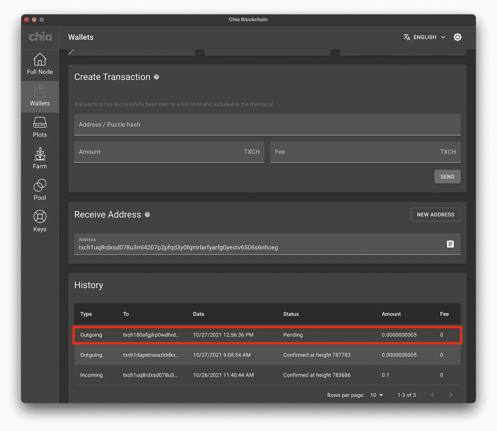
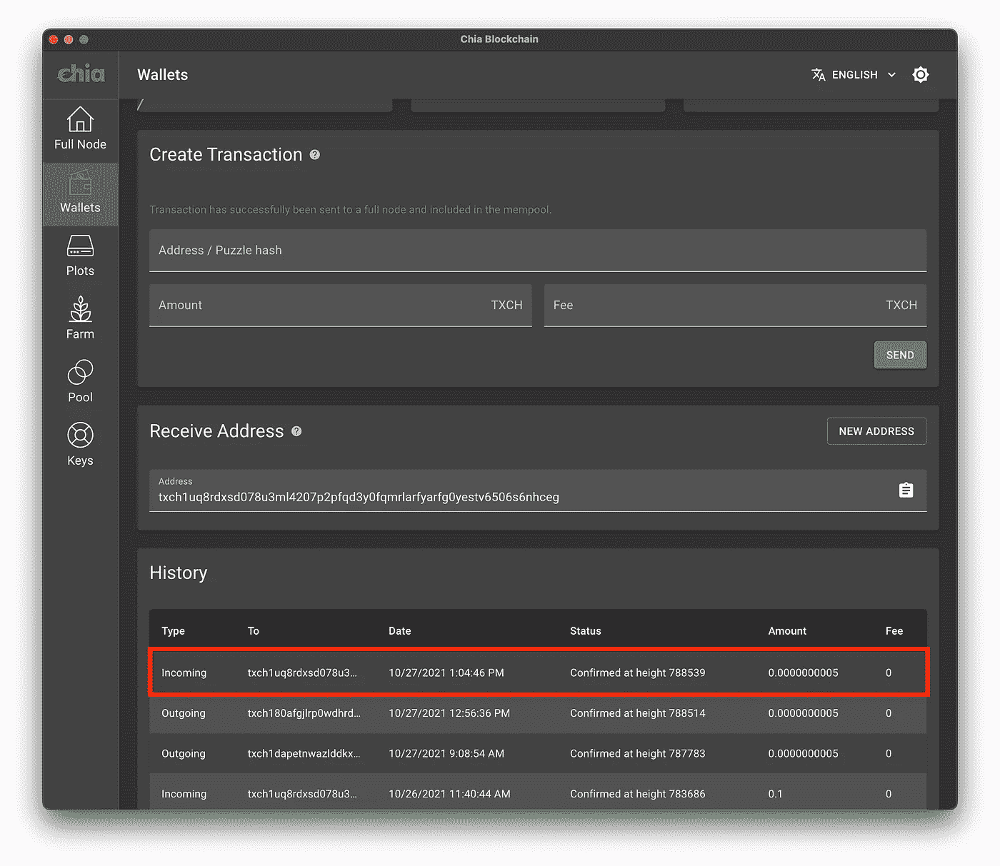

# 编写我的第一个 Chia 区块链程序(第 4 部分)——部署

> 原文：<https://levelup.gitconnected.com/writing-my-first-chia-blockchain-program-part-4-deploy-5bd1bae154d4>

我最近开始学习 Chialisp。请和我一起将我的第一枚智能硬币部署到奇亚区块链，并随时提问。


萨贾德·诺里在 Unsplash 上拍摄的照片

# 介绍

在第 1 部分中，我们回顾了 Chialisp 和 Chia 区块链的高级概念。

[](https://thepaulo.medium.com/writing-my-first-chia-blockchain-program-part-1-introduction-a10cd8eddece) [## 编写我的第一个 Chia 区块链程序—第 1 部分—简介

### 我最近开始学习 Chialisp。请和我一起将我的第一个程序部署到 Chia 区块链，并随时提问…

thepaulo.medium.com](https://thepaulo.medium.com/writing-my-first-chia-blockchain-program-part-1-introduction-a10cd8eddece) 

在第 2 部分中，我们介绍了如何设置我们将在本系列的这一部分中使用的开发环境。

[](https://thepaulo.medium.com/writing-my-first-chia-blockchain-program-part-2-setup-fda79486248) [## 编写我的第一个 Chia 区块链程序—第 2 部分—设置

### 我最近开始学习 Chialisp。请和我一起将我的第一个程序部署到 Chia 区块链，并随时提问…

thepaulo.medium.com](https://thepaulo.medium.com/writing-my-first-chia-blockchain-program-part-2-setup-fda79486248) 

在第 3 部分中，我们编写了第一个智能硬币。我们将在本系列的这一部分中使用该代码。

[](https://thepaulo.medium.com/writing-my-first-chia-blockchain-program-part-3-smart-coin-a9a4c3983dd1) [## 编写我的第一个 Chia 区块链程序——第 3 部分——智能硬币

### 我最近开始学习 Chialisp。请和我一起编写我的第一个区块链 Chia 程序，并随时提问…

thepaulo.medium.com](https://thepaulo.medium.com/writing-my-first-chia-blockchain-program-part-3-smart-coin-a9a4c3983dd1) 

**重要的**:我们将使用的密码硬币是**不**安全的。它仅作为编写 Chia 智能硬币的介绍。请仅在 testnet 上使用测试资金(TXCH)。

# **将硬币部署到区块链**

我们将使用我们在[第 3 部分](https://thepaulo.medium.com/writing-my-first-chia-blockchain-program-part-3-smart-coin-a9a4c3983dd1)中开发的智能硬币的编译版本，使用下面的命令。

```
cdv clsp build ./password/password.clspcdv clsp curry ./password/password.clsp.hex -a 0x2a9fadc7b1dd086ec3f10e77cad160cb5ba6f54dbd20290ebf0670a6b56e0ed8
```

上面的命令应该返回类似如下的内容:

```
(a (q 2 (q 2 (i (= (sha256 11) 5) (q 4 (c 6 (c 23 (c 47 ()))) (c (c 4 (c 47 ())) ())) (q 8 (q . "Incorrect, that was the wrong password !"))) 1) (c (q 73 . 51) 1)) (c (q . 0x2a9fadc7b1dd086ec3f10e77cad160cb5ba6f54dbd20290ebf0670a6b56e0ed8) 1))
```

然后，我们可以通过重复前面的命令并使用`treehash`标志来获得谜题的[树散列值](https://chialisp.com/docs/common_functions/#sha256tree1):

```
cdv clsp curry ./password/password.clsp.hex -a 0x2a9fadc7b1dd086ec3f10e77cad160cb5ba6f54dbd20290ebf0670a6b56e0ed8 —-treehash
```

这将返回类似于:

```
3bfa944be30bdcdb8dac64c1ca2e717b16d4bed786b0a4d8009efd06bc35c051
```

有了前一个命令的结果，我们可以对拼图树散列进行编码，以获得创建硬币的地址。因为我们在 testnet 中工作，所以一定要使用前缀`txch`。

```
cdv encode 3bfa944be30bdcdb8dac64c1ca2e717b16d4bed786b0a4d8009efd06bc35c051 —-prefix txch
```

此时，我们应该有一个如下所示的地址。

```
txch180afgjlrp0wdhrdvvnqu5tn30vtdf0khs6c2fkqqnm7sd0p4cpgsrve4yq
```

最后，我们可以使用下面的命令将我们的硬币部署到区块链(价值 500 mojos)(注意:确保`chia`命令指向您的 testnet 钱包，否则您可能会将真实的资金发送到一个可能无法访问的地址):

```
chia wallet send -a 0.0000000005 -t txch180afgjlrp0wdhrdvvnqu5tn30vtdf0khs6c2fkqqnm7sd0p4cpgsrve4yq
```

注意:这里我们基本上是从我们的钱包发送 TXCH 到这个新地址。恰好这个地址是从我们的散列代码中生成的，所以有可能(我们将在下一节中看到)将这两者关联起来。

如果上述命令成功，您应该能够在您的 Chia 钱包中看到交易。



我们可以通过使用以下命令查询硬币记录来检查我们的发送是否成功:

```
cdv rpc coinrecords --by puzzlehash 3bfa944be30bdcdb8dac64c1ca2e717b16d4bed786b0a4d8009efd06bc35c051
```

这将生成如下所示的输出。注意，硬币用尽状态等于`false`。

```
[
    {
        "coin": {
            "amount": 500,
            "parent_coin_info": "0xec4b2883cc348c003ee0111e14741ca8627d82e120ca5413cf6c73f45da15283",
            "puzzle_hash": "0x3bfa944be30bdcdb8dac64c1ca2e717b16d4bed786b0a4d8009efd06bc35c051"
        },
        "coinbase": false,
        "confirmed_block_index": 788514,
        "spent": false,
        "spent_block_index": 0,
        "timestamp": 1635364601
    }
]
```

您也可以使用下面的 testnet explorer 来检查硬币的状态。

 [## TXCH 地址 TXCH 180 afgjlrp 0 wdhrdvvnqu 5 TN 30 vtdf 0 khs 6 C2 fk qqnm 7 SD 0 p 4 cpgsrve 4 yq

### 注意:这是一个地址，但您的钱包可以有多个地址，因此此余额可能不会反映…

xch-testnet7.flaxexplorer.org](https://xch-testnet7.flaxexplorer.org/blockchain/address/txch180afgjlrp0wdhrdvvnqu5tn30vtdf0khs6c2fkqqnm7sd0p4cpgsrve4yq) 

# 花费(使用)硬币

在这一部分，我们将花费我们的硬币引导 TXCH 回到我们自己的钱包。这可以通过使用支出捆绑包来实现。

在您的项目目录中创建一个`spend_bundle.json`文件。该文件的基本结构如下所示:

```
{
  "coin_spends": [
    {
      "coin" : {
        "parent_coin_info": "",
        "puzzle_hash": "",
        “amount": 0
      },
      "puzzle_reveal": "",
      "solution": ""
    }
  ],
  "aggregated_signature": ""
}
```

其中，关键值应该如下所述:

**coin _ spences:**这一捆中应该花费的所有硬币的列表。

**硬币:**要在这一捆中花费的硬币。它有三个属性:

*   **parent_coin_info:** 这是我们正在消费的硬币的父 id。我们可以从我们的`coinrecords`命令的输出中得到这个值(注意，我们将输出表示为支出包中的一个字符串，因此我们不需要硬币记录值中的 0x)。从我们之前运行的`cdv rpc coinrecords`的输出中获得这个值。

```
ec4b2883cc348c003ee0111e14741ca8627d82e120ca5413cf6c73f45da15283
```

*   这是我们正在花费的硬币的字谜散列。从我们之前运行的`cdv rpc coinrecords`的输出中获得这个值。

```
3bfa944be30bdcdb8dac64c1ca2e717b16d4bed786b0a4d8009efd06bc35c051
```

*   **数量:**这是硬币中魔咒的数量。

```
500
```

**puzzle_reveal:** 这基本上是我们的难题的字节码(十六进制)版本，传递了经过处理的参数。可以通过运行:`cdv clsp curry ./password/password.clsp.hex -a 0x2a9fadc7b1dd086ec3f10e77cad160cb5ba6f54dbd20290ebf0670a6b56e0ed8 -x`得到这个值。注意最后的`-x`标志。

```
ff02ffff01ff02ffff01ff02ffff03ffff09ffff0bff0b80ff0580ffff01ff04ffff04ff06ffff04ff17ffff04ff2fff80808080ffff04ffff04ff04ffff04ff2fff808080ff808080ffff01ff08ffff01a8496e636f72726563742c207468617420776173207468652077726f6e672070617373776f726420218080ff0180ffff04ffff01ff4933ff018080ffff04ffff01a02a9fadc7b1dd086ec3f10e77cad160cb5ba6f54dbd20290ebf0670a6b56e0ed8ff018080
```

**解:**要传递到我们硬币的谜题中的解的值。我们在第 3 部分中创建了硬币，使用了以下非 curried 参数:密码、receive_puzzlehash、金额。

您应该使用自己的钱包的接收地址难题散列，因为您将希望您的 TXCH 返回到您的钱包。你可以通过解码你的钱包的接收地址得到这个值(你可以在 Chia GUI 中找到接收地址):`cdv decode txch180afgjlrp0wdhrdvvnqu5tn30vtdf0khs6c2fkqqnm7sd0p4cpgsrve4yq`。

接下来，我们需要获得解决方案的二进制表示(由密码、上面解码的值和花费的金额组成)以添加到我们的花费包中，我们可以通过运行`opc`命令来完成此操作(注意接收地址难题哈希中的 0x 以表示字节):`opc ‘(chiaiscool 0xe00e369a0d7f8fc8eff553fc1505206c48f48363ff4692746943c9982d9aa3f5500)’`

```
ff8a636869616973636f6f6cffa0e00e369a0d7f8fc8eff553fc1505206c48f48363ff4692746943c9982d9aa3f5ff8201f480
```

**aggregated_signature:** 我们不会在本教程中使用该字段。然而，这是一个重要的安全特性，你可以在这里阅读更多关于[的信息。现在，我们将把它硬编码为零(它不能为空)。](https://www.chia.net/2021/05/27/Agrgregated-Sigs-Taproot-Graftroot.html)

```
0xc00000000000000000000000000000000000000000000000000000000000000000000000000000000000000000000000000000000000000000000000000000000000000000000000000000000000000000000000000000000000000000000000
```

我们的`spend_bundle.json`文件应该是这样的:

```
{
  "coin_spends": [
    {
      "coin" : {
        "parent_coin_info": "ec4b2883cc348c003ee0111e14741ca8627d82e120ca5413cf6c73f45da15283",
        "puzzle_hash": "3bfa944be30bdcdb8dac64c1ca2e717b16d4bed786b0a4d8009efd06bc35c051",
        “amount": 500
      },
      "puzzle_reveal": "ff02ffff01ff02ffff01ff02ffff03ffff09ffff0bff0b80ff0580ffff01ff04ffff04ff06ffff04ff17ffff04ff2fff80808080ffff04ffff04ff04ffff04ff2fff808080ff808080ffff01ff08ffff01a8496e636f72726563742c207468617420776173207468652077726f6e672070617373776f726420218080ff0180ffff04ffff01ff4933ff018080ffff04ffff01a02a9fadc7b1dd086ec3f10e77cad160cb5ba6f54dbd20290ebf0670a6b56e0ed8ff018080",
      "solution": "ff8a636869616973636f6f6cffa0e00e369a0d7f8fc8eff553fc1505206c48f48363ff4692746943c9982d9aa3f5ff8201f480"
    }
  ],
  "aggregated_signature": "0xc00000000000000000000000000000000000000000000000000000000000000000000000000000000000000000000000000000000000000000000000000000000000000000000000000000000000000000000000000000000000000000000000"
}
```

我们可以使用以下命令在命令行上调试我们的 spend_bundle:

```
cdv inspect spendbundles ./password/spend_bundle.json -db
```

如果没有错误，您应该已经准备好将您的包转发到网络了！为此，我们将运行以下命令:

```
cdv rpc pushtx ./password/spend_bundle.json
```

如果一切顺利，你应该看到状态“成功”，你的 TXCH 应该回到你的钱包！这可能需要几分钟，所以请稍等。



如果我们检查一下 testnet explorer，您可以看到我们的硬币已经花掉了，因为它有一个分配的花掉块索引。

# **结论**

在本教程中，我们学习了如何将我们的密码保护智能硬币放在基亚区块链上，并使用消费包与之交互。在[第 5 部分](https://thepaulo.medium.com/writing-my-first-chia-blockchain-program-part-5-web-app-300a3ac44c72)中，我们将回顾如何创建一个 web 界面来与我们定制的 chia 智能硬币进行交互！

*合著者* [*凯蒂·甘多米博士*](https://www.linkedin.com/in/kygandomi/)

*如果您觉得这篇文章很有帮助，请点击👏按钮或捐赠一些(mainnet) Chia (XCH)到我的地址:*

xch 159 qvpvafcx 4 jxllk 9 xe 9 NPH 42 xw 50j 56 mpt 03 DSA 05 svll 7 kmd LQ 04 UCM 8

# 参考

更多关于创建奇亚硬币的深入教程，请查阅下面的参考资料。

1.  创建一个[储钱罐硬币](https://chialisp.com/docs/tutorials/coin_lifecycle_and_testing)，达到某个阈值时支付。
2.  创建一个锁定时间的 [LeaveALegacyCoin](https://www.youtube.com/channel/UCApODKqBfRkmbQsCBDq5Nlg) 。