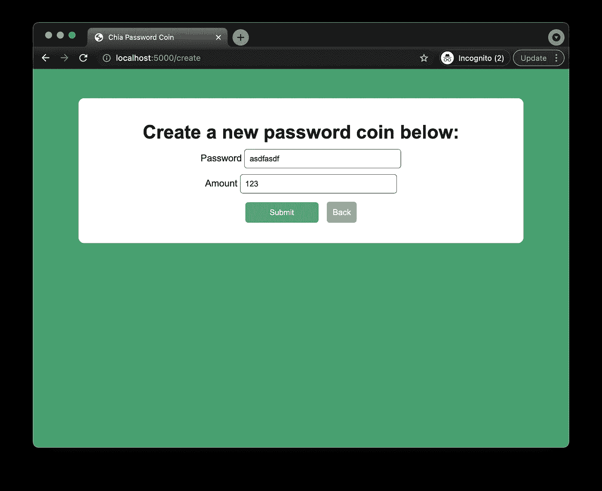

# 编写我的第一个 Chia 区块链程序(第 5 部分)——Web App

> 原文：<https://levelup.gitconnected.com/writing-my-first-chia-blockchain-program-part-5-web-app-300a3ac44c72>

我最近开始学习 Chialisp。请和我一起创建一个简单的 Python web 应用程序，与自定义硬币进行交互！


马库斯·斯皮斯克在 Unsplash 上拍摄的照片

# 介绍

在第 1 部分中，我们回顾了 Chialisp 和 Chia 区块链的高级概念。

[](/writing-my-first-chia-blockchain-program-part-1-introduction-a10cd8eddece) [## 编写我的第一个 Chia 区块链程序—第 1 部分—简介

### 我最近开始学习 Chialisp。请和我一起将我的第一个程序部署到 Chia 区块链，并随时提问…

levelup.gitconnected.com](/writing-my-first-chia-blockchain-program-part-1-introduction-a10cd8eddece) 

在第 2 部分中，我们介绍了如何设置我们将在本系列的这一部分中使用的开发环境。

[](https://thepaulo.medium.com/writing-my-first-chia-blockchain-program-part-2-setup-fda79486248) [## 编写我的第一个 Chia 区块链程序—第 2 部分—设置

### 我最近开始学习 Chialisp。请和我一起将我的第一个程序部署到 Chia 区块链，并随时提问…

thepaulo.medium.com](https://thepaulo.medium.com/writing-my-first-chia-blockchain-program-part-2-setup-fda79486248) 

在第 3 部分中，我们编写了第一个智能硬币。我们将在本系列的这一部分中使用该代码。

[](/writing-my-first-chia-blockchain-program-part-3-smart-coin-a9a4c3983dd1) [## 编写我的第一个 Chia 区块链程序——第 3 部分——智能硬币

### 我最近开始学习 Chialisp。请和我一起编写我的第一个区块链 Chia 程序，并随时提问…

levelup.gitconnected.com](/writing-my-first-chia-blockchain-program-part-3-smart-coin-a9a4c3983dd1) 

在第 4 部分中，我们将智能硬币部署到区块链，并使用它进行了第一笔交易。

[](/writing-my-first-chia-blockchain-program-part-4-deploy-5bd1bae154d4) [## 编写我的第一个 Chia 区块链程序—第 4 部分—部署

### 我最近开始学习 Chialisp。请和我一起将我的第一枚智能硬币部署到奇亚区块链，并随时…

levelup.gitconnected.com](/writing-my-first-chia-blockchain-program-part-4-deploy-5bd1bae154d4) 

现在，我们将创建一个与我们的硬币接口的网络应用程序！这将通过创建一个连接到奇亚区块链的 python 后端来完成。

请注意，这是我的第一个区块链支持的网络应用程序，所以我不能说它将遵循最佳实践。例如，我们将通过 RPC 连接直接连接到一个钱包。对于一个需要连接到几个不同钱包同时保持私钥安全的应用程序来说，这将如何扩展？

**重要的**:我们将使用的密码硬币是**不**安全的。它仅作为编写 Chia 智能硬币的介绍。请仅在 testnet 上使用测试资金(TXCH)。

# **创建 Python 驱动代码**

驱动程序代码是将与 Chialisp 模块交互的 python 脚本。首先，创建名为`password/password_driver.py`的文件。点击查看 Github [中的完整文件。](https://github.com/Kygandomi/chia-password-coin/blob/main/password/password_driver.py)

我们将拥有在[第 4 部分](/writing-my-first-chia-blockchain-program-part-4-deploy-5bd1bae154d4)中手动执行的每个操作的函数。

# **为我们的 Chia 智能币编写 pytest**

为了验证驱动程序代码是否按预期执行，我们可以编写一些单元测试。这是在 Chia 上开发智能硬币的一个重要部分，因为你不想在区块链上砖头或损失真钱。编写测试也是一个尝试考虑攻击者可能从不同角度窃取您的硬币的机会。

要创建测试，我们可以使用项目主文件夹中的以下命令:

```
cdv test —-init
```

上面的命令，会创建一个`tests`文件夹和一个`tests/__init__.py`和`tests/test_skeleton.py`。

创建一个名为`tests/test_password.py`的新文件。我们可以通过复制`tests/test_skeleton.py`中自动生成的代码来启动这个文件，但是编辑它，使它包含下面的代码。链接到 Github 版本[这里](https://github.com/Kygandomi/chia-password-coin/blob/main/tests/test_password.py)。

上面的测试经历了创建一个密码为“chiaiscool”的硬币，将其部署到区块链模拟器并消费它的过程。

我们可以使用下面的命令获得所有测试的列表。

```
cdv test --discover
```

我们可以用下面的命令运行我们的测试。

```
cdv test
```

如果一切顺利，所有的测试都应该通过！

# **创建网络应用**

现在我们已经有了我们的驱动代码和测试，我们可以创建一个简单的 python [Quart](https://pgjones.gitlab.io/quart/) 应用程序来创建我们的硬币并与之交互！

首先安装[夸脱](https://pgjones.gitlab.io/quart/)。

```
pip install quart
```

现在创建一个名为`app.py`的文件，我们将在其中为我们的 web 应用程序编写 HTTP 请求处理程序。这个文件将有一个索引，硬币创建和支出请求的处理程序。`app.py`的完整文件可以在这里找到[。](https://github.com/Kygandomi/chia-password-coin/blob/main/app.py)

在进入 HTTP 处理程序之前，让我们看一下连接到区块链的代码。它将包括以下内容:

1.  两个全局变量来保存 RPC 连接的处理程序`wallet_rpc_client`和`full_node_rpc_client`。
2.  一组配置变量将保存我们的服务器连接到我们的 wallet 和完整节点的本地实例所需的信息(`wallet_host`、`wallet_rpc_port`、`node_rpc_port`)。
3.  函数`setup_blockchain_connection`将使用 chia Python 库连接到各自的本地服务。有关用于创建这些连接的两个函数的更多信息，请参见 [FullNodeRpcClient](https://github.com/Chia-Network/chia-blockchain/blob/1.2.7-release/chia/rpc/full_node_rpc_client.py) 和 [WalletRpcClient](https://github.com/Chia-Network/chia-blockchain/blob/1.2.7-release/chia/rpc/wallet_rpc_client.py) 。

最简单的 HTTP 处理程序是下面显示的索引路径处理程序。它建立到区块链的连接(使用上面函数中的 RPC 连接),并获取本地钱包中第一个钱包的余额以显示给用户。

`/create`路径的处理程序如下所示。请注意，根据方法的不同，POST vs GET 会执行不同的代码部分。创建硬币时，它使用`create_coin_txaddress`驱动程序创建硬币地址，并使用`wallet_rpc_client.send_transaction(wallet_id, int(amount), coin_txaddress)`命令发布交易。

最后一个处理程序是`/spend`路径。这个处理程序稍微复杂一些，因为它需要完成几个不同的任务:

1.  它获取与指定的谜题散列匹配的所有硬币的记录(`full_node_rpc_client.get_coin_records_by_puzzle_hash`)。
2.  检查每个取回的硬币的花费状态，以找到尚未花费的硬币。注意:因为我们是通过 puzzle_hash 查找函数，所以用这个谜题和相同的输入密码创建的每个硬币都将被返回！甚至是其他用户创造的硬币。可能不是最好的实现。
3.  它创造了一个消费组合。
4.  向网络提交支出包(`full_node_rpc_client.push_tx(tx_spend_bundle)`)。

现在我们已经创建了 HTTP 处理程序，我们需要创建将用于每个视图的 HTML 模板。我们的四个模板如下所示:

`/templates/base.html`

`/templates/create.html`

`/templates/index.html`

`/templates/spend.html`

完整的代码可以在下面的资源库中找到。

[](https://github.com/Kygandomi/chia-password-coin) [## GitHub-Kygandomi/chia-password-coin:使用官方 chia 学习 chia lisp 的项目…

### 在这个项目中，我们使用 Chialisp 开发了一个简单的受密码保护的智能硬币！自从 Chia 开发以来…

github.com](https://github.com/Kygandomi/chia-password-coin) 

# 运行 Web 应用程序

使用下面的命令运行 webapp。注意:您的 Chia 客户端(wallet +完整节点)需要在本地运行并同步。

```
python app.py
```

打开浏览器，导航到我们的应用程序的索引，如下所示。它应该显示您本地钱包中当前确认的余额。


我们现在可以通过导航到`/create`来创建我们的第一枚硬币，并输入所需数量的魔咒和密码！



点击提交后，交易将出现在您的钱包历史记录中，如下所示。提交可能需要一段时间。


一旦交易被提交，您就可以通过输入密码和地址在应用程序的`/spend`路径中使用这笔交易。在这种情况下，我原来的钱包的接收地址。


一段时间后，收到的交易应该会出现在您的钱包的历史记录中，完成创建密码保护硬币并将其兑现回原始钱包的往返过程！


# **结论**

就是这样！在整个系列中，我们回顾了 Chialisp 的[基本概念，然后我们设置了一个](/writing-my-first-chia-blockchain-program-part-1-introduction-a10cd8eddece)[开发环境](https://thepaulo.medium.com/writing-my-first-chia-blockchain-program-part-2-setup-fda79486248)用于创建测试硬币，我们编写了第一个硬币拼图[然后](/writing-my-first-chia-blockchain-program-part-3-smart-coin-a9a4c3983dd1)[将其部署到区块链](/writing-my-first-chia-blockchain-program-part-4-deploy-5bd1bae154d4)。在这最后一部分，我们学习了如何通过自定义 Python web 应用程序编程使用我们的难题。

希望这是有帮助的！我确实从这次经历中学到了很多。欢迎在评论中留下你正在做的事情的链接！

*合著者* [*凯蒂·甘多米博士*](https://www.linkedin.com/in/kygandomi/)

*如果您觉得这篇文章很有帮助，请点击👏按钮或捐赠一些(mainnet) Chia (XCH)到我的地址:*

xch 159 qvpvafcx 4 jxllk 9 xe 9 NPH 42 xw 50j 56 mpt 03 DSA 05 svll 7 kmd LQ 04 UCM 8