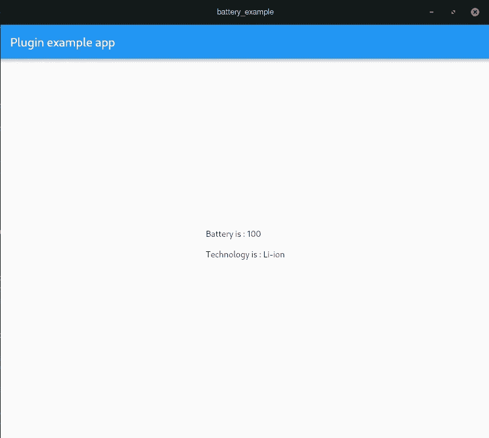

# 在 Flutter 中为 Linux 编写插件

> 原文：<https://levelup.gitconnected.com/writing-plugins-for-linux-in-flutter-38e46bd7872f>

众所周知，Flutter 最近用 [canonical](https://medium.com/flutter/announcing-flutter-linux-alpha-with-canonical-19eb824590a9) 扩展了对 linux 的支持。有了它，我们现在可以更容易地用 Flutter 为 linux 构建和部署应用程序。

# 从升级 Flutter 开始

```
flutter channel master
flutter upgrade
```

# 在 Flutter 中启用 Linux 支持

```
flutter config --enable-linux-desktop
```

# 让我们创建一个简单的电池插件

在这个例子中，我们将创建一个插件，它将为我们提供电池百分比水平及其技术。

```
flutter create -t plugin --platforms=linux battery
```

# 分析环境

在你的插件文件夹中，你会得到一个包含处理你的方法通道的`battery.dart` 文件的`lib`文件夹，一个包含演示你的插件使用的示例应用的`example`文件夹和一个包含处理你的平台级方法的`battery_plugin.cc`文件的`linux`文件夹。平台级代码是用 C++为 Linux 编写的。

每当收到来自 Flutter 的调用时，将调用函数`battery_plugin_handle_method_call`。我们可以通过调用`fl_method_call_get_name(method_call)`函数得到方法。响应将从 linux 平台以`FlMethodResponse`数据类型发送。

我们将在 linux 中处理的数据类型是`FlValue`。以下是 FlValue 的一些示例:

对于字符串:

```
string flutter = "Flutter";
g_autoptr(FlValue) converted = fl_value_new_string(flutter.c_str());
```

对于地图:

```
// Initialize a map.
g_autoptr(FlValue) mapExample = fl_value_new_map();string flutter = "Flutter", dart = "Dart";// Set a value in map.
fl_value_set(mapExample, fl_value_new_string(flutter.c_str()),               fl_value_new_string(dart.c_str()));// First parameter is the variable.
// Second parameter is the key.
// Third paramter is its value.
```

要将 FlValue 转换为响应，我们必须使用:

```
g_autoptr(FlMethodResponse) response = FL_METHOD_RESPONSE(fl_method_success_response_new(value));
// It takes a FlValue as its parameter.
```

更多关于`FlValue`的信息可以在这里找到[。](https://engine.chinmaygarde.com/fl__value_8h.html#a248fb199aa2cc2b92f692067e2d15cd9)

# 让我们工作吧

在`lib/battery.dart`文件中，添加一个函数来调用`getBatteryData`方法，如下所示:

```
static Future<Map<String, dynamic>> get getBatteryLevel async {
    final Map<String, dynamic> version = Map<String, dynamic>.from(
        await _channel.invokeMethod('getBatteryData')
    );
    return version;
}
```

这是我们将在 flutter 应用程序中调用的 getter。现在，在`linux/battery_plugin.cc`中，我们必须为`getBatteryData`方法通道添加一个条件。

> 注意:这不是 battery_plugin.cc 的全部，只是我们实现的部分。

在这里，我们用 C++打开 linux 系统文件来获取信息。我们使用文件`/sys/class/power_supply/BAT1/capacity`获取电池百分比水平，使用文件`/sys/class/power_supply/BAT1/technology`获取其技术。

# 现在到前端

这是我们的`main.dart`文件，它使用电池插件来获取电池数据。

# 运行应用程序

```
flutter run -d linux
```

要获取详细的调试数据，请使用:

```
flutter run -d linux -v
```

# 就这样

下面是作为 linux 可执行文件运行的应用程序的屏幕截图。



电池插件示例

## github:[https://github.com/yash1200/flutter_battery_linux](https://github.com/yash1200/flutter_battery_linux)