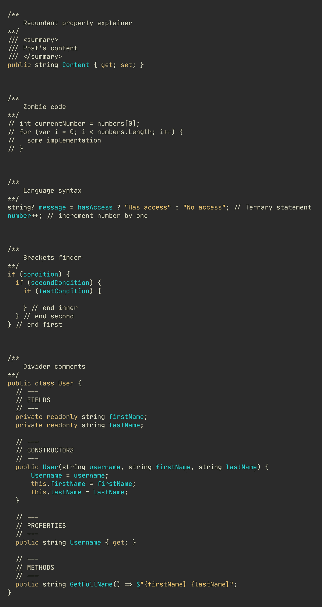
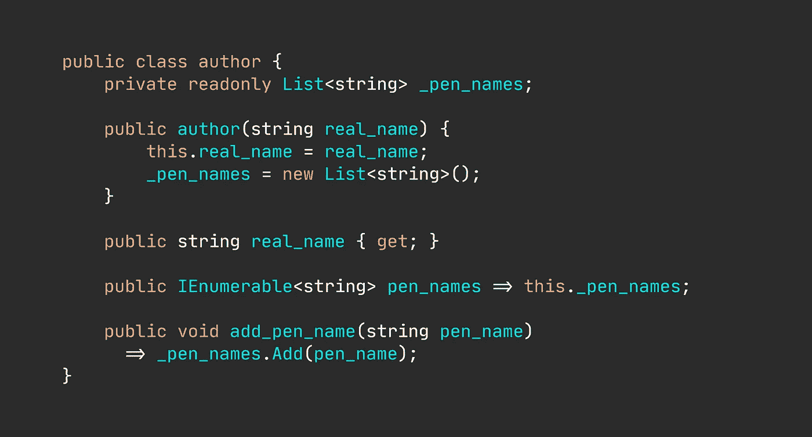
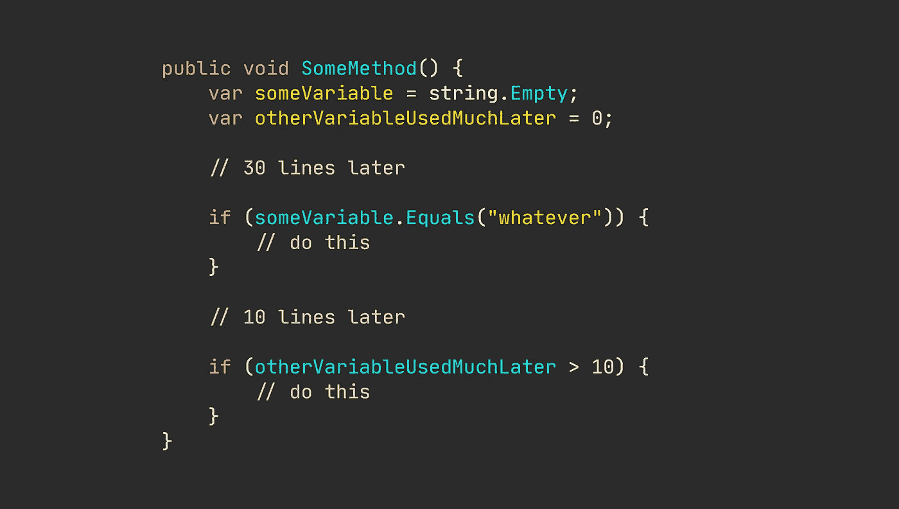
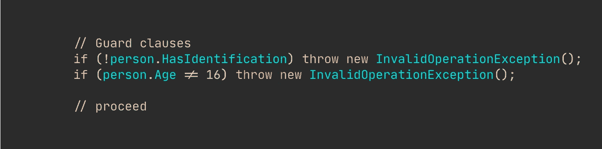
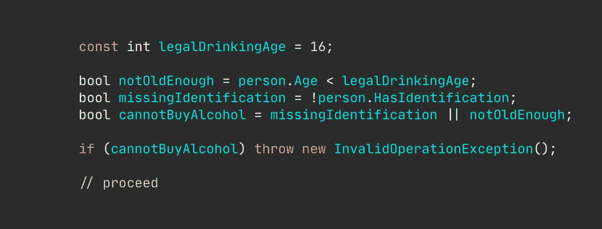
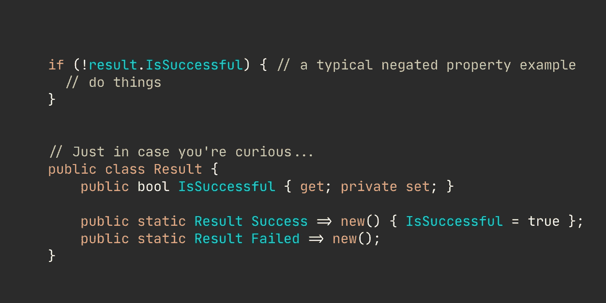
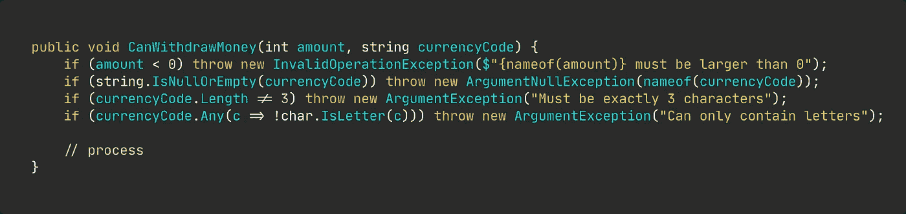

# 编写可读代码的技巧(举例)

> 原文：<https://levelup.gitconnected.com/writing-readable-code-exemplified-bd387cd93b6b>

## 固执己见的编程建议

## 遵循一些指导方针和实践大有裨益。

尼古拉斯·米勒德的眼镜图片

这些年来，我应用了许多不同的编程风格、实践和方法来编写更可读的代码。

有些最初看起来很棒，但后来证明不是。其他的已经过时了，还有一些我还在使用的实践。

我将列举一些我一直坚持的，在我看来效果很好的方法。

# 删除不必要的代码注释。

[你确实需要文档注释](/yes-your-code-need-comments-a96348bf3fb7)，但是大多数注释完全没有必要。

有许多不同“种类”的评论只会增加信噪比。

这里有一些典型的代码注释，你最好直接删除——下面有一个代码片段来举例说明。

*   **多余的房产说明**
    你会经常看到开发商通过只写房产名称来“记录”房产。又吵又没用。
*   **僵尸代码/评论**
    他们真的需要被删除。完全没有理由保留那些注释，以防有人以后需要一些代码。
    如果你真的坚持要看旧代码，就看你之前的 git 提交。
*   **语言语法注释**
    你必须假设团队中的每个人都可以阅读代码——否则，你还有其他值得解决的问题……那些仅仅是为了解释琐碎的语言语法而存在的注释永远不应该出现在产品中。
*   **匹配括号查找器**
    你的 IDE 可以很容易的找到匹配的括号。不需要评论。此外，如果您需要注释来找到左括号或右括号，您的方法要么太长，要么嵌套太深。
*   **分隔线**
    应该删除那些将你的代码“分割”或组织成段的注释。如果你遵循你的语言习惯，就不需要这些(真的从来不需要这些疯狂的评论)。

无用评论的例子。

显然还有很多。但是我经常看到我在这里提到的那些。

# 使用该语言的命名约定。

这应该是显而易见的，但是随着人们学习新的语言，我开始越来越多地看到这一点:他们忽略了学习非常基本的惯例。

无论你使用哪种语言，查找它们的约定并不困难。但是，不幸的是，我看到 C#开发人员经常应用错误的命名约定。

目睹新开发人员违反如下语言是很常见的。

难看的 C#代码。

顺便说一下，这是 C#，但它看起来像是 C#、java 和 python 之间的科学怪人。

代码可能会编译，但看起来完全是一场灾难。

我认为对事情进行微调是完全可以的，让代码在风格上更吸引你。但是尽量保持大致相同。

# 蜉蝣变数是较少精神负担。

所以，有一种倾向是在方法的最顶端声明变量，只是在很久很久以后才被使用。

在方法的顶部声明或初始化变量可能很诱人，而且可能会带来代码组织整齐的感觉。但是有一个警告。

计算机不介意这种做法，但人类介意。

以这个(简化的)例子为例。

在读取该方法的实现时，您会看到这些变量在顶部被初始化。你必须跟踪它们，即使你缺乏上下文信息来理解它们。

这增加了“心理重量”

在我看来，更好的方法是在使用变量之前立即声明它们。

# 夸大你的条件句。

我经常遇到我完全不知道发生了什么的条件语句。

主要是由于两个原因:1)条件本身很难阅读，2)我缺乏领域知识来理解为什么要验证某个东西。

以这个片段为例。有了正确的知识，你就会知道到底发生了什么，为什么。然而，如果您缺乏领域专业知识，您可能很难理解我们在这里检查的内容。

神秘的条件句。

与其写这些神秘的条件，我们还不如多花一点时间来明确不同的值和条件意味着什么。

过于明确的条件句。

因此，上面的例子可能过于冗长。但就像我们丹麦语里说的，“夸张促进理解”(直接翻译)。

现在，对于每个变量和条件的含义，至少没有一丝一毫的疑问。

你可能不想这么直截了当，但我相信你足够聪明，知道我在说什么。

# 为什么使用否定的属性？

你经常听到像“你的条件句应该总是积极的”这样的建议，但我不认为那是真的。你会经常需要验证某事是*不是*！ *)* 真实。

许多开发人员默认使用否定属性，如下所示。(对于初学者:一个否定就是你把逻辑否定运算符放在一个表达式前面，比如这里的`!Result.IsSuccessful`。)

否定属性的示例。

在我看来，这样做是错误的。

在这种情况下，如果您控制着`Result`类，那么向它添加一个额外的属性，比如“Failed”或者在您的上下文中有意义的任何名称。

否定是一种精神负担，很容易被忽视。

# 尽管输入不正确，但行为正确。

在前面的例子中，我们已经略微涉及到了 guard 子句，但是让我详细阐述一下这个概念。

[保护子句是典型的一行程序](https://medium.com/swlh/2-defensive-coding-techniques-you-should-use-today-4225cacc1c29),通过在执行方法体之前检查一些先决条件，它可以帮你省去很多麻烦。

保护条款经常将开发人员分成两个阵营，因为他们倾向于一种固执的关于“早期回报”和“单一回报”的方法

尽管如此，保护条款仍然存在，而且非常有益。

这里有一个验证`currencyCode`字符串输入实际上是表示一个货币代码的例子。

Guard 子句示例。

通过使用 guard 子句，您可以快速终止代码执行，最大限度地减少处理错误数据或状态的机会。

显然，如果你有一个像“货币代码”这样的概念，你打算在不止一个地方使用，[你最好创建一个包含这些检查的专门类](https://betterprogramming.pub/stop-using-primitive-types-in-domain-classes-c45f5973d640)。

# 我想你会喜欢类似的内容。

*   [不良代码注释示例(YouTube)](https://youtu.be/S-kJQ7ALJaE)
*   [用例子清理代码(YouTube)](https://youtu.be/goVjlWLY9NQ) / [写更干净的代码(中等)](/writing-cleaner-code-with-examples-69be2160b4c1)
*   [是的，你的代码需要注释](/yes-your-code-need-comments-a96348bf3fb7)
*   [为什么认知和圈复杂度在软件开发中很重要](/why-cognitive-and-cyclomatic-complexity-matters-in-software-development-5fce1efb56ab)