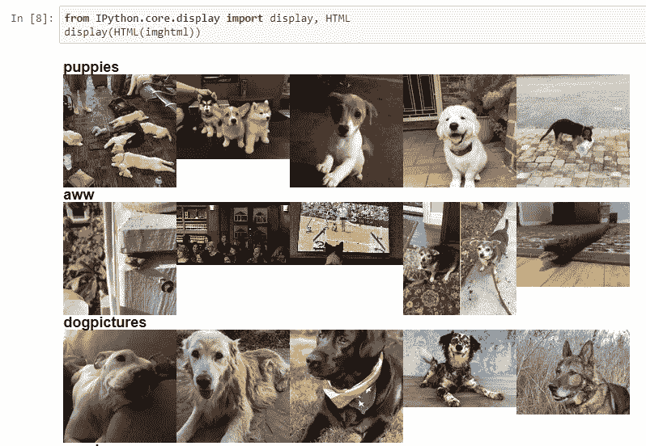

# 使用 Reddit API 编写脚本

> 原文：<https://levelup.gitconnected.com/writing-scripts-with-reddit-api-3f880aa0b974>


在这篇文章中，我将展示如何使用 Python 来收集内容并围绕它创建一个简单的网页。参见[第一部分](https://alpscode.com/blog/how-to-use-reddit-api/)了解如何向 Reddit API 注册应用并开始使用。

# 设置

我经常使用 PyCharm 或 Jupyter notebook 来开发 Python，但是任何 Python 环境都可以。你需要有一个 Reddit 应用程序 id 和应用程序的秘密已经在这一部分。HTML 和 CSS 的基础知识可能是有用的，但对于高级内容不是必需的。

我会写一个脚本，将搜索“小狗”相关的子主题，并显示他们的热门职位作为一个画廊。如果你喜欢狗，这个项目可能足以引发你可爱的攻击性。

# 概观


在前一部分我已经展示了 Reddit API 的基本介绍。我会遵循以下步骤:

1.  查找与小狗
    `[GET /subreddits/search](https://www.reddit.com/dev/api#GET_search)`相关的子编辑
2.  获取每个子编辑
    `[GET /top](https://www.reddit.com/dev/api#GET_top)`的帖子列表
3.  以 HTML 代码的形式过滤和收集图像链接
4.  最后，显示(并保存)HTML 内容

`GET`请求是 RESTful APIs 的被动成员。因此，脚本不会发布任何内容，而是返回您可以解析的内容。

首要任务是获取需要解析的子编辑名。您可以通过 API 使用 Reddit 的搜索功能:

```
payload = {'q': 'puppies', 'limit': 5}
response = requests.get(api_url + '/subreddits/search', headers=headers, params=payload)
js = response.json()
```

变量`js`是一个嵌套的字典，它包含了我们从 Reddit 得到的响应。我们可以看到字典的关键字

```
print(js.keys())dict_keys(['kind', 'data'])
```

你可以熟悉这些反应，但是可视化会有很大的帮助。使用您最喜欢的 JSON 查看器([https://jsoneditoronline.org/](https://jsoneditoronline.org/)、[https://codebeautify.org/jsonviewer](https://codebeautify.org/jsonviewer)、[http://jsonviewer.stack.hu/](http://jsonviewer.stack.hu/))复制内容`response.text`以可视化 JSON 响应。

Reddit 响应包括两个对象。对象`kind`显示了`data`对象有什么样的数据。如果是一个列表，那么`data`对象包含两个字符串，`before`和`after`，它们将用于导航。例如，在我们解析完第一个页面之后，我们将使用`after`参数请求第二个页面。

```
{
  "kind": "Listing",
  "data": {
    "modhash": null,
    "dist": 5,
    "children": [...],
    "after": "t5_2tjl7",
    "before": null
  }
}
```

这里，您可以使用的数据在`children`数组中。Reddit 通过告诉我们`children`数组有`"dist": 5`多少个元素，让我们的生活变得简单。让我们看看第一个孩子包括什么:

```
"children": [
      {
        "kind": "t5",
        "data": {
          "display_name": "puppies",
          "display_name_prefixed": "r/puppies",
          ...
        }
      },
      ...
]
```

`data`对象有很多字段。这一步我只使用`display_name`。JSON 查看器显示，可以使用下面的面包屑访问 display _ name:`data > children > i > data > display_name`。现在，您可以收集所有子编辑的名称，如下所示:

```
sr = []
for i in range(js['data']['dist']):
    sr.append(js['data']['children'][i]['data']['display_name'])

print(sr)['puppies', 'aww', 'dogpictures', 'corgi', 'lookatmydog']
```

# 收集帖子

现在我们有了一个子编辑列表，让我们继续从我们的池中的子编辑中收集前 5 个图像。

为此，我们将从这个子编辑中获得有史以来最热门的帖子。请记住，一些子编辑和他们的热门帖子可能与我们的搜索词无关，但我们在这里的目的只是显示相关子编辑的热门帖子列表。

API 请求`/r/(subreddit)/top`——其中`subreddit`将被替换为 subreddit 名称——将为我们提供顶级帖子。只需用存储在`sr`变量中的子编辑名替换`subreddit`。

在继续之前，打印一个简单的响应来理解结构:

```
payload = {'t': 'all'}
r = requests.get(api_url + '/r/puppies/top', headers=headers, params=payload)
print(r.text){
  "kind": "Listing",
  "data": {
    "modhash": null,
    "dist": 25,
    "children": [
      {
        "kind": "t3",
        "data": {
          "title": "Recently at the airport",
          "url": "[http://imgur.com/qPjptrd.jpg](http://imgur.com/qPjptrd.jpg)",
          "thumbnail": "[https://b.thumbs.redditmedia.com/bJxCSi2BHocxt0RlUvfk2ibVIKhpniqFL7_j-sCEs-Y.jpg](https://b.thumbs.redditmedia.com/bJxCSi2BHocxt0RlUvfk2ibVIKhpniqFL7_j-sCEs-Y.jpg)",
          "approved_at_utc": null,
          "subreddit": "puppies",
          "selftext": "",
          ...
        }
      },
      ...
    ],
    "after": "t3_7s49s5",
    "before": null
  }
}
```

正如您从 JSON 响应中看到的，您需要按照这个顺序访问数据:`data > children > i > data > title`。我在这里只使用`title`、`thumbnail`和`url`，但是检查 Reddit 为将来的项目返回什么样的数据是个好主意。

您可以迭代所有子元素，并将缩略图保存在 HTML 代码中。如果你使用 Jupyter，这个 HTML 代码可以打印出来。我还将展示如何将它保存为 HTML 页面。如果你对 HTML 不熟悉，在你方便的时候尽早检查一下基础知识可能是个好主意，因为这是一个非常有用的技能，尤其是现在。我使用的 HTML 标签如下:

*   `h3`用于打印标题
*   `div`用于分组和造型
*   `span`用于将 HTML 元素分组在一起
*   `a`用于创建链接
*   `img`用于显示图像

下面的代码显示了 subreddit 的标题，然后将 5 个顶部的图像放在一起。使用缩略图而不是完整图像是一个好主意，因为您只需要在画廊中展示一张小照片。当用户悬停时，它会显示原始海报的标题，点击会带用户到完整的图像(或网址)。

```
payload = {'t': 'all', 'limit': 5}
imghtml = ''
for s in sr:
    imghtml += '<h3 style="clear:both">{}</h3><div>'.format(s)
    r = requests.get(api_url + '/r/{}/top'.format(s), headers=headers, params=payload)
    js = r.json()
    for i in range(js['data']['dist']):
        if js['data']['children'][i]['data']['thumbnail'] == '':
            continue
        imghtml += '<span style="float:left"><a href="{}"></a></span>'.format(
            js['data']['children'][i]['data']['url'],
            js['data']['children'][i]['data']['thumbnail'],
            js['data']['children'][i]['data']['title'],
        )
    imghtml += '</div>'
```

在这里，`GET`对`/r/(subreddit)/top`的请求从该子编辑中返回热门帖子。我为查询传递了时间段`t=all`和每个子编辑的帖子数量限制`limit=5`。最后`imghtml`应该有你需要显示的 HTML 代码。

# 结果

我们已经到了这个简短而又切题的教程的最后一步。图像可以在 Jupyter 笔记本中显示如下:

```
from IPython.core.display import display, HTML
display(HTML(imghtml))
```



我们使用的`display`和`HTML`函数是 Jupyter 特有的。如果您使用不同的工具来编写 Python 代码，那么将 HTML 代码编写到页面中是有意义的。

```
with open("puppies.html", "w", encoding='utf-8') as html_page:
    html_page.write(imghtml)
```

现在，您可以浏览 Python 代码所在的文件夹，并打开适当命名的`puppies.html`页面。参见[此处的预览](http://htmlpreview.github.io/?https://github.com/alpscode/notebooks/blob/master/reddit-api/puppies.html)。

# 关闭

有大量的信息，我不能在这里涵盖，以保持这个帖子的重点。我希望写一个小游戏，你看到一张照片，试着猜它被分享的子编辑，但是我现在必须跳过它。我可能会在另一个迭代中这样做，希望如此。

如果你喜欢这个教程，请查看我的 [Jupyter 笔记本](https://nbviewer.jupyter.org/github/alpscode/notebooks/blob/master/reddit-api/Reddit-to-Webpage.ipynb)来看一个完整的例子，其中一个网页是由一个给定的搜索查询生成的。在即将发布的一篇博文中，我将向您展示如何编写一个 Reddit 机器人，它将解析来自两个独立 API 的信息，并在 Reddit 上发布评论。

# 参考

*   [第二部分笔记本](https://nbviewer.jupyter.org/github/alpscode/notebooks/blob/master/reddit-api/RedditAPI-2.ipynb)
*   [Reddit 转网页笔记本](https://nbviewer.jupyter.org/github/alpscode/notebooks/blob/master/reddit-api/Reddit-to-Webpage.ipynb)
*   [一个输出 HTML 页面的例子](http://htmlpreview.github.io/?https://github.com/alpscode/notebooks/blob/master/reddit-api/puppies.html)

*最初发表于*[T5【https://alpscode.com/blog/scripting-with-reddit-api/】](https://alpscode.com/blog/scripting-with-reddit-api/)*。*

[](https://gitconnected.com/learn/python) [## 学习 Python -最佳 Python 教程(2018) | gitconnected

### 77 大 Python 教程。课程由开发者提交并投票，让你找到最好的 Python…

gitconnected.com](https://gitconnected.com/learn/python)