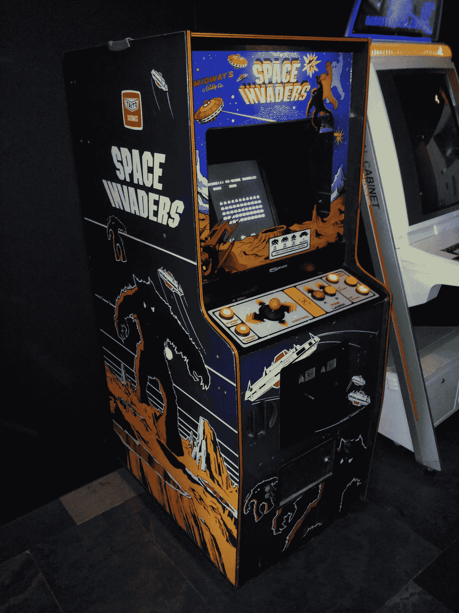

# 用 Go 编写太空入侵者

> 原文：<https://levelup.gitconnected.com/writing-space-invaders-with-go-db22111cce48>

## 如何在 Go 中写一个基于终端的太空入侵者游戏

我对街机电子游戏最早的记忆是看我的哥哥和堂兄弟在云顶高地玩电子游戏机。当我们的父母在玩云顶高地更广为人知的其他游戏时，我们通常可以尽情地玩街机游戏。


云顶高地酒店(照片由维基共享资源上的 [Chongkian](https://commons.wikimedia.org/wiki/File:Genting_Grand_Hotel.jpg) 拍摄)

那是吃豆人、太空入侵者、加拉西安、大金刚、青蛙过河、蜈蚣等等的神奇时代。几天来闪烁的灯光，激烈的音乐，疯狂地拽着操纵杆，疯狂地敲击按钮，然后是最后一条生命逝去时沮丧的呻吟。

正如许多有抱负的程序员一样，我的一个秘密梦想就是重现那种魔力，编写下一个大游戏。和许多优秀的程序员一样，我悲惨地失败了许多次。尽管最终我成功地编写了一些简单的游戏，但我开始意识到即使看似简单的游戏实际上也不容易编写。

当然，这并没有阻止我再次尝试。这一次，我尝试了街机电子游戏中的老女人——太空入侵者*。*

# *太空入侵者*

*[太空入侵者](https://en.wikipedia.org/wiki/Space_Invaders)是街机游戏黄金时代[最成功的街机游戏之一。它于 1978 年首次发行，被普遍认为是黄金时代的开始，从 70 年代末持续到 90 年代初。甚至在街机电子游戏衰落之后，它也干脆超越了媒介，转移到了电子游戏机上。](https://en.wikipedia.org/wiki/Golden_age_of_arcade_video_games)*

**

*《太空入侵者》街机柜(照片由维基共享资源上的科恩特拍摄)*

*如果你还不熟悉的话，这个游戏的前提非常简单。作为玩家，你控制激光炮与一排排外星入侵者战斗。激光炮只能在屏幕底部水平移动，因为外星人来回移动，并慢慢向你下降。外星人试图通过向你投掷鱼雷来摧毁你，而你被一些固定的防御掩体部分保护。如果外星人到达加农炮或者你所有的加农炮都被摧毁，游戏结束。*

*就像我说的，简单。*

# *无发动机的*

*大多数游戏开发使用某种游戏引擎或者至少是图形引擎，但是我写的游戏两者都没有使用。相反，我试图做的是通过创建单独的帧并快速地一个接一个地显示它们来构建一个游戏。本质上，这是我之前写的[群集模拟](https://sausheong.github.io/posts/flocking-with-go/)的变体。*

*这个想法非常简单——不久前，我偶然发现 iTerm2 中的一个[黑客](https://www.iterm2.com/documentation-images.html),它允许我在屏幕上显示图像，并引导我一个接一个地显示大量图像，从而产生一个动画。*

*如果你仔细想想，这就是像《太空入侵者》这样的简单游戏的全部——一个可以由用户控制的动画。*

*让我们看看代码。*

# *精灵*

*在计算机图形学中，精灵是添加到背景上的独立对象。不出所料，精灵首先被用于街机视频游戏，通常由硬件生成。在我们的例子中，我们使用了一个简单但流行的技术，使用一个单独的 sprite sheet，并将 sprite sheet 的各个部分作为一个单独的 sprite。*

**

*游戏精灵*

*上图是`sprites.png`精灵表文件的放大版本。*

```
*// sprites
var src = getImage("imgs/sprites.png")
var background = getImage("imgs/bg.png")
var cannonSprite = image.Rect(20, 47, 38, 59)
var cannonExplode = image.Rect(0, 47, 16, 57)
var alien1Sprite = image.Rect(0, 0, 20, 14)
var alien1aSprite = image.Rect(20, 0, 40, 14)
var alien2Sprite = image.Rect(0, 14, 20, 26)
var alien2aSprite = image.Rect(20, 14, 40, 26)
var alien3Sprite = image.Rect(0, 27, 20, 40)
var alien3aSprite = image.Rect(20, 27, 40, 40)
var alienExplode = image.Rect(0, 60, 16, 68)
var beamSprite = image.Rect(20, 60, 22, 65)
var bombSprite = image.Rect(0, 70, 10, 79)*
```

*每个精灵由`sprites.png`文件中相应精灵图像的`image.Rectangle`位置表示。例如，`alien1Sprite`显示一个矩形，其左上角位置为`(0,0)`，右下角位置为`(20,14)`。*

**

*一会儿我们会看到它是如何被使用的。*

*我们还看到加载了两个图像文件`sprites.png`和`bg.png`。这个函数只是从一个图像文件中获取一个`image.Image`。*

```
*func getImage(filePath string) image.Image {
	imgFile, err := os.Open(filePath)
	defer imgFile.Close()
	if err != nil {
		fmt.Println("Cannot read file:", err)
	}
	img, _, err := image.Decode(imgFile)
	if err != nil {
		fmt.Println("Cannot decode file:", err)
	}
	return img
}*
```

*现在我们有了精灵的位置，让我们看看`Sprite`结构本身。*

```
*// Sprite represents a sprite in the game
type Sprite struct {
	size     image.Rectangle // the sprite size
	Filter   *gift.GIFT      // normal filter used to draw the sprite
	FilterA  *gift.GIFT      // alternate filter used to draw the sprite
	FilterE  *gift.GIFT      // exploded filter used to draw the sprite
	Position image.Point     // top left position of the sprite
	Status   bool            // alive or dead
	Points   int             // number of points if destroyed
}*
```

*精灵由以下各项表示:*

1.  *精灵的大小，也就是我们之前定义的矩形*
2.  *3 个图像过滤器，我们稍后将使用它们来绘制精灵*
3.  *要在背景上绘制的精灵的位置*
4.  *子画面状态的表示，以及*
5.  *精灵被摧毁的点数(这只适用于外星人)。*

*我们使用的图像过滤器来自优秀的 [Go 图像过滤工具包(GIFT)](https://github.com/disintegration/gift) 。我们没有充分利用这个库，因为我们只用它来绘制背景上的精灵。每个精灵有 3 个过滤器，一个用于绘制正常精灵的正常过滤器，一个用于绘制精灵的替代形式的替代过滤器(目前为止只适用于外星人)和一个爆炸过滤器，当精灵爆炸(或死亡)时绘制精灵。我们使用精灵的另一种形式来制作精灵动画。*

*我们来看看游戏中不同精灵的定义。*

```
*var aliens = []Sprite{}// sprite for laser cannon
var laserCannon = Sprite{
	size:     cannonSprite,
	Filter:   gift.New(gift.Crop(cannonSprite)),
	Position: image.Pt(50, 250),
	Status:   true,
}// sprite for the laser beam
var beam = Sprite{
	size:     beamSprite,
	Filter:   gift.New(gift.Crop(beamSprite)),
	Position: image.Pt(laserCannon.Position.X+7, 250),
	Status:   false,
}*
```

*这是《太空入侵者》的简化版，所以我们只有 4 种精灵——外星人、外星人投掷的炸弹、激光炮和从大炮中射出的激光束。变量`aliens`是外星人精灵的数组，`bombs`是投掷的炸弹数组，`laserCannon`是激光炮精灵，`beam`是激光束精灵。从代码中可以看出，过滤器根据前面定义的矩形裁剪 sprite 工作表的一部分。*

*我们还没有在这里创建外星人，但是过一会儿我们会用到一个函数:*

```
*// used for creating alien sprites
func createAlien(x, y int, sprite, alt image.Rectangle, points int) (s Sprite) {
	s = Sprite{
		size:     sprite,
		Filter:   gift.New(gift.Crop(sprite)),
		FilterA:  gift.New(gift.Crop(alt)),
		FilterE:  gift.New(gift.Crop(alienExplode)),
		Position: image.Pt(x, y),
		Status:   true,
		Points:   points,
	}
	return
}*
```

*我们将把矩形传递给函数来创建正确的外星人精灵和它的替代形式(用于动画精灵)，但是所有的外星人都以同样的方式爆炸。炸弹是在游戏循环中产生的，我们稍后会看到。*

*精灵们说了这么多，让我们看看游戏的`main`功能。*

# *行动开始了*

*这是一个从终端开始的游戏，整个游戏在终端上是动画的。所以，控制终端很重要。我使用流行的 [termbox-go](https://github.com/nsf/termbox-go) 库来给我这种控制。Termbox 和 GIFT library 一样，可能有点矫枉过正，因为它是一个比这里所需要的更强大的库。*

```
*err := termbox.Init()
if err != nil {
	panic(err)
}*
```

*我通过初始化 termbox-go 来启动主函数。这个游戏实际上有两个独立的循环:*

*   *第一个是用户对激光炮的控制，这是通过键盘上的输入(左右箭头)*
*   *第二个是游戏的其余部分，在所谓的游戏循环中，稍后解释。无论用户做什么，它都会运行。它包括外星人的持续运动，因为他们下降，同时投掷炸弹摧毁地球上的所有生命，以及激光束的向上运动，因为它冲向外星人，把他们炸得粉碎。*

*这意味着有两个并发运行的线程，在本例中是 goroutines。*

```
*// poll for keyboard events in another goroutine
events := make(chan termbox.Event, 1000)
go func() {
	for {
		events <- termbox.PollEvent()
	}
}()*
```

*我们启动一个单独的 goroutine 来轮询事件，并将它们填充到一个缓冲通道中。我们在这里使用了一个非常大的缓冲区，它真的可以更小，但是缓冲区越大，事件捕获就越平滑，所以我并没有试图找出最佳的大小。*

*大多数游戏都有一个开始屏幕，在那里你被要求投入硬币，然后按下按钮开始游戏。我们也有一个。*

```
*// show the start screen
	startScreen := getImage("imgs/start.png")
	printImage(startScreen)
start:
	for {
		switch ev := termbox.PollEvent(); ev.Type {
		case termbox.EventKey:
			if ev.Ch == 's' || ev.Ch == 'S' {
				break start
			}
			if ev.Ch == 'q' {
				gameOver = true
				break start
			}
		}
	}*
```

*我们再次轮询键盘，我们等待有人按下`s`或`S`开始游戏，或`q`退出游戏。*

*接下来，我们填充`aliens`数组。这很简单，我们只需要三排不同的外星人。*

```
*// populate the aliens
for i := aliensStartCol; i < aliensStartCol+(alienSize*aliensPerRow); i += alienSize {
	aliens = append(aliens, createAlien(i, 30, alien1Sprite, alien1aSprite, 30))
}
for i := aliensStartCol; i < aliensStartCol+(30*aliensPerRow); i += alienSize {
	aliens = append(aliens, createAlien(i, 55, alien2Sprite, alien2aSprite, 20))
}
for i := aliensStartCol; i < aliensStartCol+(30*aliensPerRow); i += alienSize {
	aliens = append(aliens, createAlien(i, 80, alien3Sprite, alien3aSprite, 10))
}*
```

# *游戏循环*

*现在我们已经奠定了基础，让我们进入主要的游戏循环。大多数游戏运行在一个通常被称为[的游戏循环](http://gameprogrammingpatterns.com/game-loop.html)中。游戏循环是一种游戏软件开发模式，通常是游戏的核心。这是一个无限循环，通过更新和重绘来使游戏充满活力。在我们的太空入侵者游戏循环中，我们使用一个名为`gameOver`的变量来表示循环应该持续到游戏结束(要么由玩家触发，要么当外星人获胜)。*

*游戏循环相当长，所以我们将把它分成几个部分。让我们看第一部分，它用于从播放器中捕获键盘事件。*

```
*// if any of the keyboard events are captured
select {
case ev := <-events:
	if ev.Type == termbox.EventKey {
		if ev.Key == termbox.KeyCtrlQ {
			gameOver = true
		}
		if ev.Key == termbox.KeySpace {
			if beam.Status == false {
				beamShot = true
			}
		}
		if ev.Key == termbox.KeyArrowRight {
			laserCannon.Position.X += 10
		}
		if ev.Key == termbox.KeyArrowLeft {
			laserCannon.Position.X -= 10
		}
	}default:}*
```

*每当`events`缓冲通道有东西时，它将被接收到`ev`变量中，我们试图确定它是哪种类型的事件。按下`Ctrl-Q`结束游戏，同时按下空格键发射激光束。按下向左或向右箭头按钮，相应地向左或向右移动激光炮。*

*您可能会注意到，我们必须在 select 中有一个默认值。这是因为如果我们没有默认值，select 将会阻塞，只有当用户按下一个键时循环才能继续！*

*接下来，我们将绘制激光炮和外星精灵。我们从一个空的图像开始，并在上面绘制背景。*

```
*// create background
dst := image.NewRGBA(image.Rect(0, 0, windowWidth, windowHeight))
gift.New().Draw(dst, background)*
```

# *外星人来了！*

*我们先从外星人开始。*

```
*// process aliens
for i := 0; i < len(aliens); i++ {
	aliens[i].Position.X = aliens[i].Position.X + 5*alienDirection
	if aliens[i].Status {
		// if alien is hit by a laser beam
		if collide(aliens[i], beam) {
			// draw the explosion
			aliens[i].FilterE.DrawAt(dst, src, image.Pt(aliens[i].Position.X, aliens[i].Position.Y), gift.OverOperator)
			// alien dies, player scores points
			aliens[i].Status = false
			score += aliens[i].Points
			// reset the laser beam
			resetBeam()
		} else {
			// show alternating alients
			if loop%2 == 0 {
				aliens[i].Filter.DrawAt(dst, src, image.Pt(aliens[i].Position.X, aliens[i].Position.Y), gift.OverOperator)
			} else {
				aliens[i].FilterA.DrawAt(dst, src, image.Pt(aliens[i].Position.X, aliens[i].Position.Y), gift.OverOperator)
			}
			// drop torpedoes
			if rand.Float64() < bombProbability {
				dropBomb(aliens[i])
			}			
		}
	}
}*
```

*为了确定外星人应该去哪里，我们用变量`alienDirection`乘以外星人的水平(X)位置。*

*我们还使用外星人的`Status`来确定它是活着还是死了。如果它是活的，我们检查它是否与激光束碰撞过。如果是，那就是死了。我们绘制爆炸精灵，设置`Status`为假，累积玩家点数并重置激光束。重置激光束只是意味着我们将光束的`Status`设置回`false`，并将其放置在与加农炮相同的垂直(Y)水平。*

```
*func resetBeam() {
	beam.Status = false
	beam.Position.Y = 250
}*
```

# *碰撞物理学*

*如果外星人没有与激光束碰撞，我们要么显示正常的精灵，要么显示替代精灵。这给了我们一个移动的外星人的动画。*

*让我们快速看一下碰撞物理学，它集中在`collide()`函数中。*

```
*func collide(s1, s2 Sprite) bool {
	spriteA := image.Rect(s1.Position.X, s1.Position.Y, s1.Position.X+s1.size.Dx(), s1.Position.Y+s1.size.Dy())
	spriteB := image.Rect(s2.Position.X, s2.Position.Y, s2.Position.X+s1.size.Dx(), s2.Position.Y+s1.size.Dy())
	if spriteA.Min.X < spriteB.Max.X && spriteA.Max.X > spriteB.Min.X &&
		spriteA.Min.Y < spriteB.Max.Y && spriteA.Max.Y > spriteB.Min.Y {
		return true
	}
	return false
}*
```

*假设两个子画面被框在两个矩形内，如果满足所有这些条件，则认为子画面发生了碰撞:*

*   *spriteA。最小 X < spriteB.Max.X*
*   *spriteA.Max.X > spriteB。最小 X*
*   *spriteA。最小 Y < spriteB.Max.Y*
*   *spriteA.Max.Y > spriteB。最小 Y*

**

# *扔炸弹*

*当外星人降落在激光炮上时，他们投下炸弹。显然我们不希望它不断地投下炸弹，所以我们用一个概率来决定是否应该投下炸弹。*

```
*// drop torpedoes
if rand.Float64() < bombProbability {
	dropBomb(aliens[i])
}*
```

*在这里投放炸弹意味着我们创建一个新的`Bomb`精灵，并将其设置为从外星人所在的地方开始，然后将其添加到炸弹阵列中。*

```
*func dropBomb(alien Sprite) {
	torpedo := Sprite{
		size:     bombSprite,
		Filter:   gift.New(gift.Crop(bombSprite)),
		Position: image.Pt(alien.Position.X+7, alien.Position.Y),
		Status:   true,
	} bombs = append(bombs, torpedo)
}*
```

*现在我们已经画出了外星人(或者它的爆炸死亡)，我们检查它是否已经移到了窗外。如果是的话，我们逆转方向，把外星人带下来。*

```
*// move the aliens back and forth
if aliens[0].Position.X < alienSize || aliens[aliensPerRow-1].Position.X > windowWidth-(2*alienSize) {
	alienDirection = alienDirection * -1
	for i := 0; i < len(aliens); i++ {
		aliens[i].Position.Y = aliens[i].Position.Y + 10
	}
}*
```

*根据`bombSpeed`，我们还需要在致命下降时向下移动炸弹。*

```
*// draw bombs, if laser cannon is hit, game over
for i := 0; i < len(bombs); i++ {
	bombs[i].Position.Y = bombs[i].Position.Y + bombSpeed
	bombs[i].Filter.DrawAt(dst, src, image.Pt(bombs[i].Position.X, bombs[i].Position.Y), gift.OverOperator)
	if collide(bombs[i], laserCannon) {
		gameOver = true
		laserCannon.FilterE.DrawAt(dst, src, image.Pt(laserCannon.Position.X, laserCannon.Position.Y), gift.OverOperator)
	}
}*
```

*当炸弹落下时，我们需要检查它是否与激光炮相撞。如果是的话，游戏就结束了，我们画爆炸的大炮精灵。*

*这就是游戏循环中外星人和他们的炸弹。接下来让我们看看激光炮和它的激光束。*

# *激光炮和激光束*

*激光炮比较简单。只要加农炮没有被摧毁，我们就继续牵引它。*

```
*// draw the laser cannon unless it's been destroyed
if !gameOver {
	laserCannon.Filter.DrawAt(dst, src, image.Pt(laserCannon.Position.X, laserCannon.Position.Y), gift.OverOperator)
}*
```

*至于激光束，因为只有一个变量来表示它，你可能会意识到大炮一次只能发射一束激光束。这主要是为了简单起见。*

*我们使用`beamShot`变量来确定玩家是否按下了空格键，并因此发射了激光炮。*

```
*// if the beam is shot, place the beam at start of the cannon
if beamShot {
	beam.Position.X = laserCannon.Position.X + 7
	beam.Status = true
	beamShot = false
}*
```

*如果是，我们将光束放在激光炮的尖端，将光束的`Status`设置为`true`以指示光束正在运行，我们应该显示它，然后将`beamShot`设置回 false。*

*我们需要检查光束的`Status`,如果它在运动，我们就画出来，然后向上移动。如果光束的位置在窗口之外，我们再次重置光束。*

```
*// keep drawing the beam as it moves every loop
if beam.Status {
	beam.Filter.DrawAt(dst, src, image.Pt(beam.Position.X, beam.Position.Y), gift.OverOperator)
	beam.Position.Y -= 10
}// if the beam leaves the window reset it
if beam.Position.Y < 0 {
	resetBeam()
}*
```

# *包装并打印图像*

*就在我们结束游戏循环之前，我们将图像打印到屏幕上，打印分数并递增循环。*

```
*printImage(dst)
fmt.Println("\n\nSCORE:", score)
loop++*
```

*那么我们到底如何在屏幕上打印图像呢*？这是通过 ITerm2 上的一个简单的黑客攻击完成的(所以这只在 iTerm2 上有效，抱歉！)**

```
**// this only works for iTerm2!
func printImage(img image.Image) {
	var buf bytes.Buffer
	png.Encode(&buf, img)
	imgBase64Str := base64.StdEncoding.EncodeToString(buf.Bytes())
	fmt.Printf("\x1b[2;0H\x1b]1337;File=inline=1:%s\a", imgBase64Str)
}**
```

**就是这样！总而言之，包括注释在内，代码不到 300 行。如果它看起来很短，你应该记得最初的整个游戏编译二进制 ROM 的大小不到 110kb，包括图像和音乐！我的是一个更简单的克隆版本，没有完整的游戏功能(多重生命，防御掩体，不明飞行物等)，还包括两个外部库。**

**这是它在我电脑上的样子。你戴起来怎么样？**

****

**iTerm2 上的太空入侵者**

**这是在一个终端上心血来潮做的，后来我实际上把它变成了一个网络应用，[点击这里](https://medium.com/sausheong/create-a-simple-cross-platform-desktop-game-with-go-8e5432128c9b)！**

# **密码**

**这方面的代码都在这个 GitHub 存储库中。**

**[https://github.com/sausheong/invaders](https://github.com/sausheong/invaders)**