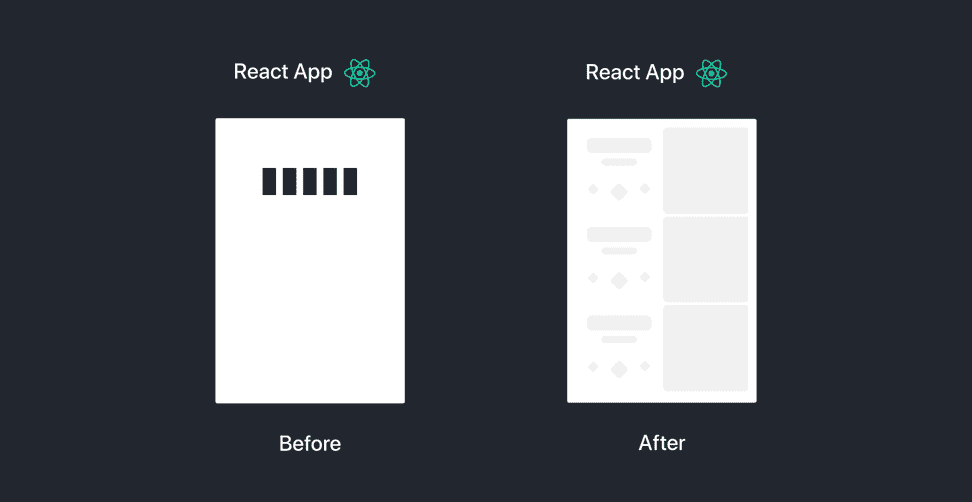
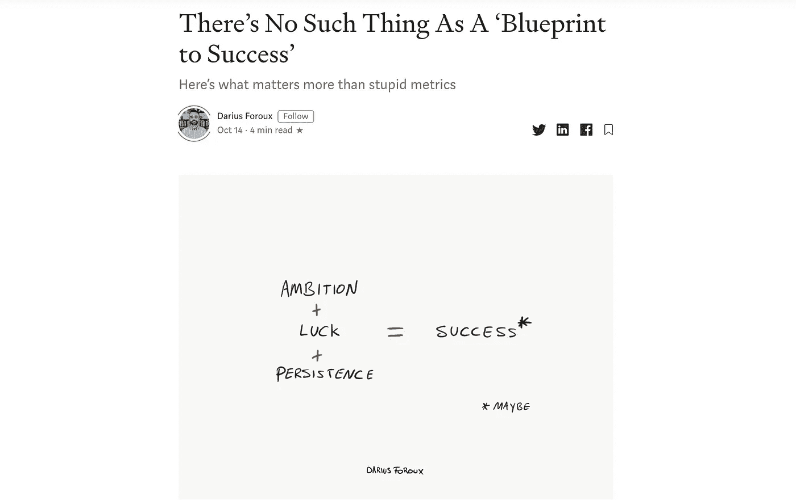

# 2020 年为开发者写强媒文章

> 原文：<https://levelup.gitconnected.com/writing-strong-medium-articles-for-developers-and-programmers-in-2020-ae5a5a17b33a>

## 这篇指南提供了我在为程序员写技术文章时学到的经验和技巧，你可以用它们来获得更大的成功


2020 ←如果你以前从未写过媒体文章，你应该写。把你一周前学的那个东西，撒上一些个性和视角，分享给全世界。只要你把你的个人观点放在这个话题上，你就在提供价值，互联网将从你的贡献中受益。

这可能是一次非常有益的经历，也可能是一次平淡无奇的经历。我想帮助你在这个平台上获得有益的体验。在 Medium 上写了我的编程文章(并获得了顶级设计作家的头衔)后，我收集了以下策略，你可以用它们来提升你的文章。

## 写编程的时候

你可能会写一些指导性的文章。“如何使用(在此插入工具)构建(在此插入项目)”或类似的内容，这是一个非常常见的主题。不管你选择写什么，你可能会想向读者展示一些**信息代码片段**。在 Medium 上有几种方法可以做到这一点，每种方法都有其优点。

**方法一:反斜杠**

这种方法可能是最不吸引人的，但在某些情况下很有用。最适合用于`inline code examples`。只需按下反勾`并开始编写代码，输出将如下所示:

`<h1>Hello World</h1>`

对于一个代码块，使用三个反斜线“”

```
<div>
   <h1>Hello World</h1>
</div>
```

**方法二:**[**carbon . now . sh**](http://carbon.now.sh)


这是一种显示代码的漂亮方法，但是不要忘记它的缺点:读者不能复制/粘贴代码。要制作你自己的漂亮的代码片段图片，比如上面的图片，去 [carbon.now.sh](http://carbon.how.sh) 看看他们优雅的编辑器吧。还有许多预设可供选择，并有多个导出选项。


碳. sh.now

**方法三:Github Gists**

这种方法最有用。您将代码片段作为要点上传到 Github，然后将要点嵌入到您的文章中。现在如果你更新了要点，文章会自动反映变化。使用这种方法很容易共享您希望用户复制的较长代码片段。这里有一个例子:

要创建你自己的，去 gist.github.com 的，创建一个公共要点，然后获得可共享的链接。只需将链接粘贴到文章中，按回车键，Medium 就会生成嵌入的要点。


## 读者需要视觉信息

向读者提供代码片段是不够的，他们希望看到代码的实际应用。图片很好，但是吸引你的观众的最好方式是通过指导性的 gif，尤其是在编程的时候。

如果你和我一样，不想使用外部软件来录制屏幕，那么下面是在两种操作系统平台上录制屏幕的内置方法:

使用 Mac，按`ctrl + shift + 5`然后选择您想要记录的视野。

在 Windows 10 上，使用`windows key + g`打开 game bar，然后按 record。


一旦你有了屏幕录像，你会想把它转换成 gif 格式。你可以使用 [gif.ski](https://gif.ski/) ，一个时髦的 gif 编码器。转换完成后，将 gif 拖到文章中进行插入。

## 你有风格或主题吗？

在我的 React UX 文章中，我在我的 gif 中坚持了相同的主题。看一看:



带有旋转 React 徽标的相同标题，以及“之前和之后”示例。我几乎每篇文章都是用这样的 GIF 打开的。在你的文章中，你可以通过保持一致的主题来增加一点个性，这将使读者更有可能追随你。我最喜欢的关于媒介的例子是大流士·弗鲁的草图。


信用:[大流士·福鲁](https://medium.com/@dariusforoux)



信用:[大流士·福鲁](https://medium.com/@dariusforoux)

他的许多文章包括一个简单迷人的草图，底部有他的签名。起初我认为这些草图很草率，但它们很快就让我喜欢上了，我现在很喜欢他的风格。为你的工作建立某种个性并不需要太多。**它可以是一个简单的草图，你编排内容的方式，或者你选择如何可视化你的例子，这些都是有效的**。

## 你的文章可能会出现在谷歌上。

超过 500-1000 次浏览的文章可能会出现在谷歌上。Medium 有一个令人难以置信的 SEO(搜索引擎优化)算法，它能够在我的文章发表后两个小时内将我的文章推到结果的第一页，并且可以为你的文章做同样的事情。

这对你意味着什么？确保你的标题、副标题和文章描述具有吸引力和信息量。你的文章描述会出现在谷歌搜索结果中。编辑您的故事时，您可以在“更改显示标题/副标题”部分编辑这些内容:


## 选择正确的标签

还要确保你的故事的标签是**相关的，但是是一般性的。**如果你正在写一篇关于 ECMAScript 新特性的文章，请确保首先涵盖伞状标签，如**编程**、 **Web 开发**和 **Javascript** ，而不是仅仅关注“ECMAScript”等小众标签。这保证了你的文章的最大曝光率。你只有五个标签，明智地使用它们。

## 不要在周末发布

中等流量在周末持续下降。看看我的统计数据:


很明显，观看高峰在周中。为了获得最佳体验，请在本周提交您的文章。

## 出版物很乐意刊登你的文章

从 Medium 获得更多有益体验的一个好方法是向出版物提交文章。有许多编程出版物拥有成千上万的追随者，他们很乐意将您的文章添加到他们的收藏中。你写编程吗？通过 gitconnected 尝试[级编码](https://levelup.gitconnected.com/)。你是前端开发人员吗？尝试[前端每周](https://medium.com/front-end-weekly)。执着于用户体验？试试 [UX 集体](https://uxdesign.cc/)。你一定会找到适合你的社区，媒介是非常多样的。通过在出版物上托管您的文章，您可以将您的文章展示给出版物的追随者，这可能会带来成千上万的额外浏览量。

## 2020 年是充满希望的一年

我们的社区正等待你的贡献！有了这些技巧，你一定会写出有益于编程社区的精彩文章。如果你犹豫要不要发表你的第一篇文章，请记住，只要你提供了独特的视角**，你就是在为这个平台增加价值**。这里欢迎你的声音。新年快乐！🎉