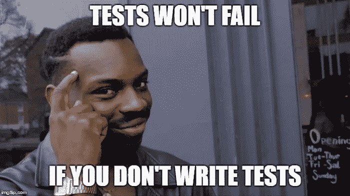
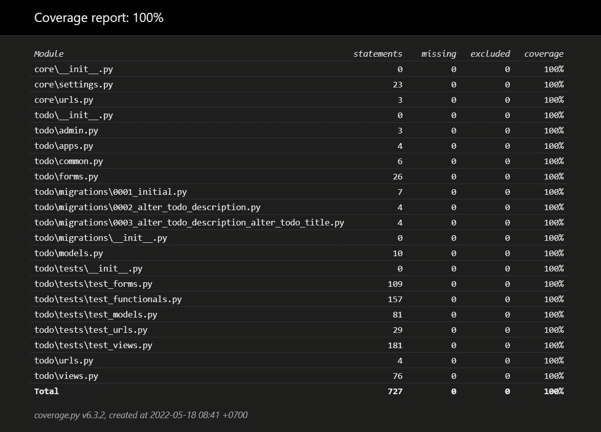

# 为一个简单的 Django 项目编写测试

> 原文：<https://levelup.gitconnected.com/writing-tests-for-a-foolproof-django-project-3c5527bd602d>

如何用 Django 编写多层测试实现 100%的测试覆盖率



让我们从回答一个问题开始，当你在写代码的时候，你有多在乎写测试？嗯，我想这真的取决于你目前正在做什么样的项目，以及你需要做多少工作来完成这个项目。

在我看来，如果我们有这么紧的截止日期和很多事情要做，我们会忘记写测试，并产生一个无测试的代码。但是如果你不写测试，那么测试就不会失败，对吗？😁

如果没有测试，那么每当我们改变一些东西或者重构代码的时候，我们都需要手工检查我们的代码。这当然不是一件好事，我要说这是一个非常糟糕的项目设计。

就像雅各布·卡普兰-莫斯*(Django web 框架的核心开发者之一)*说的……

> *“没有测试的代码被设计破坏了。”*

了解了这一点，这篇文章将带你编写一个经过全面测试的待办事项应用程序，希望它能万无一失。

# 先决条件

在继续之前，虽然本文将带您构建一个完全测试过的项目，但我假设您已经对 Django 有了一些基本的了解，因为我倾向于忽略实际的代码，而倾向于编写测试代码。然而，我仍然会给出实际的代码，并给出一些简要的解释。

一点免责声明，因为会有很多测试用例，所以我只为每一层提供一个片段，但你可以在这里获得完整的代码(实际和测试代码):

[](https://github.com/agusrichard/django-workbook/tree/master/todo-live-tests) [## django-workbook/todo-live-master agusrichard 的测试/django-workbook

### 该项目作为媒体文章的编码材料。文章本身谈到了多层测试在…

github.com](https://github.com/agusrichard/django-workbook/tree/master/todo-live-tests) 

从建立我们的 Django 项目开始。

通过运行以下命令创建一个 Python 虚拟环境:

```
python -m venv venv
```

激活虚拟环境:

```
# Mac OS / Linux
source /bin/activate# Windows
venv\Scripts\activate
```

安装依赖项:

```
pip install django coverage selenium
```

因为这个应用程序相当简单，所以我们只需要三个主要的依赖项。我们需要`coverage`来了解我们的测试覆盖范围，需要`selenium`来运行功能测试。

创建 Django 项目和 Todo 应用程序

```
# Create Django project
django-admin startproject core .# Create Todo Application
python manage.py startapp todo
```

现在，我们已经建立了我们的项目。在下一节中，我们将从`models`开始，一步一步地研究多层单元代码。

# 模型

## 实际代码

进入`todo`文件夹，打开`models.py`。将这段代码放在这里:

它只是一个基本的 Todo 模型，由标题、描述、已完成、created_at 和用户组成。请注意，我使用的是默认的用户模型。您当然可以使用自己的定制用户模型。

如果您想要运行服务器，您需要首先创建迁移脚本并进行迁移。

```
# Make migration script
python manage.py makemigrations# Migrate
python manage.py migrate# Run server
python manage.py runserver
```

目前，我们还没有`views`，所以我们无法与我们的应用程序交互。稍后我们将创建`views`。

## 试验码

我们将在这一小节中编写我们的第一个测试。因为对于这个项目，我们将编写多层测试，所以最好有一个专门的文件夹来存储所有这些测试。首先，我们需要在`todo`文件夹中新建一个名为`tests`的文件夹。注意，还有其他方法来组织测试代码，但是在这种情况下，我将使用一种方法，即每个 Django 应用程序都有自己的测试文件夹。

创建一个名为`test_models.py`的文件，并将初始代码放在那里:

这就是我们的第一个测试函数。在上面，我们创建了一个继承了`unittest.TestCase`的测试类。这个类将作为模型的所有测试用例的套件/模块。

`setUp`方法将负责用户初始化，所以我们不需要在每个测试函数中创建一个新用户。注意，t `setUp`方法将在每个测试函数之前运行，如果你需要在每个测试函数之后做一些清理，你可以使用`tearDown`方法。

正如你可能已经猜到的，我们将有正面和负面的测试用例，因为如果我们想要构建一个万无一失的项目，我确信必须覆盖整个范围的用户输入和行为肯定会使我们的项目健壮。这正是我们在这里要做的。

现在，让我们来看看其他测试用例:

这里，我们有 13 个测试只针对 Todo 模型。

在我看来，在编写测试时有两件事很重要，第一件是确保避免假阳性测试。您可以做的一件事是更改断言条件，从断言等于改为断言不等于。如果在一个条件下测试通过，那么在另一个条件下，测试肯定不会通过。这是一个我们经常忘记的重要的理智检查。

另一件重要的事情是，当你想让你的项目万无一失时，你需要考虑许多可能的输入排列。如果您有很多输入，那么要包含的测试数量将会激增。所以，这又回到了编写测试的时间和及时完成任务之间的权衡。

一点提醒，每个测试总是由三个步骤组成，它们是安排-行动-断言。以上面的代码为例，首先我们创建一个将创建 todo 的用户，然后创建 todo，然后断言该 todo 是否确实是我们所期望的。

# 形式

## 实际代码

现在，我们将工作在不同的层，`forms`层。

简单明了，对吗？

## 试验码

与`models`的测试代码相比，这里，我们将重点放在`UserForm`和`TodoForm`上

上面的代码只是`forms`整个测试代码的一个片段。您可以在本文的代码资源中直接查看其余部分。

非常类似于`models`的测试代码。我们有`setUp`方法来初始化用户数据(我们需要它来创建一个有效的 todo)。然后将新创建的用户分配给`self.user`，这样我们就可以在每个测试功能中访问这个用户。

我们可以使用`form.is_valid()`来检查用户的输入是否有效，并且我们可以通过访问`form.errors[“field_name”]`来断言表单的错误信息。

# 视图

## 实际代码

下面是`view.py`文件的内容

这里我们有八个视图函数，其中三个与认证相关，其余的与 Todo CRUD 操作相关。为了正确运行这个服务器，我们需要创建所有的模板。但是我选择忽略这件事，你可以在这里得到 HTML 模板[。](https://github.com/agusrichard/django-workbook/tree/master/todo-live-tests/templates/todo)

## 试验码

我们可以通过使用测试客户端来测试`views`。首先，我们需要从`django.test`导入`Client`并在`setUp`方法中初始化它。之后，我们可以在每个测试函数中使用它。以下是`views`的测试代码

就像以前一样，这里只有代码片段，您可以在编码材料中找到其余部分。

让我们以注册用户为例。首先，在`setUp`方法中，我们初始化测试客户端，现在来看看测试函数`test_register_user_GET`。这里，我们调用注册 URL 并断言它的响应，比如它的状态代码和用于呈现注册页面的模板。

再举一个测试函数`test_negative_home_user_not_logged_in`内部的例子。这里，我们还检查了`context`字典中的值。基本上，这是一个注入到 Django 模板中的字典，我们可以检查这个`context`字典中的值。在上面的代码中，我检查了用户是否已经登录(如果`is_authenticated`为真，则用户已经登录)。

# 资源定位符

## 实际代码

这里是我们注册`views`到`urls`的地方。

## 试验码

与测试其他层相比，测试`urls`被认为不是那么重要。因为当我们测试`views`时，我们实际上同时也在测试`urls`。为了完整性，我选择提供这些测试。

# 功能测试

现在，我们到达了最终的测试代码。在继续之前，您需要下载基于您的 Chrome 版本的 Selenium。然后，您可以将`chromedriver`放在项目根文件夹中名为`driver`的文件夹中。

然后添加新的附加变量到`settings.py`

```
# For Windows
WEB_DRIVER_PATH = os.path.join(BASE_DIR, "driver", "chromedriver.exe")# Running functional tests without opening up a chrome window
WEB_DRIVER_HEADLESS = True
```

下面是测试代码的片段。

注意，对于功能测试，我们实际上没有继承`unittest.TestCase`，相反，测试类继承了`StaticLiveServerTestCase`。

这里，我们在`setUp`方法中设置 Selenium web 驱动程序，并在`tearDown`方法中退出 web 驱动程序。对于测试代码的其余部分，我们遵循排列-动作-断言原则。找到我们想要与之交互的元素，对其进行操作(比如点击或输入)并断言行为和结果。

# 新闻报道

我们已经为所有的层编写了所有的测试，但是我向你保证的 100%的测试覆盖率怎么样呢？我们现在就谈这个！

首先，创建`.coveragerc`来存储测试覆盖设置。我们将省略`manage.py`和`venv`中的所有文件:

```
[run]
omit =
  */manage.py
  ./venv/*
```

我们可以通过运行以下命令来了解测试覆盖率:

```
coverage run ./manage.py test
```

通过运行上面的命令，我们创建了一个名为`.coverage`的文件。我们将从这个文件中得到报告。

获取测试覆盖报告:

```
coverage report
```

通过运行以下命令获得漂亮的 HTML 报告:

```
coverage html
```

以上命令将创建`htmlcov`文件夹。然后，您可以打开`index.html`来查看测试覆盖率。



作者形象

瞧，我们实现了 100%的测试覆盖率…祝贺你！

# 结论

在本文中，我们学习了如何为典型的 Django 项目中的每一层编写测试。我们涵盖了如何编写模型、表单、视图、URL 和功能测试。

我强烈建议您查看编码材料中的最终代码，因为我倾向于忽略实际的代码，而只给出整个测试代码的片段。因为我不想让你因为不得不列出所有的测试用例而感到厌烦。

总之，我相信编写测试代码和实际代码一样重要，因为测试给了我们可预测性，至少给了我们高度的可预测性。我们不希望我们的代码出现不可预测的行为，并且发现到处潜伏着未被注意到的错误。此外，看着这些绿色的“OK”或“PASSED”单词对我来说总是一种有趣的体验，对吗？

本文的编码材料:

[](https://github.com/agusrichard/django-workbook/tree/master/todo-live-tests) [## django-workbook/todo-live-master agusrichard 的测试/django-workbook

### 该项目作为媒体文章的编码材料。文章本身谈到了多层测试在…

github.com](https://github.com/agusrichard/django-workbook/tree/master/todo-live-tests) 

感谢您的阅读和快乐编码！