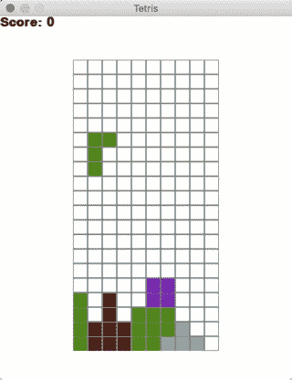
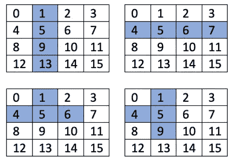

# 如何用 Python 写俄罗斯方块

> 原文：<https://levelup.gitconnected.com/writing-tetris-in-python-2a16bddb5318>

用 Python 和 PyGame 编写俄罗斯方块的分步指南

在本教程中，我们将使用 Python 中的 PyGame 库编写一个简单的俄罗斯方块。里面的算法非常简单，但对初学者来说有点挑战性。我们不会过多关注 PyGame 的机制，而是关注游戏的逻辑。如果你懒得去读所有的东西，你可以简单地复制并粘贴代码。



俄罗斯方块游戏

## 先决条件

1.  Python3。这个可能是从[官网](https://www.python.org/downloads/)下载的。
2.  PyGame。根据您使用的操作系统，进入您的命令提示符或终端，并键入`pip install pygame`或`pip3 install pygame`。
3.  Python 的基础知识。如果需要，可以看看我的其他文章。

您可能会遇到安装 PyGame 或 Python 本身的问题，但这超出了本文的范围。请参考 StackOverflow:)

我个人经历了一个在 Mac 上显示任何东西的问题，安装一些特定版本的 PyGame 解决了这个问题:`pip install pygame==2.0.0.dev4`。

## 人物类

我们从数字课开始。我们的目标是将体形类型与旋转一起存储。当然，我们可以用矩阵旋转来旋转它们，但这会使它变得太复杂。



图形表现的主要思想

所以，我们有一个简单的数字列表:

```
**class** Figure:
    figures = [
        [[1, 5, 9, 13], [4, 5, 6, 7]],
        [[1, 2, 5, 9], [0, 4, 5, 6], [1, 5, 9, 8], [4, 5, 6, 10]],
        [[1, 2, 6, 10], [5, 6, 7, 9], [2, 6, 10, 11], [3, 5, 6, 7]],  
        [[1, 4, 5, 6], [1, 4, 5, 9], [4, 5, 6, 9], [1, 5, 6, 9]],
        [[1, 2, 5, 6]],
    ]
```

其中主列表包含体形类型，内部列表包含它们的旋转。每个图中的数字表示 4×4 矩阵中的位置，其中该图是实线。例如，数字[1，5，9，13]代表一条直线。为了更好地理解这一点，请参考上面的图片。

作为练习，尝试在这里添加一些缺失的数字，即“z”数字。

`__init__`功能如下:

```
**class** Figure:
    ...    
    **def** __init__(self, x, y):
        self.x = x
        self.y = y
        self.type = random.randint(0, len(self.figures) - 1)
        self.color = random.randint(1, len(colors) - 1)
        self.rotation = 0
```

我们随机选择一种类型和一种颜色。

我们需要能够快速旋转并得到一个图形的当前旋转，为此我们有这两个简单的方法:

```
**class** Figure:
    ...
    **def** image(self):
        **return** self.figures[self.type][self.rotation]

    **def** rotate(self):
        self.rotation = (self.rotation + 1) % len(self.figures[self.type])
```

## 俄罗斯方块课程

我们首先用一些变量初始化游戏:

```
**class** Tetris:
    level = 2
    score = 0
    state = **"start"** field = []
    height = 0
    width = 0
    x = 100
    y = 60
    zoom = 20
    figure = **None**
```

状态告诉我们是否还在玩游戏。`field`是游戏的区域，其中空的地方包含零，有数字的地方包含颜色(除了仍在向下飞的那个)。

我们用下面的简单方法初始化游戏:

```
**class** Tetris:
    ...    **def** __init__(self, height, width):
        self.height = height
        self.width = width
        **for** i **in** range(height):
            new_line = []
            **for** j **in** range(width):
                new_line.append(0)
            self.field.append(new_line)
```

这创建了一个大小为`height x width`的字段。

创建一个新图形并将其定位在坐标(3，0)处很简单:

```
**class** Tetris:
    ...
    **def** new_figure(self):
        self.figure = Figure(3, 0)
```

更有趣的功能是检查当前飞行的图形是否与场地上固定的东西相交。当图形向左、向右、向下移动或旋转时，可能会发生这种情况。

```
**class** Tetris:
    ...
    **def** intersects(self):
        intersection = **False
        for** i **in** range(4):
            **for** j **in** range(4):
                **if** i * 4 + j **in** self.figure.image():
                    **if** i + self.figure.y > self.height - 1 **or** \
                            j + self.figure.x > self.width - 1 **or** \
                            j + self.figure.x < 0 **or** \
                            self.field[i + self.figure.y][j + self.figure.x] > 0:
                        intersection = **True
        return** intersection
```

这非常简单:我们去检查当前图形的 4x4 矩阵中的每个单元，看它是否超出了游戏边界，以及它是否触及了某个繁忙的游戏区域。我们检查一下`self.field[..][..] > 0`，因为可能有任何颜色。如果有一个零，这意味着字段是空的，所以没有问题。

有了这个函数，我们现在可以检查是否允许我们移动或旋转图形。如果它向下移动并相交，那么这意味着我们已经到达底部，所以我们需要“冻结”我们场上的图形:

```
**class** Tetris:
    ...
    **def** freeze(self):
        **for** i **in** range(4):
            **for** j **in** range(4):
                **if** i * 4 + j **in** self.figure.image():
                    self.field[i + self.figure.y][j + self.figure.x] = self.figure.color
        self.break_lines()
        self.new_figure()
        **if** self.intersects():
            game.state = **"gameover"**
```

冷冻后，我们要检查是否有一些完整的水平线应该被破坏。然后我们创建一个新的图形，如果它已经相交，那么游戏结束:)

检查完整的行相对简单直接，但是要注意这样一个事实，即销毁一行是从下往上进行的:

```
**class** Tetris:
    ...
    **def** break_lines(self):
        lines = 0
        **for** i **in** range(1, self.height):
            zeros = 0
            **for** j **in** range(self.width):
                **if** self.field[i][j] == 0:
                    zeros += 1
            **if** zeros == 0:
                lines += 1
                **for** i1 **in** range(i, 1, -1):
                    **for** j **in** range(self.width):
                        self.field[i1][j] = self.field[i1 - 1][j]
        self.score += lines ** 2
```

现在，我们缺少移动方法:

```
**class** Tetris:
    ...
    **def** go_space(self):
        **while not** self.intersects():
            self.figure.y += 1
        self.figure.y -= 1
        self.freeze()

    **def** go_down(self):
        self.figure.y += 1
        **if** self.intersects():
            self.figure.y -= 1
            self.freeze()

 **def** go_side(self, dx):
        old_x = self.figure.x
        self.figure.x += dx
        **if** self.intersects():
            self.figure.x = old_x

    **def** rotate(self):
        old_rotation = self.figure.rotation
        self.figure.rotate()
        **if** self.intersects():
            self.figure.rotation = old_rotation
```

正如你所看到的，`go_space`方法实际上复制了`go_down`方法，但是它一直向下，直到到达底部或者某个固定的数字。

而在每一个方法中，我们都记住最后一个位置，改变坐标，检查是否有交集。如果有，我们就回到之前的状态。

## PyGame 和完整的代码

我们快完成了！

还剩下一些简单的逻辑，就是游戏循环和 PyGame 的东西。现在让我们来看看完整的代码:

试着复制粘贴成一个`py`文件。跑起来享受游戏吧！:)

别忘了和你的朋友分享！

# 分级编码

感谢您成为我们社区的一员！升级正在改变技术招聘。 [**在最好的公司**找到你的完美工作](https://jobs.levelup.dev/talent) **。**

[](https://jobs.levelup.dev/talent) [## 提升——改变招聘流程

### 🔥让软件工程师找到他们热爱的完美角色🧠寻找人才是最痛苦的部分…

作业. levelup.dev](https://jobs.levelup.dev/talent) 

***如何编写快 35 倍的 Django 查询***

[](/optimizing-django-queries-28e96ad204de) [## 如何编写快 35 倍的 Django 查询

### 使用批量查询、预加载外键等。

levelup.gitconnected.com](/optimizing-django-queries-28e96ad204de) 

***如何用 Django*** 生成和提供 PDF 文件

[](https://python.plainenglish.io/generate-and-serve-pdf-files-with-django-e3efd9fde7bc) [## 如何用 Django 生成和提供 PDF 文件

### 如何在 Django 中生成 PDF 报告

python .平原英语. io](https://python.plainenglish.io/generate-and-serve-pdf-files-with-django-e3efd9fde7bc) 

***Django:读模型比缓存好***

[](/django-read-models-are-better-than-cache-9e0d11d6b835) [## Django:读模型比缓存好

### 什么是读取模型，如何在 Django 中使用它们？

levelup.gitconnected.com](/django-read-models-are-better-than-cache-9e0d11d6b835) 

***Django 中仅仅一个索引就让你的 App 快了 15 倍！***

[](/just-one-index-in-django-makes-your-app-15x-faster-742e2f13108e) [## Django 中的一个索引就能让您的应用速度提高 15 倍！

### 你的应用有了索引会快多少？

levelup.gitconnected.com](/just-one-index-in-django-makes-your-app-15x-faster-742e2f13108e) 

***Django 管理堆叠内联示例:多对一关系***

[](/django-admin-stacked-inline-example-many-to-many-relations-e81ae4b59f51) [## Django 管理堆叠内联示例:多对多关系

### 你如何把几样东西加入购物车？

levelup.gitconnected.com](/django-admin-stacked-inline-example-many-to-many-relations-e81ae4b59f51) 

***为什么以及如何用 Python 写冻结的数据类***

[](https://python.plainenglish.io/why-and-how-to-write-frozen-dataclasses-in-python-69050ad5c9d4) [## 为什么以及如何用 Python 编写冻结的数据类

### 冻结和非冻结数据类的区别。

python .平原英语. io](https://python.plainenglish.io/why-and-how-to-write-frozen-dataclasses-in-python-69050ad5c9d4)