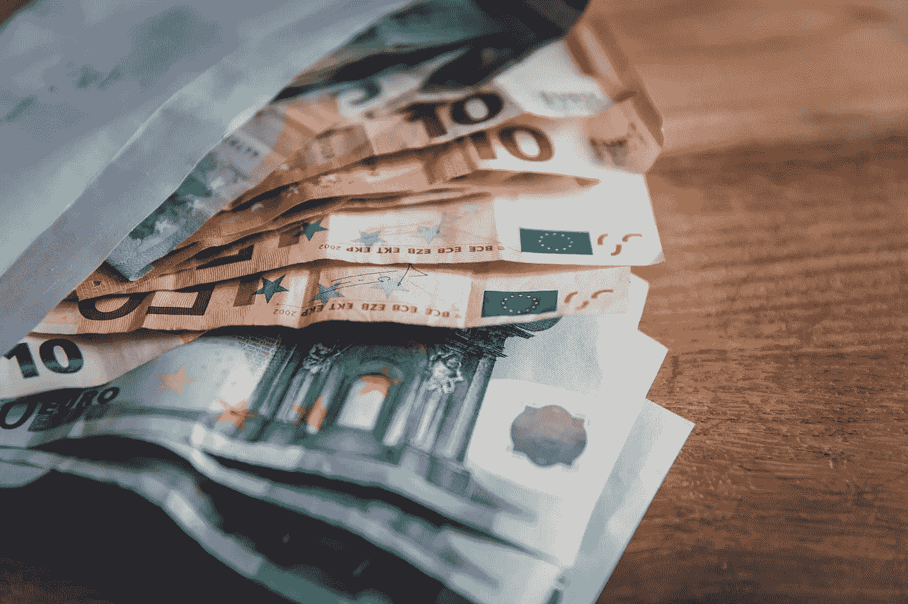

# 编写有价值的测试

> 原文：<https://levelup.gitconnected.com/writing-valuable-tests-591f5e4d2895>

## 最好的测试不会把你的代码和你的测试捆绑在一起。

下面我比较了我对两种常见测试心态的看法。一种侧重于首先编写测试，另一种侧重于最后编写测试。

# **测试驱动开发**

TDD 要求你为每个函数写一个测试，首先让它*失败*，然后实现逻辑让它*通过*。

这些测试*通常*不会一次覆盖多个对象，因为编写这样做的测试的认知负荷*可能*太大。

结果，这些测试*可能*太细粒度，导致代码直接绑定到您的测试。

这使得任何未来的重构尝试都极其危险，会导致高昂的维护成本，请考虑以下情况:

*   如果一个新的对象被添加到对象图中会发生什么？
*   如果一个对象添加或删除了一个变量呢？
*   如果我们需要移动一些逻辑，因为它在那里不再有意义，那该怎么办？

这些都是对系统的主要更改，可能会中断数十个甚至数百个单元测试(和初始化程序),导致:

*   大拉请求(你可怜的同事！)
*   失去信心。如果代码和测试已经改变，我们如何保证行为是相同的？*剧透:*不行，我们现在大概需要做一个回归(你们可怜的同事！)
*   时间的损失。这给你的雇主/客户带来了维护测试的巨大费用。我们应该关注新的特性和错误修复，而不是重写断言。

# 行为驱动发展

在考虑了 TDD 的一些缺陷之后，我认为用 BDD 的思维方式来思考更加有效，因为它关注于:

1.  在这个过程中从哪里开始
2.  测试什么和不测试什么
3.  一次测试多少
4.  如何称呼这些测试
5.  如何理解测试失败的原因

以下方法涵盖了上述所有内容，并防止对底层对象/逻辑的更改。

## 测试用户界面

如果您正在测试的行为具有视觉效果，您应该使用快照测试来测试视图层(在快照测试中，您对屏幕的每次更改进行屏幕捕获)。

这意味着您可以重构所有的业务逻辑、模型对象和副作用，并且仍然保证您的视图在所有可能影响其表示的场景中行为正确。

想象一下，你在屏幕上有一个开关，当开关打开时，它会展开显示附加选项；您可以拍摄关闭和打开状态的快照，并检查图像是否正确。

如果 UI 改变或者业务逻辑改变，您的测试将会失败，您可以查看记录的图像和失败的图像之间的差异。这将帮助您缩小代码的哪个部分发生了变化，一目了然。

在我看来，这些是最有价值的测试，因为你可以同时验证屏幕的布局和行为，这是一个额外的好处——因为它们是单元测试，所以比自动化测试运行得更快。

## 测试副作用

测试底层框架的行为是否正确通常没有价值，这些测试*应该已经被框架的测试套件所覆盖。*

因此，遵循依赖性反转原则，我们应该为每个依赖性编写一个接口，允许我们注入一个模拟/间谍来代替框架，以便测试我们副作用的业务逻辑。

然后，我们可以模拟 API 调用或特定对象存储的结果，返回每个可能的成功/失败值。我们还可以编写 spies 来记录每个函数的执行时间，并断言它们以正确的顺序和正确的数据执行。

# 结论

我希望这个简短的比较让你看到了编写粒度测试可能导致的一些问题，并且至少帮助你质疑什么样的测试是有价值的。

**iOS 开发者:【PointFree 有一个[伟大的框架](https://github.com/pointfreeco/swift-snapshot-testing)用于快照测试，他们会在[这一集](https://www.pointfree.co/episodes/ep86-swiftui-snapshot-testing)中深入讲解如何使用它。你甚至可以扩展这个库来测试你喜欢的任何东西。**