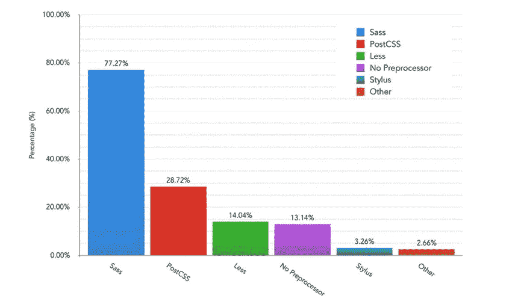
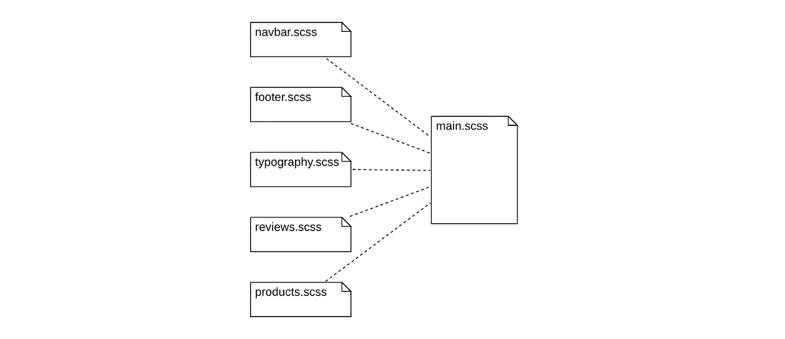
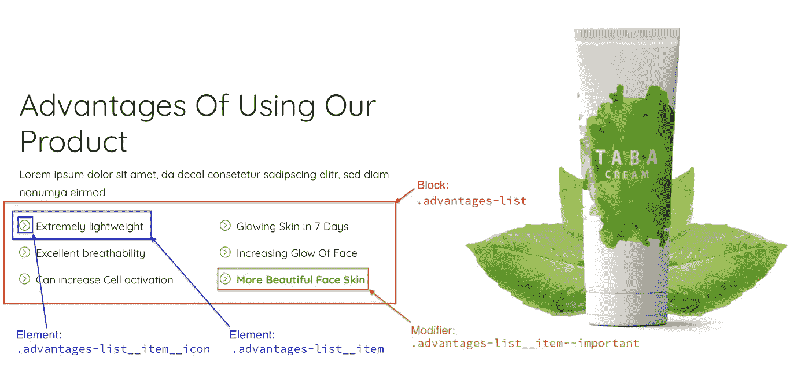
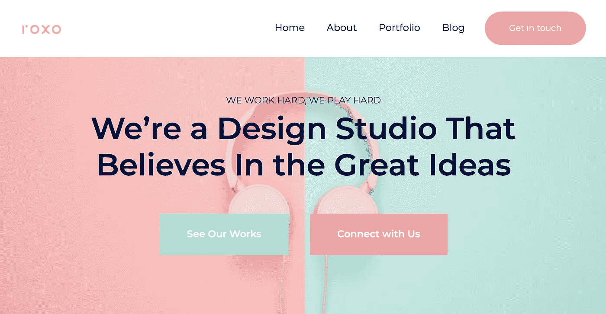
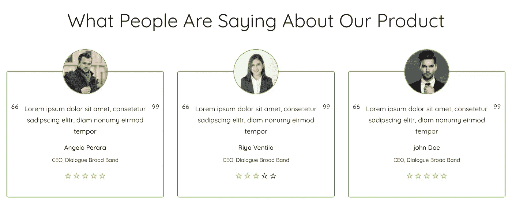

# 像这样写你的 CSS 将会使你的代码非常干净

> 原文：<https://levelup.gitconnected.com/writing-your-css-like-this-will-make-your-code-super-clean-f82d4bfeb468>

## 让你的样式表保持整洁的 6 个技巧——让它们易于阅读、维护和重用。


照片由[罗曼·科瓦尔](https://www.pexels.com/cs-cz/@kovalrk?utm_content=attributionCopyText&utm_medium=referral&utm_source=pexels)从[佩克斯](https://www.pexels.com/cs-cz/foto/makro-malirsky-stetec-malovani-platno-1639627/?utm_content=attributionCopyText&utm_medium=referral&utm_source=pexels)拍摄

今天的交互式网页和单页应用程序大量使用 HTML、CSS 和 JavaScript 作为它们的主要实现语言。除了最近在可维护性和可读性方面获得关注的 JavaScript 代码(TypeScript、ES 模块和`class`构造)之外，此类应用程序中的许多 HTML 和 CSS 代码都处于无人问津的状态。

这类应用程序中的 HTML 代码很可能充斥着非语义标签和过多的类，其对应的自定义 CSS 类只是一组随机命名的规则集，相互覆盖，这意味着几乎没有可重用性。

这种代码与各种 JavaScript MVC 框架的指令(如 Angular、React 或 Vue)结合在一起，难以阅读、维护和调试。被框架无关类污染的 HTML 也对框架升级关闭，在更大的升级中需要很多耐心。

> 编写可读、可维护和可重用的代码是优秀开发人员与伟大开发人员的区别。

# 🏭使用 CSS 预处理器

你可能听说过或者使用过它们。CSS 预处理程序将允许你的样式表有更简单的语法，让你的代码变得安全，帮助你管理你的颜色，并允许你自动创建样式表，比如用几行代码定义你的自定义网格系统。

有四个主要的前置处理器——[Sass](https://sass-lang.com)、 [PostCSS](https://postcss.org) 、 [Less](http://lesscss.org) 和 [Stylus](https://stylus-lang.com) ，每一个都拥有有趣而令人敬畏的功能。



*CSS 预处理器用法来自* [*前端工具调查 2019*](https://ashleynolan.co.uk/blog/frontend-tooling-survey-2019-results)

选哪个？从语法的角度来看，选择一个对你来说好的。本文中的代码将利用 Sass 预处理器的 SCSS 语法。

# 🧩模块化你的代码

当你根据你的页面结构将你的 CSS 分割成逻辑命名的*模块*(即单独的 CSS 文件)时，你本身就使得*在调试或更改的情况下容易定位代码*，另外*你有可能在下一个项目中重用*来自该模块的代码，并且有可能自动为类添加前缀，以便*避免类命名冲突*作为额外的好处。



main.scss 包含所有需要的模块

```
/* The contents of the main.scss file which will be <link>-ed to your HTML page */@import "./navbar.scss";
@import "./footer.scss";
@import "./typography.scss";
@import "./reviews.scss";
@import "./products.scss";
```

短的 CSS 模块通常易于维护——与包含数百或数千个类的大模块相比，它们对代码读者的认知影响较小。

这些模块还带来了*自然的可配置性*，例如在 [Sass 文档](https://sass-lang.com/documentation/at-rules/use#configuration)中进一步阐述。

Angular 和 Vue 等前端应用程序框架通过它们的本地样式和作用域 CSS 特性支持模块化 CSS。

# 📜使用边界元方法

BEM 是*块-元素-修饰符*的简写。这是一种关于如何可预测地命名 CSS 类的方法。它在您的项目中的应用非常简单:

*   *块*是页面的一个独立的、可重用的部分，
*   *元素*是一个块或另一个元素的从属部分(~一个子块)，
*   *修改器*允许块和元素稍微改变它们的外观或行为，

命名类时，类的名称遵循以下命名约定:

*   对于作为可重用代码单元的块，
*   `.block**__element**`(用一个*双下划线*分隔各部分)对于元素——不应在其块之外使用的块的各个部分，
*   `.block__element**--modifier**`(用*双破折号*分隔各部分)用于修饰，表示元素的特定状态。



将边界元方法应用于设计草案

该方法还指出，*类的名称应该与它们真正的设计*分离——这就是为什么绿色子弹的类不被命名为`.advantages-list__item--**green**`的原因——因为将来颜色可能会改变或者可以基于每个模块进行配置。

整个块/元素/修饰符识别过程是一种*软科学*。考虑下例中的按钮。



BEM 抓住你了

有三个按钮——一个绿色、一个粉色和一个粉色+圆形。绿色/粉色的情况很简单——它们显然是通用按钮块的修饰符。

但是 navbar 中的圆形按钮可能是 navbar 的一个*元素*，假设这个圆形按钮不会在 navbar 之外的任何地方使用，或者它可能是一个普通按钮块的一个*修饰符*。这种微妙的决定很大程度上依赖于页面整体的设计语言。

# 👌认可灵活的 CSS 选择器

CSS 中有大量的选择器可用，其中大部分用于非常特殊和复杂的情况。然而，使用一些常见和明显的选择器可能会导致 CSS 代码在将来对 HTML 标记进行可能的更改时变得脆弱:

*   像`.button.green`这样的类组合选择器将使得*更难在页面中重用某些特定的行为*，
*   Child ( `article > .button`)、descendant ( `article .button`)和 sibling selector(`.form-field + .button--search`)将*限制你的类*在 HTML 的不同上下文中的可重用性，
*   选择器选择带有特定 id 的元素(`#submit-query`)只会在重用 CSS 代码时*强迫你给 HTML 元素*不需要的 id。

*好的*选择器呢？这些通常有利于使用:

*   诸如`.container`、`.product-card`等著名的简单类选择器对于定义想要重用的样式特征非常有用，因为一般来说，它们具有*低特异性*，
*   元素选择器(`h1`、`p`、`small`)对于设计项目的*基本版式*非常有用。

好吧。这是否意味着您应该只写这些，而不考虑任何其他的选择器组合？嗯……也就是说，ID /子代/后代/兄弟/组合选择器可能会在特定(*非常特定于项目)的小定制的情况下派上用场！*)等上下文进行局部定位调整。然而，*你应该避免在任何将来重用的代码中使用它们。*

# ♻️利用风格继承

这是一个很好的例子，CSS 预处理器的知识会有所回报。当试图使你的框架特定的 HTML 代码更容易阅读时，你迟早会遇到一个问题，即*许多元素会有大量的类*。下面的例子将说明这个问题:


带有定制品牌的引导导航条

导航条的 HTML 代码被很多类污染了

```
.*navbar-brand* {
  font-family: 'Orbitron', sans-serif; /* a customization */
}
```

通过利用 BEM 和*风格继承*在 SCSS 使用`@extend <selector>`指令(它在其他预处理器中也可用！)，这样的问题将得到缓解，HTML 类的不可读的 slush 将被很好地隐藏在一个 CSS 类中:

```
.*topbar* {
  *@extend* .*navbar*;
  *@extend* .*navbar-light*;
  *@extend* .*bg-light*;

  &__brand { // this approximately means **.topbar__brand**
    *@extend* .*navbar-brand*;

    font-family: 'Orbitron', sans-serif; // a customization
  }
  &__form {
    *@extend* .*form-inline*;

    &__searchbox { // **~ .topbar__form__searchbox**
      *@extend* .*form-control*;
      *@extend* .*mr-sm-2*;
    }
    &__submit {
      *@extend* .*btn*;
      *@extend* .*btn-outline-success*;
      *@extend* .*my-2*;
      *@extend* .*my-sm-0*;
    }
  }
}
```

在这个相当简单的例子中，这种方法的优点可能并不明显，但是假设有这样一种情况*，其中一大块 HTML(如客户评级)在静态页面中反复出现*:



如果这个例子的 HTML 被框架工具类(比如`py-3`、`mt-4`等)污染了。)，改变名字、角色和等级的垂直间距将会非常费力——每次出现都必须改变。*在使用 BEM 和样式继承时，这样的改变只需要几行 CSS 代码。*

最后但同样重要的是，利用 BEM 和样式继承的小部分 HTML 代码不需要修改，例如，如果我们将来使用一个新的很酷的动画库——只需使用`@extend`就可以了。

所有这些都有一个折衷——作为一个 web 开发人员，你不应该允许`@extend`们形成没有任何顺序的意大利面条式代码，所以实现类继承的过程应该被彻底地计划好。你的代码将不包含意大利面条，以防它会`@extend`只在框架库中可用的类，而没有你自己的类。

虽然*样式继承*方法会导致编译后的输出 CSS 尺寸稍大一些(指令`@extend`基本上会将*给定类的规则复制粘贴*到使用的上下文中)，但是用于压缩客户端和服务器之间的网络流量的最先进的压缩算法会减轻这个问题，因为它们在压缩包含重复出现的文本块的文本数据时非常有效。

# 📱利用风格构成

您过去在`media`查询中编辑移动样式覆盖并检查原始样式时肯定遇到过这个问题。*上下滚动。重复地。无限地。*

由 SCSS 和其他预处理程序实现的风格合成作为*混音*在此提供帮助。通过使用`@include <mixin>`指令，前面提到的问题通过 Bootstrap 中一组本地可用的 mixins 得到了有效解决。

样式组合还允许*定义自己的 mixin*——参数化的可重用 CSS 代码片段，用于解决*重现的问题*，这些通常作为完整的库提供——看看[波旁](https://www.bourbon.io/docs/latest/)，一个用于 Sass 预处理器的 mixin 库。

# 🎁结论

您已经看到了 6 个技巧，每个都改进了页面代码的不同方面，从而使 HTML 和 CSS 代码更加整洁。

然而，这不仅仅是关于你作为网络开发者。也是关于你的队友——设计师。为了使设计更容易转换成可重用的 BEM 实体，你还应该指导你的设计师在页面上一致地设计重复出现的元素(当然，除非你正在实现一个非常奇特的页面)。

# 👓值得一看的文章

[](/10-mistakes-i-made-as-a-newbie-self-taught-developer-2b3f14d01052) [## 作为一个自学成才的新手，我犯的 10 个错误

### 完成理学硕士学位后，对过去的自己进行了批判性的反思。在软件工程和飞速发展的职业生涯中…

levelup.gitconnected.com](/10-mistakes-i-made-as-a-newbie-self-taught-developer-2b3f14d01052) [](/learning-these-5-programming-languages-will-make-you-a-better-programmer-f9ffc6283ef9) [## 学习这 5 种编程语言会让你成为更好的程序员

### 通过学习这 5 种编程语言中包含的概念，加快您的编程速度。

levelup.gitconnected.com](/learning-these-5-programming-languages-will-make-you-a-better-programmer-f9ffc6283ef9) 

*在你自己的项目中，这些方法有没有让你惊喜的经历？不要犹豫，在评论中告诉我们吧！*

[](https://skilled.dev) [## 编写面试问题

### 掌握编码面试的过程

技术开发](https://skilled.dev)