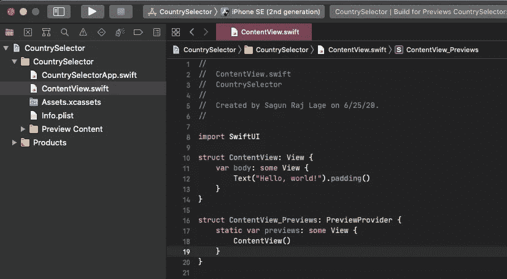

# 为 iOS 编写第一个小部件

> 原文：<https://levelup.gitconnected.com/writing-your-first-widget-for-ios-e1e8acf0079>

## WidgetKit 入门


资料来源:WWDC20

如果你一直在关注 WWDC20，那么你会完全理解这个版本的 WWDC 对整个苹果生态系统、用户和开发者有多么重要。随着 [iOS 14](https://www.apple.com/ios/ios-14-preview/) 的发布，许多便利的功能正在增加 iOS 体验的趣味。其中一个功能是[小部件](https://developer.apple.com/widgets/)。

我知道这对 Android 用户来说听起来并不新鲜，但这对 iOS 用户来说绝对是个好消息。现在，开发人员可以通过使用新的 [WidgetKit](https://developer.apple.com/documentation/widgetkit) 框架来创建他们应用程序的小部件。截至目前，它仍处于测试阶段，可在 [Xcode 12 Beta](https://developer.apple.com/documentation/xcode-release-notes/xcode-12-beta-release-notes) 及以上版本中使用。

> 注意:您需要 Xcode 12 Beta 或更高版本才能创建 Widgets。

现在，让我们开始为 iOS 编写第一个小部件。为此，让我们创建一个新的 SwiftUI 项目。我把它命名为`CountrySelector`。这个应用程序将显示一些国家的国旗，当用户点击任何国旗，该特定国家的细节将显示在应用程序的小工具。


先睹为快小部件将会是什么样子。在屏幕截图中，显示了中型和大型微件。


创建新的 SwiftUI 项目

创建项目后，项目结构将如下所示:



项目结构

首先，让我们创建一个模型，`Country`。这将是一个`struct`，将持有一个国家的细节，如`name`、`flag` 和`continent`。让我们使它符合`Codable`和`Identifiable`协议，因为我们想要分别执行编码-解码操作和稍后使用`ForEach`执行迭代。由于我们使我们的模型符合`Identifiable`，我们将被要求在模型中添加一个`id`属性，这是一个返回`name`值的计算属性。因此，添加所有内容后，最终的代码将如下所示:

之后，让我们转到`ContentView.swift`文件，在那里添加一些虚拟国家数据。因此，在`ContentView`的`body`属性之上，创建一个数组`countries`，并编写以下代码:

```
let countries = [Country(name: "Nepal", flag: "🇳🇵", continent: "Asia"),
Country(name: "USA", flag: "🇺🇸", continent: "North America"),
Country(name: "United Kingdom", flag: "🇬🇧", continent: "Europe"),
Country(name: "France", flag: "🇫🇷", continent: "Europe"),
Country(name: "China", flag: "🇨🇳", continent: "Asia"),
Country(name: "India", flag: "🇮🇳", continent: "Asia"),
Country(name: "Australia", flag: "🇦🇺", continent: "Australia")]
```

现在，我们的虚拟数据准备好了。是时候在我们的视图中显示虚拟数据了。为此，让我们创建一个新的视图，`CountryView`。我们将使用这个视图来显示国旗。

在`CountryView.swift`中，如果我们不想看到预览，我们可以去掉`CountryView_Previews`结构。您也可以从其他视图中删除预览。

在`CountryView`中，我们添加一个`Country`类型的变量`country`。它将用于存储和显示从`ContentView`发送的数据。然后，我们可以从视图中删除`Text("Hello, World!")`并添加以下行:

```
Text(country.flag)
    .font(.largeTitle)
    .background(Color.gray)
    .clipShape(Circle())
```

综上所述，整体代码将如下所示:

预览将显示如下所示的内容:


干杯！我们已经完成了我们的`CountryView`。现在，让我们用在`ContentView`中。首先，删除“你好，世界！”文本并添加以下代码:

```
HStack {
    ForEach(countries) { country in
        CountryView(country: country)
            .onTapGesture {
                self.selectCountry(country)
            }
    }
}
```

这将遍历我们之前设置的虚拟数据，并将`countries`数组中的每一项传递给`CountryView`，并在其上添加一个点击手势来调用方法`selectCountry(_:)`。让我们添加一个方法`selectCountry(_:)`，现在，在`ContentView`中打印被点击的国家的值。

```
private func selectCountry(_ country: Country) {
    print(country)
}
```

`ContentView`中的整体代码如下所示:

现在，让我们运行代码。


这是应用程序的外观。我们可以点击任何标志，并在控制台中查看其详细信息。

现在，让我们在项目中添加[应用程序组](https://developer.apple.com/documentation/bundleresources/entitlements/com_apple_security_application-groups)功能。为此，我们需要一个开发者帐户登录 Xcode。我们需要使用应用程序组，因为我们想要创建一个组容器，以便我们的`CountrySelector`应用程序及其小部件(我们将很快创建)能够访问公共数据，即当前选择的国家。以下屏幕记录显示了我们如何添加应用程序组功能。

添加功能后，我们创建一个新的应用程序组。为此，让我们首先复制我们的捆绑包标识符，然后按下应用程序组部分中的“+”图标。将显示一个对话框，并将包标识符附加到此处的`group.`文本。然后单击确定。之后，如果新添加的组显示为红色，持续按“+”按钮附近的重新加载按钮，直到该组不再变白。

现在，我们可以回到`ContentView`进行进一步的工作。在`ContentView`中，在`countries`数组上方添加以下几行。

```
@AppStorage("selectedCountry", store: UserDefaults(suiteName: "group.np.com.sagunrajlage.CountrySelector"))
var selectedCountry: Data = Data()
```

在这里，我们添加了一个名为`@AppStorage`的属性包装器，这是一种访问键为`"selectedCountry"`的`UserDefaults`数据的方法，这些数据存储在我们的应用程序组的容器中，套件名为`"group.np.com.sagunrajlage.CountrySelector"`。然后，我们将能够将这些数据存储在`selectedCountry`变量中。

现在，让我们使用`selectedCountry`变量。为此，我们创建了一个方法`storeData(with:)`，它将`Country`数据作为输入，对其进行编码，并将其分配给`selectedCountry`变量。通过这样做，数据被存储在我们的应用程序组的容器中。

```
private func storeData(with country: Country) {
    guard let encodedData = try? JSONEncoder().encode(country) else { return }
    selectedCountry = encodedData
}
```

之后，让我们从`selectCountry(_:)`调用`storeData(with:)`方法。因此，`selectCountry(_:)`将首先打印其`country`参数的值，然后将其发送给`storeData(with:)`方法进行存储。这就是`selectCountry(_:)`的样子:

```
private func selectCountry(_ country: Country) {
    print(country)
    storeData(with: country)
}
```

因此，当我们现在点击一个国家的国旗时，该国家的详细信息将以这样一种方式存储，即它们可以通过应用程序和它的小部件(我们稍后将创建)访问。

但是在应用程序中仍然存在一个缺陷。如果这是应用程序的第一次发布，但没有选择任何国家，该怎么办？为了处理这种情况，我们在`ContentView`中添加一个初始化器，并编写以下代码:

```
init() {
     guard let _ = try? JSONDecoder().decode(Country.self, 
                   from: selectedCountry) else {
                       storeData(with: countries[0])
                       return
                   }
}
```

这里，如果`selectedCountry`没有任何值，那么`selectedCountry`的值将被设置为`countries`数组的第一项。这是通过使用我们之前编写的`storeData(with:)`方法实现的。

`ContentView`的最终代码是这样的:

我们的申请完成了。现在，是时候创建它的小部件了。为此，我们必须通过“文件->新建->目标”来创建一个新目标在那里，我们单击“Widget Extension ”,然后单击“Next”。然后，我们将小部件的名称设为`CountrySelectorWidget`，并取消选中[“包含配置意图”](https://developer.apple.com/documentation/widgetkit/intentconfiguration)复选框，因为我们将创建一个没有用户可配置属性的小部件或一个具有静态配置的小部件。最后，单击“完成”。之后，如果你得到对话框提示说“激活 CountrySelectorWidget 方案？”，单击“激活”。这将激活微件方案，稍后，当我们按下“运行”按钮时，我们的微件方案将运行。

现在，如果我们在项目导航器中看到，我们将看到一个名为`CountrySelectorWidget`的文件夹。里面有我们打开的`CountrySelectorWidget.swift`文件。在这里，我们可以看到四种不同的结构。分别是`Provider`、`SimpleEntry`、`PlaceholderView`、`CountrySelectorWidgetEntryView` 和`CountrySelectorWidget`。

符合`[TimelineProvider](https://developer.apple.com/documentation/widgetkit/timelineprovider)`的`Provider`负责通知 WidgetKit 何时更新小部件的显示。它实现了两种协议方法，`snapshot(with:completion)`和`timeline(with:completion:)`。当 widget 要在 widget gallery 中显示预览时，WidgetKit 调用`snapshot(with:completion:)`方法。因此，我们应该让小部件准备好虚拟数据，并且几乎不做任何处理，这样小部件预览就可以快速显示在小部件图库中。
调用`timeline(with:completion:)`方法来更新小部件。这是我们执行处理以获取新数据并通过更新小部件来显示它们的地方。

符合`TimelineEntry`的`SimpleEntry`是一个结构，默认情况下，它指定显示小部件的日期，并且还指示小部件内容的当前相关性。如果需要，我们可以在其中添加其他属性。当我们声明`SimpleEntry`时，我们可以包含`CountrySelectorWidget`中的配置块呈现小部件所需的任何附加信息。

`PlaceholderView`是在数据加载到`CountrySelectorWidgetEntryView`的过程中显示的视图，这是小部件在加载和填充数据后显示的实际视图。`CountrySelectorWidgetEntryView`从它的`entry`属性中获取实际数据。

`CountrySelectorWidget`是上面提到的所有事情都集中在一起的地方。它标有`@main`以便我们的小部件扩展知道这是需要调用的主函数。它有一个属性`kind`,存储小部件扩展的名称。它有`body`属性，可以有任何类型的`WidgetConfiguration`。这里，我们使用了`[StaticConfiguration](https://developer.apple.com/documentation/widgetkit/staticconfiguration)`,因为我们不想在我们的小部件中有任何用户可配置的属性。否则，我们会使用`[IntentConfiguration](https://developer.apple.com/documentation/widgetkit/intentconfiguration)`。在`StaticConfiguration`中，我们已经输入了`kind`、`provider`、`placeholder`和一个获取`entry`并将其发送到`CountrySelectorWidgetEntryView`的块，这是我们的小部件中显示的视图。另外，我们可以在这里设置`description`和`configurationDisplayName`，以及我们想要支持的小部件的大小(我们将会介绍)。

描述够了！是采取行动的时候了。

现在，在`Provider`的第一行中，添加以下几行:

```
@AppStorage("selectedCountry", store: UserDefaults(suiteName: "group.np.com.sagunrajlage.CountrySelector"))
var selectedCountry: Data = Data()
```

这些是我们在`ContentView`中使用的相同的线。我们在这里再次使用它，因为我们想要访问和修改存储在我们的应用程序组容器中的数据。

之后，通过添加`country`属性来修改`SimpleEntry`结构。如果你还记得的话，据说我们可以在必要的时候给这个结构添加我们自己的属性。因此，它看起来像这样:

```
struct SimpleEntry: TimelineEntry {
    public let date: Date
    public let country: Country
}
```

这里，Xcode 不会识别`Country`，因为它是在另一个目标中创建的，而不是`CountrySelectorWidgetExtension`目标的成员。因此，让我们去`Country.swift`并使其成为`CountrySelectorWidgetExtension`目标的一员并构建项目，如下面的视频所示。如果任何其他文件出现这样的问题，也要修改它们的目标成员。

下一步是修改`snapshot(with:completion:)`方法。删除该方法中的所有内容，并添加以下内容:

这里，我试图从 App Groups 容器中获取`selectedCountry`的值，并对其进行解码。如果解码成功，用当前的`Date`和`decodedData`将`entry`设置为`SimpleEntry`的一个实例，否则，设置一个虚拟数据。然后，调用完成处理程序。请注意，当小部件的预览要在小部件库中显示时，会调用此方法。为了更快地加载预览，该方法执行尽可能简单的操作是很重要的。

现在，让我们转到`timeline(with:completion:)`方法，它负责在用户将小部件添加到他/她的屏幕后更新小部件。该方法也将尝试使用`selectedCountry`键从应用程序组容器中获取解码数据。并且如果存在选定的国家，则具有当前`Date`并且该值被设置为`entry`的`SimpleEntry`的实例。但是，如果不存在任何选定的国家(首次启动应用程序时会出现这种情况)，则会将默认值设置为`entry`。然后，通过将`entry`作为数组项传递并将`policy`设置为`.atEnd`来创建`Timeline`的实例。

`policy`属于`TimelineReloadPolicy`类型，负责在时间线中的最后一个日期过去后请求新的时间线。`TimelineReloadPolicy`负责定义小部件何时重新加载。这里，我们设置了`.atEnd`,因为我们希望小部件在前一次输入日期过后重新加载。在当前情况下，这对我们很有用，因为当我们选择一个国家并最小化应用程序时，它会刷新小部件。我们也可以使用`.never`从不更新小部件，使用`.after(Date)`让它在特定的`Date`过后重新加载。

现在，是时候构建显示在小部件中的视图了。让我们转到`CountrySelectorWidgetEntryView`并将它的`body`改为如下:

这将显示国家的`flag`，随后是其`name`和`continent`。让我们修改`PlaceholderView`来显示虚拟数据。

现在，在我们运行应用程序之前，让我们修改`CountrySelectorWidget`中的`configurationDisplayName`和`description`。因此，`CountrySelectorWidget`中的代码将如下所示:

现在，在我们通过将方案设置为`CountrySelectorWidgetExtension`来运行应用程序后，我们将看到一个小部件:


我们可以对小部件做的另一件事是，我们可以设置小部件支持的大小，并相应地安排视图的内容。上面显示的小工具属于`.systemSmall`系列，并且是默认的。但是如果我们使用`.systemMedium`或`.systemLarge`，我们将能够在我们的小部件中看到许多空白空间。为了检查一下，让我们在`.configurationDisplayName(“Country Selector Widget”)`前加上`.supportedFamilies([.systemMedium ])`。这是输出:


正如我们所看到的，在中等大小的部件中有很多空白空间。现在，让我们通过将`.supportedFamilies([.systemMedium ])`更改为`.supportedFamilies([.systemLarge])`来检查大尺寸的小部件。这是输出:


可悲的是，它看起来更糟。但幸运的是，有一种方法可以为每种尺寸创建单独的视图。我们所需要做的就是在我们的`CountrySelectorWidgetEntryView`中添加`@Environment(\.widgetFamily) var family`属性，并在其`body`属性中执行`family`的切换。记得在`body`上方添加`@ViewBuilder`属性包装器，因为如果我们想在`body`中使用一个开关盒，这是必需的。这是为每种情况添加开关情况和独立视图设计后代码的外观:

最后把`.supportedFamilies([.systemLarge])`改成`.supportedFamilies([.systemLarge, .systemMedium, .systemSmall])`。`CountrySelectorWidget`的整体代码是这样的:

现在运行代码，看看神奇之处！


中小型部件


大尺寸部件

这就是我们如何在 iOS 中创建小部件的全部内容！

如果你成功地一直读到这里，你已经做了一件了不起的工作，值得为此鼓掌。👏

快乐的雨燕！

如果你觉得这篇文章有用，并且愿意支持我，请"[给我买杯咖啡](https://www.buymeacoffee.com/sagunraj)"

[](https://www.buymeacoffee.com/sagunraj) [## Sagun Raj Lage 正在撰写博客和书籍，并免费教授编程。

### 我是一名 iOS 开发人员，有从事各种领域相关项目的经验，如交通和…

www.buymeacoffee.com](https://www.buymeacoffee.com/sagunraj)