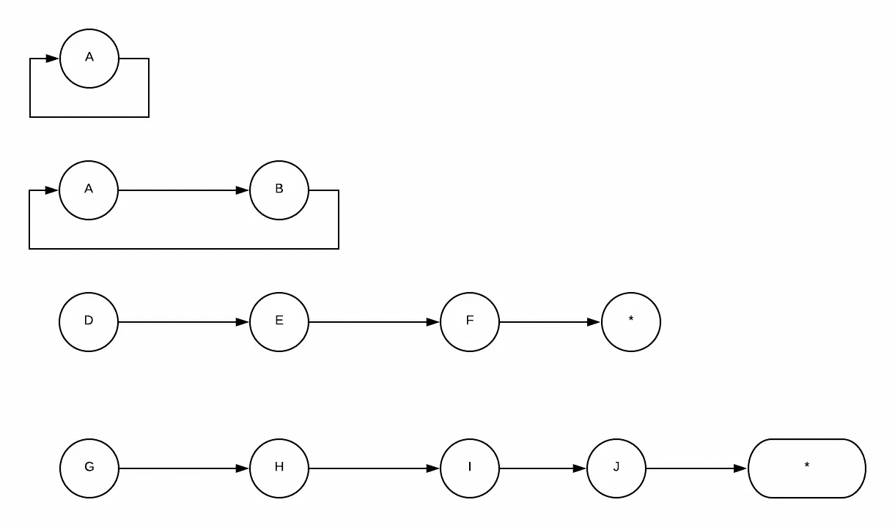

# WTF 是共同毁灭？

> 原文：<https://levelup.gitconnected.com/wtf-is-corecursion-7d3ba8818b48>



递归是编程中经常用到的一个概念。通常，当人们说问题可以递归解决时，他们的意思是问题可以分解成一个更小的问题。

许多算法和数据结构通常是以迭代和递归的方式解决的。

项目管理的生命周期通常以迭代的方式进行。一个庞大的系统可以分解成多个微服务。最流行的数据结构，数组，本质上是一种*递归*数据结构。

例如，假设你正在为一家 X 公司进行编码面试，他们会问你一些经典的斐波纳契问题。

"给定一个数 n，打印第 n 个斐波那契数."

解决这个问题的第一个方法是递归或迭代(动态编程)。然而，也有另一种方式来回答这些问题，使用共奏。

你一定在想:

“那么，什么是 Corecurion？”

在这篇文章中，我将分享什么是共逆，并给你两个用共逆解决问题的例子。

# 什么是共同毁灭？

共递归是递归的反义词。递归*消耗*数据，而共递归*产生*数据。

递归通常解析地工作。从远离基本案例的数据或问题开始，通过使用归纳法将问题分解成更小的数据，直到它达到基本案例。

协同进化综合作用。从基本案例开始并逐步建立—迭代地产生远离基本案例的数据，并具有某种递归关系。

共同毁灭的一个经典功能是`unfold`:

```
def unfold[A,S](s: S)(f: S => Option[(A,S)]): List[A]
```

`A`是应用`f`后的状态结果，`S`是使用`f`后的当前状态或下一个状态。

它需要一个初始状态，以及一个函数，用于在生成的迭代器中产生下一个状态和未来值，无论是列表还是流。

考虑递归与共递归的一种方法是，用自顶向下和自底向上的方法来解决问题。

让我们来实现`unfold`:

对于经典的斐波那契数，我们可以通过从 0 和 1 开始展开来生成 n 个斐波那契数，并将这两个数相加来产生下一个状态:

在上面的函数中，我们通过跟踪`n`数和前一个状态中的两个来产生下一个斐波那契状态，从而产生一个斐波那契数列。当`num`达到 0 时，函数将终止，这意味着我们提供 n 个斐波那契数列。

核心体通常广泛用于函数式编程，主要是在处理无限数据结构时，比如流构建函数。通常，共简给出了产生潜在无限结构的有限子集的解决方案，例如创建生成器。

我将给出另外两个例子，我们可以用共递归来解决这个问题。

# 阶乘

阶乘的递归计算将定义一个基本情况`factorial(0)`等于`1`，递归关系将是`n * factorial(n-1)*`。

对于共简，我们从基础案例`factorial(0)`开始，也就是`1`。为了得到下一个结果，`n = 1`。

就像常规的迭代解法一样，`factorial(2)`可以由`factorial(1) * (1+1)`导出。`factorial(1)`可以由`factorial(0) * (0+1)`派生而来，是基础案例。

所以，我们可以倒着读——“用`n+1`乘`factorial(n)`可以产生`factorial(n+1)`”。

知道了下一个值和下一个状态，让我们用`unfold`写出这个问题的解决方案:

`unfold`函数将接受一个由`n`值和当前阶乘组成的元组。因此，我们在计算下一个阶乘数时增加了`n`的值。回调在`unfold`内起作用，采用未来值和下一个状态。下一个值将是`currentFactorial x num`，下一个状态将是一个包含以下数字和下一个计算阶乘的元组。

# 树遍历

深度优先搜索方法中的树遍历是递归的经典例子。然而，广度优先搜索方法中的树遍历可以使用共递归来实现。

实现深度优先和广度优先的根本区别在于存储节点的数据结构。当我们用深度优先搜索遍历树时，我们用栈(LIFO)存储每个节点。使用广度优先搜索，我们在遍历树时用队列(FIFO)存储节点。

它以后序遍历的方式递归地使用深度优先搜索。它从根开始，依次递归遍历每个子树。

使用 corecursion 实现广度优先搜索，可以从根开始，生成它的所有子树，并把它的所有子树作为一个整体列表放在下一个状态。下面的状态充当要遍历的队列。

让我们用节点中的`unfold`来实现 BFS:

在`unfold`函数的每一步，我们将返回头部作为新结果，返回`newQueue`作为下一个状态。我们将把根节点的子节点添加到现有的“队列”列表中。

递归遍历将叶节点作为基本情况处理，并将树分析成子树。相比之下，corecursion 遍历将根节点作为基本情况处理，并将树视为合成的根节点及其子节点。它在每一步产生一个辅助输出子树列表，为下一步提供输入。根的子节点将成为下一步的根节点。

# 外卖食品

如果我们正在处理无限结构的树或生成无限结构的斐波那契或阶乘，共递归比递归更有用。通过递归，它将永远不会到达基本情况，因为它是无限的。然而，共简化将从基本情况开始，并无限地产生其输出。

共简化的通用功能是`unfold`的精髓。展开是列举元素，使得给定的项目与其先例以及与之前一部分的先例具有相同的关系。

另一种推导共递归的方法是使用迭代，或自底向上的方法。在函数式编程中，通过流构建函数已经慢慢地定义了共递归。

所有代码的来源是[这里](https://github.com/edwardGunawan/Blog-Tutorial/blob/master/ScalaTutorial/corecursion/src/main/scala/main.scala)。

**感谢阅读！如果你喜欢这篇文章，请随意订阅我的时事通讯中的**[](https://edward-huang.com/subscribe/)****来获得关于科技职业的文章、有趣的链接和内容的通知！****

**你可以关注我，也可以在[媒体](https://medium.com/@edwardgunawan880)上关注我，以获得更多类似的帖子。**

***原载于*[](https://edward-huang.com/functional-programming/algorithm/programming/scala/2020/08/02/wtf-is-corecursion/)**。****