# 什么是正则表达式和重要的正则表达式函数

> 原文：<https://levelup.gitconnected.com/wtf-is-regex-really-4dd563ee5ce0>

# **Regex…Reg 什么？！**

所以你可能已经见过这些疯狂的、令人生畏的字符组合，被称为***‘正则表达式’(RegEx)。***

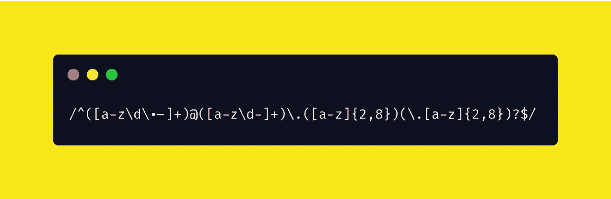

什么是真正的 f@^*？！(检查电子邮件地址模式)

你可能想知道他们实际上做什么？也许你甚至发誓要在很久很久以后的某一天好好研究一下。我的朋友，今天就是那一天！

冠军，我们走吧

**常见的解释是:**

> **正则表达式**是定义一个*搜索* [*模式*](https://en.wikipedia.org/wiki/Pattern_matching) 的一系列[字符](https://en.wikipedia.org/wiki/Character_(computing))。
> 
> 通常这些模式被[字符串搜索算法](https://en.wikipedia.org/wiki/String_searching_algorithm)用于对[字符串](https://en.wikipedia.org/wiki/String_(computer_science))的“查找”或“查找和替换”操作，或者用于输入验证

# 它有什么用途？

RegEx 允许我们检查文本字符串中的模式，例如尝试匹配有效的电子邮件地址或密码。RegEx 最大的超能力之一是能够为一个模式定义你自己的搜索标准来满足你的需要，它就像一门自己的语言。

在某种程度上，世界上所有的表单都在使用正则表达式模式。他们都做类似的事情，但他们都可以非常不同。在决定要搜索的模式时，有很多控制。

然而，RegEx 不仅仅用于表单。假设您有一些文本/字符串格式的动态数据。如果它是动态的，您可能希望对照某个模式来检查它，以便对照数据库来验证它。因为该字符串是动态的，所以您需要验证它是否具有所需的参数。这就是正则表达式可以发挥作用的地方，并证明它是您想要的模式。

RegEx 的另一个优点是，如果你用一种语言学习它，你也可以用其他语言学习，比如 Javascript、Perl、Python、Php 和 Java。作为一名软件/web 工程师，理解正则表达式是一项可以转移的技能。

# 入门指南

这就是 RegEx 的主要内容。使用正则表达式的核心是什么。让我们从头开始…

## 声明正则表达式方法

有几种方法可以声明你的正则表达式，下面是我发现的最简单也是最常见的方法。

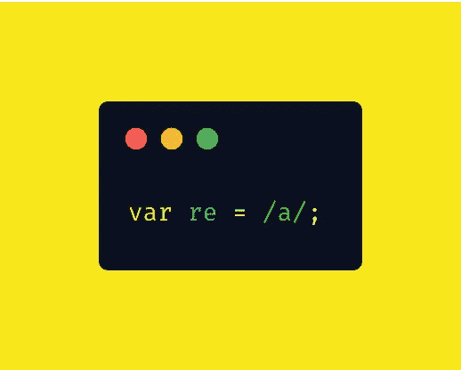

第二种方法稍微有点冗长，因为它使用了`RegExp()`方法。

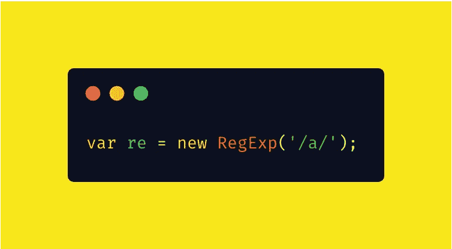

[https://developer . Mozilla . org/en-US/docs/Web/JavaScript/Reference/Global _ Objects/RegExp](https://developer.mozilla.org/en-US/docs/Web/JavaScript/Reference/Global_Objects/RegExp)

`**RegExp**`构造函数创建一个正则表达式对象来匹配文本和模式。很棒吧。大多数东西都很花哨，但通常也是不必要的。使用第一种方法。

## “测试”正则表达式

现在，我们如何看到我们的正则表达式声明是否匹配给定的字符串。

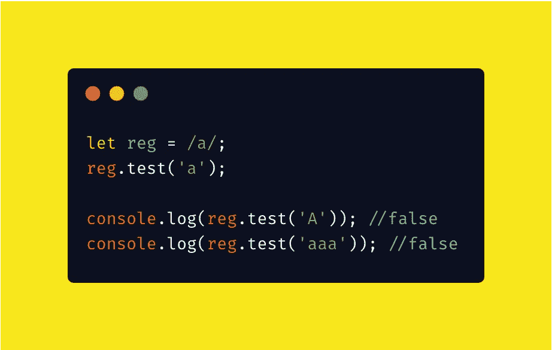

幸运的是，已经有了一个简单的测试方法`.test()`来检查正则表达式模式是否匹配，返回一个`boolean`。

## 执行对特定匹配的搜索

`**exec()**`方法在指定的字符串中执行匹配搜索。返回一个结果数组，即`[null](https://developer.mozilla.org/en-US/docs/Web/JavaScript/Reference/Global_Objects/null)`。

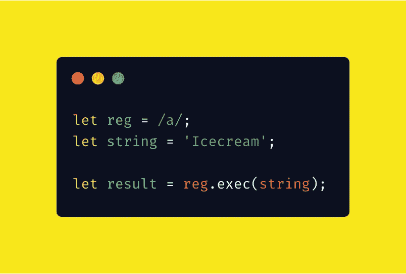

在这种情况下，它将返回一个数组。

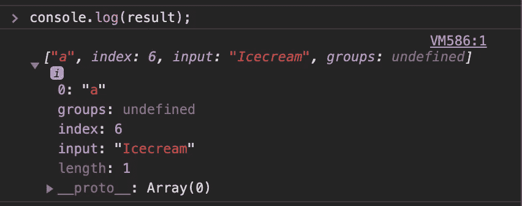

## 比赛

虽然执行模式搜索很棒，但是如果我们真的想进行匹配呢？我已经用`.match()`方法覆盖了你。

`.match()`方法在字符串中搜索正则表达式的匹配项，并将匹配项作为数组对象返回。然而，在这种情况下，我们希望返回数组和一些更有用的信息，比如我们的模式出现的具体实例。我们这样做是通过将`g`(全局)方法附加到我们的`reg`变量声明中，就像这样…

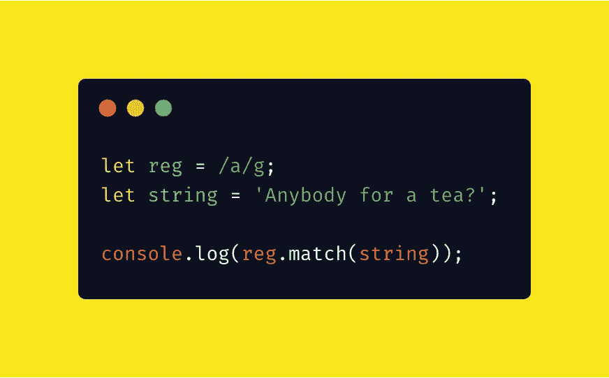

现在，它返回一个实例数组，这些实例出现在`reg`中概述的模式中。

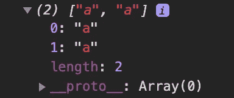

## 替换

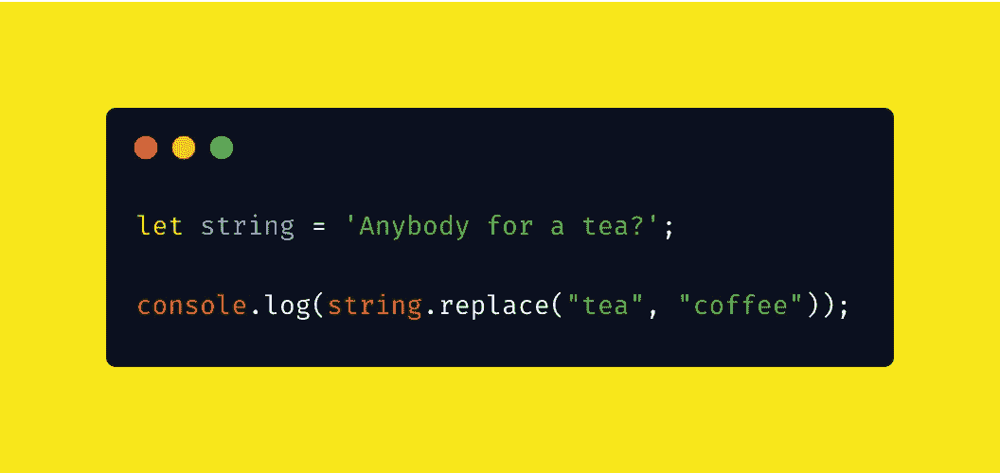

现在你并不总是需要声明一个正则表达式模式。你总是可以只使用你的字符串和一个方法。与`.replace()`方法的情况一样。

它只是用你选择的东西替换任何符合你模式的东西…

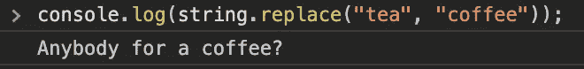

## 搜索

另一个很酷的 regEx 方法是`.search()`方法，它在字符串中搜索指定的值，并返回匹配的位置。

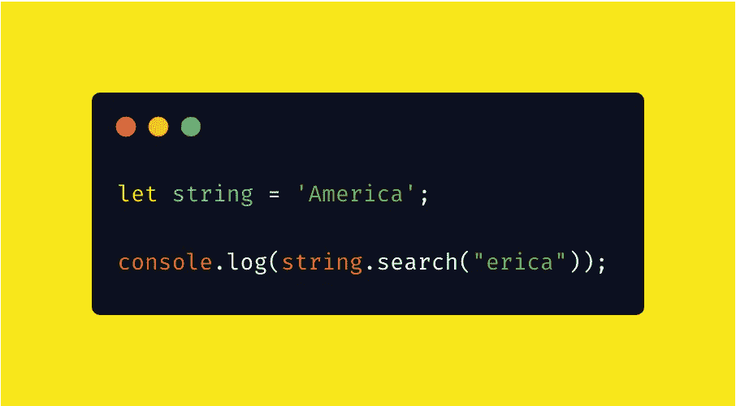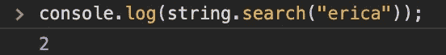

regEx 的一个优点是在这个方法中，搜索值可以是字符串或正则表达式。可定制性是多种多样的，这也是为什么你会在开发人员社区中看到如此多关于在 regEx 中做任何事情的最佳方式的不同意见。

如果没有找到匹配，这个方法也返回`-1`。

# 想学些有趣的把戏吗？

## 范围

当您试图限制一组字母或数字的模式时，搜索字符范围会非常有用。

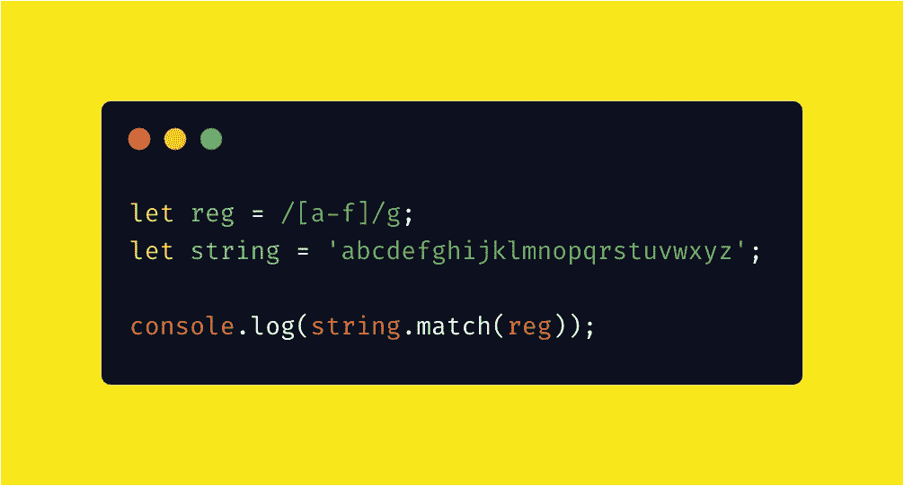

使用`.match()`方法，我们返回一个结果数组。

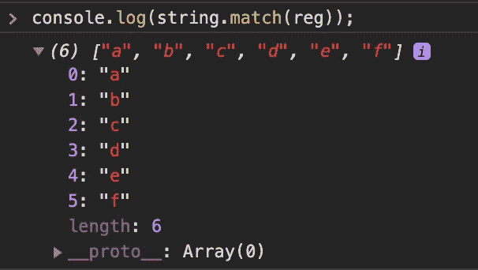

**我们简单地返回一个数字范围 range；**
替换`reg`中的正则项为`/[1-9]/g`；

## 在 HTML 中使用正则表达式作为属性参数

Patterns 是 HTML 中用于`<input>`元素的一个属性，可以使用 regEx 检查模式。

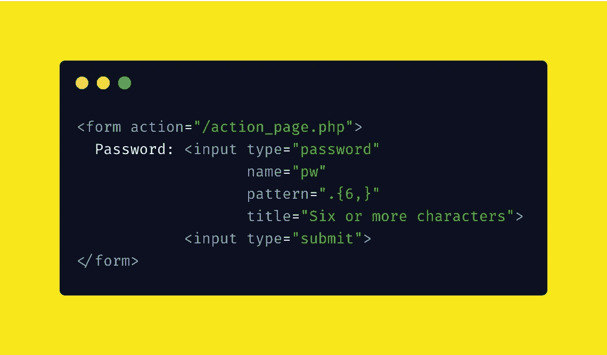

**该模式也适用于以下输入类型的属性:**文本、日期、搜索、url、电话、电子邮件和密码。

这是一种很好的方式，可以将正则表达式嵌入到 HTML 中，而不必担心编写任何附带的 JavaScript。

# 何时使用正则表达式

现在您对什么是 RegEx 有了更好的理解，那么应该在什么时候使用它呢？

## 良好的用例

*   一次性代码
*   用户输入验证
*   当试图在一大堆文本中找到一个特定的模式时！

## 糟糕的用例

*   Regex 不适合解析 HTML，因为 HTML 不是常规语言。
*   我会避免用 regex 解析 URL 的路径和查询参数。大多数标准库都有成熟的工具来将 URL 分解成相应的部分。
*   电子邮件地址是另一个不太适合 regex 的复杂数据格式的例子。[这里的](http://emailregex.com/)是使用 regex 解析大多数(不是全部)有效电子邮件地址时必须经历的困难的一个例子。我再次推荐一个专用的解析库来实现这个目的。

# 这就是你开始行动所需要的一切

不管这篇文章有多棒，正则表达式不是你在一篇文章之后就能掌握的东西。

尽管这是您的 RegEx 之旅的开始，但我还是强烈建议您走出去，投入其中。创建一些简单的东西，用正则表达式来测试你的新的' ***l337 skillz'*** 。

你甚至可以做一些类似于我下面做的注册验证演示的事情？

# RegEx 注册演示

所以我为这篇文章创建了一个演示，概述了如何在注册表单上假设使用正则表达式，并在没有正则表达式库的情况下检查验证。

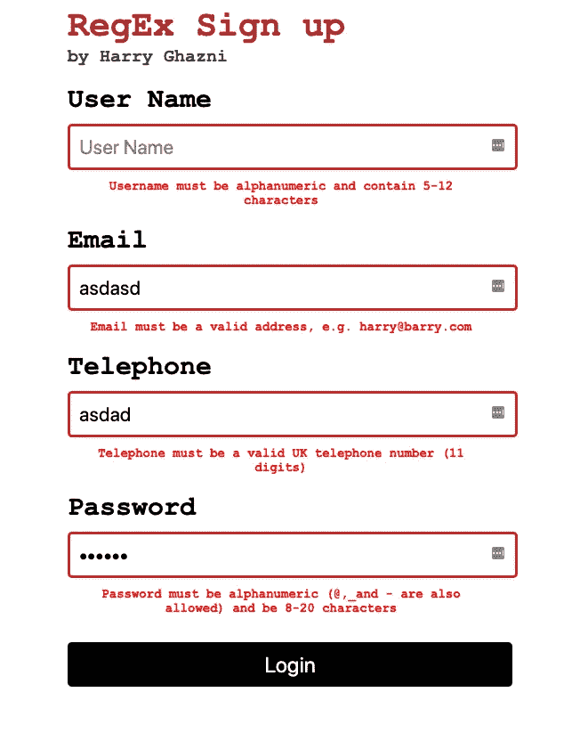

如果有兴趣，请点击这里查看现场演示
[https://regex-validation.netlify.com/](https://regex-validation.netlify.com/)

至于源代码看一看它的回购
[https://github.com/hghazni/regEx](https://github.com/hghazni/regEx)

# 感谢阅读

我的名字 [**哈里加兹尼**](https://github.com/hghazni) 我在英国诺丁汉工作。

如果你喜欢我写的东西，你可以在 [***推特***](https://twitter.com/harryghazni) 或 [***媒体***](https://medium.com/@hghazni) 上找到我。我热爱我所做的事情，我所学的知识，并与他人分享。

我也有一个 YouTube 频道叫做 [**好奇 Byt** e](https://www.youtube.com/channel/UChgP4qLeMhkcJUFMO5S05mQ/) 我在那里发布教程和建议，看看吧！