# x86 调用约定

> 原文：<https://levelup.gitconnected.com/x86-calling-conventions-a34812afe097>

由[巴特·阿内斯廷](https://unsplash.com/@banestin?utm_source=unsplash&utm_medium=referral&utm_content=creditCopyText)在 [Unsplash](https://unsplash.com/s/photos/payphone?utm_source=unsplash&utm_medium=referral&utm_content=creditCopyText) 上拍摄的照片

> " T 在 x86 平台上调用约定的好处是有太多的选择了！"*雷蒙德·陈，微软*

**调用约定**充当汇编级子程序之间的契约。它们描述了参数传递的方式和位置，以及谁负责清理堆栈。密切相关的考虑因素，如哪些寄存器可以被“破坏”，哪些寄存器必须被保留，以及返回值位于何处，都与特定的应用程序二进制接口(ABI)相关，这是一个更广泛的主题，在此不作讨论。

我想，作为一名 C/C++开发人员，即使没有真正理解各种调用约定及其细微差别，也有可能拥有一个漫长而充实的职业生涯。毕竟，它们是编译器关心的问题，通常不是开发人员关心的问题(除非您正在进行一些低级别的调试)。

作为一名从事二进制目标的逆向工程师，理解调用约定并学习如何在您要逆向的代码中发现它们是很有帮助的。在这里，我们看一些 x86 调用约定，使它们独特的属性，并查看一些它们反汇编时的样子。

# 呼叫者/被呼叫者

你将会看到术语**呼叫者**和**被呼叫者**在这里被大量使用，这可能会有点令人困惑。调用者只是一个*调用另一个函数*的函数。被调用者是从另一个函数调用的函数*。考虑下面包含两个函数的 C 程序， *main* 和 *printFavNums* 。*

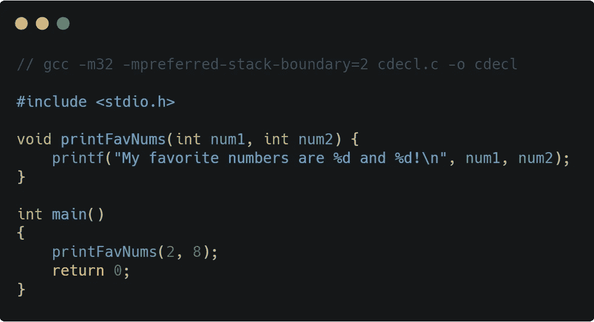

说明调用者和被调用者的 c 代码

在上面的代码中，`caller`是 *main* 而`callee`是 *printFavNums* 。为什么？因为*main*调用另一个函数 ( *printFavNums* )而 *printFavNums* 是从另一个函数 ( *main* )调用的**。**

> 如果你想从这篇文章中复制并粘贴代码，请查看 Github 的要点。那些恶心的源代码图片是由[碳](https://carbon.now.sh/)生成的。❤

# 谁决定使用哪种调用约定？

编译器确定哪个调用约定用于所有函数。然而，许多编译器允许程序员在每个函数的基础上设置特定的调用约定，正如我们在本文中对 GCC 所做的那样。

重要的是要记住，这些只是约定，编译器可以选择遵守或不遵守任何约定。您会遇到的调用约定通常是编译器设置的默认调用约定的结果，或者是目标平台正式采用的调用约定，比如 Win32 API 对`stdcall`的使用。

# x86 (32 位)

x86 体系结构在 64 位处理器之前就已经采用了许多*调用约定。在这里，我们将了解四种最常见的 32 位调用约定、它们的定义特征以及它们在英特尔风格反汇编中的外观。*

*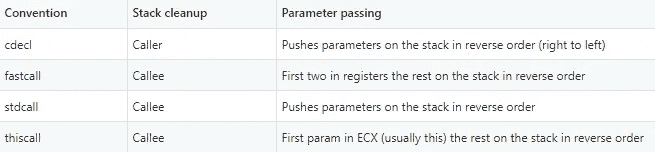*

*通用 x86 调用约定属性*

# *cdecl*

*`cdecl`(发音为 *see-dec-el* ，简称“C 声明”)调用约定非常常见，因为它是当今最流行的编译器的默认 x86 (32 位)调用约定，包括 [GCC](https://gcc.gnu.org/onlinedocs/gcc/x86-Function-Attributes.html) 、 [MSVC](https://docs.microsoft.com/en-us/cpp/build/reference/gd-gr-gv-gz-calling-convention) 和 [LLVM](https://llvm.org/docs/LangRef.html#calling-conventions) 。它具有以下属性:*

*   *调用方将*所有*参数放入堆栈中的被调用方*
*   *参数从*右向左*推至堆栈*
*   *堆栈清理由*调用方*执行*

*让我们考虑一下前面提到的简单程序。我们不需要显式设置 *cdecl* ，因为这是 GCC 的默认调用约定，我们在这里使用的编译器。*

**

*用 GCC 编译 cdecl 的一个例子*

> *这里我们用`-m32`告诉 GCC 我们想要一个 32 位二进制，用`-mpreferred-stack-boundary=2`告诉 GCC 我们想要 2 (4 字节)堆栈对齐。我们设置这种堆栈对齐，因为更容易确认谁清理了堆栈。如果不设置该选项，ABI 会指示 2⁴ (16 字节)堆栈对齐，这只会增加不必要的混乱。*

*让我们看看这个简单的程序(只需将 *main* 和 *printFavNums* )与[Binary ninger](https://binary.ninja/)拆开，寻找我们期待看到的 *cdecl* 特性。*

*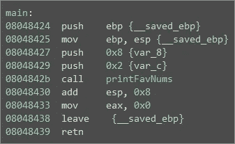*

*cdecl 调用者功能(主)*

*这里我们可以看到 *main* (调用者)正在从右向左将 *printFavNums* (被调用者)的参数压入堆栈。它首先推 8，然后推 2，并调用 *printFavNums* 。这确认了*‘调用者将被调用者的所有参数放在堆栈上’*，*‘参数从右向左推入堆栈’*。*

*但是最后一个特征呢？谁在清理这里的烟囱？如果您在调用 *printFavNums* 后立即查看， *main* 会清理堆栈帧`(add esp, 0x8)`的 8 个字节，这是传递给被调用者的两个 4 字节参数。这确认了*调用者，主*正在为*被调用者*清理堆栈。但是为了确保这里没有什么有趣的事情，让我们看看 *printFavNums* 。*

*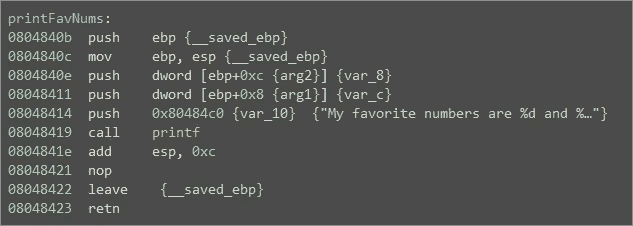*

*cdecl 被调用函数*

*我们可以看到， *printf* 的三个 4 字节参数从右到左被推到堆栈中，在调用完成后，*调用者 printFavNums* 通过向堆栈指针(esp)添加 0xC (12)来为*被调用者* (printf)清理堆栈，正如我们对 *cdecl* 的预期。 *printFavNums* 在清理堆栈帧时从不考虑自己的参数。这是它的调用者( *main* )在这个约定中要做的。*

# *快速呼叫*

*`fastcall`调用约定之所以得名，是因为它比其他在堆栈上传递参数的调用约定更快。在 32 位系统上，用于参数传递的寄存器数量有限(与 x86-64 和其他一些具有更多通用寄存器的体系结构相比)。因此，在 *fastcall* 中，只有前 2 个参数被寄存器传递，而任何剩余的参数都在堆栈上传递。*快速调用*具有以下属性:*

*   *调用者将第一个 *2 参数*放入寄存器，其余放入堆栈*
*   *从右到左*将参数加载到寄存器/推入堆栈**
*   *堆栈清理由*被调用者*执行*

*让我们考虑一个与我们之前提到的简单 C 程序非常相似的程序。这一次我们增加了一个参数，并且我们明确地将 *fastcall* 设置为一个函数属性(这是 GCC 特有的语法)。*

*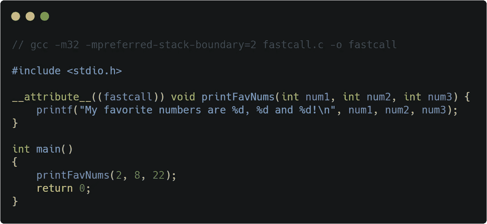*

*用 GCC 编译 fastcall 的一个例子*

*让我们看看编译器在这个版本的简单程序中做了什么，再次用[二进制忍者](https://binary.ninja/)反汇编。*

*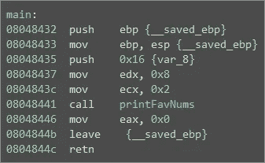*

*快速呼叫呼叫者功能*

*这里我们可以看到 *main* (调用者)正在将最后一个参数推入堆栈，然后将第二个和第一个参数分别加载到 *edx* 和 *ecx* 寄存器中。这证实了在 *fastcall* 中，*调用者将前 2 个参数放入寄存器中给被调用者，堆栈中的其余参数*和*参数从右向左处理*。*

*注意在调用 *printFavNums* 之后 *main 没有*清理堆栈。让我们看一下 *printFavNums* 以确保它清理了自己的参数。*

*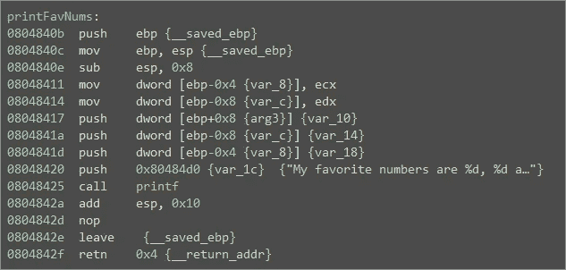*

*快速调用被调用函数*

*如果我们看下面对 *printf* (仍然是 *cdecl* )的调用，我们会看到 *printFavNums* 清理 0x10 (16)字节，以说明传递给 *printf* 的四个 4 字节参数。但是 *printFavNums* 在哪里清理它自己的三个 4 字节参数呢？嗯，记住在*快速调用*中，这三个中的两个通过了不需要清理的寄存器。这就只剩下一个 4 字节的参数需要清理，但是在哪里完成呢？*

**printFavNums* 函数通过使用 0x4 的`retn`指令的可选操作数来实现这一点。这将导致在返回操作中“清除”额外的 4 个字节。它看起来肯定与我们目前看到的有很大不同，堆栈指针( *esp* )被直接操作，但效果是一样的。因此，*被调用者*在自身之后进行清理。*

# *stdcall*

*`stdcall`(“标准调用”的缩写)是一种常见的 x86 调用约定，类似于`cdecl`，但是*被调用方*负责从堆栈中清除自己的参数。如果你曾经做过 Windows 开发，你可能知道这个调用约定为`WINAPI`，它只是在`windef.h` ( `#define WINAPI __stdcall`)中设置的 *stdcall* 的别名。该调用约定具有以下属性:*

*   *调用者将*所有*被调用者的参数放在堆栈上*
*   *参数从右到左从*推入堆栈**
*   *堆栈清理由*被调用者*执行*

*让我们考虑一下我们一直在使用的同一个简单的 C 程序，这次为 *printFavNums* 设置了 *stdcall* 。*

*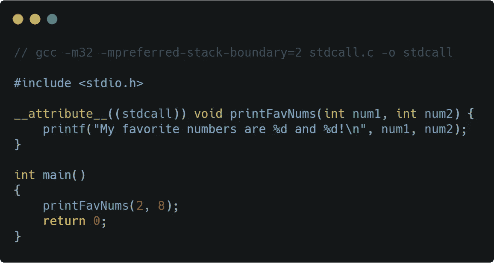*

*用 GCC 编译 stdcall 的例子*

*现在让我们来看看我们的两个反汇编函数。*

*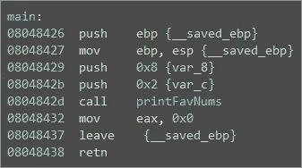*

*stdcall 调用程序函数*

*正如我们所料， *main* 将 *printFavNums* 的参数从右向左推入堆栈。请注意 *main* 在调用 *printFavNums* 后没有清理堆栈。*

*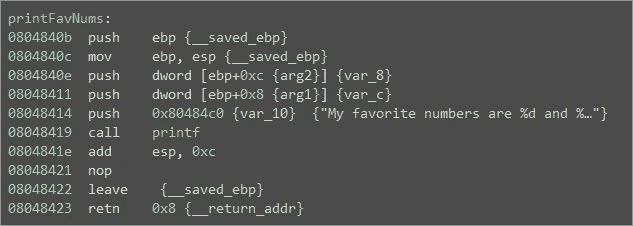*

*stdcall 被调用方函数*

*在 *printFavNums* 中我们可以看到`retn 0x8`，它解释了传递给这个函数的两个 4 字节参数。正如我们所预料的，这个 *stdcall* 函数会自动清理。*

# *这通电话*

*`thiscall`呼叫约定是一个非常有趣的东西。它旨在用于需要引用其“this 指针”的 C++类成员函数，以便该函数可以访问类实例变量。以下是此调用约定的属性:*

*   *参数从右到左从*压入堆栈**
*   *这个指针通过 ECX 寄存器传递给被调用者*
*   *堆栈清理由*被调用者*执行*

*让我们考虑一下我们一直使用的 C 程序的 C++版本，其中 *printFavNums* 是 *FavoriteNumbers* 类的成员。*

*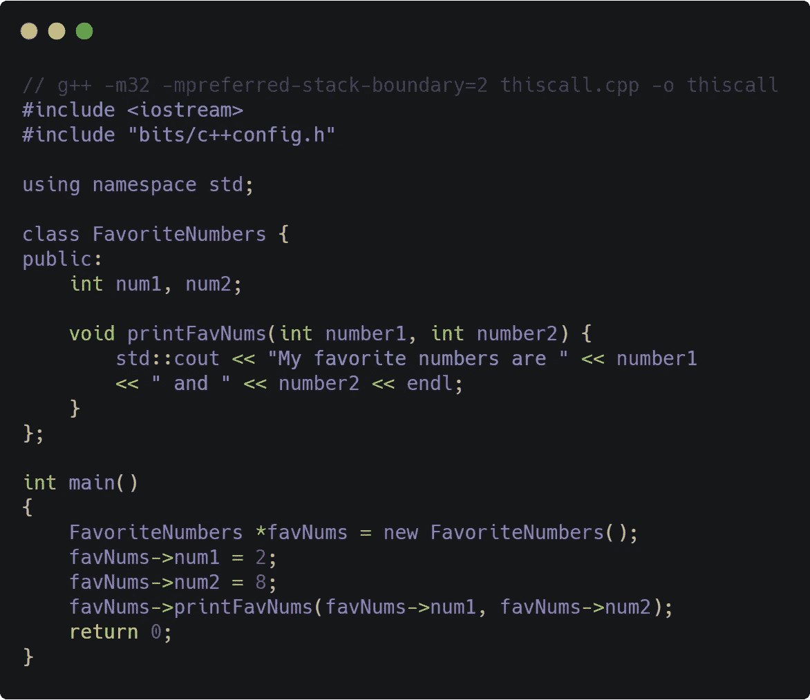*

*一个只有一个成员函数的 C++类*

*基于我所阅读和了解的关于`thiscall`的一切，GCC *应该*让 *printFavNums* 成为`thiscall`函数，因为我们正在调用一个 C++类成员函数，它需要访问自己的实例变量。所以让我们看看…*

*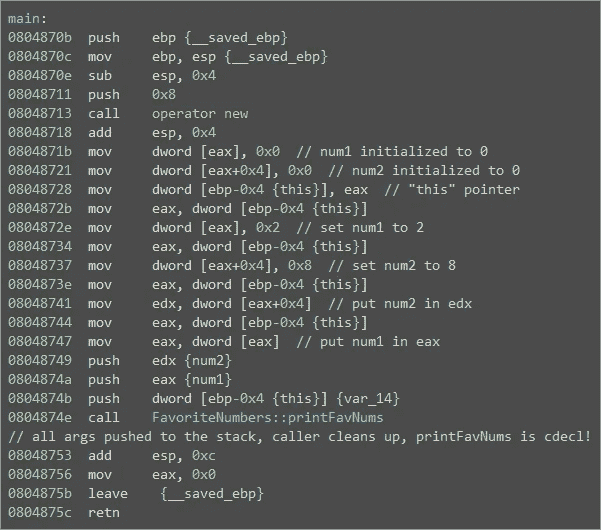*

*GCC 使 printFavNums 成为 cdecl 调用，并将“this pointer”作为第一个参数注入*

*等一下。 *ecx* 寄存器没有被用于 *this* 指针，并且堆栈显然正在被*调用者(main)* 清除。 *printFavNums* 符合对 *cdecl* 的描述。这里发生了什么？*

*原来`g++`(GCC 的 C++编译器命令)使这个函数成为了 *cdecl* 函数，但是插入了 *this 指针*作为 *pritnFavNums 的第一个参数。所以这个函数在编译时被赋予了三个参数，尽管 C++原型只有两个！**

> *网上和书中有很多信息告诉你这种呼叫有两种版本。一份给海湾合作委员会，一份给 MSVC。这可以从两个方面来考虑；1.这个调用有两个不同的版本，2。默认情况下，GCC 使用 cdecl 代替 thiscall，注入隐含的“this pointer”作为第一个参数。*

*这两种描述都是可以接受的，我个人喜欢用第二种来理解这里发生的事情。GCC 与 *thiscall* 的时髦业务可以追溯到 4.7.0⁴版本，开发者从一种形式转换到另一种形式，试图变得与 MSVC 实现的 *thiscall* 更加兼容。*

*这使得 problems⁵的开发者们没有预料到这种变化。最终，GCC 切换回他们自己的方式——但是增加了一个 *thiscall* 函数 attribute⁶，允许开发人员强制 *thiscall* 而不是 GCC 奇怪的“cdecl with injected*this*pointer”约定。*

*让我们使用相同的代码，但是这次我们将使用 GCC 函数属性*显式地*设置 *printFavNums* 为`thiscall`。*

*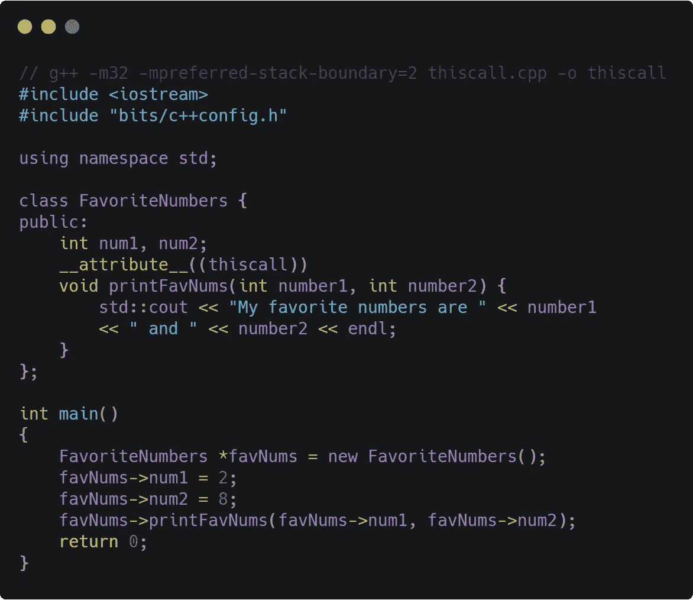*

*请注意 printFavNumers 方法上的显式属性修饰符*

*现在我们来编译反汇编一下，看看这次发生了什么。*

*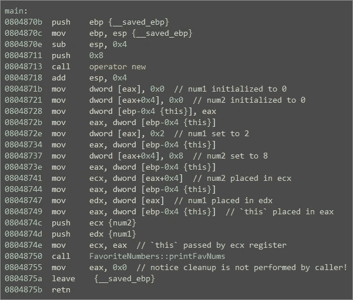*

*在我们显式地设置了 fastcall 属性之后，GCC 屈从于我们的意志*

*这还差不多！ *printFavNums* 函数在堆栈上传递两个参数，并且在调用之前用 *this 指针*加载 *ecx* 。我们还可以看到 *main* 在调用 *printFavNums* 之后并没有清理堆栈。 *printFavNums* 现在是一个 *thiscall* 函数！*

# *特殊考虑*

*调用约定的主题在某些情况下会变得复杂(这个调用已经够糟糕的了)。在许多情况下，到目前为止提供的信息都是正确的，但是在某些情况下，您必须考虑一些问题。这里我们讨论一些特殊情况。*

# *可变参数函数*

*在本文中，您已经了解了一些“被调用者清理”的调用约定，这意味着*被调用者*自己清理堆栈，但是有一个问题。*被调用者* **无法**清理他们自己的堆栈，如果他们被传递了可变数量的参数！*

*可变参数函数(也称为“vararg”或“variadic”函数)是接受可变数量参数的函数。下面给出了一个 vararg 函数的例子。*

*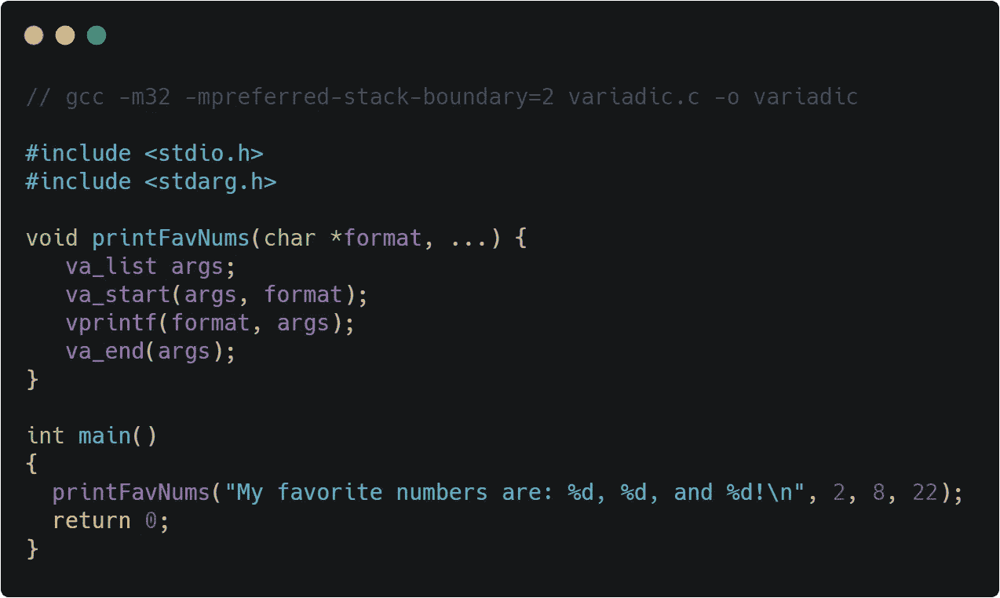*

*一个 C 语言中的变量函数例子，没有属性修饰符*

*上面的代码编译起来没有问题，因为默认的调用约定是 *cdecl* ，一个*调用者清理*约定。然而，如果我们试图将这个函数设置为我们已经学过的任何一个*被调用者清理*函数，比如说 *stdcall* …*

*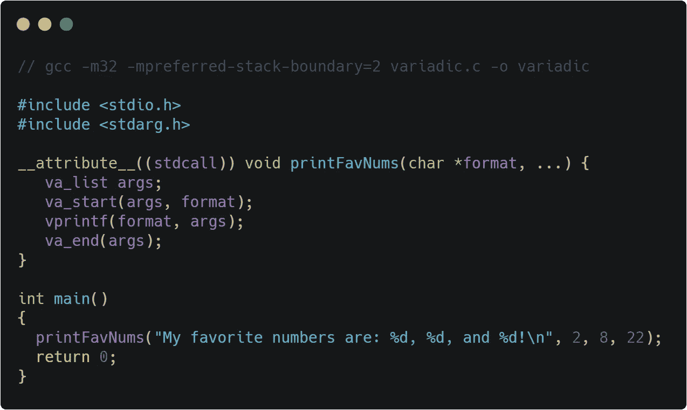*

*一个 C 语言中的变量函数例子，带有一个 stdcall 属性修饰符*

*…编译器将抛出一个警告并退回到 *cdecl* ，因为它不能使一个可变函数成为一个*被调用方*清理约定。*

*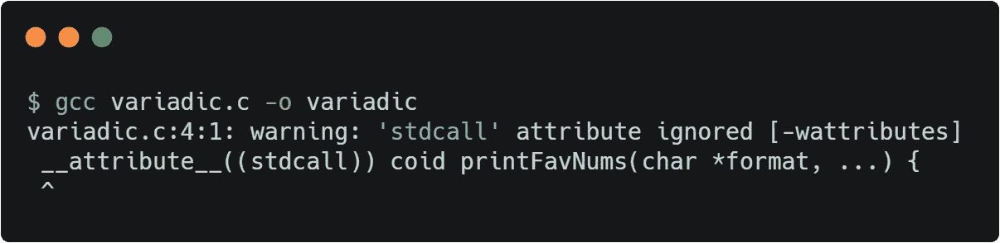*

*GCC 吼我们是因为编译器开发者永远是对的:)*

*那么为什么可变被调用者不能清理自己的栈呢？难道他们就不能在返回前动态调整堆栈指针，或者用 *retn X* 清理吗？*

*在编译时，可变的被调用方不知道它可以传递多少个参数。它可能是零，一百，或其他任何值。所以编译器无法确定有效的堆栈清理策略。*

*理论上，可变函数可以被编译器修改来动态解析它自己的参数数量和大小，然后清理它自己的堆栈吗？在大多数情况下，我相信是这样的。但是想到可能的边缘情况以及如何正式验证这一点，我就头疼。有了调用者和被调用者都可用的清理约定，当存在更简单的解决方案时，再经历所有这些麻烦就没有意义了；只是不要对变量函数使用调用者清理约定。*

# *随时打这个电话！*

*因此，我们了解了 *thiscall* 的预期用途，它将用于需要访问自己的类实例的 C++类成员函数。但是*这个 call* 可以用在任何你想用的地方(当使用 GCC 的时候)。事实上，这段代码完全有效。*

*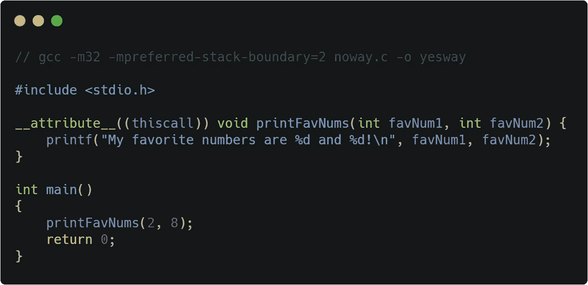*

*在看不到 C++类的情况下向 GCC 请求这个调用*

*你可能会认为编译器(这里是 GCC 5.4.0)会抱怨。这甚至不是 C++，这里也没有类。为什么我们需要这个调用呢？但它工作，检查拆卸。*

*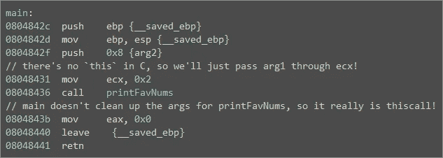*

*GCC 将一个标准的 C 函数称为 thiscall*

*由于没有*这个指针*，编译器通过栈上的 *ecx* 和 arg2 传递 arg1。正如我们在 *thiscall* 函数中所预期的，被调用方*正在从堆栈中清除自己的参数。这种疯狂是 GCC 扩展的一部分，它允许这种情况发生在 occur⁷.**

# *结论*

*我希望您喜欢这篇关于常见 x86 调用约定的文章，并且您可以想象在每种情况下 C 到汇编的转换。还有一些特殊的调用约定我们没有在这里讨论，比如 pascal、optlink、safecall 等等。说实话，我是因为[维基百科](https://en.wikipedia.org/wiki/X86_calling_conventions)才知道这些的。我想在我的职业生涯中从来没有遇到过他们。*

*作为一名专业的逆向工程师，我已经做了很多年了，却从来没有在白板上写过这些东西。我知道 x86 调用约定之间的一些一般差异，但我从未花时间真正坐下来研究这个主题。*

*然而，在今天的现代 x86–64 系统中，调用约定实际上是我生活中每个工作日都必须考虑的事情。理解 Windows 和 System-V ABI 之间微妙但非常重要的差异在 x86–64 逆向工程过程中至关重要，我将在以后关于 x86–64 调用约定的文章中解释原因。*

# ***脚注&参考文献***

*[1]维基百科， [x86 调用约定，thiscall](https://en.wikipedia.org/wiki/X86_calling_conventions#thiscall) 。*

*[2]: Ownedcore，魔兽世界，魔兽世界机器人和程序，WoW 内存编辑。[*GCC“this call”调用约定【Linux/Win32 MinGW】*](https://www.ownedcore.com/forums/world-of-warcraft/world-of-warcraft-bots-programs/wow-memory-editing/281008-gcc-thiscall-calling-convention-linux-win32-mingw.html)*。**

*[3]: [掌握恶意软件分析](https://books.google.com/books?id=_wucDwAAQBAJ&pg=PA25&lpg=PA25&dq=gcc+and+thiscall&source=bl&ots=UEczyFq1Mk&sig=ACfU3U1Txd1IobjPPBaIoE5PKc6Tr2-eog&hl=en&sa=X&ved=2ahUKEwjiyPqg_aDnAhVNHc0KHZW_A_IQ6AEwEHoECAoQAQ#v=onepage&q=gcc%20and%20thiscall&f=false)，Alexey Kleymenov，Amr Thabet，Packt Publishing，第 25 页:“在 GCC 编译器中，这个调用几乎与 cdecl 调用约定相同，它将对象地址作为第一个参数传递。但在微软 C++编译器中，它类似于 stdcall，在 ecx 中传递对象地址。”*

*[4]: [GCC 4.7 发布系列*变更、新特性和修复。*](https://gcc-help.gcc.gnu.narkive.com/z7It0S03/how-to-disable-thiscall-on-mingw-gcc-4-7-x) *"* Windows x86 目标使用 C++类成员函数的`__thiscall`调用约定。*

**[5]: Narkive Mailinglist Archive，"[如何在 MinGW-gcc-4.7.x 上禁用 __thiscall？](https://gcc-help.gcc.gnu.narkive.com/z7It0S03/how-to-disable-thiscall-on-mingw-gcc-4-7-x)”。**

**[6]: [*6.33.34 x86 函数属性*](https://gcc.gnu.org/onlinedocs/gcc/x86-Function-Attributes.html) ， *thiscall* 。**

**[7]:来自 GCC 文档 [*6.33.34 x86 函数属性*](https://gcc.gnu.org/onlinedocs/gcc/x86-Function-Attributes.html) :“在 x86–32 目标上，`thiscall`属性导致编译器传递寄存器 ECX 中的第一个参数(如果是整型的话)。[...] **作为 GCC 的扩展，这个调用约定可以用于 C 函数和静态成员方法。****

> **关于作者**
> 
> **John Toterhi 是 Battelle Memorial Institute 的安全研究员，他专门研究逆向工程、漏洞研究和工具开发。当他不是一个电脑迷时，他可能会培养一个新的爱好或者讲一些坏爸爸的笑话。你可以在 [LinkedIn](https://www.linkedin.com/in/john-toterhi/) 、 [GitHub](https://github.com/cetfor) 、 [Twitter](https://twitter.com/cetfor) 和 [Medium](https://medium.com/@cetfor) 上与约翰联系。**