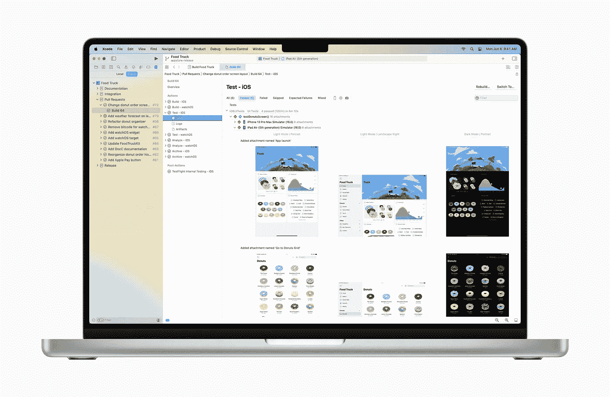
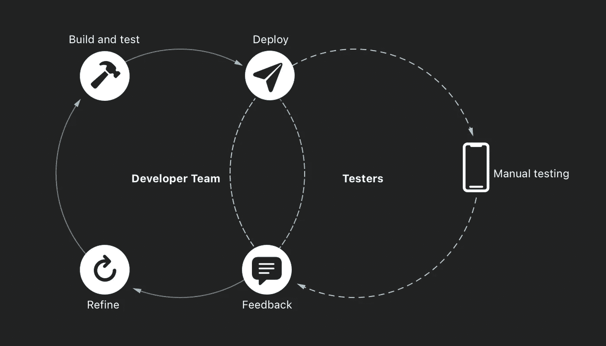
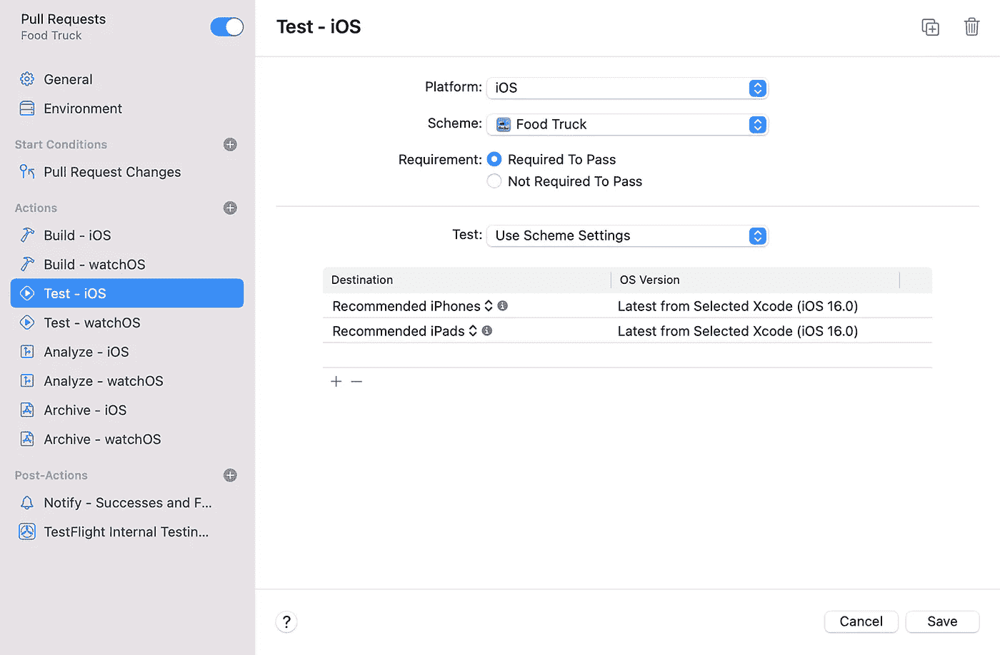
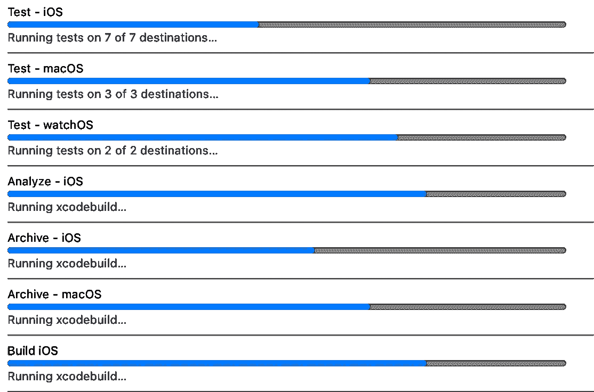
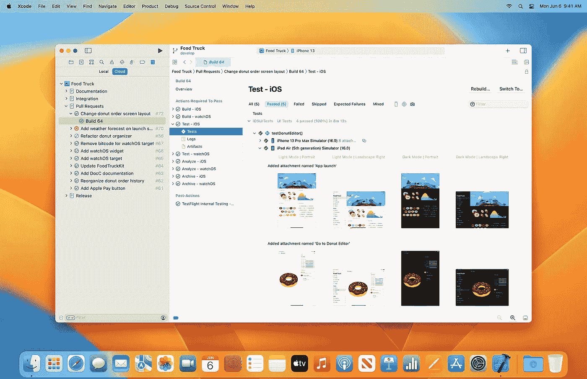

# Xcode 云:现在为苹果开发者直播

> 原文：<https://levelup.gitconnected.com/xcode-cloud-now-live-for-apple-developers-170ee3674bbf>

## 流行开发工具的基于 Web 的解决方案

在 WWDC 2022 大会上，苹果推出了许多新工具、技术和 API，旨在帮助开发者为他们的用户创造更丰富的体验。其中一个重要的东西是 Xcode Cloud——苹果内置于 Xcode 的持续集成和交付服务现在可供苹果开发者计划中的每个人使用。

Xcode Cloud 允许您采用持续集成和交付(CI/CD)，这是一种标准的软件开发实践，可以帮助您开发和维护代码，并将应用程序交付给测试人员和用户。

Xcode Cloud 通过汇集基于云的工具来加速高质量应用的开发和交付，这些工具可以帮助您构建应用、并行运行自动化测试、向测试人员交付应用以及查看和管理用户反馈。

这里是你需要知道的关于 Xcode Cloud 的一切。

# Xcode 云

Xcode Cloud 是一个持续集成和交付(CI/CD)系统，它使用 Git 进行源代码控制，并提供一个集成的系统来确保您的代码库的质量和稳定性。它还有助于应用程序的高效发布。Xcode Cloud 将 Xcode 与 Apple 的云基础架构相结合，用于构建和测试您的代码，以及 TestFlight 和 App Store Connect，从而简化了以下操作:

*   自动构建和测试您的代码。
*   在苹果设备上经常自动测试你的应用。
*   接收来自 Xcode Cloud 的通知，以便在错误变成严重问题之前识别错误。
*   使用 TestFlight 向团队成员和测试人员分发新版本的应用程序。
*   在将应用程序发布到 App Store 之前，让应用程序的新版本可供应用程序审查。
*   使用 Xcode 和 Apple 的云基础设施协作开发您的软件。

# 自动化工作流程

自动化工作流程

您可以配置工作流以适应您的开发过程，或者从内置的工作流开始，并随着您的过程进行调整。您可以构建每一个提交的代码更改，如果更改出现任何问题，您的团队将会立即得到通知，从而在您的用户发现错误之前潜在地节省了几天的时间。

# 平行测试

您可以配置 Xcode Cloud 来测试一种或两种设备类型，以便快速检查项目的健康状况，或者针对边缘情况以较低的频率测试各种设备配置。Xcode Cloud 并行分配资源，在您和您的 Mac 继续编码的同时快速完成测试工作。

# 内置于 Xcode 和 App Store Connect

您的构建和测试结果，以及用户对崩溃的反馈，都显示在 Xcode 中。当构建发生在云中时，Xcode 会显示实时状态指示器，并允许您根据想要跟踪的构建任务进行过滤。

App Store Connect 的 web dashboard 显示关于您的版本和测试结果的重要信息。您还可以使用 web 来编辑工作流和启动构件。

# Xcode 云& TestFlight

Xcode Cloud 和 TestFlight 合作为您的团队安装新版本，以便每个人都可以立即开始测试，或者在您尝试新想法时，将您应用程序中具有独特开发功能的特定分支发送给选定的外部测试人员。

它旨在通过加密所有数据来保护您的项目和隐私，并受到多因素身份验证的保护。只有构建时才访问源代码，当构建完成时，短暂的构建环境就会被销毁。

# 可用性和订阅

您只需下载 Xcode 13.4.1 并添加您的第一个项目，即可在几分钟内开始在 Xcode Cloud 中免费构建您的应用程序。构建状态显示在 Xcode 中，构建完成后会立即生成报告。Xcode 云使用 Xcode 项目中的信息来优化您的构建设置。

从今年夏天开始，您将能够订阅 Xcode Cloud 的四个月计划之一，具体取决于您需要的计算小时数。您可以随时升级或降级您的套餐。截至 2023 年底，所有苹果开发者计划成员每月免费获得 25 个小时:

*   25 小时/月——14.99 美元/月(免费至 2023 年 12 月)
*   100 小时/月——44.99 美元/月
*   250 小时/月—99.99 美元/月
*   1000 小时/月—399.99 美元/月