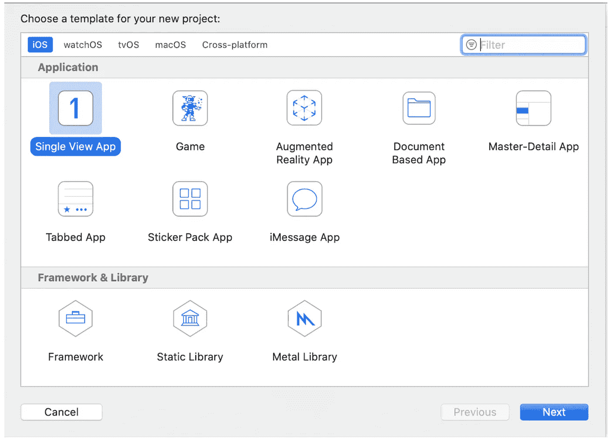

# 通过 5 个步骤将触控 ID/ Face ID 认证集成到您的 iOS 应用程序中

> 原文：<https://levelup.gitconnected.com/xcode-how-to-integrate-touch-id-face-id-authentication-to-your-app-in-5-steps-6700cdfc1ed>

本教程概述了将触控 ID 和 Face ID 添加到您的 iOS 应用程序的步骤。

## **第一步:创建一个新项目**

打开 XCode 和 single view 应用程序，将产品名称命名为“TouchIDProtectedApp ”,然后选择要保存应用程序的位置。

在 Xcode 中创建单视图应用程序

## **第二步:添加 UI 元素**

*   点击下面截图右下角的按钮，这将允许你添加一个导航控制器到应用程序的主视图控制器。
*   从 UI 元素列表中添加一个按钮对象到情节提要，并将按钮文本更改为“单击此处进行身份验证”。
*   如果需要，编辑按钮属性(可选)。

创建一个简单的用户界面来整合触控 ID/Face ID

## **第三步:创建按钮动作并添加属性**

*   如下面的屏幕截图所示，将步骤 2 中创建的按钮的动作添加到 viewController 中(确保连接是 action)。
*   使用名称:“验证”
*   选择事件为“触摸内部”

**添加一个带动作的按钮**

一旦您按下按钮，它将调用“viewController”类中的方法“verification ”,并执行用于本地用户身份验证细节的代码。

## **步骤 4:认证过程**

*   将 LocalAuthentication 导入到项目 viewController 中
*   将下面截图中的代码片段复制到验证方法中。

验证方法的代码片段

*LocalAuthentication* 框架使我们能够通过生物特征向用户请求身份验证。苹果没有针对 touch ID 和 Face ID 的单独方法。该应用程序将根据您使用的设备而有所不同。例如，iPhone 8 Plus 使用触控 ID，而 iPhone X 使用 Face ID。

evaluatePolicy 方法将检测设备上的生物识别支持，并提供正确的身份验证功能。这些功能通常由数据敏感型应用程序使用，如银行交易、个人文件等。

## **步骤 5:在 iOS 模拟器上运行(使用 TouchID)**

现在，您可以从模拟器中运行该项目，并从功能菜单中注册触控 ID 内部的生物识别。

**注册** —启用模拟器的生物认证

**匹配触摸** —用户认证成功(返回真)

**非匹配触摸** —用户认证失败(返回假)

*   单击按钮“单击此处进行身份验证”(将出现如下所示的窗口)

具有触控 ID 认证窗口

*   进入功能-> 触控 ID ->匹配 Touch ID 方法将返回真并进入应用程序

## **第六步:在 iOS 模拟器上运行(和 FaceID 一起)**

*   与 TouchID 相比，我们需要在 FaceID 身份验证中添加另一个属性。为此，向 info.plist 添加一个新行，关键字为“NSFaceIDUsageDescription ”,值为<reason for="" using="" the="" suthentication=""></reason>

在 info.plist 中添加 NSFaceIDUsageDescription

*   现在从模拟器中运行该项目，并从功能菜单中注册 Face ID 内部的生物特征。

**注册** —启用模拟器的生物认证

**匹配人脸** —用户认证成功(返回真)

**面部不匹配** —用户认证失败(返回假)

*   单击按钮“单击此处进行身份验证”(将出现如下所示的窗口)

具有 Face ID 认证窗口

*   进入功能-> Face ID ->匹配 Face ID 方法将返回真并进入应用程序。