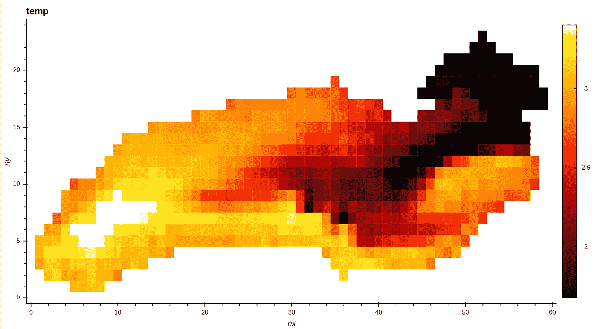
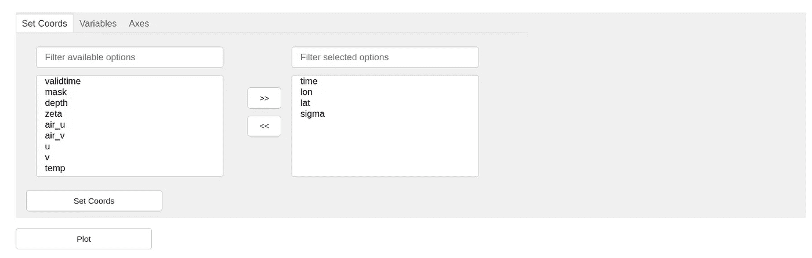
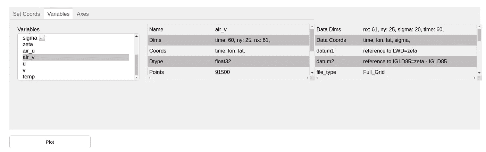
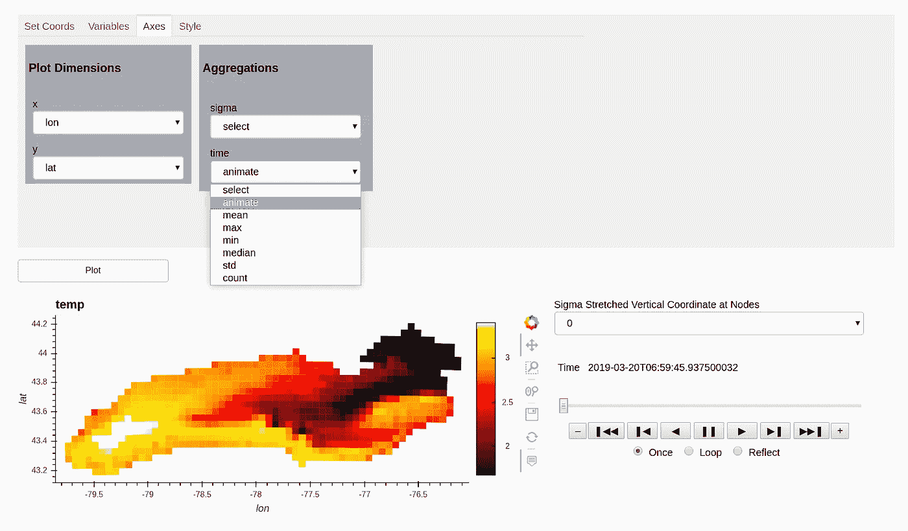
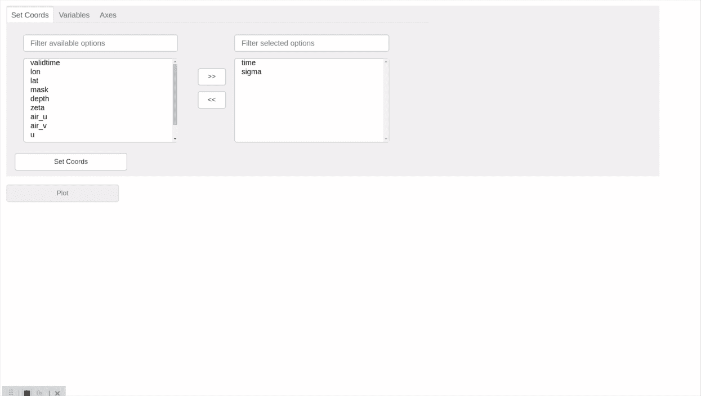

# XrViz:一个用于 Xarrays 的交互式可视化界面

> 原文：<https://levelup.gitconnected.com/xrviz-an-interactive-visualisation-interface-for-xarrays-9ecf8e325aa9>



安大略湖

XrViz 是一个交互式浏览器可视化界面，支持 Python 生态系统的全部功能。它允许使用工具的[入口](https://intake.readthedocs.io/en/latest/)、 [Xarray](http://xarray.pydata.org/en/stable/) 和 [PyViz](https://pyviz.org/) (现在的 [HoloViz](https://holoviz.org/) )集合在浏览器中控制数据点选择、大规模渲染、数据显示、自定义交互和选择用于绘图的字段。它有望为地球科学和其他研究人员节省大量时间，因为他们可以直接专注于可视化数据分析和研究，而不是编写自定义代码来探索数据。

[这里的](https://github.com/intake/xrviz)是项目仓库。

## 截至目前，它有 3 个面板:
1。设置坐标



该面板允许用户设置/重置坐标。

## 2.变量面板



该面板允许用户选择一个用于绘图的变量，并查看其特性或属性。

## 3.轴选择面板



该面板允许用户选择沿其创建绘图的轴。它还允许选择要应用于其余维度的聚合。如果不需要应用任何聚合，可以为维度创建一个选择器或动画小部件。

## 即将推出的功能

以下是一些即将推出的功能。[样式面板](https://github.com/intake/xrviz/pull/13)
2。[投影面板](https://github.com/intake/xrviz/pull/14)3
。[系列提取特征](https://github.com/intake/intake-gsoc-gui/issues/24)

## 优势

1.  这个接口是用 Python 构建的，Python 已经成为科学界最流行的编程语言之一。因此，研究人员可以很容易地扩展这个接口。
2.  它是开源开发的，所以任何人都可以分享他们的想法，对代码做出贡献或要求新的功能。开源环境也将确保随着社区使用它，界面不断变得更好、更强、更好地测试。
3.  它将有能力处理存储在云上的大规模数据集和数据。并行计算和内存管理可以通过与像 [Dask](https://dask.org/) 这样的工具结合使用来处理。
4.  与其他此类工具相比，更好的用户界面和更多的功能( [Ncview](http://meteora.ucsd.edu/~pierce/ncview_home_page.html) 、 [Panoply](https://www.giss.nasa.gov/tools/panoply/) 、 [Godiva](https://www.unidata.ucar.edu/software/thredds/current/tds/reference/GodivaUsersGuide.html) )。
5.  它可以很容易地扩展到特定领域的功能，例如天文学或海洋学。

## 仪表盘

要使用界面，请通过以下方式使用 pip 安装 Xrviz:

```
pip install git+https://github.com/intake/xrviz.git
```

或通过以下方式与 conda 一起使用:

```
conda install -c conda-forge xrviz
pip install git+[https://github.com/intake/xrviz](https://github.com/intake/xrviz) --no-deps
```

然后运行`python -c "import xrviz; xrviz.example()"`或以下脚本:

界面看起来是这样的:



XrViz 接口

我正在与成员组织[美国地质调查局](https://www.usgs.gov/)下的[地球科学信息伙伴(ESIP)](https://www.esipfed.org/) 的[谷歌代码之夏](https://summerofcode.withgoogle.com/projects/#4825250494152704)中从事这个项目。我这个项目的导师是伍兹霍尔美国地质调查局的海洋学家里奇·西格内尔和阿纳康达公司的数据科学家兼软件工程师马丁·杜兰特。

## 讨论

请继续关注[周进度报告](https://github.com/intake/intake-gsoc-gui/blob/master/Report%20for%20GSOC%202019.md)。如果您对这个项目有任何想法或问题，请随时在我们的 [Gitter 频道](https://gitter.im/ESIP_GUI/community)讨论。