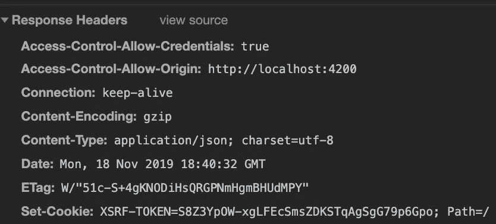
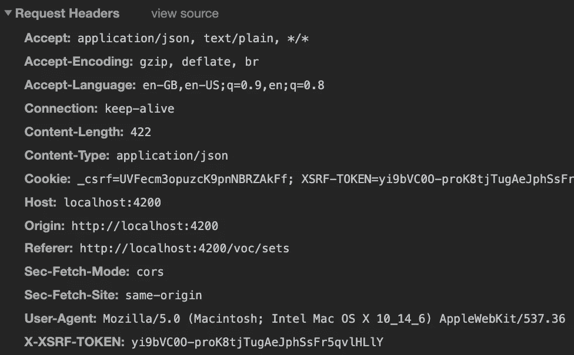

# 带角度和快速的 XSRF 保护

> 原文：<https://levelup.gitconnected.com/xsrf-protection-with-angular-and-express-d084c6e57da5>


[Icons8 团队](https://unsplash.com/@icons8?utm_source=unsplash&utm_medium=referral&utm_content=creditCopyText)在 [Unsplash](https://unsplash.com/s/photos/security-computer?utm_source=unsplash&utm_medium=referral&utm_content=creditCopyText) 上的照片

作为一名 web 开发人员，保护应用程序的安全性是您工作的一部分。最常见的漏洞之一是 XSS，但是 XSRF 也代表了一个您不应该低估的风险。幸运的是，如果您正在构建 Angular/Express 应用程序，保护您的用户是非常容易的。

# XSRF 是什么？

XSRF(或 CSRF，因此有时读作“*海上冲浪*”)代表跨站请求伪造。

假设我想在社交媒体平台上查看我丈夫的聊天记录[*www.unsafe.com*](http://www.unsafe.com.)*。*通过打开网络选项卡浏览网站，我注意到为了更改密码，[*www.unsafe.com*](http://www.unsafe.com)向 url 发出一个 GET 请求*www.unsafe.com/changePassword?password=123456.*(发送一个 GET 请求很奇怪，但无论如何我们可以从技术上找到一种方法使它与另一种请求类型一起工作。)

突然发出这种请求通常是行不通的。后端应该会收到一些带有请求的 cookies，用于识别。如果我丈夫登录了他的账户，如果我能让他点击链接*www.unsafe.com/changePassword?password=123456*(例如，通过给他发电子邮件向他保证这是一张滑稽的猫图片)，所有的 cookies 都会出现，服务器会接受请求。从服务器端来看，没有办法知道请求是否合法。它是由正确的客户端使用正确的 cookies 发出的。密码会被更改，我就能进入他的账户。

这不是那么容易利用，因为你必须找到可复制的链接，真正的损害，你需要一点运气，因为受害者必须登录到目标网站。现在，如果你的目标是一个真正的主流社交媒体平台，或者如果你设法获得了一个给定网站的所有用户的电子邮件地址…大奖！

# 如何保护自己的网站？

您可能会发现的一个常见建议是只使用 POST 请求。虽然这使得它更难被利用，但仍然有可能诱骗受害者发出 POST 请求。

我们必须找到一种方法，让服务器理解一个请求何时合法，何时不合法，即使它有所有正确的 cookies 和正确的来源。一种常见的机制，也是 Angular HttpClient 默认支持的机制，是使用 X-XSRF-TOKEN。

想法很简单:服务器不能依赖会话 cookie 或令牌 cookie，因为它们是由浏览器自动设置的。但是，如果前端使用 JavaScript，它可以为每个请求设置一个**头**。

您的 JavaScript 代码必须在浏览器选项卡中运行，请求从该选项卡发出，以便设置这个头。来自点击电子邮件链接的请求将没有正确的标题。如果您的服务器需要这个头并拒绝所有不提供它的请求，那么您就可以免受这种攻击。

在这个例子中，我的令牌是硬编码的*【令牌】*，这当然不是它的工作方式。当前端向服务器发送第一个请求时，服务器为其响应设置一个 XSRF-TOKEN cookie。JavaScript 代码截取该令牌并将其保存在某个地方。只有运行在同一原点的 JavaScript 才能访问这个令牌。这个令牌每次都会改变。当发送任何新请求时，JavaScript 代码将在**头**中设置一个 X-XSRF-TOKEN。如果头部丢失，服务器知道请求不是由它的客户机发送的，可能是不合法的。

# Express 和 Angular 示例

## 服务器端:发送 XSRF-令牌

保护机制的第一步发生在服务器上。在这个例子中，我使用了 Express 框架和 TypeScript。

每个 XSRF-TOKEN 都必须是唯一且不可预测的。有一个很好的库为我们处理大部分工作: [csurf](https://www.npmjs.com/package/csurf)

您可以像安装任何 npm 软件包一样安装它

```
npm i csurf — save
```

并安装它的类型包，就像我们使用 TypeScript 一样(如果没有，请跳过它)。

```
npm i @types/csurf — save-dev
```

根据文档，我们还需要 [cookie-parser](https://www.npmjs.com/package/cookie-parser) ，您可以用同样的方式安装。现在，我们可以在每个响应上设置 XSRF-TOKEN cookie:

我们根据库文档启动 XSRF 令牌创建和验证中间件，有两个选项:

*   cookie: true，将令牌秘密存储在 cookie 中(默认情况下，它存储在用户会话中，但在本例中我们没有会话)
*   ignoreMethods: ['GET '，' HEAD '，' OPTIONS']。我们只需要检查令牌中可以改变数据的方法，在我们的例子中是 POST、PUT 和 DELETE。如果您有可能改变数据的 GET 请求，比如我们前面的 *changePassword* 请求，您不应该忽略 GET。但是在这种情况下，您也应该考虑不使用 GET。

我们可以看到，XSRF-TOKEN 是作为 cookie 发送的。



## 客户端:拦截 cookie 并为每个请求设置令牌

在客户端，我们需要获取该令牌，并将其添加到任何新请求的头中。

这就是 Angular 的用武之地:它为我们做到了。如果您检查下一个请求的头，您将找到您的 X-XSRF-TOKEN。



# 几个先决条件

Angular 为我们做了这项工作，但它的工作有几个先决条件:

*   XSRF-TOKEN cookie 必须是 httpOnly: false。有道理，cookie 需要由 JavaScript 访问。设置 cookie 时，您必须在后端设置此选项。
*   前端和后端必须有相同的来源。如果您的前端和后端运行在不同的端口上，您可以使用代理将您的请求重定向到后端:
*   创建一个 proxy.conf.json 文件:

*   在您的 HTTP 服务中，将路径*[*HTTP://localhost:8080/API*](http://localhost:8080/api)替换为 */api。*代理将正确地重定向它们。*
*   *在 package.json 中，将启动脚本更改为:*

```
*"start": "ng serve --proxy-config proxy.conf.json"*
```

*Angular 我们负责设置头中的 XSRF 令牌，保护您的应用程序免受 XSRF 攻击，只需要您在后端实现令牌生成和请求验证部分。库，比如我们在例子中使用的库，使得使用 Express 变得非常容易，但是我假设所有类型的后端都有类似的库。*

*我希望这篇文章对你有用。*