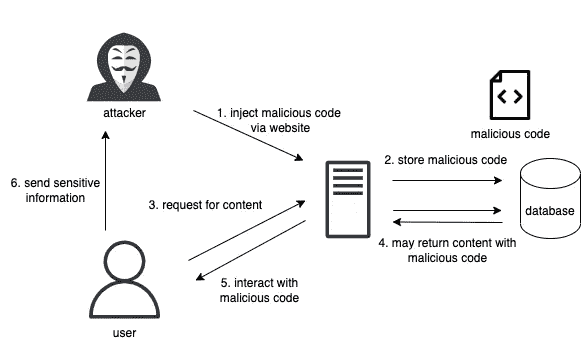
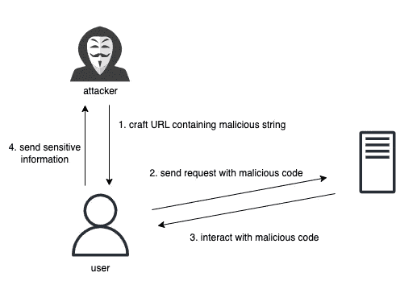

# XSS——作为开发人员，您必须知道的最大网络安全威胁

> 原文：<https://levelup.gitconnected.com/xss-top-cybersecurity-threat-you-must-know-as-a-developer-c73a71697bd8>

## 了解它是什么，它是如何工作的，以及如何预防它


[GuerrillaBuzz 区块链公关机构](https://unsplash.com/@guerrillabuzz_blockchain_pr_agency?utm_source=medium&utm_medium=referral)在 [Unsplash](https://unsplash.com?utm_source=medium&utm_medium=referral) 上的照片

想象一下，你喜欢去一家日本餐馆，因为那里的食物很美味，而且你信任那家餐馆。然而，今天厨房的锁坏了，一个可疑的人溜进厨房，用腐烂的食物替换了所有新鲜的食材。厨师用不新鲜的食物准备和烹饪，而没有注意到它不新鲜。最终，你会在吃了你喜欢的餐馆的食物后生病。这就是**跨站脚本**攻击。


照片由 [Unsplash](https://unsplash.com?utm_source=medium&utm_medium=referral) 上的[凯尔头像](https://unsplash.com/@kyleunderscorehead?utm_source=medium&utm_medium=referral)拍摄

> 你最喜欢的餐厅:**网站**
> 
> 成分: **HTML 和 Javascript**
> 
> 可疑男子:**黑客**
> 
> 腐烂的食物:**恶意代码**

# 什么是 XSS？

**XSS(跨站脚本)**是一个网络安全漏洞。它一直是 OWASP 中列出的十大 web 安全风险之一。

[](https://owasp.org/www-project-top-ten/) [## OWASP 十大

### OWASP Top 10 是开发人员和 web 应用程序安全性的标准认知文档。它代表了广泛的…

owasp.org](https://owasp.org/www-project-top-ten/) 

> XSS 漏洞使得攻击者能够将恶意的客户端脚本注入到其他用户浏览的可信网页中，给用户带来严重的意外麻烦。

简而言之，只要开发人员接受用户输入并将其呈现在页面上而没有对输入进行净化，就会出现这个问题。

# XSS 的类型

## 存储的 XSS



存储的 XSS

*   注入的脚本永久存储在数据库/消息论坛/访问者日志/评论字段中
*   然后，当受害者请求存储的信息时，它会从服务器检索恶意脚本
*   执行恶意脚本，获取用户的敏感数据，并将其发送回攻击者

## 反映了 XSS



反映了 XSS

*   从 web 服务器反射，例如错误消息、搜索结果或任何其他响应，包括作为请求的一部分发送到服务器的部分或全部输入
*   隐藏 URL 中的恶意脚本

## 基于 DOM 的 XSS

当您直接改变 DOM 时，攻击者很容易向它注入包含恶意 JavaScript 的数据。

例如:

*   **innerHTML**

由于`innerHTML`呈现完整的标记，而不仅仅是文本，恶意代码会被注入到你的站点中，然后被执行。

```
target.**innerHTML** = "";
```

*   **Ruby on Rails**

`html_safe()`将提供的字符串标记为“HTML 呈现安全”这绕过了 HTML 转义，并可能造成 XSS 漏洞。

```
html = "<div>#{name}</div>".**html_safe**
```

*   **反应过来**反应过来`**dangerouslySetInnerHTML**`

您可以直接在元素上使用该属性，而不是使用选择器来获取 HTML 元素，然后设置`innerHTML`。

然而，如果从第三方来源获取数据或由用户提交数据，那么 XSS 攻击就很危险。

```
return (<p **dangerouslySetInnerHTML**={{__html: review}}></p>);
```

# 为什么 XSS 不是那么容易避开的？

## 难题

为了避免 XSS，你第一个想到的可能是**禁止** `**<script>**` **标记**。

然而，在一些 html 标签中，如``或`<svg>`，我们仍然有**事件处理程序**。例如，`<svg onload="alert()" />`

那如果我们过滤掉所有的 html 标签呢？在现实世界的应用中，我们可能需要在某些情况下使用 html 标签。例如:

*   Gmail 使用 HTML 发送电子邮件
*   在线富文本/降价编辑器

# 如何预防 XSS？

事实上，你可以做很多事情来预防 XSS。

一种方法是用`**textContent**`代替`innerHTML`。`textContent`返回包含所有元素样式的原始内容，但不包括 HTML 元素标签。它会自动对 HTML 实体进行编码。

另一种方法是使用 XSS 消毒剂。比如 **DOMPurify** 。

[](https://github.com/cure53/DOMPurify) [## GitHub-cure 53/DOM purify:DOM purify——一个 DOM 专用的、超级快速的、超级宽容的 XSS 杀毒软件，用于…

### DOMPurify -一个只支持 DOM 的，超快的，超级宽容的 XSS 杀毒软件，支持 HTML，MathML 和 SVG。DOMPurify 与一个安全的…

github.com](https://github.com/cure53/DOMPurify) 

关于 XSS 预防的更多信息，请查看 OWASP XSS 预防备忘单:

 [## 跨站点脚本防护- OWASP 备忘单系列

### 该备忘单提供了防止 XSS 漏洞的指导。跨站点脚本(XSS)是一个误称。这个名字…

cheatsheetseries.owasp.org](https://cheatsheetseries.owasp.org/cheatsheets/Cross_Site_Scripting_Prevention_Cheat_Sheet.html) 

# 练习时间

学东西的最好方法总是把手弄脏。谷歌 XSS 游戏是谷歌提供的练习 XSS 的训练平台。它包括 6 个级别，在每一个级别，你必须执行一个 JavaScript 警告，以推进到下一个级别。

 [## XSS 游戏

### 跨站点脚本(XSS)错误是 Web 应用程序中最常见和最危险的漏洞类型之一…

xss-game.appspot.com](https://xss-game.appspot.com/) 

下面是每个级别的解决方案:

## 1 级你好，XSS 世界

由于 url param `query`的值被直接添加到正文中，我们可以简单地将 javascript 代码放在 param `query`中。

*   网址`<https://xss-game.appspot.com/level1/frame?query=**<script>alert(1)</script>**`

## 二级坚持是关键

这是存储在 XSS，因为文章不通过任何过滤器，html 标签直接存储在数据库中。

*   ``或者
*   ``
*   带有事件处理程序的 img 标签可以执行 javascript

## 3 级下沉的感觉

检查完代码后，我们可以在`num`处注入我们的有效载荷。

*   网址`[https://xss-game.appspot.com/level3/frame#1'](https://xss-game.appspot.com/level3/frame#1') onerror="alert()"'`

## 第四级上下文关系重大

在*timer.html*，``。

*   网址`[https://xss-game.appspot.com/level4/frame?time=1000'](https://xss-game.appspot.com/level3/frame#1'))%3B alert('`
*   )%3B 意思是；

## 5 级破坏协议

由于点击“下一步> >”将触发有效载荷，我们可以将代码添加到参数`next`中。

*   网址`[https://xss-game.appspot.com/level5/frame/signup?next](https://xss-game.appspot.com/level3/frame#1')=javascript:alert()`

## 跟随兔子

检查完代码后，我们可以加载外部 javascript 文件，但不能从`http`或`https` url 加载。我们可以试试数据 URL。

[](https://developer.mozilla.org/en-US/docs/Web/HTTP/Basics_of_HTTP/Data_URLs) [## 数据 URL-HTTP | MDN

### 本节描述创建和使用数据 URL 时经常出现的问题。数据:文本/html，大量文本…

developer.mozilla.org](https://developer.mozilla.org/en-US/docs/Web/HTTP/Basics_of_HTTP/Data_URLs) 

*   网址`[https://xss-game.appspot.com/level6/frame](https://xss-game.appspot.com/level3/frame#1')#data:application/javascript,alert()'`

现在，您知道了最大的网络安全威胁之一，以及如何防止您的网站出现 XSS 漏洞。

要了解更多关于我的后端学习路径，请点击这里查看我的旅程:

[](https://mattchw.medium.com/my-backend-developer-learning-journey-%E6%88%91%E7%9A%84%E5%BE%8C%E7%AB%AF%E5%AD%B8%E7%BF%92%E4%B9%8B%E6%97%85-5315fe2fefc2) [## My Backend Developer Learning Journey 我的後端學習之旅

### 毕业一年多了。拥有 2 年以上的前端和后端工作经验…

mattchw.medium.com](https://mattchw.medium.com/my-backend-developer-learning-journey-%E6%88%91%E7%9A%84%E5%BE%8C%E7%AB%AF%E5%AD%B8%E7%BF%92%E4%B9%8B%E6%97%85-5315fe2fefc2)