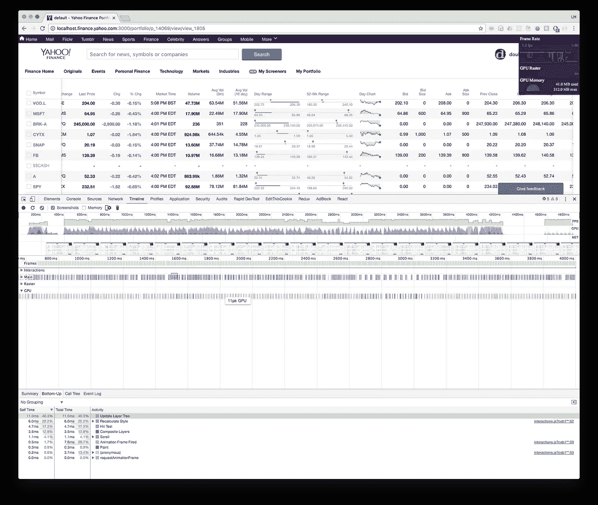
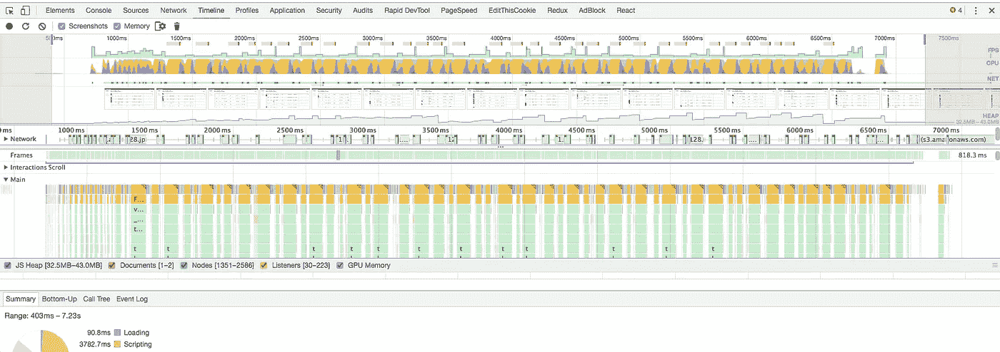

# Yahoo Finance Portfolio:在 React 中呈现高性能财务数据表

> 原文：<https://levelup.gitconnected.com/yahoo-finance-portfolio-rendering-high-performance-financial-data-table-in-react-634fe2d6a381>



雅虎金融投资组合简介

每秒 60 帧(fps)是任何前端渲染基础设施的核心。实现高帧率的关键在于主线程上高性能渲染功能和工作负载编排的结合。

呈现类似 Excel 的大型表格并不是一个新问题。然而，不断变化的前端浏览器和功能允许我们探索新的途径，用不同的权衡来解决这个问题。我们已经彻底探索了脸书和谷歌的现有解决方案，但无法确定我们的使用案例。因此，我们决定建立一个内部解决方案，并建立一套可以在整个雅虎通用的最佳实践。

# 背景

Portfolio 是 Finance 中的一个实用工具，它允许用户创建一个由一组定制的数据列和一系列用户指定的符号组成的电子表格。我们通过识别 99%的使用模式开始着手解决这个问题。这使我们处于大约 20 列(4000–5000 个单元格)的 200–250 个分笔成交点的范围内。

一般用户反馈还要求支持整个表格的复制/粘贴和打印，这使得传统的单元格重用/踩踏操作过于复杂。最重要的是，作为新体验的一部分，第一列(符号列)和标题行在 viewport 中是固定的，这给设计复合层以尽量减少使用期间的重新布局带来了很大的挑战。

# 现有解决方案

最流行的开源解决方案是[脸书固定数据表](https://github.com/facebook/fixed-data-table)，专有的是 Google Sheets。

脸书数据表利用了，这是一种常见的做法，它呈现一组固定的行，并在用户滚动时将看不见的前排移动到后排。
由于并非所有的单元格都被渲染，这使得用户无法复制/粘贴/打印整个表格。此外，这种解决方案的帧速率较低，在严重回流的情况下徘徊在 20–30 fps 左右。



固定数据表性能配置文件

Google solution 使用了相同的方法，但是由于使用 canvas 作为主干，它具有更好的性能。Google Sheets 确实在画布表的顶部放置了一个元素表，主要用于单元格选择和用户交互。这个解决方案不是开源的，实现起来非常复杂。其在持续流式数据集下的性能也未得到验证。

# 我们的一般方法

在高层次上，我们确定了从结构到微操作的关键优化:

*   **基准测试/分析基础设施**:没有一个稳定的基准测试/分析基础设施，我们就无法安全前进。Chrome 等浏览器提供了一套很好的分析工具，从 CPU/内存使用情况到 UI 重组所用时间的图表。
*   **一般布局**:由于粘滞的行/列行为，这些元素需要特殊处理，这不仅影响标记结构，也影响样式。
*   **单元格渲染优化**:最后，它归结为对整个表格影响最大的单个单元格渲染性能的组合。我们花了大量时间分别调整每种细胞类型。

# 基准/分析基础设施

我们依赖几个关键绩效指标(KPI ):

*   **CPU 时间**:这可以通过在受控环境下反复渲染某一类型的单元格来衡量。这种实践也被称为微基准测试。我们利用 [benchmark.js](https://benchmarkjs.com/) 和 React 字符串呈现作为代理来收集这些信息。
*   **CPU 使用量**:流式票数据点需要重新渲染某些单元格。Chrome DevTool profiling 与任务管理器的结合为我们提供了这个数字的近似值。
*   **内存使用**:由于数据集是实时变化的，我们希望确保这不会影响浏览器中的 GC 周期，否则会导致线程暂停。Chrome DevTool 也提供了这一功能。
*   **布局/排版时间**:重新计算布局所花费的时间，这本身就很昂贵。这将对帧速率产生负面影响。chrome dev tool flame graph profiling 为我们提供了花费在 UI 布局计算上的时间明细。

# 总平面

由于标题/第一列的粘性，我们开始将这些元素克隆到一个单独的层中，并将它们放在表格的顶部。

这种方法的优点是可以控制布局和样式的重新计算。这使我们能够根据 CPU 可用性来专门限制/批处理/拆分这些操作。

缺点是，由于其灵活的宽度特性和同步滚动位置，我们必须花费额外的 CPU 周期将这些元素的尺寸与核心表同步。

然而，这可以通过缩小可能影响维度更改的事件集来缓解。这些是`resize`、`data column change`事件、`ticker change`事件和`navigation`事件。通过了解这些何时发生，这使我们能够控制何时最好地重新计算这些布局并最小化成本。

然而，同步位置是极其昂贵的，因为去抖动/节流它们将导致无序的毛刺，并且实时地进行它们会影响滚动性能。最后，我们决定使用`position: sticky`和 [polyfill](https://github.com/wilddeer/stickyfill) 只分离出标题行，并保留第一列作为核心表的自然流程的一部分。之后，我们`preventDefault`表格的水平滚动行为，并手动计算滚动位置和滚动速度，以确保列总是同步的。

# 单元渲染优化

## 普通单元格

我们从当前单元渲染 CPU 时间的基线开始:

```
Row w/ 62 cells x 190 ops/sec ±3.06% (73 runs sampled)
CPU time for Row w/ 62 cells: 5.253441030475995ms
```

我们决定尝试通过将`Component`改为功能`StatelessComponent`来消除 React 开销，以最小化某些单元类型上的`createElement`开销。假设这些单元类型在流式传输期间具有非常高的值改变概率，因此使得差异检查不相关。

```
Row w/ 62 cells x 344 ops/sec ±3.72% (72 runs sampled)
CPU time for Row w/ 62 cells: 2.908777648130453ms
```

## 数字单元格

由于我们的大多数单元格类型都是需要国际化格式的数字，但设置非常相似，我们决定`memoize`通过将构造函数选项序列化为一个键来实现格式化机制。这极大地减少了重构格式化程序的需要。

```
Row w/ 62 cells x 562 ops/sec ±2.52% (80 runs sampled)
CPU time for Row w/ 62 cells: 1.7808359339126558ms
```

## 图形单元格

我们的一些单元格是自定义图形(如图表和数字范围)。这些最初是使用常规 DOM 元素和 SVG 的组合呈现的。然而，尽管 SVG 是灵活的和基于向量的，但它需要不同的组合层。这在滚动/调整大小/流动期间不断地被重新计算。我们决定将它们重写为基于`canvas`的实现，以充分利用光栅化。

**有色流式细胞**

彩色流动池是特殊的流动池，根据变化是负还是正而“闪烁”(`background-color`变化)成红色/绿色。虽然这可能很简单，`background-color`不容易被 [GPU 加速的](https://www.html5rocks.com/en/tutorials/speed/high-performance-animations/)动画化，但是`opacity`却很容易。

我们决定探索一种“三明治”的方法，为这个单元格创建 3 个单独的层，1 层用于绿色，1 层用于红色，1 层用于实际内容。这两个背景层是使用`pseudo`元素`:before`和`:after`创建的，并基于 3 `keyframes`制作动画以模仿类似`bezier-curve`的动画。`background-color`也固定为红色/绿色，而`opacity`正在被激活。关键帧设置如下所示:

```
[@keyframes](http://twitter.com/keyframes) trendAnimUp1 {
  25% {
    opacity: 1;
    display: block;
  }
  75% {
    opacity: 1;
  }
  100% {
    opacity: 0;
    display: none;
  }
}
```

这里的关键技术是:

*   **操纵显示属性**:创建额外层的缺点是合成它们的成本。通过将`display`改为`none`，我们实质上在这些层完成动画制作后移除了它们，从而降低了复杂度。
*   **旋转动画**:由于关键帧不能轻易暂停/恢复/重置，我们创建重复的关键帧，并使用`class`在它们之间切换，有效地触发关键帧重置。

使用这些技术，我们能够将**32.04 毫秒** CPU 时间转换为**9.72 毫秒** (-68%) CPU 时间&**1.2 毫秒** GPU 时间。

# 结果和主要收获

我们为大约 2000 行的货币渲染一个持续流动的表格的最终 fps 大约是 **54fps** 。在这个过程中，我们还发现了一些重要的经验:

*   **移除 React 样式机制，支持纯 CSS** :渲染样式和图标，React 在两个 CPU & GPU 时间中引入开销，而不是将 SVG 内联到 CSS 中。
*   **栅格化极大地帮助了 FPS**:通过从基于矢量的 SVG 切换到栅格化的画布，我们能够从我们的 flamegraph 中移除一大块布局构图。SVG 中的动画也非常昂贵。
*   **针对 GPU 加速进行优化**:在我们的彩色值用例中，通过将繁重的 UI 任务从 CPU 转移到多个 CPU & GPU，我们能够显著减少主线程中的 CPU 时间。
*   尽可能多的记忆:通过在我们的需求范围内尽可能多的记忆，我们能够重用昂贵的国际化格式化程序。