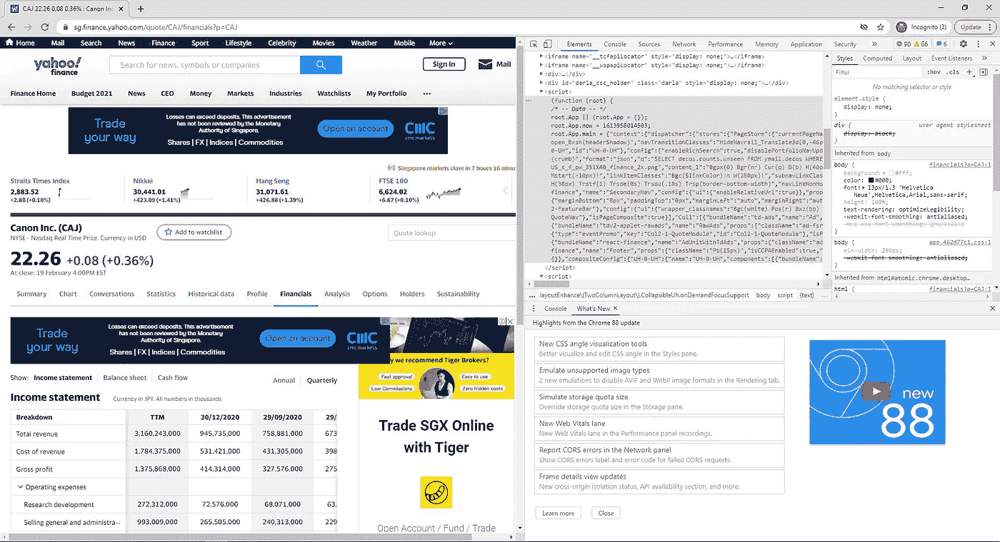
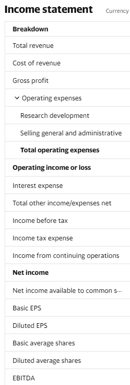
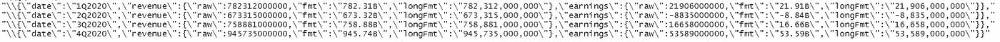

# 雅虎财经网页抓取与 R

> 原文：<https://levelup.gitconnected.com/yahoo-finance-web-scraping-with-r-5584d226c3a6>

公司的财务健康围绕三个核心要素:(1)运转良好的日常系统和流程，(2)弹性(抵御冲击的能力)，以及(3)追求长期目标。公司的财务表现也反映了管理的有效性。Yahoo Finance 是公开交易股票财务数据的一个很好的来源，我有兴趣收集对一长串公司财务健康状况的理解。


马库斯·斯皮斯克在 [Unsplash](https://unsplash.com?utm_source=medium&utm_medium=referral) 上的照片

很多网站都是动态创建的。这可以通过加载内容或数据的方式来实现，通常使用 JavaScript / react.js 来完成。或者，根据思想流派，可以动态创建网站的模板或架构，而不是使用更传统的预定义标签嵌套。Yahoo Finance 就是这样一个动态创建的网站，其中*类*和 [*data-reactid*](https://www.pluralsight.com/guides/introduction-to-the-data-reactid-attribute-in-html) 的值是动态生成的属性，数据通过 json 加载。

Python 有 BeautifulSoup 和 Selenium 包来帮助 web 抓取。在这篇文章中，我们将看看 R 的网络抓取，特别是雅虎财经网站。数据是通过 react.js 填充的，因此我们可以从 root.app.main 组件的页面源中获取 json 格式的数据。让我们开始设置吧！



root.app.main 组件包含页面的数据。

# 设置

除了一些常规使用的 R 库，你还需要加载一些库，特别是下面 4 个处理 HTML 读取和解析的库:

1.  xml2 —用于读取 HTML 或 xml
2.  XML —用于解析 XML 或 HTML 文件或字符串
3.  rvest —用于提取 HTML 文档的节点和片段，包括 CSS 选择器
4.  httr —用于处理 http 请求— GET()、PUT()、POST()、PATCH()、HEAD()和 DELETE()

```
library(data.table)
library(tidyr)
library(tidyverse)
library(XML)
library(xml2)
library(rvest)
library(httr)
```

# 我们要刮什么？

雅虎财经网站上的公司财务可以按年度或季度报告。无论哪种方式，我们都可以从大量的指标中提取数据。这些指标如下所示:



出于我的目的，我对每季度报告的以下指标感兴趣:

*   总收入
*   收益
*   收入成本
*   毛利

# 密码

首先，我们必须阅读 HTML 脚本，并开始解析网站。

```
url <- paste0('https://finance.yahoo.com/quote/', symbol, '/financials?p=', symbol)
html_M <- read_html(url) %>% html_node('body') %>% html_text() %>% toString()
```

我想将所有股票的财务数据标准化为美元，以便于比较。因此，提取报告财务所用的货币非常重要。报告货币以下列方式通过 root.app.main 组件传递:*，\ " financial currency \ ":\ " JPY \ " }*，。下面是我用来提取和剥离“***【JPY】****”货币代码字符串的脚本。*稍后，我将使用货币兑换率，将收入数字转换为美元。

```
fin_cur <- sub(".*\"financialCurrency\":*(.*?) *[\n|\r\n|\r]{2}", "\\1", html_M)
fin_cur <- head(stringr::str_match_all(fin_cur, "(.*?)\\}")[[1]][, 2],1)
fin_cur=gsub("\"", "", fin_cur, fixed=T)
```

## 季度总收入和收益

我们希望能够提取季度总收入和收益数据，并将其保存为可用的格式。为此，我们需要提取季度数据，将其解析为可读的格式，然后迭代地获取数据和原始数据。我们通过下面的代码片段来实现。在第 5 行，在下面的代码片段中，splitQ 变量由屏幕截图中显示的输出组成；因此，我们需要使用第 6 到 18 行来提取总收入和日期的原始数据。我们也可以使用类似的代码来提取季度收益。

```
Q_results <- sub(".*\"quarterly\":*(.*?) *[\n|\r\n|\r]{2}", "\\1", html_M)
Q_results <- head(stringr::str_match_all(Q_results, "\\[(.*?)\\]")[[1]][, 2],1)
splitQ <- str_split(Q_results, "\\{\"date\":")
splitQ <- splitQ[[1]]
splitQ<- paste("\\{\"date\":", splitQ, sep="")if(length(splitQ)>0){
   tot_rev_df <- data.frame(curr = fin_cur,
      key=str_extract(splitQ, "\"date\":\"*(.*?) *\""),
      value=str_extract(splitQ, "\"revenue\":\\{\"raw\":*(.*?) *,"))
   tot_rev_df <- tot_rev_df[complete.cases(tot_rev_df), ]
   tot_rev_df <- data.frame(lapply(tot_rev_df, as.character), stringsAsFactors=FALSE)
   tot_rev_df <- tot_rev_df %>%
      separate(key, c("first", "key"), sep=":") %>% 
      select(-first)
   tot_rev_df <- tot_rev_df %>%
      separate(value, c("first", "second", "value"), sep=":") %>%
      select(-first, -second)
   tot_rev_df <- tot_rev_df %>%
      mutate(key=gsub("\"", "", key, fixed=T),
         value=gsub(",", "", value, fixed=T))
}
```



splitQ 中捕获的结果的屏幕截图

## 收入成本和毛利

可以使用下面的代码提取属于收入成本和毛利指标的原始数据。从 ex_between 函数提取的字符向量的前半部分包含季度数据，后半部分包含年度数据。

```
cost_rev<- qdapRegex::ex_between(html_M, "\"costOfRevenue\":", "\"fmt\"")[[1]]
cost_rev <- cost_rev[1:(length(cost_rev)/2)]
cost_rev <- gsub("{\"raw\":", "", cost_rev, fixed=T)
cost_rev <- gsub(",", "", cost_rev, fixed=T)gp <- qdapRegex::ex_between(html_M, "\"grossProfit\":", "\"fmt\"")[[1]]
gp <- gp[1:(length(gp)/2)]
gp <- gsub("{\"raw\":", "", gp, fixed=T)
gp <- gsub(",", "", gp, fixed=T)
```

# 结论

*if(length(splitQ)>0){ }*的 if 条件负责捕捉股票未上市或财务报告未完成时的错误。一旦您为感兴趣的指标编译了代码片段并将结果分类到数据帧中，您就可以将脚本包装在 for 循环中，并迭代地抓取您感兴趣的不同股票。

# 额外资源

如果你对使用 Python 搜集雅虎财经感兴趣，你可以看看:

*   [https://code burst . io/how-to-scrape-Yahoo-finance-using-python-31164 aa 06468](https://codeburst.io/how-to-scrape-yahoo-finance-using-python-31164aa06468)
*   [https://towards data science . com/we B- scraping-Yahoo-finance-477 Fe 3 da a852](https://towardsdatascience.com/web-scraping-yahoo-finance-477fe3daa852)