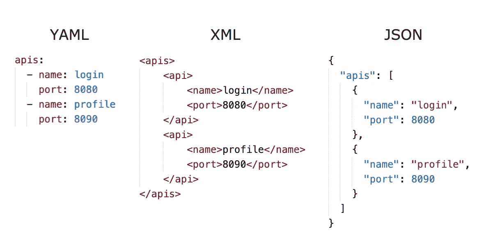

# YAML 教程:5 分钟内你需要知道的一切

> 原文：<https://levelup.gitconnected.com/yaml-tutorial-everything-you-need-to-know-in-5-mins-14f333a23ed1>

## YAML 文件入门简要指南


图片由作者创作|图标致谢: [Dryicons](https://dryicons.com/free-icons/files)

YAML 非标记语言(YAML)是一种类似 XML 和 JSON 的序列化语言。它是 JSON 的超集，主要用于配置文件。您可以创建以`.yaml`或`.yml`为文件扩展名的 YAML 文件。它是一种人类可读的文件格式，由强调缩进和行分隔的键值对组成。你可以看到 YAML 在著名工具/技术的配置文件中被广泛使用，比如 docker-compose、Kubernetes 和 Ansible 等等。

在下面的例子中，你可以看到 YAML 与 XML 和 JSON 的比较。



YAML、XML 和 JSON 文件比较(图片由作者创建)

现在，让我们开始讨论组成 YAML 文件的语法、数据类型和不同的主题。

# 键值对

键值对是 YAML 的基本构件。YAML 文档中的每个条目都是至少一个字典的成员。键主要是字符串，值可以是任何数据类型，如数字、布尔、字符串、空、数组和对象。

```
name: John
age: 25
city: LA
```

# 数字

数字是可以在 YAML 文件中用作值的标量之一。数字可以是十进制、浮点、指数、八进制和十六进制类型。只要没有用单引号或双引号将它们括起来，

```
decimal     : 10
float       : 2.5
exponential : 5.0e+12
infinity    : .inf
octal       : 0o12 
hexadecimal : 0xF
```

> **注:**在表示一些涉及时间、八进制码、十六进制码等数字的标准记法时。，请谨慎。它们可能会以你不希望的方式得到不同的解释。你可以在下面看到一些例子。

```
time  : 6:00
hexval: 0x12
octval: 0o25
```

在这里，时间被转换成分钟，所以`6:00`被解释为 360 度。`0x12`被视为十六进制代码，因此它被解释为十进制值 18。`0o25`被解释为十进制值 21。因此，如果您不打算以这种方式使用它们，请务必将它们用引号括起来。

> **注意:** `0o`代表从 YAML 1.2 规范开始的八进制值，`0`在早期版本中用于它。

# 布尔运算

类似于其他编程语言或表示法的布尔值有两种状态，一种是`true`或`false`。在 YAML 文件中，除了`true/false`，术语`yes/no`和`on/off`也被解释为布尔值，除非你用引号将它们括起来。

> **注意:**确保您按照预期表示了`yes/no`和`on/off` 值。如果它们没有用引号括起来，它们将被解释为布尔型`true/false`。

# 评论

您可以使用如下所示的`#`字符对 YAML 文件的内容进行注释。

```
# This a comment on the first.
# And this a commented second line.
```

# 用线串

在 YAML 文件中，你可以写一个不带任何引号的字符串。或者您也可以将它们包含在单引号或双引号中。根据您的喜好，您可以使用这三种方式中的任何一种。

如果您的字符串包含任何需要使用`\`转义的特殊字符，您必须用双引号将字符串括起来。这里有一个例子。

```
signature: "John Williams \nSales Executive \nXYZ Company \tLA."
```

但是，如果您需要使用一些特殊字符，如下所示。

```
:, {, }, [, ], ,, &, *, #, ?, |, -, <, >, =, !, %, @, `
```

在这种情况下，不需要对任何字符进行转义。您可以使用单引号来代替，这将解释字符串的意图。

## 单线线路

如果您出于某种原因需要在多行中编写一个字符串，但是希望解析器将其解释为单行，那么您可以这样做。

```
message: >
  this is a normal string
  which spans more than multiple lines
  but needs to be treated
  as a single line.
```

您需要使用`>`字符并将字符串内容写成如上所示的缩进块。上面解析的内容将有一个尾随的`\n`字符，如果您不想有任何尾随的换行符，您可以使用`>-`字符来代替。

## 多线

如果你想写一个跨越多行的字符串，但是需要用和写的一样的方式来解析它，你可以这样写。

```
message: |
  this is a multi-line string
  which spans across multiple lines
  and needs to be treated
  as a multi-line string.
```

`|`字符将在解析内容的末尾添加一个尾随换行符。您可以通过使用`|-`来避免在解析内容的末尾添加尾随的`\n`。

# 无效的

您可以使用`~`或`null`来表示空值，不需要用引号括起来。

```
foo: ~
bar: null
```

# 数组

在 YAML，你也可以用数组/列表的形式来表示值。您可以将项目表示为数组，如下所示。

```
teams:
  - name: Australia
    rank: 3
  - name: New Zealand
    rank: 4
  - name: England
    rank: 1
  - name: India
    rank: 2
```

在上面的例子中，我们用一个团队的名称和级别来表示一个对象数组。请确保行分隔和缩进是正确的，以便它是一个有效的文件。

数组中的每一项都用连字符(`-`)表示。所有的项目都应该在同一水平上，有相同的缩进。

而且，如果数组中有基本项而不是对象，也可以如下所示表示它们。

```
teams: [ Australia, New Zealand, England, India ]
```

# 目标

如图所示，您可以表示 YAML 的对象。

```
student:
  name: John
  age: 22
  city: NY
  college: NYU
  gpa: 3.5
```

一个对象中的所有属性都应该在同一级别上，具有相同的缩进，以便成为同一对象的一部分，并且是一个有效的 YAML 文档。

开始使用 YAML 文件时，您需要熟悉这些概念。一旦您理解了上面的主题，您就可以开始理解并为您自己想要的工具和技术配置文件。

感谢阅读，祝学习愉快！

如果你喜欢阅读这样的故事，并想支持我成为一名作家，可以考虑[注册成为一名媒体会员](https://nehalk.medium.com/membership)。一个月 5 美元，你可以无限制地阅读 Medium 上的所有故事。如果你[用我的链接](https://nehalk.medium.com/membership)注册，我会赚一小笔佣金。

[](https://nehalk.medium.com/membership) [## 通过我的推荐链接加入 Medium-Nehal Khan

### 作为一个媒体会员，你的会员费的一部分会给你阅读的作家，你可以完全接触到每一个故事…

nehalk.medium.com](https://nehalk.medium.com/membership)