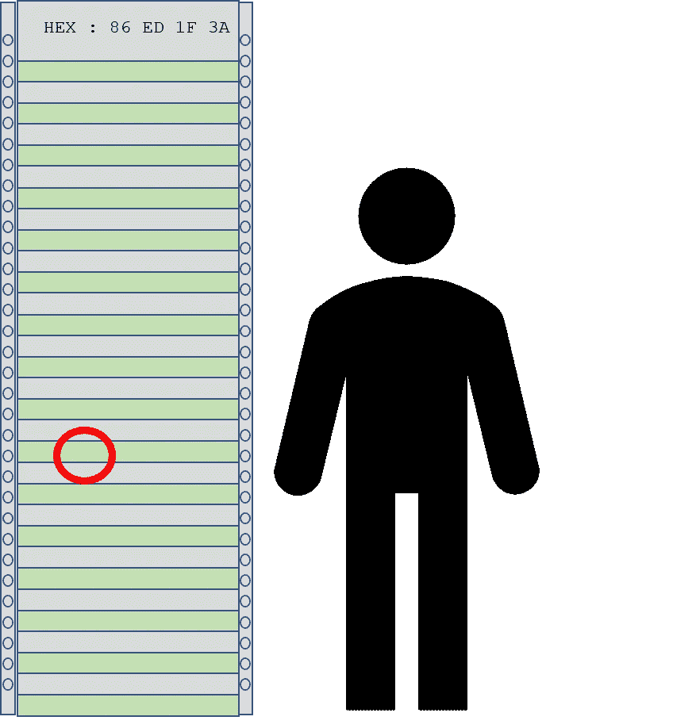
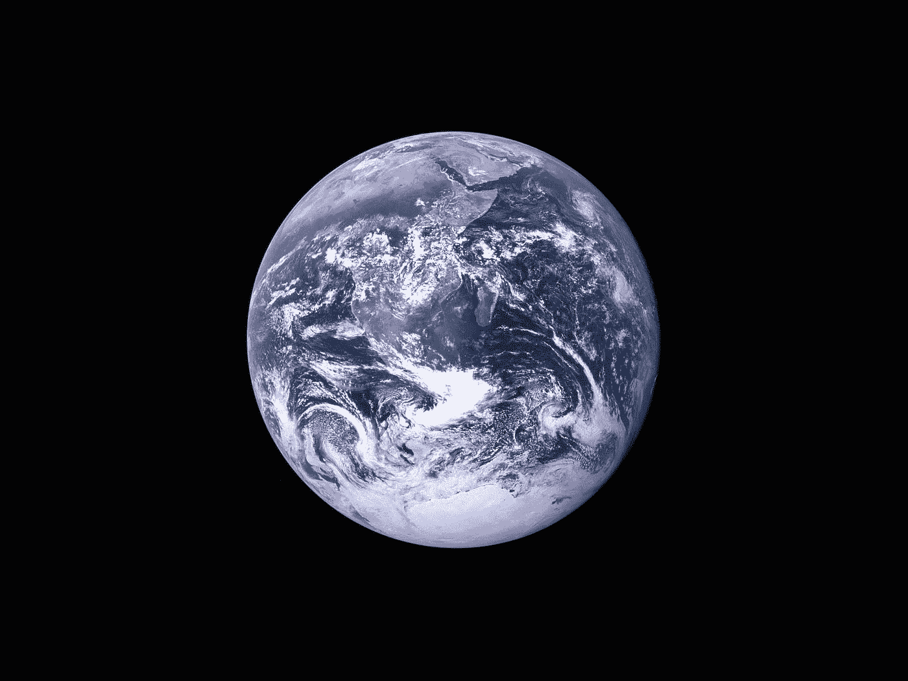

# 是的，这是航天飞机的 85%

> 原文：<https://levelup.gitconnected.com/yep-its-85-of-a-space-shuttle-3084ea11a590>

## 与高级管理人员一起相对估计和使用它

美国宇航局在 [Unsplash](https://unsplash.com?utm_source=medium&utm_medium=referral) 拍摄的照片

我们在敏捷中使用相对估算已经有一段时间了，所以 scrum 团队对它和它的好处感到很舒服。然而，在与高级管理层沟通时，相对估计也是有用的。

开发人员熟悉:

*   **T 恤尺码** —小号、中号、大号
*   **规划扑克**和斐波那契数列
*   **故事点**——对实现一项工作的努力的估计
*   **斐波纳契数列**1，2，3，5，8，13，21

相对估计的概念并不是什么新奇的敏捷概念，而是源于一位德国生理学家的观察。

> 韦伯定律——明显的刺激变化是原始刺激的比率——恩斯特·韦伯 1834

最简单的方法是向某人解释这一点，看着窗外典型的道路和街道场景。

*   红色的汽车比蓝色的大卡车重吗？

答案将是“否”，因为我们迄今为止对物体的经验和两个物体的视觉尺寸表明:

*   卡车在视觉上比轿车大
*   在过去，我们被告知卡车比汽车重
*   我们已经看到，由于其假定的重量和尺寸，卡车比汽车需要更长的时间来加速和减速
*   我们知道我们可以用一个简单的千斤顶来举升一辆汽车来换轮胎
*   我们看到几个人抬起并移动一辆小汽车

我们或许可以推断出我们看到和猜测的事实:

*   这辆卡车看起来是小汽车的四倍大
*   卡车有 12 个轮子，汽车有 4 个轮子，因此可能有 3 倍的负载
*   所以卡车可能比汽车重 3 到 4 倍

但是如果被问及“汽车的公吨重量精确到 1 公斤是多少？”我们无法给出答案。

# 经理的衡量标准

那么，高级管理人员有什么样的生活经验和心智模型可以用于相对估计呢？

此外，是什么打动了这些人，使得相对比较具有价值和影响？如果你说你的新应用程序的代码量是食物搅拌机的 3000 倍，这很难得到任何赞赏。你需要想得宏大而令人印象深刻。

所以它需要大，需要有意义。幸运的是，这里有一些例子，我自己已经看到并使用过了，我知道它们是有效的。在这种情况下，一点戏剧性的变化会很有用。

# 与最近在全球范围内取得巨大成功的产品相比

所以让我们从思考大的、吵杂的、戏剧性的事情开始做比较，管理者就是他们，会有很大的自我，所以让我们从太空旅行开始。

[computerworld](https://www.computerworld.com/article/2725085/curiosity-about-lines-of-code.html) 的文章提到了航天器软件的大小，这是一个很好的数据参考点，可用于与您的应用程序进行比较，并提供了以下数据:

*   [阿波罗 11 号](https://tecknoworks.com/apollo-11-code-review/)——人类登上月球，1969 年，65k 行代码
*   [航天飞机](https://www.nasa.gov/mission_pages/shuttle/flyout/flyfeature_shuttlecomputers.html)——大吵大闹，令人印象深刻，1978 年，40 万行代码
*   好奇号火星车——2011 年送往火星的火星车，250 万行代码

不太引人注目但仍然令人印象深刻和难忘的软件有:

*   安卓操作系统——安卓 2.2，2010 年，1200 万行代码
*   Windows 操作系统— Windows XP，2001 年，4500 万行代码
*   Mac 操作系统- OS X 10.4，2005，8600 万行代码
*   [谷歌](https://www.wired.com/2015/09/google-2-billion-lines-codeand-one-place/) — 2015，20 亿行代码

# 大海捞针比较

另一种表达软件的方式是把它转换成现实。

将无形转化为有形的一种方法是:

将软件打印成十六进制代码，这是用点阵打印机最容易做到的，以获得连续的扇形折叠打印输出，理想的长度为 6 到 8 英尺。站在打印输出旁边，给出一个相对大小的比较，并要求观众指出可能错误的代码字节。当我看到这样做时，32k 的目标代码大约是 6-8 英尺。也许给他们一个飞镖，让他们扔出去，击中虫子。

作者格雷格·比灵顿的图片

如果你计算出谷歌有 20 亿行源代码，每行有 14-20 字节的目标代码，那么就是 400 亿字节的目标代码。到 2021 年，世界人口将达到 79 亿，所以如果世界上的每个人都是一个字节，那么需要 5 个地球才能成为谷歌。假设代码中有一个严重的错误，那么你需要在这 5 个星球中找到那个人…最好现在就开始找…

美国宇航局在 [Unsplash](https://unsplash.com?utm_source=medium&utm_medium=referral) 拍摄的照片

或者，如果你在地球的[圆周上画一条线，它将是 40，075 公里，也就是 40，075，017，000 厘米(对于那些使用英制度量的人来说，1 英寸等于 2.54 厘米)，即 400 亿厘米，再次尝试找到地球圆周上存在臭虫的 1 厘米部分…](https://web.archive.org/web/20110424104419/http://home.online.no/~sigurdhu/WGS84_Eng.html)

> 所以相对估计是有用的，如果你把它和正确的事情进行比较，它也会变得非常强大。祝你找到理想的对比愉快。

# 进一步阅读

 [## 如何不传达一个估计！

### 敏捷评估及其导致的混乱

blog.devgenius.io](https://blog.devgenius.io/how-not-to-communicate-an-estimate-fef77d5b40aa)  [## 从评估中阻止团队争论的 4 种方法

### 偶然地，你自己看起来不错，会让团队中的其他人看起来很差

blog.devgenius.io](https://blog.devgenius.io/4-ways-to-stop-team-disputes-from-estimates-23eacf6e85b3)  [## 在大约 3.4 分钟内虚张声势你的估计

### 如何像专业人士一样估算！

blog.devgenius.io](https://blog.devgenius.io/bluff-your-estimate-in-roughly-3-4-minutes-c2961364b0a3) 

# 关于作者的更多信息

**Greg** 是一名经验丰富的软件专业人士，也是 [**外包公司的首席技术官。**](https://outsource.dev/)

如果你喜欢这篇文章，请鼓掌👏和**跟着**我。