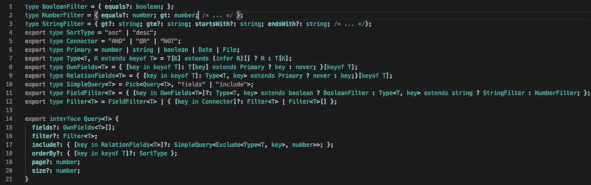
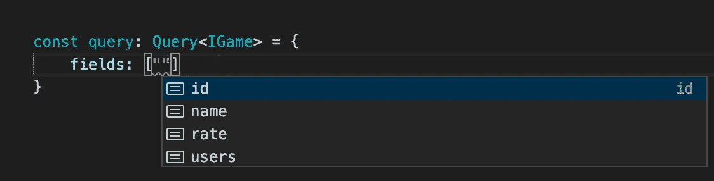
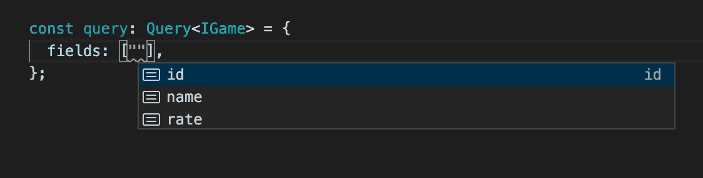
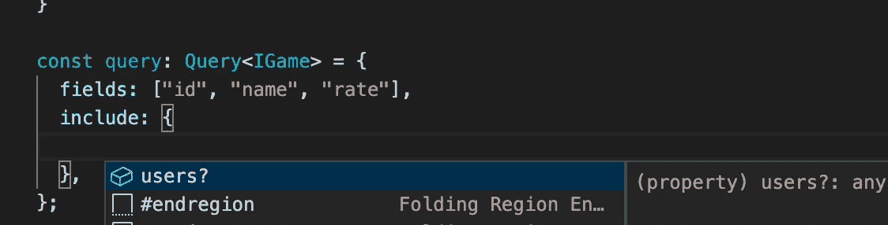
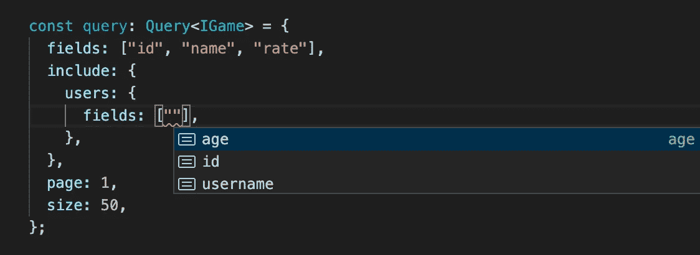
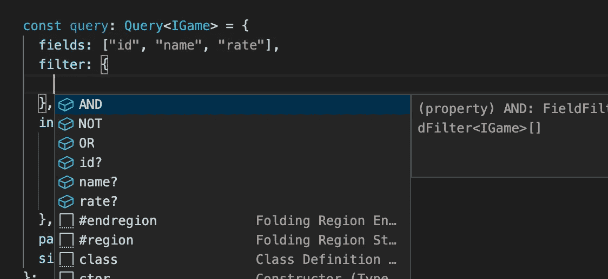
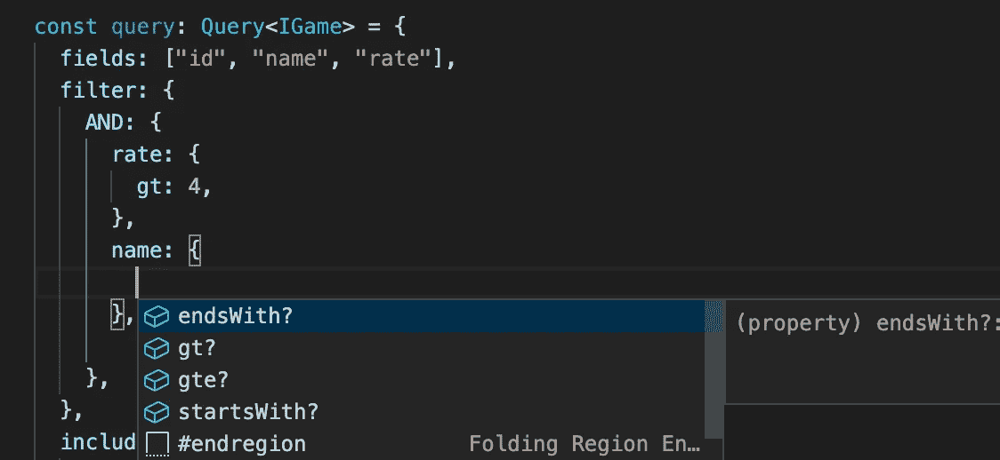

# 类型脚本中的类型推理

> 原文：<https://levelup.gitconnected.com/yes-typescript-can-do-that-975dcc4ef72a>



T.L.D.R。)

这篇文章是关于为一个查询对象写一个类型定义，这个查询对象在客户端从 API 获取数据。然而，在我开始之前，我想提一下这是高级的 typescript 概念，所以如果您是新手，您可能会觉得有点难以理解。

我不会谈论后端，但如果你一定要知道，这个查询对象将被转换为一个`[PrismaClient](https://www.prisma.io).findMany`参数。有广泛的验证和逻辑检查，以确保安全和访问管理。

# 问题是

为了解释我将在这里使用的概念，我将使用两个简单的`User`和`Game`模型，它们有多对多的关系。不用说，这也可以用于任何其他关系。

模型及其关系

假设我们要创建一个查询来获取所有游戏的列表，包括用户。大概是这样的:

```
const query: Query = { ... };
const games = await api.findMany(query);
```

我们的查询对象应该是这样的:

查询定义

这个定义不会给我们太多的代码完成，但是，它肯定比什么都没有好。让我们试着让它更有用。

# 改进 1:使用`keyof`

如果我们将模型接口作为通用类型传递给我们的查询定义，我们可以使用`keyof`操作符来提取该模型的属性，并将它们用于`fields`、`includes`、`orderBy`:

现在我们得到了更好的代码完成。而且如果你输入不正确的字段名，`tsc`会警告你:



字段名的代码完成

# 改进 2:类型推断

`include`属性只能用关系类型的字段名填充。并且`fields`属性应该只填充模型自己的字段。在本例中，`id`、`name`和`rate`是自己的字段，而`users`是关系。Own 字段是主要类型，所以我们可以使用它。

为了解释`OwnFields`，我们来追溯一下代码。`Game`模型第 5 行的结果将是`{id: "id", name: "name", rate: "rate", users: never}`。当我们添加第 6 行时，这将产生字段的名称:`"id" | "name" | "rate"`。



对于关系来说，只是另一种方式。



# 改进 3:下兔子洞

如果我们希望能够选择关系的领域呢？甚至是亲戚关系？

我们可以从关系的类型推断开始。但是当关系是多对多时，属性的类型将是关系模型的数组(`games: IGame[]`)。我们需要一种从数组推断类型的方法。我们可以通过以下方式实现这一目标:

```
type ExtractType<T, K extends keyof T> = T[K] extends any[]: T[K][number]: T[K];// and from TypeScript v2.8:
type ExtractType<T, K extends keyof T> = T[K] extends (infer R)[]: R: T[K];
```

上面的代码将从关系中提取数据类型。下一个问题来了。对于关系字段，类型为`number[] | IUser[]`。为了让这个工作，我们需要从 TypeScript: `Extract<someTypes, number>`中使用`Extract`地图类型来移除`number`:

对于代码完成:



如你所见，现在我们得到了嵌套关系的正确代码完成，不管兔子洞有多深。

# 过滤器部分来了

过滤基本上是对自己的字段进行的。对于基于其类型的每个字段，可以有以下操作符或它们的子集:

```
equals, not, lt, lte, gt, gte, in, notIn
contains, startsWith, endsWith
```

和以前一样，我们可以使用类型推断来为字段分配适当的过滤操作。还有像`AND`、`OR`、`NOT`这样的连接器来创建更复杂的过滤。

我们可以为自己的字段创建三个过滤类别:`BooleanFilter`、`NumberFilter`、`StringFilter`。现在，我们可以为每个字段创建以下类型:

```
type FieldFilter<T> = {
  [key in keyof OwnFields<T>]?: Type<T, key> extends boolean
    ? BooleanFilter
    : Type<T, key> extends string
      ? StringFilter
      : NumberFilter;
};
```

对于关系，当关系类型是多对多时，我们也可以给`SimpleQuery`对象添加过滤属性。这看起来很难，但是相信我，这只是另一种类型的推理。

现在我们只需创建另一种类型来使用连接器操作符连接`FieldFilter`:

厉害！现在看看代码完成情况:



字段和连接器的一级代码完成



字符串字段的嵌套代码完成

有了这些定义，我们就获得了最终的 IDE 支持。该查询对象几乎可以覆盖`PrismaClien.findMany`中所有类型的参数类型。

我没有过滤多对多关系。这可能是一个不错的挑战。如果你喜欢，写下你的答案作为评论！

*如果我做错了什么，或者有更好的方法，请***告诉我！**

*[](https://skilled.dev) [## 编写面试问题

### 掌握编码面试的过程

技术开发](https://skilled.dev)*