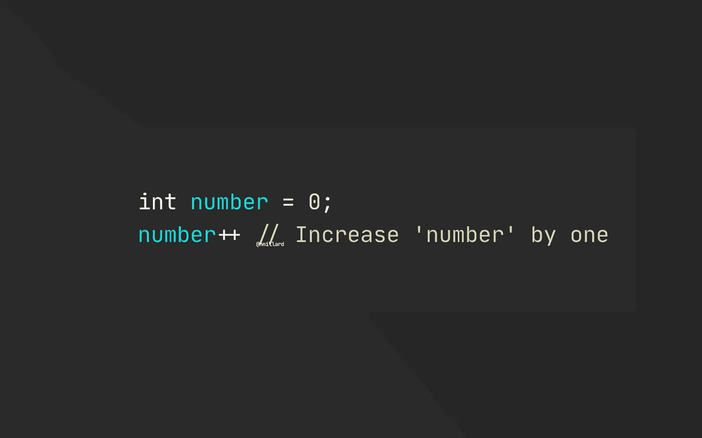
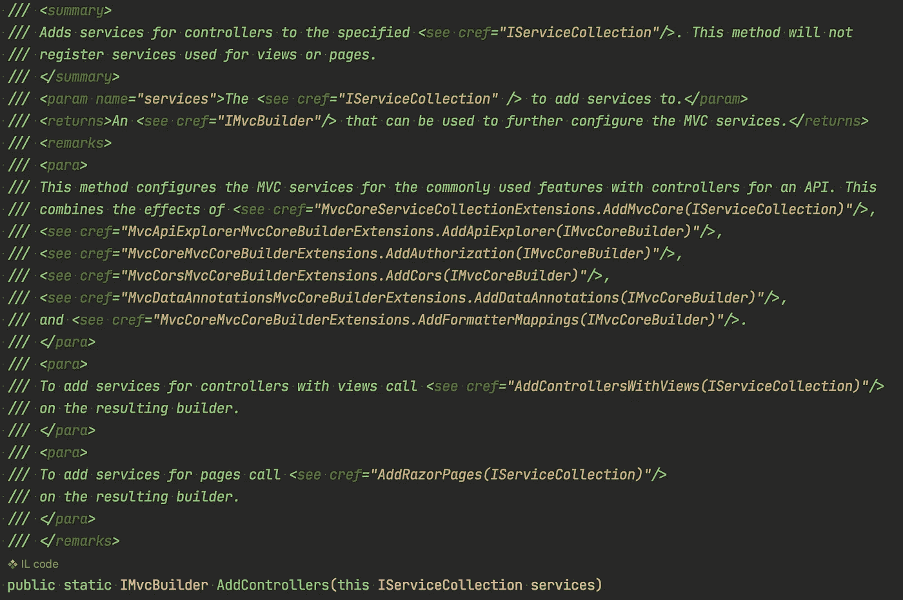
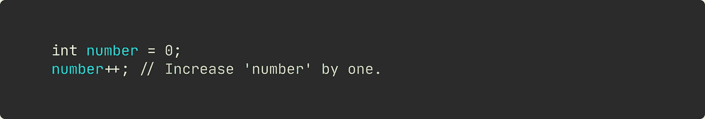

# 是，你的代码需要注释

> 原文：<https://levelup.gitconnected.com/yes-your-code-need-comments-a96348bf3fb7>

## 固执己见的观点

## 还有很多。所以，不要再吹嘘你的代码是如何自文档化的了。

图片由[这至少是当今开发人员的心态。

许多开发人员不假思索地说出诸如“你的代码必须是自文档化的”、“好的代码不需要注释”、“注释代码是个坏主意”或“注释有代码味”之类的话这些可能是这些年来你被告知的所有版本。

但是让我告诉你这个小秘密:

> 正确使用注释可以极大地提高系统和应用程序的理解能力。

请这样想，如果您只是将 dll 交给 aspnet core 或像 React 这样的 npm 包，那么您能通过读取类名和方法声明对它们做任何事情吗？

大概不会。

## 使用评论是完全可以的——甚至是被鼓励的。

代码注释通常会让每个人的生活变得更容易，包括你未来的自己。

当然，你需要用心命名你的类、方法、变量等等，但是好的名字所能捕捉的上下文是有限的。选择库而不是其他库是有原因的，很多时候这与库在独立站点和评论中的文档化程度有关。

伟大的注释所传达的意义远远超出了任何类或方法名称所能传达的。伟大的注释告诉我为什么一段代码存在，以及如何正确使用它——甚至可能是超出特定代码范围的内容。

以下面的 aspnetcore 框架源代码为例。

aspnet 核心框架的代码片段。

完美的注释方法。

当然，`AddControllers()`这个名字就足够了。但是，这里的注释包含了框架用户想要的更多信息。一些开发人员可能想当然地认为，如果用于基于 MVC 的框架，添加控制器也意味着添加视图。这种假设肯定会让一些人感到沮丧，因为调用`AddControllers()`时不会添加视图。这个评论完美地展示了我们所期待的。

## 那么，什么时候评论是不必要的呢？

坦白说，经常。

根据经验，不要评论语言的语法和语义。比如，下面举例说明的流行的初级开发者评论。

完全不必要的属性注释。

以及递增整数时的经典注释。

荒谬的语法注释。

这些评论会给评论带来坏名声。评论语言本身是如何工作的——除非它是完全不合理的——会增加信噪比。

顺便说一句，疯狂的开发者，毫不怀疑地接受每一条建议，可能会创建一个完美命名的方法来增加变量，如下所示。

自记录代码的荒谬例子。

老实说，在类似的情况下，如果您必须选择内联注释或正确命名的方法，请选择注释…

您可能认为这是一个非常人为的例子来证明一个观点，但是像这样的代码确实存在于业务线、生产应用程序中。](https://medium.com/u/7c7a43b3d9de#</code>注释代码只会增加信噪比，甚至更糟。

注释代码只会增加信噪比，甚至更糟。
<p id=)

[点击这里](https://nmillard.medium.com/subscribe)订阅时事通讯，获得类似文章的通知，并查看新的 YouTube 频道[*(@ Nicklas Millard)*](https://www.youtube.com/channel/UCaUy83EAkVdXsZjF3xGSvMw)

*连接上* [*LinkedIn*](https://www.linkedin.com/in/nicklasmillard/) ！

# 好奇者的资源

*   [code conquest 对代码](https://www.codeconquest.com/advanced-programming-concepts/code-commenting/)进行注释的指南
*   犹他大学的评论
*   [在代码中添加注释:好的、坏的、丑陋的](https://www.freecodecamp.org/news/code-comments-the-good-the-bad-and-the-ugly-be9cc65fbf83/)作者 Bill Sourour

 [## 你写不诚实的方法吗？

### 可能没有什么比糟糕的方法声明更让开发人员头疼了…

levelup.gitconnected.com](/do-you-write-dishonest-methods-6ec21349e8db)  [## 使用属性的简单策略模式

### 如何改进传统的分支并理解策略模式如何降低圈复杂度。

levelup.gitconnected.com](/simple-strategy-pattern-using-attributes-880c55988215)  [## 依赖注入让你变得极其懒惰

### 导致令人痛苦的构造函数膨胀和难以理解的对象图。

levelup.gitconnected.com](/dependency-injection-has-made-developers-lazy-255afc5bedf7)