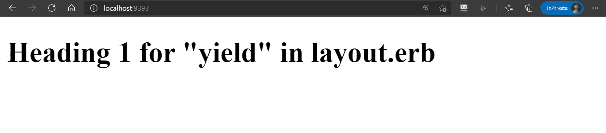
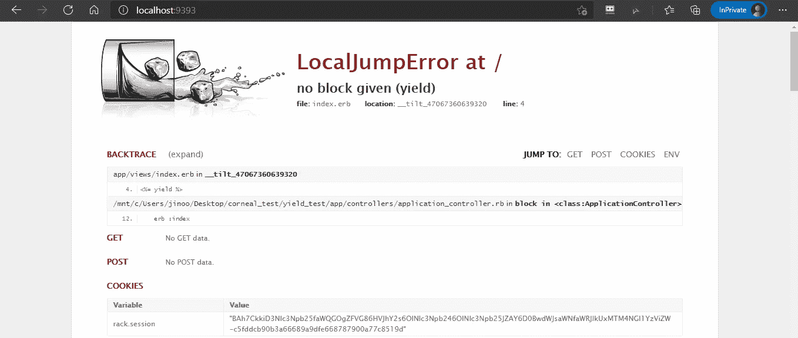
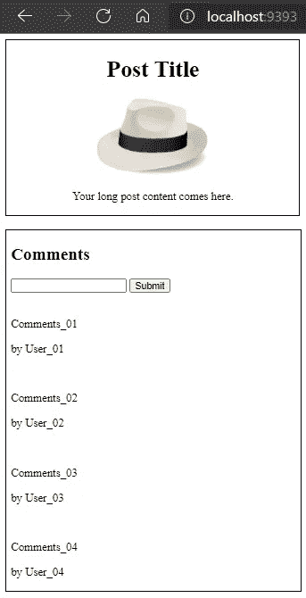

# 红宝石产量中的产量。Sinatra Web 应用程序的 erb 模板

> 原文：<https://levelup.gitconnected.com/yield-in-yield-in-ruby-erb-for-sinatra-web-app-37d445363afe>


YIELD/等到一个块执行完！！！

在 **Ruby-Sinatra** 组合(甚至 **Ruby-on-Rails** )中使用模板的一个最重要的部分就是如何有效地使用`yield`关键字。

下面是您创建 Ruby-Sinatra web 应用程序时最有可能使用的基本文件夹结构:

```
|- app
|    |- controllers
|    |- models
|    |- views
|- config
|       environment.rb
|- db
|   |- migrate
|
config.ru
Gemfile
Rakefile
```

在`controllers`文件夹中有你的`application_controller.rb`文件，在`views`目录下有你的`.erb`视图文件。假设你有基本控制器和带`show.erb`的`layout.erb`。请在此处查看代码:

```
# (assuming that you already have Gemfile, Rakefile, config.ru, environment.rb, and some other basic files)
```

现在，您认识到必要的`yield`关键字出现在`layout.erb`文件中，以将该文件用作所有其他`.erb`文件的背景模板(您可能知道，Sinatra 在默认情况下会为该角色查找这个`layout.erb`)。因为控制器`application_controller.rb`调用带有参数`:show`的`erb`方法，所以`views`文件夹中的`show.erb`文件将是要填充到`layout.erb`文件中的`yield`位置的块。结果如下:



做得好！

大家都知道这么远！但是，我想提的是，“我们能在`show.erb`里再放一个`yield`吗？”我的情况是，我有一个帖子的`show`页面，每个帖子的底部都有评论区。大概是这样的:


正如你所看到的，评论部分和主文章部分是完全分开的。它也来自数据库中的不同模型/表。换句话说，这个评论区分开会更好！那么，有一个包含`yield`的 post `show`文件怎么样，这样一个单独的`comments.erb`视图文件可以在以后填充那个`yield`部分。这是可能的！

让我们稍微改变一下我们的`show.erb`文件，使它看起来像一篇博文:

并且，您有一个单独的`comments.erb`文件，如下所示:

你认为这行得通吗？



为什么，为什么，为什么？！？“无块给定(产量)”嗯…

这就是我们目前掌握的密码。为什么？理论上一个`yield`取一个块，那么`show.erb`文件中的`yield`应该取`comments.erb`作为它的块！对吗？一点也不！！！`show.erb`档中的`yield`根本不知道`comments.erb`的存在。因此，我们必须让它知道一个名为`comments.erb`的文件存在，并准备好填充其中的`yield`。方法如下:

你看到附加部分了吗？是啊！我们为`show.erb`中的`yield`取另一个块`erb :comments`。这样，`show.erb`文件中的`yield`现在知道了`comments.erb`的存在。结果？



漂亮~

正如你可能猜到的，我们可以在`yield`中做`yield`在`yield`中做`yield`在`yield`中做`yield`……你懂我的意思吧！以防万一，这里是如何:

所以，下次你在你的 Sinatra 网络应用程序中有一个复杂的页面时，使用这个技术！为了更好的理解，你可以阅读 [Sinatra 文档](http://sinatrarb.com/intro.html)和一些好的相关文章，比如[Allyson Wesman 的这篇](https://allysonw.github.io/nested_layouts_in_sinatra_with_erb)。并且，请知道你甚至可以使用名字标记的多个`yield`，使用 Sinatra extension gem 名为' **sinatra-contrib** '(请参见 [Sinatra 文档](http://sinatrarb.com/contrib/content_for)和[一篇由 *Jake Trent* 撰写的相关文章](https://jaketrent.com/post/multiple-yields-in-erb-template))。更复杂的例子，你可以在[我的 Github repo](https://github.com/jinook929?tab=repositories) 里试试我的 [TraVlog App](https://github.com/jinook929/_flatiron_project2) 。