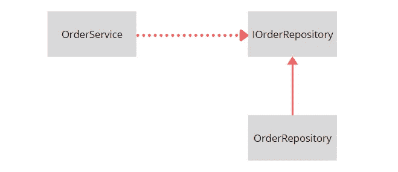

# 您只是简单地注入了一个依赖，认为您遵循了依赖倒置原则

> 原文：<https://levelup.gitconnected.com/you-are-simply-injecting-a-dependency-thinking-that-you-are-following-the-dependency-inversion-32632954c208>

## 澄清差异。


照片由[布鲁斯·马斯](https://unsplash.com/@brucemars?utm_source=medium&utm_medium=referral)在 [Unsplash](https://unsplash.com?utm_source=medium&utm_medium=referral) 上拍摄

依赖倒置原则和依赖注入是完全不同的东西，尽管术语的名称相似。理解这些差异对于从事面向对象编程的软件工程师来说非常重要。

只有非常简单或少数底层对象才能独立实现所需的全部功能。通常，对象需要重用其他对象的逻辑。要做到这一点，对象可以简单地使用`new`关键字自己实例化所有需要的依赖关系:

```
public class OrderService
{
   private OrderRepository _orderRepository = new OrderRepository(); public Order PrepareOrder(long orderId)
   {
      var order = _orderRepository.GetOrder(orderId);
      //...
   }
}
```

对象可以重用对象 T2 的逻辑。现在好像一切都好。每个组件负责自己的工作，组件之间相互作用。

然而，使用`new`关键字会在对象及其依赖项之间产生紧密耦合。紧密耦合使得类`OrderService`对于不需要存储库的新上下文中的代码重用是不可用的。同样，单元测试不能为`OrderService`类编写。缺乏依赖注入会严重影响应用程序的可维护性。这就是为什么依赖注入是软件工程中常见的最佳实践。

依赖注入是一种允许一个对象接收它所依赖的其他对象的技术。最常见的方法是将依赖项的接口注入到类的构造函数中，如下所示:

```
public class OrderService
{
   private IOrderRepository _orderRepository; public OrderService(IOrderRepository orderRepository)
   {
      _orderRepository = orderRepository;
   } public Order PrepareOrder(long orderId)
   {
      var order = _orderRepository.GetOrder(orderId);
      //...
   }
}
```

除了构造函数注入，还有两种技术:方法注入和属性注入。当一个类的单个方法需要某种依赖时，可以使用方法依赖注入。属性依赖注入通常用于设置在类的生命周期中可以多次更改的依赖关系。

将构造函数注入与接口结合使用有助于我们反转`OrderRepository`依赖性——类`OrderService`不应该再实例化`OrderRepository`。依赖关系需要由其他人实例化，并传递给`OrderService`构造函数。



在这个特殊的例子中，在构造函数中注入一个接口使得代码遵循依赖倒置原则。但整个故事的关键点如下:

> 并不是每个在构造函数中需要接口的对象都遵循依赖反转原则。

依赖倒置原则不仅仅是将一个接口注入到构造函数中。原则声明一个对象必须依赖于相同或更高抽象层次的对象。

```
public class OrderService
{
   private ISqlConnection _sqlConnection;

   public OrderService(ISqlConnection sqlConnection)
   {
       _sqlConnection = sqlConnection;
   }
}
```

在这个例子中，`OrderService`类仍然在构造函数中接收一个接口，但是尽管如此，`OrderService`还是违反了依赖倒置原则。类`ISqlConnection`存在于`OrderService`类的几个层次之下，它应该只处理存储库(在下一个层次)或其他域对象(在同一层次上)。处理连接、套接字或其他底层细节违反了依赖倒置，这会使`OrderService`类的实现变得非常复杂。

依赖倒置原则帮助开发人员将应用程序组件(类和模块)组织成一个清晰的层次结构，而依赖注入只是一种避免类之间紧密耦合的简单技术。

# 摘要

*   依赖注入是一种允许对象通过构造函数、方法或属性获得它所依赖的其他对象的技术。
*   依赖注入没有说依赖应该属于哪个抽象层次。
*   依赖倒置原则声明依赖必须存在于相同或更高的抽象层次。
*   依赖倒置原则是使用依赖注入技术实现的。

# 更多关于设计的文章

[](/5-ways-to-implement-the-singleton-design-anti-pattern-in-c-68bb664c31f2) [## 在 C#中实现单例设计反模式的 5 种方法

### 各有利弊

levelup.gitconnected.com](/5-ways-to-implement-the-singleton-design-anti-pattern-in-c-68bb664c31f2) [](/3-main-use-cases-of-the-facade-design-pattern-in-enterprise-applications-aa9b290adac6) [## 企业应用程序中外观设计模式的 3 个主要用例

### 优雅地处理代码复杂性

levelup.gitconnected.com](/3-main-use-cases-of-the-facade-design-pattern-in-enterprise-applications-aa9b290adac6) [](/the-simplest-explanation-of-adapter-design-pattern-cd37f02bfecd) [## 适配器设计模式的最简单解释

### C#中的真实世界示例

levelup.gitconnected.com](/the-simplest-explanation-of-adapter-design-pattern-cd37f02bfecd)