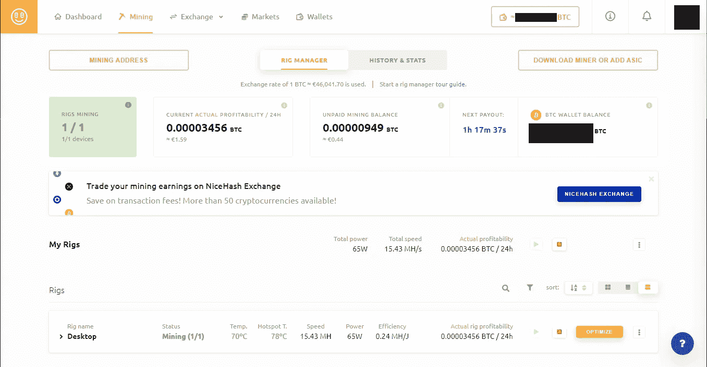

# 你可以通过出售你的 GPU 的加密货币挖掘能力来赚钱

> 原文：<https://levelup.gitconnected.com/you-can-earn-money-selling-your-gpus-cryptocurrency-mining-power-9bda92c46dc8>

## 如何用你的显卡用 NiceHash 赚钱

德米特里·德米德科在 [Unsplash](https://unsplash.com?utm_source=medium&utm_medium=referral) 上拍摄的照片

随着最近[比特币](https://www.reuters.com/article/us-crypto-currency-bitcoin-idUSKBN2BY02V)和[以太坊](https://finance.yahoo.com/news/1-ethereum-hits-fresh-record-232436395.html)的一些价格记录，加密货币遍布新闻，许多人都想加入炒作。然而，将你的真金白银投资于比特币仍然是一项高风险、高波动的投资，直到今天，我还没有足够的勇气去这么做。

除了直接购买比特币，还有一种方法可以获得小额加密货币:**挖矿**。

然而，研究、设置软件、加入矿池等。需要耐心和一些技术知识。对于大多数人来说，使用像 [NiceHash](https://www.nicehash.com/) 这样的消费者友好的挖掘客户端是一个更好的选择。NiceHash 提供了一种简单的方法，当你不使用 GPU 做任何其他事情时，可以赚取一些比特币。

# 尼斯哈什

[NiceHash](https://www.nicehash.com/) 是斯洛文尼亚加密货币 hash power broker。他们为有哈希能力的买卖双方牵线搭桥，收取少量费用。这意味着你可以出售你的显卡的哈希能力，并以比特币的形式获得报酬。根据市场的不同，这可能有利于卖方或买方，它可能不如直接加入一个矿池有利可图。然而，它的设置要容易得多，并且在用户方面只需要很少的维护。它还有一个集成的市场，所以你可以用你的比特币交易其他加密货币，或者把它们兑换成真实的货币。

由于比特币价格如此之高，即使是更老、功能更弱的显卡，在扣除电力成本后也能盈利。我的英伟达 GTX 1060 6 GB 每天的电力成本是德国的 3.5 倍，即使德国的电力成本非常高。

要开始，你需要做的就是创建一个 NiceHash 帐户并下载 QuickMiner 软件。它带有一个集成的超频工具，我建议用它来降低你的 GPU 的功率限制。这将提高挖掘效率(散列率每瓦)并使您的卡更冷，这对 GPU 的寿命更好。例如，我将 GTX 1060 的最大功率限制设置为 65 W，而不是 120 W。通过这种设置，卡永远不会超过 70°C，这不仅对卡更好，而且还使风扇更安静。

每当我不使用 GPU 进行游戏、3D 建模、3D 编程或其他 GPU 密集型任务时，我都会打开 NiceHash 来赚一些比特币。这是一种赚回我花在卡上的一些钱的方式，也许还可以节省下来在未来购买新的 GPU。

NiceHash 挖掘仪表板，作者截图。

# GPU 短缺和挖掘限制

如果你最近一直在关注新闻或显卡的可用性和价格，你可能已经注意到，目前几乎不可能买到显卡。[其中一个很大的原因是加密货币开采](https://www.tomshardware.com/news/gpu-shortages-worsen-cryptocurrency-coin-miners-ethereum)。由于比特币的高价值，矿工们购买了显卡用于采矿，这给游戏玩家和其他消费者留下了很少的钱。Nvidia 和 AMD 正在发布带有采矿限制器的[GPU](https://www.tomshardware.com/news/nvidia-ampere-anti-mining-limiter-mid-may)，因此游戏玩家可以实际购买它们。

然而，虽然我更多地认同自己是一名游戏玩家，而不是矿工，但我不喜欢这一举动。如果我能得到一张昂贵的卡，我不希望任何人为的限制来阻止我用这张卡做任何我想做的事情。即使作为一个游戏玩家，当我不用它玩游戏时，我也会想用它来采矿。虽然我很想玩，但我不能整天玩游戏，在我工作、吃饭、看电影或做其他事情的时候，我也可以用我的卡来弥补一些购买的成本。

# 尼斯哈希黑客

像加密货币领域的其他公司一样，NiceHash 在过去一直是一次重大黑客攻击的目标。2017 年 12 月 6 日，【4,736 枚比特币从其服务器上被盗，当时总价值约为 7000 万美元。虽然 NiceHash 无法追回被盗资金，但他们已经努力从他们的利润中偿还丢失的比特币，截至 2020 年 12 月 16 日，他们已经偿还了 100%的被盗资金。

这提醒我们，把比特币放在网上钱包里总是伴随着一定程度的风险，你永远不能完全信任网上服务。如果你拥有大量的比特币或其他加密货币，请确保将它们安全地存储在离线或硬件钱包中。

由于比特币和其他加密货币的价值很高，出售你的 GPU 的哈希能力可以非常有利可图。像 NiceHash 这样的服务很容易从当前的加密货币宣传中受益，而不需要大量的技术知识或设置时间。采矿是全球显卡短缺和可用显卡价格过高的一大原因。所以当你不用显卡玩游戏的时候，你也可以用现有的显卡来挖矿，赚点钱。

你喜欢这样的内容吗？通过加入 Medium ，可以无限制地访问所有故事，并支持我和其他作者。*如果你通过这个链接注册，你的一部分会员费将会转给我。*