# 您可以更好地记录—如何实施实时应用程序监控

> 原文：<https://levelup.gitconnected.com/you-can-log-better-how-to-implement-real-time-application-monitoring-25e17de8cdb1>

仅仅因为我们以一种方式做某事，并不总是意味着这是正确的方式…甚至是最好的方式。

从我记事起，我就在代码中包含了日志消息，以便在运行时了解代码到底在做什么。从本地运行的开发人员一直到生产支持工程师，这些额外的代码行旨在帮助解决意外情况。

这种方法的问题是整个过程似乎有点偏离。一些意想不到的事情发生了，所以我们努力使用一些日志解决方案来定位根本原因，跟踪日志消息并向后堆栈跟踪，试图确定现实与预期的差异。这可能要花费大量的精力和时间——代价是不耐烦的客户(包括内部和外部)想知道为什么事情不能正常工作。

当我开始阅读关于[翻车保护杆](https://rollbar.com/)的文章时，我开始怀疑我多年来用一种方式做事情到底是不是正确的方式。所以我决定尝试一下 Rollbar，看看它是否提供了一个比我目前的过程更好的方法。

# 什么是滚动条？

滚动条提供了一种不同的应用程序监控方法。它不仅关注敏捷开发和持续交付，还关注提供对应用程序的实时可见性，而无需刷新混乱的日志屏幕和挖掘大量数据。此外，进入滚动条仪表板的数据不仅提供生产支持和开发运维团队期望的指标，还链接到底层源代码，甚至可以将现有票证链接到意外事件…或者可以直接从滚动条本身创建新票证。

所以当滚动条报告一个错误时，你通常只需点击一下鼠标就能找到有问题的源代码并创建一个新的标签。

我觉得这是我开始写“但是等等…还有更多”的地方。老实说，真的有更多，但现在是一个很好的时间来停止走营销之路，实际上用滚动条本身做一些事情。

# 入门指南

在我们进入细节之前，让我们先浏览一下设置。我们需要做的第一件事是通过访问以下链接设置一个帐户:

【https://rollbar.com/signup/ 

您应该会看到如下所示的屏幕:

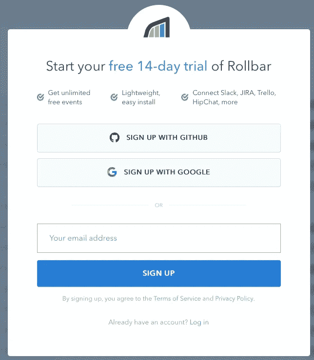

提交后，将创建一个免费帐户。下一步是创建一个新项目:

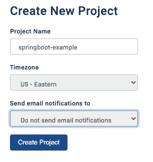

将项目视为 Rollbar 服务的一个实例。在我的例子中，我创建了一个名为“springboot-example”的项目，因为我计划使用一个简单的 springboot 项目来测试 Rollbar。出于本文的目的，我计划尽可能坚持使用默认值。在构建 Spring Boot 服务之前，我需要从项目设置的项目访问令牌部分获取 post_server_item 令牌值:

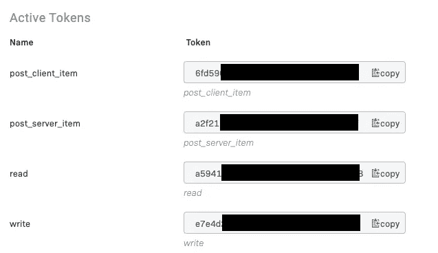

在我的例子中，post_server_item 标记以“a2f21”开头，它将被我们接下来创建的 Spring Boot 服务使用。

# 创建 Spring Boot 服务

使用 IntelliJ IDEA，我能够使用 Spring Intializr 创建一个基本的 Spring API，它具有以下依赖项:

```
<dependencies>
  <dependency>
    <groupId>org.springframework.boot</groupId>
    <artifactId>spring-boot-starter-data-jpa</artifactId>
  </dependency>
  <dependency>
    <groupId>org.springframework.boot</groupId>
    <artifactId>spring-boot-starter-jersey</artifactId>
  </dependency>
  <dependency>
    <groupId>org.springframework.boot</groupId>
    <artifactId>spring-boot-starter-web</artifactId>
  </dependency>
  <dependency>
    <groupId>com.h2database</groupId>
    <artifactId>h2</artifactId>
    <scope>runtime</scope>
  </dependency>
  <dependency>
    <groupId>org.springframework.boot</groupId>
    <artifactId>spring-boot-configuration-processor</artifactId>
    <optional>true</optional>
  </dependency>
  <dependency>
    <groupId>org.projectlombok</groupId>
    <artifactId>lombok</artifactId>
    <optional>true</optional>
  </dependency>
</dependencies>
```

对于 Rollbar，我向 pom.xml 添加了以下依赖项:

```
<dependency>
  <groupId>com.rollbar</groupId>
  <artifactId>rollbar-spring-boot-webmvc</artifactId>
  <version>1.7.4</version>
</dependency>
```

我还添加了一些 Apache 库和我自己的随机生成器库:

```
<dependency>
  <groupId>org.apache.commons</groupId>
  <artifactId>commons-lang3</artifactId>
</dependency>
<dependency>
  <groupId>org.apache.commons</groupId>
  <artifactId>commons-collections4</artifactId>
  <version>4.1</version>
</dependency>
<dependency>
  <groupId>com.gitlab.johnjvester</groupId>
  <artifactId>random-generator</artifactId>
  <version>1.9</version>
</dependency>
```

# 基本服务功能

对于这个演示，我创建了一个服务，它将返回经典摇滚乐队 Rush 和 Yes 的音乐表演者列表。我不想花费大量的时间来构建数据模型，所以在这个项目中有两个非常简单的实体:

```
@Entity
@AllArgsConstructor
@NoArgsConstructor
@Data
public class Musician {
  @Id
  @GeneratedValue(strategy = GenerationType.IDENTITY)
  private long id;
  private String firstName;
  private String lastName;
  @ManyToOne
  private Instrument instrument;
}
@Entity
@AllArgsConstructor
@NoArgsConstructor
@Data
public class Instrument {
  @Id
  @GeneratedValue(strategy = GenerationType.IDENTITY)
  private long id;
  private String name;
}
```

因为我使用的是内存中的 H2 数据库，所以我包含了一个名为 data.sql 的 SQL 脚本，并将其放在 resources 文件夹中。因此，每次 Spring Boot 服务器启动时都会执行该脚本。

有了基本服务之后，我在端口 8001 上启动了 Spring Boot 服务，并注意到我使用的 Rollbar 徽标在日志中显示得相当好:

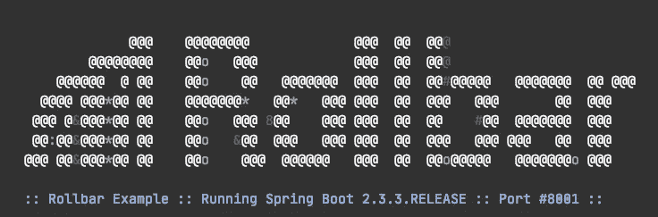

在当前版本的 Spring Boot 中，你只需要将名为 banner.png 的图像附加到项目的\resources 文件夹中，Spring Boot 就会自动创建上面显示的内容。

接下来，使用 Postman，我能够向/音乐家 URI 发出一个简单的 GET 请求，它返回一个 200 OK 响应和以下数据:

```
[
  {
    "id": 1,
    "firstName": "Alex",
    "lastName": "Lifeson",
    "instrument": {
      "id": 1,
      "name": "Guitar"
    }
  },
{
  "id": 2,
  "firstName": "Trevor",
  "lastName": "Rabin",
  "instrument": {
    "id": 1,
    "name": "Guitar"
  }
},
{
  "id": 3,
  "firstName": "Geddy",
  "lastName": "Lee",
  "instrument": {
    "id": 2,
    "name": "Bass"
  }
},
{
  "id": 4,
  "firstName": "Chris",
  "lastName": "Squire",
  "instrument": {
    "id": 2,
    "name": "Bass"
  }
},
{
  "id": 5,
  "firstName": "Tony",
  "lastName": "Kaye",
  "instrument": {
    "id": 3,
    "name": "Keyboards"
  }
},
{
  "id": 6,
  "firstName": "Neil",
  "lastName": "Peart",
  "instrument": {
    "id": 4,
    "name": "Drums"
  }
},
{
  "id": 7,
  "firstName": "Alan",
  "lastName": "White",
  "instrument": {
    "id": 4,
    "name": "Drums"
  }
},
{
  "id": 8,
  "firstName": "Jon",
  "lastName": "Anderson",
  "instrument": {
    "id": 5,
    "name": "Vocals"
  }
}
]
```

此时，Spring Boot 服务已经被验证为正在运行，所以我决定将我的代码提交到一个新的公开可用的存储库中，该存储库位于 [GitLab](https://gitlab.com/johnjvester/rollbar) :

# 将 Spring Boot 配置为使用滚动条

因为我喜欢将尽可能多的配置外部化，所以我决定使用 application.yml 文件并建立以下自定义属性:

```
rollbar:
  access-token: accessTokenGoesHere
  branch: master
  environment: development
  code-version: codeVersionGoesHere
spring:
  application:
  name: Spring Boot Rollbar Example
```

对于 rollbar 属性，我创建了下面的类来方便地访问这些属性:

```
@Data
@Configuration("rollbarConfiguration")
@ConfigurationProperties("rollbar")
public class RollbarConfigurationProperties {
  private String accessToken;
  private String branch;
  private String codeVersion;
  private String environment;
}
```

我的计划是永远不在 application.yml 中存储访问令牌和代码版本值。相反，我将使用 Spring Boot 的一个选项传递这些值。对于此示例，将使用 IntelliJ IDEA 中的运行/调试配置:

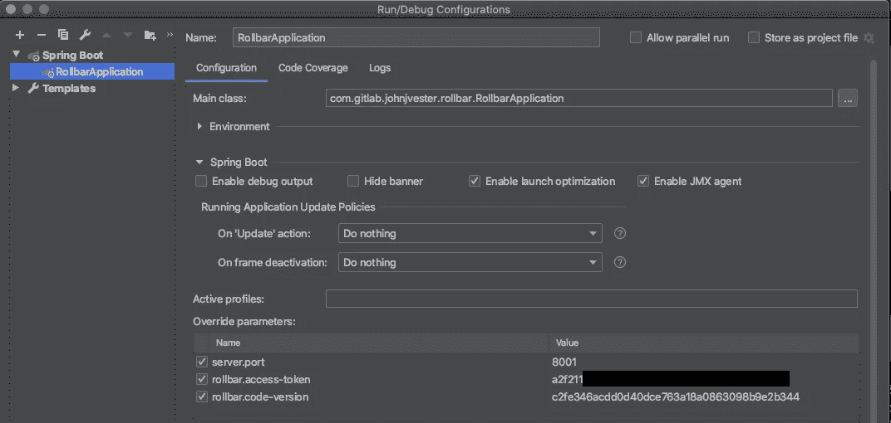

rollbar.access-token 属性是我们将存储以“a2f21”开头的值的地方，代码版本将是来自 GitLab 的 SHA，用于我对主分支的最新提交——一旦一切都设置好了，就会被填充。

随着配置属性的建立，只需要两个配置类。第一个是建立一个供 Rollbar 使用的服务器/提供商:

```
@RequiredArgsConstructor
@Component
public class RollbarServerProvider implements Provider<Server> {
  private final Environment environment;
  private final RollbarConfigurationProperties                       rollbarConfigurationProperties;
  @Override
  public Server provide() {
    return new Server.Builder()
    .codeVersion(rollbarConfigurationProperties.getCodeVersion())
    .branch(rollbarConfigurationProperties.getBranch())
    .host(environment.getProperty("spring.application.name"))
    .root("com.gitlab.johnjvester.rollbar")
    .build();
  }
}
```

接下来，我们添加滚动条配置:

```
@Slf4j
@RequiredArgsConstructor
@ComponentScan({
  "com.gitlab.johnjvester.rollbar",
  "com.rollbar.spring",
})
@Component
public class RollbarConfig {
  private final RollbarConfigurationProperties rollbarConfigurationProperties;
  private final RollbarServerProvider rollbarServerProvider;
@Bean
public Rollbar rollbar() {
  log.debug("rollbarConfigurationProperties={}", rollbarConfigurationProperties);
  return new Rollbar(RollbarSpringConfigBuilder
   .withAccessToken(rollbarConfigurationProperties.getAccessToken())
   .environment(rollbarConfigurationProperties.getEnvironment())
   .server(rollbarServerProvider)
   .build());
  }
}
```

最后，我想创建一个全局控制器异常处理程序来报告给 Rollbar，并保持一切正常(不要重复):

```
@Slf4j
@RequiredArgsConstructor
@ControllerAdvice
public class GlobalControllerExceptionHandler {
  private final Rollbar rollbar;
  @ExceptionHandler(value = Exception.class)
  public void handleExceptions(HttpServletRequest request, HttpServletResponse response, RollbarException e) {
    e.getRollbarExceptionData().
      setIpAddress(request.getRemoteAddr());
    e.getRollbarExceptionData().setUri(request.getRequestURI());
    e.getRollbarExceptionData().setRequestType(request.getMethod());
    log.error("e.getMessage()={} [{}]", e.getMessage().
    e.getRollbarExceptionData());
    rollbar.error(e.getMessage(),
    e.getRollbarExceptionData().getRollbarMap());
    response.setStatus(HttpStatus.BAD_REQUEST.value());
  }
}
```

# 将滚动条与 Spring Boot 一起使用

现在让我们看看防滚架的工作情况。对于这个非常简单的例子，我想使用滚动条来捕捉以下动作:

*   Spring Boot 服务开始的时间(信息)。
*   当调用基本音乐家 API 时，至少有一个结果(信息)。
*   发生强制异常时(错误)。

# 使用带滚动条的随机生成器

为了模拟多个用户，我创建了一个 RollbarUtils 静态实用程序类，在每个请求中包含用户信息。我创建了 17 个不同的用户，并使用[随机生成器](https://gitlab.com/johnjvester/RandomGenerator)框架随机挑选一个用户。Rollbar 允许自定义信息的映射与对 Rollbar 服务的每个 API 调用一起发送，这在 Rollbar 仪表板上是可用的。

对于我想在本文中证明的坏请求概念，同样的方法被用来返回一个随机错误消息。

# 处理异常并链接到 GitLab

在 GitLab 上提交到存储库之后，我想在 Rollbar 应用程序中执行几个额外的设置步骤。在“springboot-example”项目的 Settings 部分中，Integrations | Source Control 部分被打开并配置如下:

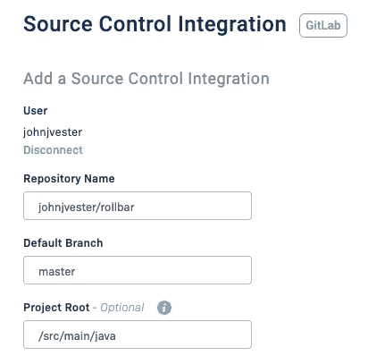

接下来，我设置了 Integrations | Notifications 部分，如下所示:

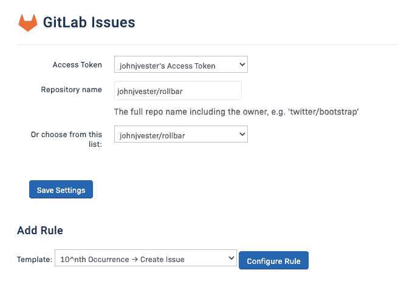

通过这些更改，Rollbar 不仅可以在意外情况下链接到源代码控件，还可以将该事件链接到 GitLab 中的现有票证(例如),或者直接从 Rollbar 仪表板创建新票证。

捕获了 GitLab 的最后一个 SHA 后，我更新了我的 Spring Boot 应用程序的运行/调试设置并重新启动。这个动作通常是 CI/CD 过程的一部分，它允许 Rollbar 知道服务使用的提交散列。

# 将@PostConstruct 与滚动条一起使用

一切就绪后，创建信息滚动条事件就非常简单了:

```
@RequiredArgsConstructo
@Slf4
@Component
public class RollbarEvents {
  private final Environment environment;
  private final RollbarConfigurationProperties rollbarConfigurationProperties;
private final Rollbar rollbar;@PostConstruct
public void postConstruct() {
  rollbar.info(String.format
    ("Started %s on port #%s using Rollbar accessToken=%s (%s)",
  environment.getProperty("spring.application.name"),
  environment.getProperty("server.port"),
  SecurityUtils.maskCredentialsRevealPrefix
    (rollbarConfigurationProperties.getAccessToken(), 5, '*'),
     rollbarConfigurationProperties.getEnvironment()));
  }
}
```

每次 Spring Boot 服务启动时，都会从滚动条仪表板中实时捕获并查看以下事件:

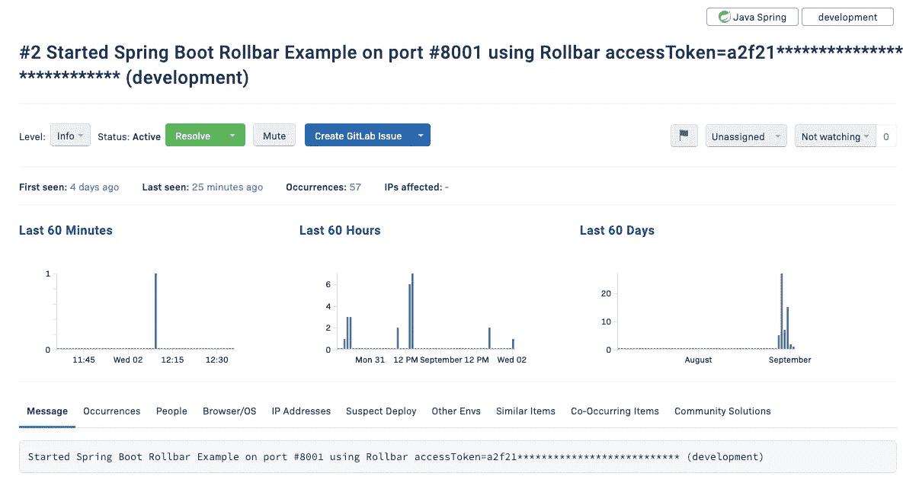

在上面的截图中，请注意创建 GitLab 问题的选项。这将在 GitLab issues 部分插入一个新标签，该标签也可能是为像 JIRA 这样的系统设置的。单击该按钮上的向下箭头，您也可以将此错误链接到现有的票据。

# 呼唤/音乐家 URI

在 MusicianService 中，可以通过 Spring 框架注入 Rollbar 对象，以便向 Rollbar 发送信息和警告消息:

```
public List<Musician> getAllMusicians() {
  List<Musician> musicians = musicianRepository.findAll();
  if (CollectionUtils.isNotEmpty(musicians)) {
    rollbar.info(String.format("Found %s musicians", musicians.size()),
    RollbarUtils.createRollbarExceptionData().getRollbarMap());
  } else {
  rollbar.warning("Could not locate any musicians",
  RollbarUtils.createRollbarExceptionData().getRollbarMap());
  }
  return musicians;
}
```

现在让我们来看看滚动条仪表盘，在这里我们可以看到以下事件:

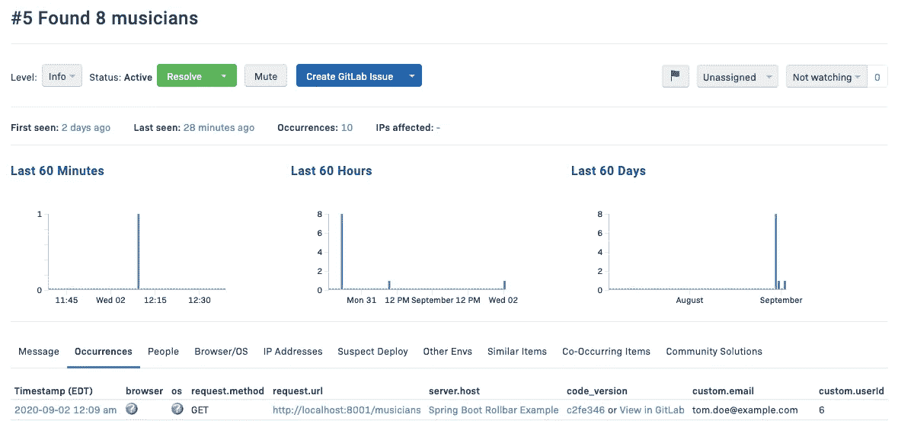

请注意，我们看到了许多关于该错误的有用信息:

*   请求的详细信息
*   “tom.doe@example.com”的用户邮箱
*   用户 ID 值为 6
*   此错误以前出现的次数
*   工作流操作，如创建或分配/分类问题
*   出现此错误的代码版本
*   这类错误的历史记录

# 处理常见异常

本文最困难的问题之一是找出一种方法来引入会导致异常的代码。这很大程度上是由于 IntelliJ IDEA 的客户端多年来避免异常的经验，它总是试图防止异常进入代码库。在尝试提出一些令人兴奋的东西后，我决定求助于一个简单的例外，如下所示:

```
public Musician getIndexOutOfBounds() {
  List<Musician> musicianList = new ArrayList<>();
  return musicianList.get(0);
}
```

在上面的例子中，我们创建了一个新的列表，代码试图返回列表中的第一项。这应该会产生 IndexOutOfBoundsException。调用此代码的控制器如下所示:

```
@GetMapping("/indexOutOfBounds")
public ResponseEntity<Musician> getIndexOutOfBounds() {
  return new ResponseEntity<>(musicianService.getIndexOutOfBounds(), HttpStatus.ACCEPTED);
}
```

当调用/indexOutOfBounds URI 时，以下事件到达滚动条仪表板:

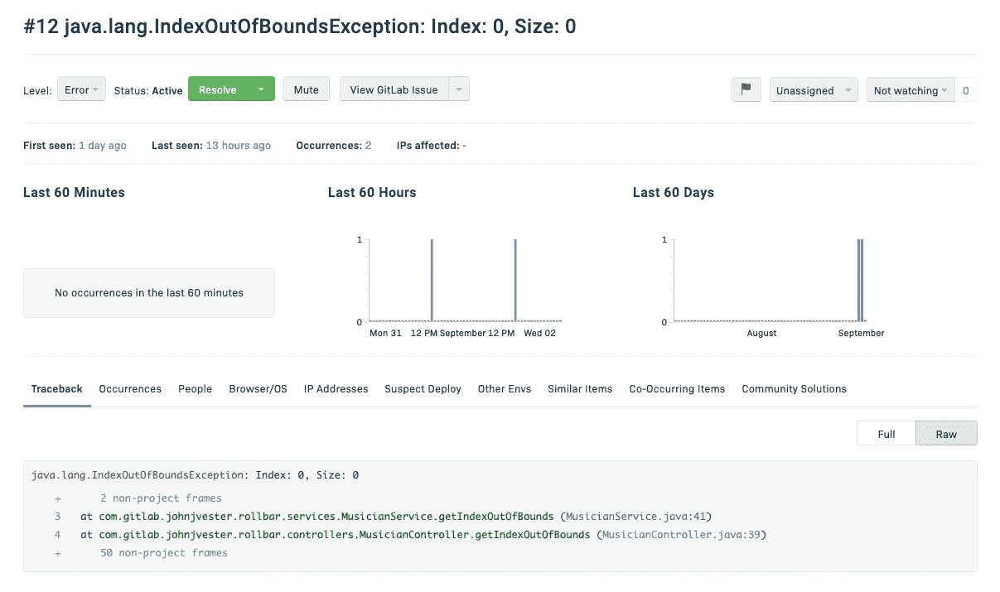

因为我已经把这个问题和 GitLab 问题联系起来了，所以我可以直接在滚动条面板上查看它。此外，请注意堆栈跟踪如何包括直接将我带到 MusicianService.java:41 的链接。单击该链接时，将会打开一个新窗口，直接进入 GitLab 项目:

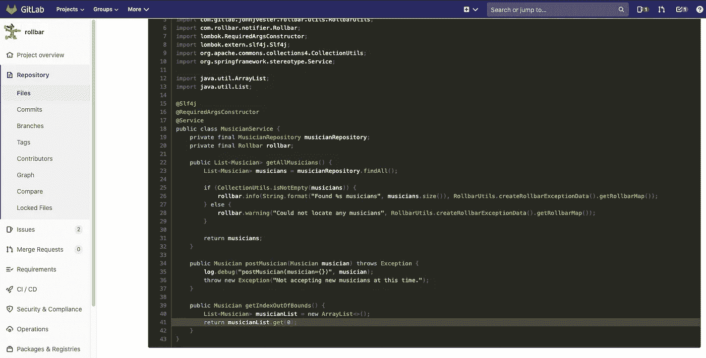

使用“出现次数”选项卡时，code_version 列中现在有链接:

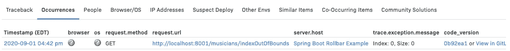

点击链接也可以直接进入提交页面:

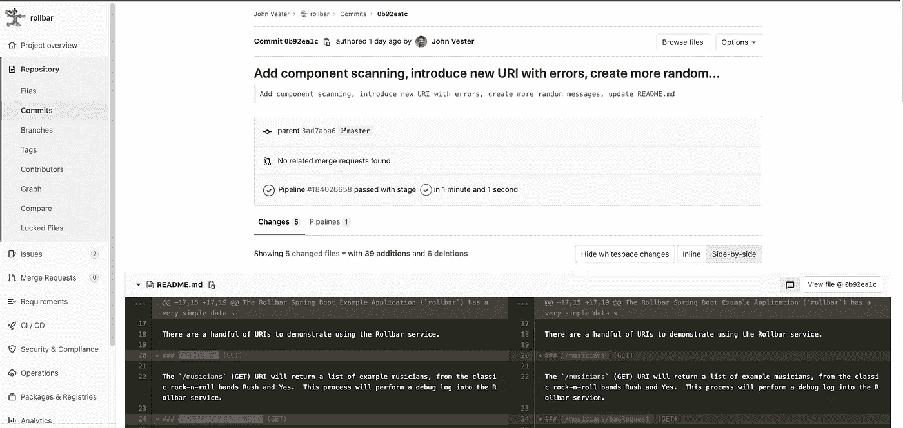

当出现意外异常时，可以使用滚动条仪表板来监视实时事件，甚至可以查看服务器上运行的源代码行和当前提交散列。这不仅对我的开发有帮助，对测试/阶段的部署管道也有帮助，当然还有生产阶段。

# 结论

使用 Rollbar 之后，我觉得我的应用程序监控方法需要一种新的方法。实际上，在二十多年的应用程序开发中，我一直采用相同的方法，并且为了找到问题的意外根源，这种方法的结果总是需要比我希望的更多的时间。Rollbar 提供了一种新的应用程序监控方式，这不仅是一种正确的方式，也是一种更好的方式。

Rollbar 的实现有一些挑战。短名单将包括以下项目:

*   我觉得应该不需要使用 RollbarServerProvider 来为滚动条提供预期的数据。
*   最初，我想使用@PreDestroy 方法提醒 Rollbar 服务已经关闭。但是，当@PreDestory 生命周期事件触发时，联系滚动条服务就太晚了。
*   配置屏幕中需要包含什么并不是很清楚，server_root 的概念是我很难理解的。然而，我觉得这篇文章提供了让 Rollbar 完全与 GitLab 库一起工作所需的一切。

在每一个案例中，我都能够通过 Rollbar 工程团队的帮助，尤其是 Vijay 的帮助，迅速解决我的问题。

从定价的角度来看，爱好开发者可以免费使用 Essentials 包，每月最多 5000 次活动。付费基本计划从每天 1 美元开始，共 6000 场活动，每月 599 美元，共 400 万场活动。高级计划面向需要高级帐户控制面板、多项目提要和版本范围从每月 99 美元到每月 999 美元(400 万笔交易)的客户。在所有情况下，建立年度计划反映了一个相当可观的折扣。

Rollbar 提供了一个实时解决方案，其中包含了分析工具，这些工具提供了比我职业生涯中所经历的更好的应用程序体验洞察。事实上，我计划在以后的文章中更深入地研究这种分析，同时附加一个基于 JavaScript 的客户端来访问我的 Spring Boot 服务。

欢迎您在这里克隆、派生或下载我为本文[创建的项目。](https://gitlab.com/johnjvester/rollbar)