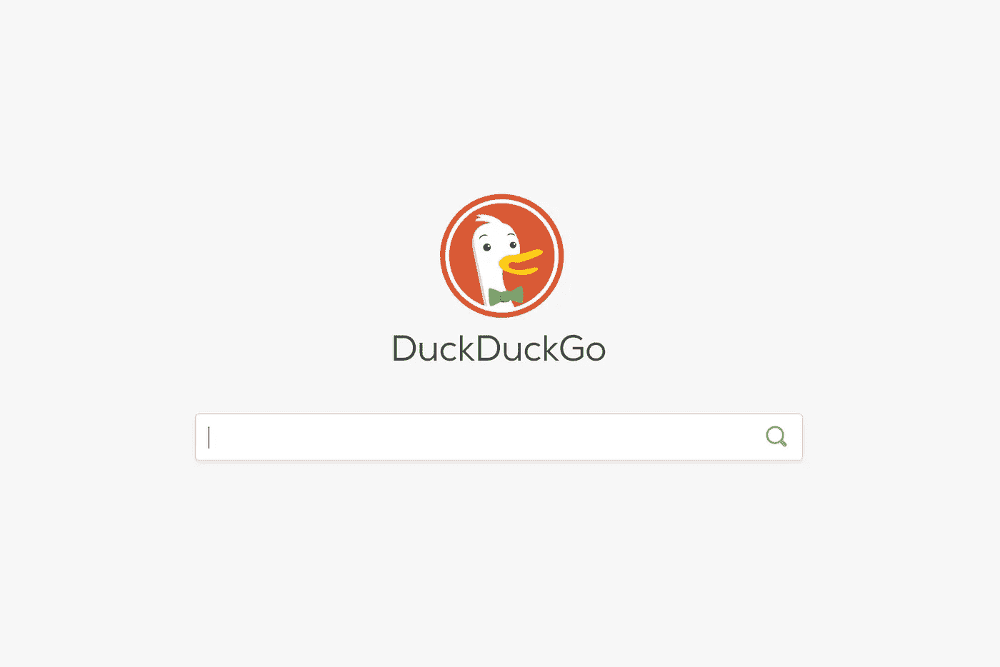
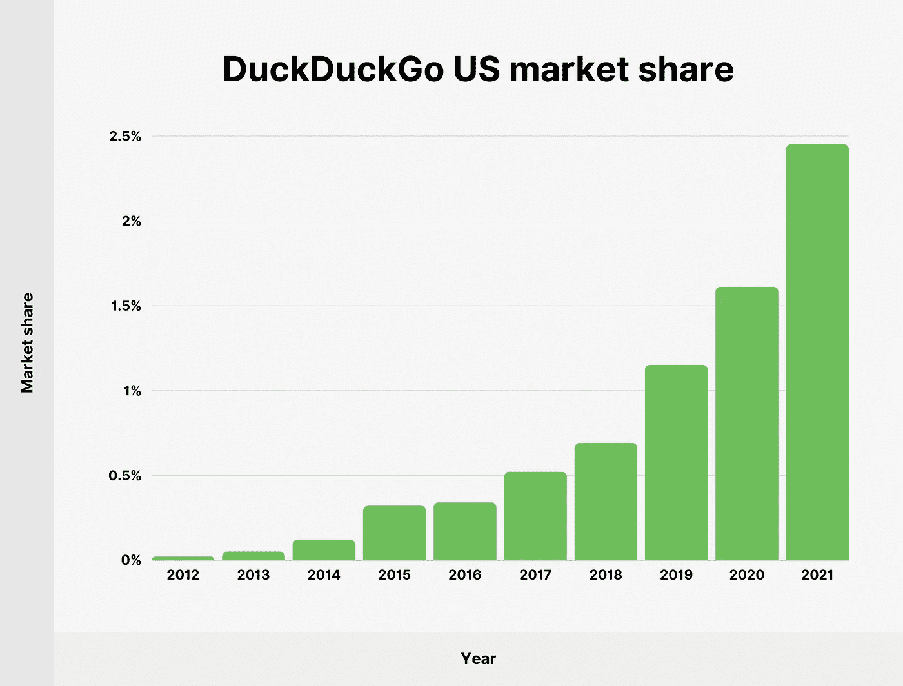

# 您现在可以创建一个安全的 DuckDuckGo 电子邮件帐户

> 原文：<https://levelup.gitconnected.com/you-can-now-create-a-secure-duckduckgo-email-account-c266d812b3e4>

## 关于新的 DuckDuckGo 电子邮件服务，你需要知道的一切。立即获取您的@duck 电子邮件地址！

DuckDuckGo 在行动

你可能已经知道， [DuckDuckGo](https://duckduckgo.com/) 是一个搜索引擎，它承诺让你的搜索保持匿名，同时提供一个内置的跟踪拦截器。这使得您访问的网站更难收集您的信息。换句话说，DuckDuckGo 允许你在没有公司控制你的个人信息的情况下上网冲浪。

DuckDuckGo 美国市场份额[ [来源](https://backlinko.com/duckduckgo-stats)

现在，DuckDuckGo 刚刚推出了创建@duck.com 电子邮件地址的可能性。在推出[电子邮件保护程序](https://duckduckgo.com/email/privacy-guarantees)的私人测试版一年后，这项服务现在对所有人开放。

下面我们来详细了解一下。

# DuckDuckGo 电子邮件服务提供什么？

DuckDuckGo 电子邮件服务使您能够创建个人“duck”地址或保护现有的私人地址。具体来说，DuckDuckGo 电子邮件服务可以防止公司检测到您的电子邮件地址，并使用它向您发送促销邮件或进行个人资料分析。

本质上，DuckDuckGo 删除了当电子邮件被打开时触发的位置跟踪器，不仅可以检测电子邮件被打开的时间，还可以检测使用的位置和设备。此外，DuckDuckGo 电子邮件服务还提供了有多少追踪器被移除以及它们所属公司的详细信息。一旦清理完毕，您在@duck.com 电子邮件地址中收到的电子邮件将由电子邮件保护自动发送到您的收件箱。

# 个人与私人 DuckDuckGo 电子邮件地址

如上所述，您可以申请两种类型的地址:个人地址和私人地址。现在让我们来了解一下两者的区别。

## 个人 DuckDuckGo 邮件地址

个人 DuckDuckGo 电子邮件地址包含您选择的名称(例如[maria.williams@duck.com](mailto:paola@duck.com))，是一个全新的电子邮件地址，配备了前面介绍的所有保护功能。

## 私人 DuckDuckGo 电子邮件地址

要使用 DuckDuckGo 保护您的私人电子邮件地址，您必须遵循一个更复杂的程序。基本上，每次你填写在线表格时，DuckDuckGo 电子邮件服务都会创建一个随机生成的地址，与你的真实地址相关联，从而使追踪你变得更加困难。这个新创建的地址将代替您原来的电子邮件地址。然后，清理后的电子邮件将被转发到您的原始地址。

# 如何尝试 DuckDuckGo 电子邮件服务

随着测试版向公众开放，DuckDuckGo 刚刚为其电子邮件保护服务引入了新功能。其中包括移除嵌入图像中的追踪器，以及直接从@duck 地址回复电子邮件的功能。

要试用测试版，只需下载适用于 Firefox、Chrome 和 Edge 的 DuckDuckGo 浏览器扩展。或者，你可以在 iOS、Android 和 Mac 上安装 DuckDuckGo 隐私浏览器应用程序(记住它仍处于测试阶段)。

# 结论

近年来，DuckDuckGo 搜索引擎越来越受欢迎。这是因为 DuckDuckGo 非常重视隐私和数据保护。现在 DuckDuckGo 刚刚推出了一个电子邮件服务，在这里你有机会看看你应该知道的一切。

感谢阅读！我希望这篇文章对你有所帮助。请随意留下任何问题、评论或建议。