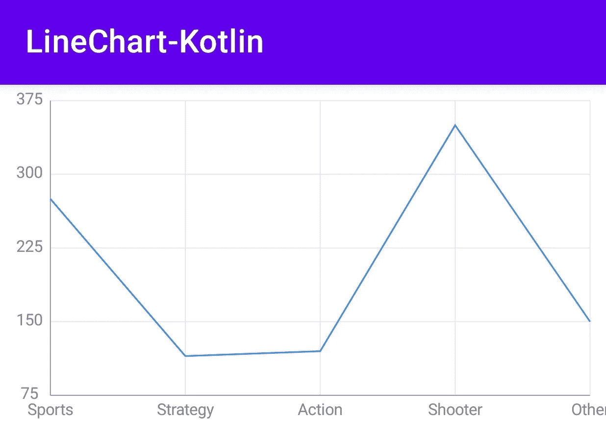
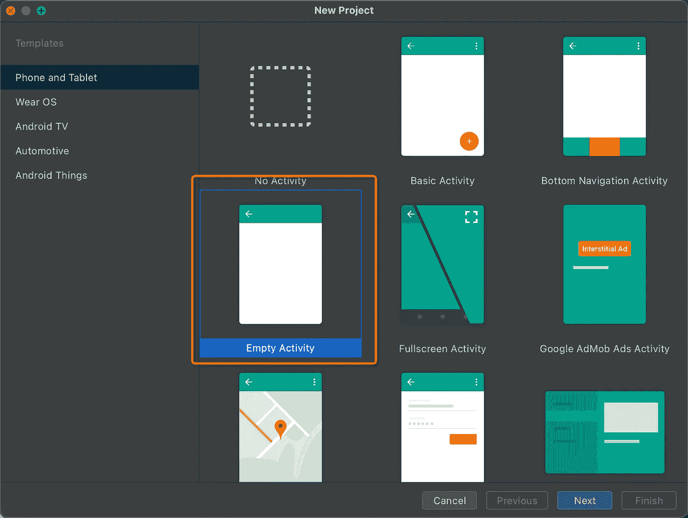
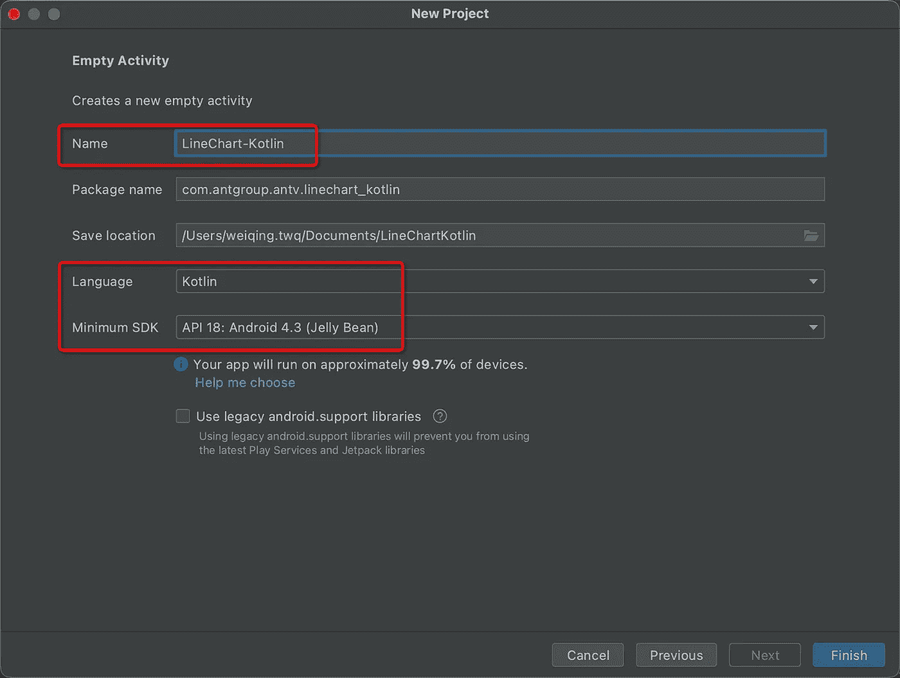
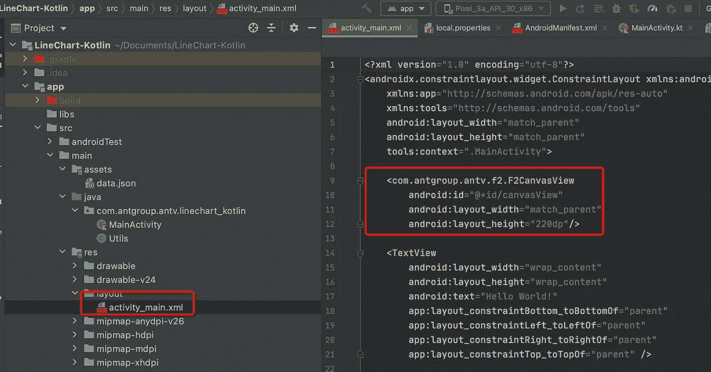
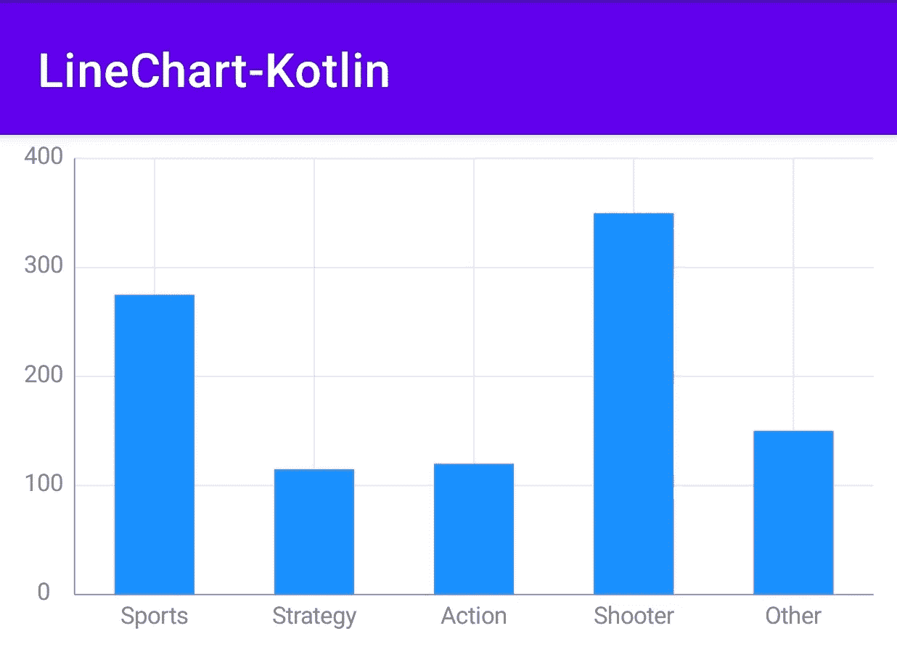

# 你可以使用这个库来绘制 Android 可视化图表

> 原文：<https://levelup.gitconnected.com/you-can-use-this-library-for-android-visual-chart-drawing-67ef47d4ee11>

在大数据时代的入口之内，`visualization`可以用更直观的方式展示数据，让数据更客观，更有说服力，从而帮助用户理解和分析数据。今天我们就来看看如何使用 **Kotlin** 来**绘制折线图** **。**



# 技术选择

其实 iOS 上的可视化图表库很少。著名的是[图表](https://github.com/danielgindi/Charts)，但今天我选择了 [F2Native](https://github.com/antvis/F2Native) ，主要是因为它丰富的图表类型`supporting 7 types of charts`，跨越`iOS`、`MacOS`、`Android`、`Webassembly`平台，最后实现了 `the grammar of graphic`理论，可以组合形成千变万化的图表。


# 开发和实施

代码提交在 [GitHub](https://github.com/weiqingtangx/LineChart-Kotlin) 上，你可以在最后直接下载。那我们开始吧。

## 1.创建项目

我们用 Android Studio 创建一个空项目。



点击下一步，在下一个界面输入项目名称 LineChart-Kotlin，选择语言为`Kotlin`，最小 SDK 选择`API 18`，点击完成。



## 2.导入 F2Native

F2Native 已经上传到`jetpack`，所以我们需要把它添加到项目的`build.gradle`

```
maven { url 'https:*//jitpack.io' }*
```

然后转到模块的`build.gradle` 添加依赖项，我们默认使用最新版本。

```
implementation 'com.github.antvis:F2Native:latest.release'
```

## 3.准备数据

由于引擎的输入数据格式是字符串数组，所以我准备了以下数据，并将其保存为`data.json`文件。然后放在`assets`目录下。

```
[{
    "genre": "Sports",
    "sold": 275
}, {
    "genre": "Strategy",
    "sold": 115
}, {
    "genre": "Action",
    "sold": 120
}, {
    "genre": "Shooter",
    "sold": 350
}, {
    "genre": "Other",
    "sold": 150
}]
```

## 4.创建视图

我们在`res/layout/activity_main.xml`中添加`F2CanvasView`并设置宽度和高度。此视图用于显示折线图。

```
<com.antgroup.antv.f2.F2CanvasView     
android:id="@+id/canvasView"     
android:layout_width="match_parent"     android:layout_height="220dp"/>
```



# 5.编码

下一步是编写代码。我们将相关的包导入到`MainActivity.kt`

```
**import** com.antgroup.antv.f2.* 
**import** com.antgroup.antv.f2.F2Chart.*
```

编写代码逻辑时，我写了代码中每一步的注释。

如果你看到了这个，恭喜你，以上是绘制折线图所需的全部代码，图表如下:


我提到过，F2Native 实现了图形语法，可以通过组合快速应对业务迭代的快速性。如果需求突然发生变化，需要绘制柱形图，那么我们只需要修改`mChart!!.line().position(“ genre*sold”)`，其中代码中的线是`interval.`

```
mChart!!.**interval**().position("genre*sold")
```

柱形图出来，很方便。



# 最后

感谢您的阅读，代码已经提交到 [GitHub](https://github.com/weiqingtangx/LineChart-Kotlin) ，欢迎下载。

[](https://github.com/weiqingtangx/LineChart-Kotlin) [## GitHub-weiqing tangx/line chart-kot Lin:展示如何使用 swift 创建折线图示例

### 此时您不能执行该操作。您已使用另一个标签页或窗口登录。您已在另一个选项卡中注销，或者…

github.com](https://github.com/weiqingtangx/LineChart-Kotlin) 

如果你对 iOS `visualization`感兴趣，你可以看看这篇文章。

[](https://medium.com/codex/draw-a-line-and-bar-chart-using-swift-within-10-lines-code-c36aadaf3cdd) [## 使用 Swift 在 10 行代码内绘制线条和条形图

### 介绍跨平台可视化库的使用

medium.com](https://medium.com/codex/draw-a-line-and-bar-chart-using-swift-within-10-lines-code-c36aadaf3cdd) 

# 分级编码

感谢您成为我们社区的一员！在你离开之前:

*   👏为故事鼓掌，跟着作者走👉
*   📰查看[升级编码](https://levelup.gitconnected.com/)中的更多内容
*   🔔关注我们:[Twitter](https://twitter.com/gitconnected)|[LinkedIn](https://www.linkedin.com/company/gitconnected)|[时事通讯](https://newsletter.levelup.dev)
*   🚀👉 [**软件工程师的热门职位**](https://jobs.levelup.dev/)