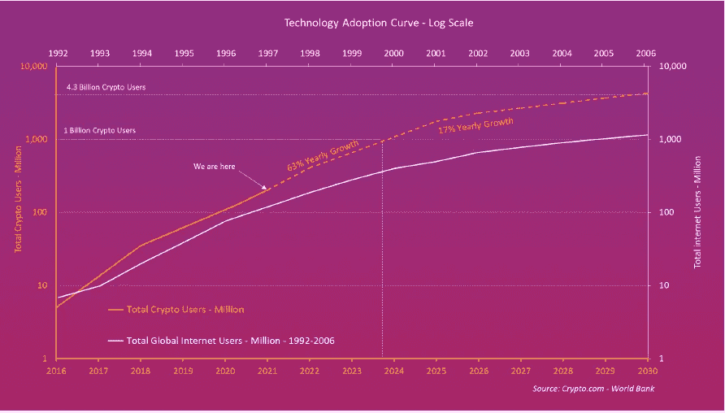

# 你从小就不知道怎么开车。可以了解一下比特币。

> 原文：<https://levelup.gitconnected.com/you-didnt-grow-up-knowing-how-to-drive-you-can-learn-about-bitcoin-aab816c45bef>

关于比特币，你想知道但又不敢问的事情。

在 [Unsplash](https://unsplash.com/s/photos/driving?utm_source=unsplash&utm_medium=referral&utm_content=creditCopyText) 上由 [Averie Woodard](https://unsplash.com/@averieclaire?utm_source=unsplash&utm_medium=referral&utm_content=creditCopyText) 拍摄的照片

人们对技术的短视程度令人难以置信。

包括我。

克利夫·斯托尔是《T4 新闻周刊》的记者，他在 1995 年写了一篇关于互联网的臭名昭著的文章，直到今天，他对写这篇文章感到非常后悔。

斯托尔的文章驳斥了互联网的每一个使用案例——我们今天接受为规范的东西几乎被视为不值得相信的幻想。

> 1995 年的克利夫·斯托尔:
> 
> “他们谈到了电子城镇会议和虚拟社区。商业将从办公室和商场转向网络和调制解调器。数字网络的自由将使政府更加民主。胡扯。”
> 
> “我们的计算机专家缺乏常识吗？事实是，任何在线数据库都无法取代你的日报，任何光盘都无法取代一名合格的教师，任何计算机网络都无法改变政府的工作方式”。

谁会因为这篇文章责怪他呢？

当时，人们仍然需要了解互联网是什么，以及我们如何使用它。

你知道互联网将极大地影响我们的生活，但我们正处于其使用案例的发现阶段。

斯托尔的文章指出了当我们不能把社会将如何发展的棋局放在一起时，我们是如何思考的。

我经常将这样的历史参考与我们对比特币的现代观点进行比较，比特币是一种正在以两倍于互联网的速度被采用的技术。

在这里，我们将解决一些你想知道但可能不敢问的关于比特币的事情。

直到我们达到法定极限，我们才在电话、社交媒体或学习驾驶的环境中长大。

但是我们发现了他们。我认为比特币是你应该研究并弄清楚的东西。

我有什么资格告诉你该做什么？做出自己明智的决定。

# 比特币让我们的金融体系变得更好了吗？

我相信比特币不一定比我们目前的货币体系更好，但它确实有优势。

这是一种包容性的价值储存，允许第三国人民参与经济繁荣。

以下是比特币的优势。

*   它不需要中间人，消除了失败点和人类腐败。
*   比特币是稀缺的，有固定的供应量(2100 万比特币)。
*   它非常耐用，并由全球的计算机进行备份。
*   你不能创造假比特币。
*   因为它是一种数字资产，所以与黄金不同，它具有很高的便携性。
*   你可以在世界上任何时间、任何地方，以几分之一便士的价格进行大额交易。
*   唯一阻止比特币运行的情况是互联网瘫痪。

# 即使在价格波动后，比特币的采用也在增加。

最近几周比特币价格暴跌已经不是什么秘密了。

反常之处并不在于价格和其他所有资产一起崩溃，包括股票市场。持有比特币的钱包地址数量正在增加，尽管价格已经从历史高点回调了 75%。

比特币的用户数量和 1997 年互联网的用户数量差不多。

然而，最显著的区别是，比特币的采用率远高于互联网。

如果比特币继续沿着同样的轨迹发展，它将在未来四年拥有约 10 亿用户。

随着加密用户以每年 80%的速度增长，这使得它成为人类历史上最快的技术采用率。

以下是 1997 年比特币与互联网的历史采用曲线:

来源— [虚拟比特币](http://visbitcoin/)

1997 年，比特币的采用曲线与互联网相同。

然而，比特币的采用速度更快，加入比特币的新地址数量没有放缓的迹象。

# 比特币的价值在于它的网络(梅特卡夫定律)。

梅特卡夫定律听起来不切实际。这通常是对比特币持观望态度的人失去兴趣的地方。

如果你理解这一部分，这是比特币工作的基本原因；梅特卡夫定律是这样一种理论:网络中的每个新用户都在不知不觉中为其他用户(和网络)增加了价值。

如果我问你电话的价值在哪里，梅特卡夫定律会说在使用它的人的网络中。

大部分是。

如果你有电话，电话就没用了，但是没有一个拥有电话的人的网络。

[梅特卡夫定律](https://en.wikipedia.org/wiki/Metcalfe%27s_law)最能理解互联网的运作，与比特币及其网络效应有关。

该法律经常使用[传真机](https://en.wikipedia.org/wiki/Fax)的例子来证明自己的观点。

一台传真机是没有用的，但是这台传真机的价值随着网络中其他传真机的总数而增加。

如果每个人都有一台传真机，它的价值是指数级的，因为用户可以发送和接收文件的人数增加了。

比特币的人际网络都认同它的价值。社交媒体网络也是如此。

社交媒体平台上的用户数量越多，这项服务对社区的价值就越大。

这就是比特币的网络效应是如何发挥出来的。

# 比特币正在占据黄金的市场份额。

[高盛](https://www.bloomberg.com/news/articles/2022-01-04/goldman-says-bitcoin-100-000-a-possibility-by-taking-on-gold?leadSource=uverify%20wall)最近报告称，随着数字资产被更广泛地采用，比特币很有可能继续夺走黄金的市场份额。

与价值约 2.6 万亿美元的黄金投资相比，比特币的市值为 3160 亿美元，高盛(Goldman Sachs)的报告显示，比特币目前在“价值储存”市场中占据 12.5%的份额。

在其预测列表中，这家全球投资巨头将比特币视为“最有可能”随着时间的推移变得比黄金更重要的资产类别。

# 比特币减半

比特币减半事件每四年发生一次，矿工挖掘比特币交易的奖励减半。

即使需求增加，减半也会降低新硬币的创造速度，降低新硬币的供应量。

这些事件总是与大幅上涨和价格暴跌相关联，但总是在事件发生后以更高的低点和更高的历史高点结束。

下一个减半事件是在 2024 年，届时矿工的大宗奖励将从 6.25 比特币降至 3.125 比特币。

# 最后的想法。

当然，风险是存在的。

自我保管你的比特币是非常好的，直到你丢失了你的种子短语，并且没有客户服务热线可打。

我们喜欢指责政府印钞票、糟糕的政策、扼杀技术，在一些国家，还指责政府彻头彻尾的腐败。

当出现问题时，通常是针对糟糕的演员，我们需要他们的帮助。

摆在我们面前的数据和所有信息表明了比特币的必然性。

除非政府说——“如果你是我国公民，你不能持有这项资产”，这是完全可能的，否则比特币的风险仍然巨大。

但是，否认我们越来越重视的技术现状，用克利夫·斯托尔的话说就是:

“反对未来主义评论的潮流”。

> *如果你想在 Web3 上阅读更多我的观点，考虑成为会员吧。你的会员费直接支持你读的作家。如果你用我的链接* [*注册，我会赚一小笔佣金。点击这里*](https://medium.com/@jayden_levitt/membership) *。*

*本文仅供参考；不应将其视为财务、税务或法律建议。在做出任何重大财务决定之前，请咨询财务专家。*