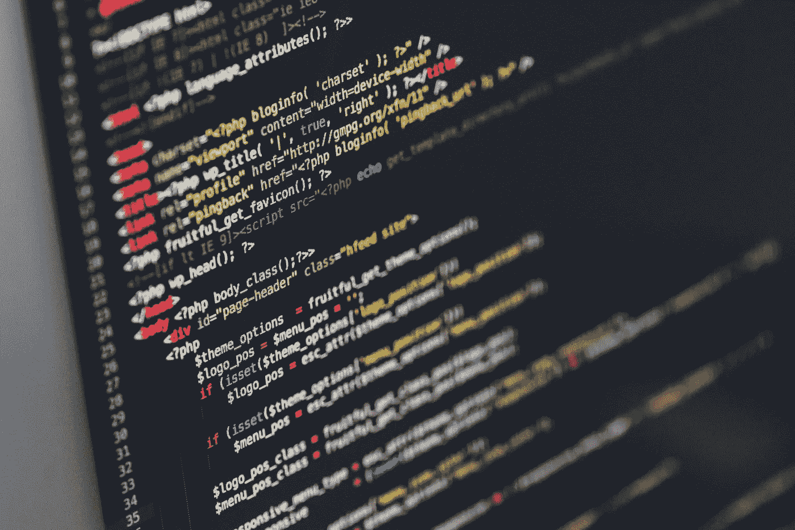

# 你不需要掌握代码库

> 原文：<https://levelup.gitconnected.com/you-dont-have-to-master-a-codebase-a3a065142885>

潜入一个新的代码库有时可能感觉像是准备潜入鲨鱼出没的水域。虽然你工作的公司可能有一个指导方针，但是人们用不同的方式解决问题。在一个小时的阅读后，来自从事同一项目的不同开发人员的大量评论可能开始看起来像噪音丛林。然而，你会觉得为了掌握代码库，你必须克服噪音。

盲目地逐行阅读代码是不可能实现任何形式的生产力的。如果你不理解第 10，000 行的代码，你可能也不会理解第 100，000 行的代码。我将向您展示如何破解代码读取过程，而不是使用暴力来获得源代码。这个技巧适用于所有类型的代码库。

万能的主人不是万能的主人。很容易陷入想知道一切的欣快中。但是阅读理解在哪个点上破坏了生产力呢？程序员不是律师，他们必须了解法律的来龙去脉才能构建一个强有力的论点。即便如此，律师也不会试图了解法律“代码库”的所有内容。律师只基于一个目标研究相关信息。

因此，作为开发人员，我们应该以实现 X 为目标来学习代码库。X 可以是在代码库中找到被团队中的其他工程师认为是优雅的代码，然后将优雅的解决方案与不那么优雅的解决方案进行比较。这种形式的比较可以让你熟悉代码库的整体质量。你可以用几个月的时间来尝试理解整个框架，而不是通过重构糟糕的代码来将优雅的解决方案应用到代码库的特定区域。当你决定改变你的目标时，你可以用一种有助于你完成新任务的方式来阅读代码库。

这种攻击代码库的方法是大象问题的解决方案。**你如何吃掉一头大象？**我第一次被问到这个问题是在高中的时候，我的美国历史老师停下来等待我的回答。根本没有。你把它切成小块，她最后说。出于某种原因，这个回答安抚了我。直到我在编码训练营学习如何编码，我才知道为什么会这样。在那之前，我一直认为学习编程意味着学习编程语言的方方面面。每一种方法都需要记忆和理解。然而，由于在九个月内学习如何编码的时间限制，学习所有的 JavaScript 和 Ruby 是不可能的。

当我开始解决越来越多的问题时，我终于打破了我的静态心态。我意识到，在老师的帮助下，我只需要懂一点点语言就可以解决一个特定的问题。我不需要强调知道所有的事情，因为所有的事情都已经被记录下来了。只要我知道去哪里找，我只是被我解决问题的能力所限制。知道这让我卸下了肩上的重担。

同样的原则也适用于学习代码库。你只需要知道代码库的一小部分。就像一门语言的各种特征一样，有些特征比其他特征用得更多。您应该优先考虑任务中最常用的代码库特性。代码库的其他方面可能包含数千行代码，根据代码库的整体大小，您很少(如果有的话)需要与之交互。

**有时候，你必须知道你要吃的是哪种青蛙**。实现一行新的代码可能看起来丑陋而可怕，但为了知道什么会破坏系统，这可能是必要的。在真正熟悉您正在处理的代码之前，您可能必须先动手。虽然追逐蝌蚪可能会感觉不那么可怕，但你必须问问自己，随着时间的流逝，你是否真的有所成就。如果没有，试着一次一个字节地读取代码。