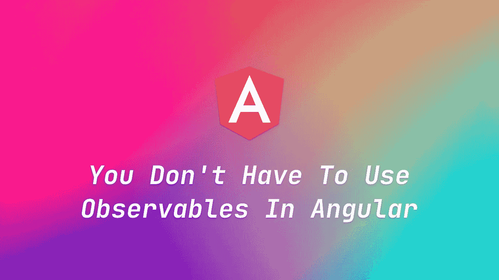
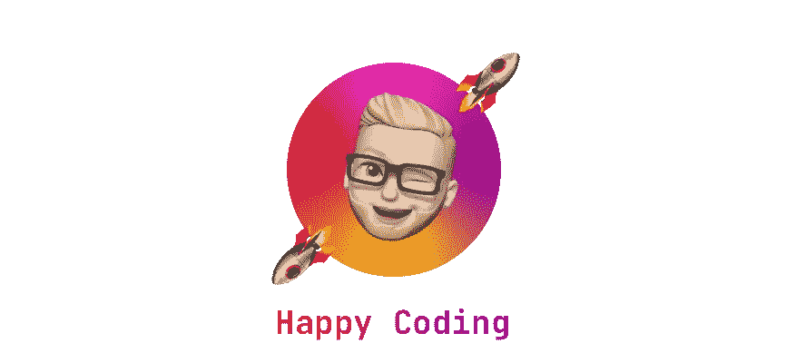

# 你不必在角度上使用可观测量

> 原文：<https://levelup.gitconnected.com/you-dont-have-to-use-observables-in-angular-4eac6372dd0>

## 没人告诉你的可观测量和承诺

在 Angular 中，你可以用两种不同的方式执行异步动作，Observables 和 Promises。

大多数人选择可观察的事物是因为博客和文档中的每个例子都告诉你要这样做。但是为什么呢？承诺有那么糟糕吗？或者有这么好的观察点？

在这篇文章中，我想和你一起探究为什么！为什么和什么时候我们应该使用可观的，什么时候承诺就可以了。

我们先来对比一下这两者。

# 可观察到的与承诺

让我们从可观察到的开始。

## 看得见的

Angular 正在引擎盖下使用 RxJS。RxJS 附带了一组很棒的特性，比如 Observables。

与承诺相比，可观察对象可以执行异步和同步操作。承诺只能执行异步操作。

当可观测量被创建时，它什么也不做，直到一段代码决定订阅它。你可以取消订阅 Observables，或者当错误发生时，它会自动退订。

可观测量处理一串值。它在稍后的时间点更新得非常快。

**可观察到的行为**

*   多重值
*   可以取消
*   非常适合实时信息
*   可以从多个地方订阅
*   错误自动退订
*   可观测量是说明性的。它们只有在订阅了某个内容时才会执行。
*   有一个内置的机制来执行数据转换(map、forEach、filter、reduce、retry 和 retryWhen 操作符)
*   可以是异步的，也可以是同步的

## 承诺

承诺是自 ES2015 (ES6)以来引入的一个通用 JavaScript 概念。它非常适合执行异步操作。它没有 Observables 这样的订户。

承诺不能像可观察的那样被取消。可以解决，也可以拒绝，不多也不少。它可以处理单个值，而不是一串值。

承诺是在创造时履行的，而不是像可观察物那样的订阅。

**承诺行为**

*   单一值
*   不能取消
*   非常适合单次信息
*   不能重复使用或分发信息
*   承诺是在创世时实现的
*   总是异步的

> 如果你想了解更多关于承诺的信息，查看[我之前写的一篇更详细的文章](https://hasnode.byrayray.dev/how-promises-actually-work-in-javascript-1c80b1af7193)

# 何时使用承诺或可观察的？

正如我们前面看到的，承诺和可观察到的之间最显著的区别是处理单个值和一系列值。

## 使用可观察的

对于数据在其生命周期内发生变化的情况，可观察值是理想的。

要使用的情况

*   例如，来自 WebSocket 的实时数据。想想仪表盘、聊天信息、通知、视频字幕、声音可视化。
*   或者用户经常执行的动作。例如，想想可折叠的菜单，黑暗和光明的模式。

这些情况要求数据在短时间内更新，至少在订阅的生命周期内更新。

## 使用承诺

因为承诺可以处理单个值，所以有很多情况可以使用它。

要使用的情况

*   表单提交:创建、编辑和删除数据实体不需要不断更新的数据流。表单数据被发送到 API 成功与否。
*   API 对不实时变化的数据的请求:显示概览页面或详细页面的大量数据

所有这些情况都不需要数据经常改变。数据由 API 调用收集、显示和处理。就这么简单。

# 为什么每个人都用 Observables 做任何事情？

这给我提出了一个问题。"为什么每个人都用 Observables 做任何事情？"

是的，这个话题我自己也有罪！我用一个可观察的。需要吗？不要！

保持订阅开放，而数据在可观察的生命周期内没有变化，这不是正确使用浏览器的能力。除此之外，大多数开发者(包括我自己)经常会忘记取消订阅他们的 Observable。

我的经验主要是:"*如果你不需要它，就不要包含或使用它！*

让我们不要浪费我们的资源，而是让每样东西都达到它的目的。

# 总结

好吧，大家都简单点。

> 对实时变化或在其生命周期内更频繁变化的数据使用可观测值。不要浪费资源！如果数据在一个组件的生命周期内没有改变，就使用承诺！

[**通过电子邮件获取我的文章点击这里**](https://blog.byrayray.dev/subscribe) **|** [**购买 5 美元中等会员资格**](https://blog.byrayray.dev/membership)

# 谢谢！

我希望你在读完这个故事后学到了新的东西，或者受到了启发去创造新的东西！如果我给你留下了问题或一些要说的话作为回应，向下滚动并给我键入一条消息。想保密的话请在 Twitter @ DevByRayRay*给我发个* [*DM。我的 DM 永远是开放的😁*](https://twitter.com/@devbyrayray)