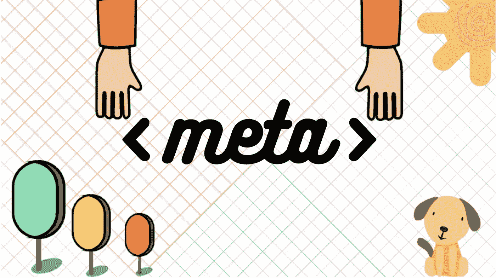
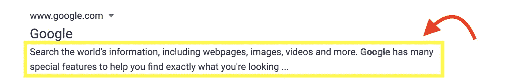

# 你不知道 Meta

> 原文：<https://levelup.gitconnected.com/you-dont-know-meta-a1ee7e381bc1>

## 理解 HTML 元标签的简单指南



你不知道 meta——由 Piyush Kochhar 创建

Meta 标签用于网页的元数据。这些标签在 head 标签中，并没有真正的视觉效果，但是对于搜索引擎优化(SEO)来说是至关重要的。这些标签被网络爬虫或浏览器读取。

当构建网页时，我们有许多元数据选项可用于定义关于网页的信息。除了页面标题、页面描述和字符集定义等基本信息之外，还可以为浏览器提供全面的信息。这种列表包括定义与网页内容、作者和版权信息、网页描述、网络爬虫指令等相关联的相关关键词。

元元素的一般语法是:

```
<meta name=" " content=" "/>
```

其中 name 属性指定元数据的名称，content 是与元名称相关联的值。

现在我们来看一些元素。

# **描述**

描述是搜索引擎优化最重要的 HTML 元标签之一。它也被称为**元描述**。它用于提供网页的简短摘要。根据谷歌的指导方针，描述应该是唯一的，每个网页都应该包含关于该网页的精确信息元描述。这个元描述对于用户理解网页的内容非常重要，因为它显示在搜索结果中。然而，重要的是要记住描述有 160 个字符的限制(包括空格)。此点之后的任何文本都将被删除，不完整的描述将出现在搜索结果中。没有人喜欢不完整的描述，可能只需要点击一下就可以了。

它看起来是这样的:

```
<meta name="description" content="I can tell you everything about this webpage under 160 characters"/>
```

当您使用搜索引擎进行搜索时，描述显示如下:



# 作者和版权

Author 和 copyright met 标签用于记录信息，如网站的创建者和版权所有信息。在一些内容管理系统(CMS)中，author 标签是自动插入的，并且总是给出最后编辑页面的人的名字。这将有助于管理员检查谁编辑了哪个页面。

看起来是这样的:

```
<meta name="author" content="Name of the author" /><meta name="copyright" content="Copyright information" />
```

# 字符编码

Web 浏览器需要字符编码信息来正确显示网页。为了定义字符编码，我们使用 charset 属性，并给它分配一个适当的值。最常用的字符编码是 UTF-8。我们使用 UTF 8，因为它有超过 10，000 个字符。字符集的其他可能值有:ASCII、ANSI、ISO-8859–1、Windows-1252 等。

这是它看起来的样子

```
<meta charset="UTF-8">
```

# 视口

Viewport meta 标签是必要的，因为它指示 web 浏览器(主要是移动 web 浏览器)如何在所有设备上呈现网页。viewport meta 标记还有两个属性:内容和初始比例。Google 建议每次将内容设置为 width=device-width，initial-scale=1，因为这将确保网页内容(主要是文本)正确呈现，即针对小屏幕阅读进行优化。

它看起来是这样的:

```
<meta name="viewport" content="width=device-width, initial-scale=1">
```

# 机器人

Robots 元标签用于为搜索引擎爬虫提供索引信息。以下 meta 标签用于确定网页是否可用于网络搜索，以及是否被添加到搜索引擎索引中。这个标签是与 SEO 最相关的元标签之一。

## 索引:

这使得网络爬虫能够索引你的网页。

```
<meta name="robots" content="follow"/>
```

值 ***跟随*** 也确保任何传出的超链接也被爬取。

## **诺指数**

它是索引的反义词。它告诉网络爬虫不要索引你的网页。

```
<meta name="robots" content="noindex"/>
```

## **不跟随**

它可以防止 web 爬网程序对网页上的超链接进行索引。

```
<meta name="robots" content="nofollow"/>
```

# Http 等价物

http-equivalents 属性用于包含通常包含在 http 头中的信息。它用于控制缓存信息、截止日期、刷新页面重定向等等。

## 缓存控制

当我们使用元标签" *cache-control* "和值" *no-cache* "时，我们阻止了网页的缓存，这意味着网页会在每次页面查看时重新加载。这可能会导致更长的加载时间，但在网页经常更新的情况下很有帮助。

```
<meta http-equiv="cache-control" content="no-cache"/>
```

## 期满

我们可以为网页数据设置到期日期，而不是完全阻止缓存。

当网页缓存到期时，网络浏览器将从源地址加载相应的 HTML 文档。我们可以使用秒或时间戳来设置到期时间:

```
<meta http-equiv="expires" content="4500"/>
```

*以上网页 4500 秒= > 75 分钟= > 1 小时 15 分钟到期。*

```
<meta http-equiv="expires" content="Thu, 06 Aug 2020 20:13:13 GMT"/>
```

*以上网页于 2020 年 8 月 6 日 20:13:13 到期。GMT 时间根据 24 小时制定义为 HH/MM/SS。*

## 恢复精神

而不是使用 JavaScript 或其他编程语言来使用复杂的方法重定向网页。HTML 提供了一个更加简洁和简单的解决方案。要重定向网页，我们需要将三个属性设置为:

```
<meta http-equiv="refresh" content="time(seconds); url=http://www.your-website.com/"/>
```

这里，内容的值被设置为重定向的等待时间(以秒为单位), url 被设置为要重定向到的网页。

# 关键词

我们可以在搜索引擎中使用关键字进行搜索。使用关键字进行搜索将向互联网用户显示网页，其中包含与其搜索相对应的关键字。优先选择那些在关键字元标签中包含适当搜索词的网页。在早期，关键字元标签曾经是 SEO 最重要的部分，也是搜索结果排名的核心功能。但是因为这个标签很容易被操纵，它现在被排除在谷歌的排名因素之外。即使关键词元标签对网页的排名没有积极的影响，如果我们过度使用它们，它仍然可能有负面影响。因此，一个好的做法应该包括关键字元标签和一组有限的适当的关键字。

看起来是这样的:

```
<meta name="keywords" content="keyword #1, keyword #2, keyword #3"/>
```

# 总结

还有很多元标签。您可能会遇到一些 HTML 文档，它们使用了今天不再需要的遗留 meta 标记。这是一个详尽的相关 meta 标签列表，对每个 web 开发人员来说，理解这些标签是必须的。