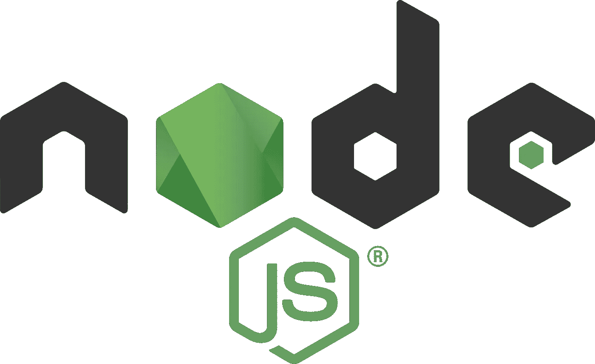

# 你不知道 Node

> 原文：<https://levelup.gitconnected.com/you-dont-know-node-ecdad3b6eb47>



很长一段时间，当我想到服务器端语言时，JavaScript 不在其中。虽然它在很大程度上是当今使用的最流行的编程语言之一，而且功能强大得令人难以置信，但我认为它严格来说是一种浏览器语言——后来我发现了 Node。

Node 建于 2009 年，是一个服务器端 JavaScript 环境。那么什么是*节点呢？网站本身的官方定义如下:*

> Node.js 是建立在 [Chrome 的 V8 JavaScript 引擎](https://developers.google.com/v8/)之上的 JavaScript 运行时。Node.js 使用事件驱动的非阻塞 I/O 模型，这使它变得轻量级和高效。Node.js 的包生态系统， [npm](https://www.npmjs.com/) ，是世界上最大的开源库生态系统。*—*[*node . js Foundation*](https://nodejs.org/en/)

酷毙了。但是这意味着什么呢？让我们把它分解一下。

## 事件驱动编程:

在 Node 中，我们在一个称为“事件循环”的架构中工作，这是 Node 如何通过使用一系列事件侦听器来处理高吞吐量场景，这些事件侦听器在检测到事件时执行回调；这些回调可以是同步的，也可以是异步的。如果这听起来仍然像基本的 JavaScript，很好——确实如此。对于 React.js 的任何用户来说，下面的定义听起来都非常熟悉:

> 事件驱动编程是由事件或状态变化决定的应用程序流控制。— [*特雷弗·诺里斯；理解 Node.js 事件循环'*](http://nodesource.com/blog/understanding-the-nodejs-event-loop/)

与浏览器中使用事件监听器如`.onclick()`或`.onsubmit()`的普通 JavaScript 相比，Node 使用了`EventEmitter`模块:

```
const EventEmitter = require('events');
```

节点对象(即套接字、服务器、流、HTTP 请求等。)通过`Event Emitter`的实例发出事件。值得注意的是，节点的内置模块*继承了`EventEmitter`的*，而定制模块需要成为*扩展*的类。下面是一个常见的例子:

```
class MyEmitter extends EventEmitter {
  //enter some emitter functionality here
}
```

然后，我们实例化发射器对象，并使用`.emit`函数来指示要发射的事件。例如，我们可以使用一个定制的事件发射器`WithLog`和`.on()`监听器来监听一个控制台日志，一旦检测到想要记录的字符串(即‘Hello World’)，它将执行一个回调函数(即 console . log(‘Hello to You Too！’)).

这种事件驱动编程是 Node 比传统的服务器端语言(如 Ruby、Python 或 Perl)更快的主要原因之一。

在这一点上，我们应该绝对清楚，尽管 Node 通过异步事件促进了并发性，并且具有高度可伸缩性，但它仍然被认为是*单线程*。正如之前的文章所讨论的，并发仅仅是构建结构来*促进*并行和多线程。与其他原生支持多线程的语言(比如 Ruby)相比，这可能是一个缺点。也就是说，让我们通过 Node 的另一个主要方面来进一步探索这种并发性:

## 非阻塞 I/O 模式:

Node.js 构建在几个依赖项之上。首先，我们将参考 [*libuv*](https://github.com/libuv/libuv) ，这是一个跨平台的库，*抽象了运行它的设备的操作系统所支持的*异步输入/输出调用。这使得 Node 可以在单个执行流中处理成千上万个异步调用，看起来像是同步的，而不是并行的。

你可以把它想象成一只非常非常擅长多任务处理的章鱼。它有有限数量的手臂，但可以分散注意力，协调各种任务之间的行动和时间，而不会错过任何一步。

当我们提到非阻塞时，我们指的是一种算法，它可以执行它的功能，而不会阻塞线程和阻止其他任务执行，直到它完成；*这个*是异步函数的美妙之处，它使得 JavaScript 比传统的服务器端编程语言更快更强大。

举一个非常简单的例子，假设我们用一个工作站和一个一次只能放一层烤盘的烤箱烘烤一个分层蛋糕。这是一个极其复杂的过程，需要注意力、时间和几个步骤的协调。在为蛋糕制作面糊并将底层平底锅放入烤箱烘烤后，我们现在必须等待一段时间——但是，我们也有一个凌乱的工作站，有面糊碗、勺子、碎蛋壳等。因为我们只有这么大的工作空间，而且我们知道一旦蛋糕烤好了，我们需要用这些空间来装饰蛋糕*和*我们需要把下一个平底锅放进去，我们可以通过多任务来节省时间。我们将第一层放入烤箱烘烤，在烘烤的同时，清理工作台，洗碗，只留下必要的装饰和糖霜材料。一旦这一层完成，我们将插入下一层，并重复这一过程，直到所有被清理和完成！


这也是 Node 为服务器端应用程序处理和执行事件的方式。这也使我们能够最大限度地利用 CPU 和内存。

那么 Node.js 和 JavaScript 有什么区别呢？记住， *JavaScript 是一种编程语言*。Node 是一个 *JavaScript* *运行时环境*，使用 V8 引擎(谷歌 Chrome 的引擎)和几个库依赖来处理事件驱动的非阻塞 I/O。而在浏览器中，我们使用 JavaScript 来修改网页(文本、图形、样式表等)， *Node* 使我们能够在浏览器外使用 JavaScript 来创建 shell 脚本并在硬件上运行，以便我们可以创建服务器或操作文件。