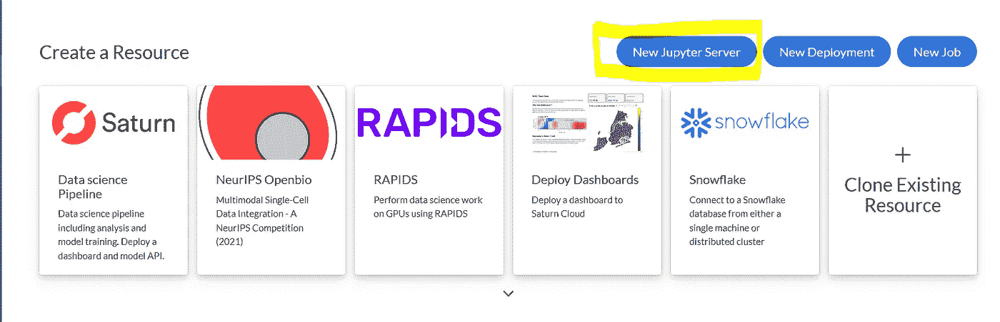
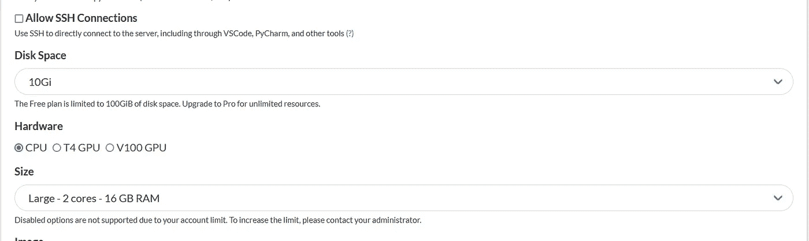
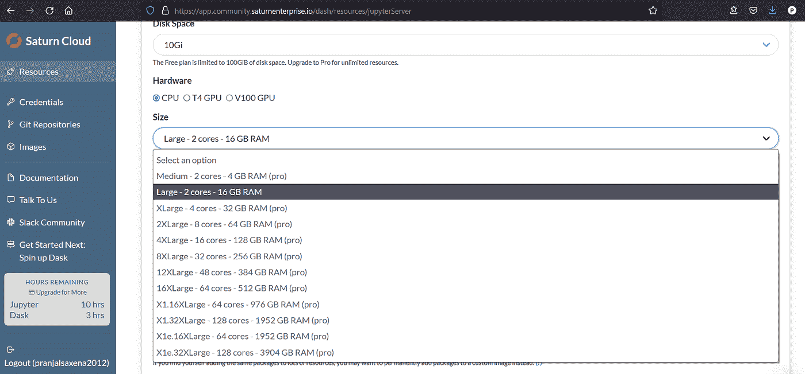
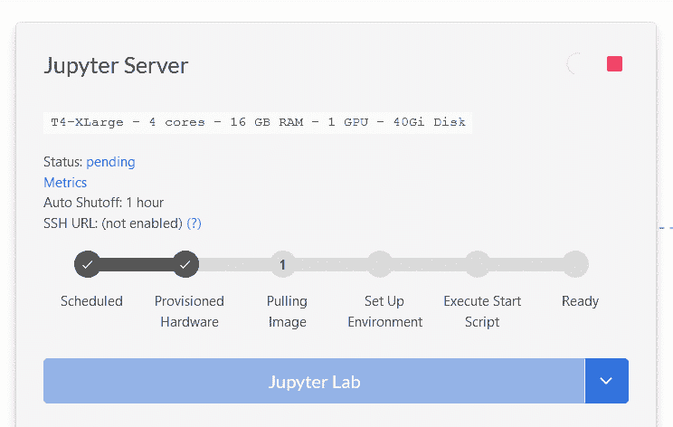
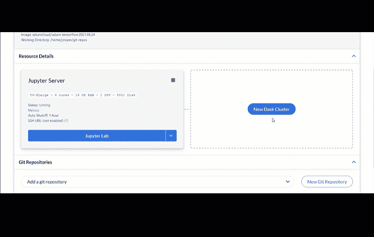

# 你不需要一个高端系统来训练你的机器学习模型

> 原文：<https://levelup.gitconnected.com/you-dont-need-a-high-end-system-to-train-your-machine-learning-model-da024d18b839>

## 基于云的解决方案是程序员和数据科学家的新未来


照片由 [**亚历山大·巴甫洛夫**波德瓦尔尼](https://www.pexels.com/@freestockpro?utm_content=attributionCopyText&utm_medium=referral&utm_source=pexels)发自[像素 ](https://www.pexels.com/photo/silhouette-of-person-on-cliff-beside-body-of-water-during-golden-hour-1060489/?utm_content=attributionCopyText&utm_medium=referral&utm_source=pexels)

机器学习和深度学习能力正在继续大幅扩展。我观察到许多行业采用数据科学方法的巨大潜力。

人们现在已经开始探索 python，并开始实践 python 环境，因为它现在是任何类型的数据科学任务的广泛接受的编程语言，然而，当我们进入机器学习部分时，我们通常会被机器性能和配置所困扰。

# 机器学习模型需要强大的可扩展环境

机器学习和深度学习领域需要强大、优质的机器来训练我们的模型。当我们转向更复杂的模型时，处理能力的重要性发挥了至关重要的作用。

像计算机视觉、图像分割、对象检测或任何基于文本的模型这样的深度学习领域都使用深度学习。深度学习模型更适合处理非结构化数据，但这些模型非常复杂，即使是一个基本的高端机器也无法很好地训练它们。因此，它需要更多的 RAM 和并行处理能力来在更短的时间内处理它们。

即使你设法为你的任务获得了一台高端机器，你也需要花大量的时间根据项目需求来配置你的机器学习环境。这不是一种用户友好的方式来处理您的机器学习和深度学习模型。

一旦您开始从事需要不同 python 版本或不同技术栈的不同项目，那么您将需要为它们创建单独的环境。应对这些不同的环境并不容易。

# **在土星云中处理多个机器学习环境**

我们需要一种解决方案，可以根据需要自动调整内存大小，并且我们不需要担心任何安装问题，而安装问题有时可能是有害的。此外，我们还需要一个系统，在该系统中，特定项目的不同环境可以以安全的方式保存，并且可以在以后访问时不会出现问题。

基于云的解决方案的好处是，您可以使用自己的个人计算机，并满足以下要求:

*   访问云托管的 Jupyter 服务器的浏览器
*   将您的数据转移到 google drive，这样您就不需要在每次运行 Jupyter 实验室时都上传数据。

一旦您将硬盘连接到托管的 Jupyter 实验室环境，您就可以开始工作了！

让我们看看这是如何操作的，我们如何做到这一点，以及它有多简单。我通常更喜欢用土星云进行我的模型训练，因为它为我提供了 Dask 集成，帮助我加快模型训练。

土星云是可扩展 Python 的数据科学和机器学习平台。数据科学家可以快速使用 Dask 集群、GPU、部署云资源来扩展他们的数据科学能力，在整个项目生命周期中进行协作，等等。

在 Saturn Cloud 中，您可以创建不同的 Jupyter 实验室，并根据项目进行配置。这样，您就不需要向环境中添加不必要的库。当项目数量增加并且您需要在不同的项目中使用不同版本的库时，这种做法可以节省时间。

# 启动云托管的 Jupyter 实验室

启动云托管的机器非常简单明了。你唯一需要的是一个可以粘贴到浏览器中的链接。好了，给你。您将在浏览器中看到一个 Jupyter 笔记本。让我们看看它的实际效果。

登录[土星云](https://saturncloud.io/?utm_source=Pranjal+Saxen&utm_medium=ML+Model+Article&utm_campaign=ML+Model+Article)后，你可以移动到[资源区](https://app.community.saturnenterprise.io/dash/resources)。然后点击新的 Jupyter 服务器。



作者截图

我最喜欢的部分是数据科学管道。当你需要部署端到端的机器学习或深度学习模型时，这非常方便。您可以在管道中配置完整的数据流和模型构建过程，最后，您可以自动运行它们。

此外，您还可以从您的管道中公开一个 API 调用，以便您可以在您的应用程序或网站中调用该模型。其他一些功能包括部署仪表板和连接到雪花数据库。当您部署仪表板时，这意味着您可以通过一个可共享的链接共享您托管的仪表板，任何有访问权限的人都可以查看和使用仪表板中的元素。类似的仪表板可以嵌入到您的应用程序或网站中，以供进一步使用。

# 配置您的资源

基于云的解决方案的主要好处是，您可以将特定的配置分配给特定的项目，因为不同的项目用例需要不同种类的系统配置。深度学习模型很复杂，因此它需要一个良好的 GPU 支持的系统在更短的时间内进行训练。

根据你的需求有效地管理你的资源是一个很好的实践。



根据您的训练历元大小和数据集大小，您可以选择 RAM 空间和磁盘空间。根据您的模型复杂性和数据大小来选择资源是一个很好的实践。否则，如果模型很简单，你的大部分记忆能力都不会被模型使用。

您可以随时使用内存更大的机器——Saturn Cloud 为机器提供高达 4TB 的内存。



云托管的 Jupyter 实验室还允许您访问高功率 GPU，这太棒了！您可以在自己喜欢的时间内使用任何 GPU，以便以更低的成本获得最多的 GPU。

# 运行并行模型实例

你也可以为不同的机器学习模型创建不同的资源。您可以为需要 GPU 能力的深度学习模型创建单独的资源，此外，您可以为简单的机器学习模型创建另一个资源，这可能不需要任何 GPU。

这种方法的好处是，您可以同时在不同的资源中运行许多不同的模型，并且不会因为一切都发生在云中而变慢。

# 启动您的云托管 Jupyter 实验室

一旦 Jupyter 服务器准备就绪，我们只需点击绿色按钮，让 Jupyter 笔记本准备运行，然后点击 Jupyter 笔记本，在 Jupyter 实验室下启动。



将会打开一个新标签，其中包含您的 Jupyter 实验室。



你将得到一个运行在云上的类似的 Jupyter 实验室。现在，你不需要担心你的内存问题。

现在，您可以单击“新建”按钮来创建您的。ipynb 笔记本。好消息是你甚至可以上传你自己的。ipynb 笔记本在这里。此外，您还可以导出您的任何。pdf、Html 或更多格式的 ipynb 笔记本。

# 控制您的模型版本

基于云的解决方案的好处是，您可以将您的 GitHub 或任何版本控制系统与您的帐户连接起来，这样每次调整您的模型配置时，您都可以将它们保存为不同的版本。

在这里，您不需要单独粘贴您的模型文件，大多数事情都是自动完成的。一段时间后，您的更改也会自动提交到 GitHub 中——这太棒了！

此外，您可以与其他人共享对回购的访问权限，这样整个团队就可以在相同的项目上进行协作。此外，您可以使用相同的 GitHub repo 来展示您之前的采访项目工作。

你在云上做的项目报告可以被你想要的人访问。如果有人想要查看您以前的构建模型报告，只需单击一下，您就可以生成报告，并与任何人共享。不要担心安全，这里的一切都很安全。

# 利用 Dask 进行并行计算

Dask 在并行计算方面非常受欢迎。但是，并行计算需要一个高质量的系统，这在你的个人机器上是不可行的。但是，在基于云的解决方案中，却是如此。

仅仅一行代码就能把你的熊猫代码转换成 Dask。

```
**import** dask 
**import** pandas **as** pd

**@dask.delayed**
**def** testfn**(**df**):**
    df1 **=** df**.**groupby**(**"PULocationID"**).**trip_distance**.**mean**()**
    **return** df1testfn**(**df**).**compute**()**
```

现在，如果您希望您的数据框架使用 dask 并行化，只需调用此`compute()`函数。

这里有一个熊猫的例子:

```
pandasDF**[[**"trip_distance"**]].**mean**()**
```

现在，如果我只添加 compute()函数，如下所示:

```
daskDF**[[**"trip_distance"**]].**mean**().**compute**()**
```

我们现在使用 dask 并行化。

# 做好行业准备

大多数行业已经启动了“向云迁移”计划。由于灵活性、安全性和易于使用的环境，大多数行业都倾向于基于云的解决方案。

所以，如果你已经熟悉在云端使用 Jupyter 笔记本，那么事情就简单多了。根据我对 Linkedin 和其他社交媒体平台的观察，许多行业仍在使用本地机器学习环境。

适应一个基于云的机器学习环境，一定会在你的职业生涯中打开另一个层面的未来机会和轻松。

这些云解决方案更好的一点是它们都遵循相似的用户体验。因此，在未来，如果你想尝试另一种云解决方案，那么你不会面临任何重大挑战。唯一改变的是这些云解决方案提供的便利。

你不会在 Google Colab 中找到 Dask 支持，但是你可以在土星云中找到它。

选择应该基于你的需要。如果您希望您的模型能够并行处理事情，那么就选择能够提供这种便利的云解决方案。

# 结论

在本文中，我们讨论了基于云的机器学习解决方案的旅程有多美好。

你不需要随身携带昂贵的高性能笔记本电脑，但一个带有互联网连接的浏览器就能为你做一切。我们还讨论了如何只需点击一下鼠标就能启动首个云托管的 Jupyter 实验室。

我们还讨论了如何根据项目需求配置 Jupyter 实验室，以优化您的成本和工作。现在，只需点击一下土星云，你就可以启动你的第一个云托管的 Jupyter 实验室。

随意看看[土星云](https://saturncloud.io/?utm_source=Pranjal+Saxen&utm_medium=ML+Model+Article&utm_campaign=ML+Model+Article)，在 Jupyter 实验室探索云托管的 Jupyter 笔记本的易用性，以及协作工具、部署等。

> 在你走之前…

如果你喜欢这篇文章，并希望**关注我即将发表的关于 **Python &数据科学**的**激动人心的**文章**，请点击这里[https://pranjalai.medium.com/membership](https://pranjalai.medium.com/membership)考虑成为一名中级会员。

通过这种方式，会员费的一部分归我，这激励我写更多关于 Python 和数据科学的令人兴奋的东西。

还有，可以随时订阅我的免费简讯: [**Pranjal 的简讯**](https://pranjalai.medium.com/subscribe) 。