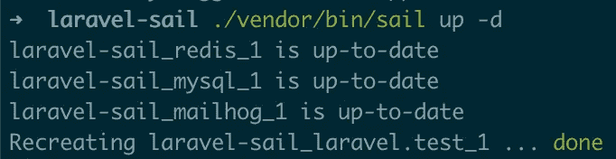
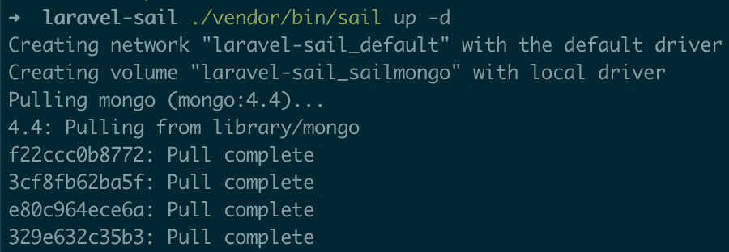
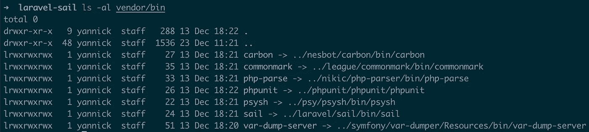

# 拉勒维尔帆船完全指南

> 原文：<https://levelup.gitconnected.com/you-dont-need-laravel-sail-e66b2dd8cffa>

## 它是什么，它是如何工作的，如何扩展它，以及为什么你可能根本不需要它


> ⚠️ **这个内容已经过时了。**这是在 Laravel Sail 首次发布后几天写的，从那以后 Sail 收到了一些更新，毫无疑问还会有更多更新。**请** [**访问我的博客**](https://tech.osteel.me/posts/you-dont-need-laravel-sail) **获取最新版本**，这是本指南最初发表的地方。谢谢你。

> *杜鲁门继续驾驶着他失事的帆船驶向无限后退的地平线。一切都很平静，直到我们看到船头突然撞上一堵巨大的蓝色墙壁，把杜鲁门撞倒在地。杜鲁门恢复过来，爬上甲板来到船头。在他头顶的海面上隐约可见一幅巨大的旋风图。他驶向的天空只不过是一幅画中的背景。*
> 
> *——安德鲁·m·尼科尔，* [*《楚门的世界》*](http://www.dailyscript.com/scripts/the-truman-show_shooting.html)

2020 年 12 月 8 日，Taylor Otwell 宣布推出基于 Docker 的开发环境 Laravel Sail，并对 Laravel 的文档进行了大规模修改:

该公告在整个社区引起了一阵兴奋，因为许多人认为新环境是最终进入 Docker 的一种方式；但它也留下了一些困惑，因为 Sail 引入了一种与其前辈截然不同的开发方法，并不是成为 Docker 专家的准确指南。

这个帖子是关于对 Laravel Sail 的期望，它是如何工作的，以及如何充分利用它；这也是对开发人员的一种恳求，要求他们脱离 it，支持他们自己的定制解决方案。

但是在我们到达那里之前，我们需要看一看甲板下面，从什么是帆的高层次解释开始。

# 什么是拉勒维尔帆？

Sail 是 Laravel 的最新开发环境。这是一个长长的列表中的最新成员，一方面是官方解决方案，如 [Homestead](https://laravel.com/docs/homestead) 和 [Valet](https://laravel.com/docs/valet) ，另一方面是社区努力，如 [Laragon](https://laragon.org) 、 [Laradock](http://laradock.io) 、[外卖](https://github.com/tighten/takeout)和[船只](https://vessel.shippingdocker.com/)(根据 [GitHub 知识库](https://github.com/laravel/sail#inspiration)，Sail 很大程度上是受后者的启发)。

Laravel Sail 基于 [Docker](https://www.docker.com) ，这是一种利用[容器](https://www.docker.com/resources/what-container)从本质上打包应用程序的技术，因此它们可以在任何操作系统上快速轻松地运行。

Sail 的未来似乎是光明的，因为 Laravel 文档已经将它描述为在本地安装和运行 Laravel 项目的首选方式，这是 Homestead 和 Valet 占据多年的一个地方。

# 它和它的前辈相比怎么样？

作为补充，Homestead 是一个[流浪者](https://www.vagrantup.com)盒子(一个虚拟机),预装了大多数 Laravel 应用程序需要的一切，包括像 PHP、MySQL 和 web 服务器(Nginx)这样的基本组件，但也有像 PostgreSQL、Redis 或 Memcached 这样不常用的技术。

另一方面，Valet 是一个面向 macOS 的轻量级环境，专注于性能，依赖于 PHP 的本地安装而不是虚拟机，旨在与其他服务一起使用，如 [DBngin](https://dbngin.com) 或外卖，以管理其他依赖关系，如数据库。

虽然宅地和代客看起来很不一样，但它们促进了当地发展的相同的一般方法，这也是大多数前述解决方案所共有的:它们试图成为 Laravel 项目的通用环境，并在一个屋檐下管理它们。

Sail 的方法与众不同，因为开发环境的描述包含在代码库的其余部分中。该项目没有依赖开发人员机器上的第三方解决方案，而是附带了一组指令，供 Docker 选择和构建相应的环境。

该应用程序自带电池，只要安装了 Docker，无论开发者的操作系统是什么，只需要一个命令就可以启动其开发环境。它还引入了为应用程序定制开发环境的概念，在我看来，这是 Laravel Sail 的真正亮点。

虽然这种方法与传统的解决方案有很大的不同，但 Sail 仍然在它所附带的工具方面与传统的解决方案有一些相似之处，其中一些是必不可少的，另一些则不是。

让我们回顾一下最重要的方法以及它们的实现方式。

# 它是如何工作的？

从现在开始，跟随 Laravel 的全新安装会更容易，尽管我提到的文件附带了到[官方 GitHub 库](https://github.com/laravel/sail)的链接。如果你有一点点时间，现在就去遵循你的操作系统的[指令，完成后再回来这里。](https://laravel.com/docs/installation#your-first-laravel-project)

虽然 Sail 允许我们在创建新的 Laravel 应用程序时选择感兴趣的服务，但默认情况下，它由三个主要组件组成:PHP、MySQL 和 Redis。根据[文档](https://laravel.com/docs/sail#introduction)，整个设置围绕着两个文件:`[docker-compose.yml](https://github.com/laravel/sail/blob/1.x/stubs/docker-compose.stub)`(在全新安装后，您将在项目的根目录下找到)和`[sail](https://github.com/laravel/sail/blob/1.x/bin/sail)`脚本(在`vendor/bin`下找到)。

# `docker-compose.yml`文件

如前所述，Laravel Sail 基于 Docker，这是一种利用容器的技术。根据经验，每个容器应该只运行一个进程；粗略地说，这意味着每个容器应该只运行一个软件。如果我们将这个规则应用到上面的设置中，我们将需要一个容器用于 PHP，另一个用于 MySQL，第三个用于 Redis。

这些容器组成了你的应用程序，它们需要被*编排*才能正常工作。有几种方法可以做到这一点，但 Laravel Sail 依靠 [Docker Compose](https://docs.docker.com/compose/) 来完成这项工作，这是最简单、最常用的本地设置解决方案。

Docker Compose 希望我们以 YAML 格式在一个`docker-compose.yml`文件中描述应用程序的各个组件。如果你打开项目根目录下的那个，你会在顶部看到一个`version`参数，在它下面有一个`services`部分，包含一个组件列表，包括我们刚刚提到的:`laravel.test`、`mysql`和`redis`。

我将首先描述`mysql`和`redis`服务，因为它们比`laravel.test`简单；然后，我将简要地介绍一下其他较小的，也是默认情况下新安装的。

## `mysql`服务

顾名思义，`mysql`服务处理 MySQL 数据库:

```
mysql:
    image: 'mysql:8.0'
    ports:
        - '${FORWARD_DB_PORT:-3306}:3306'
    environment:
        MYSQL_ROOT_PASSWORD: '${DB_PASSWORD}'
        MYSQL_DATABASE: '${DB_DATABASE}'
        MYSQL_USER: '${DB_USERNAME}'
        MYSQL_PASSWORD: '${DB_PASSWORD}'
        MYSQL_ALLOW_EMPTY_PASSWORD: 'yes'
    volumes:
        - 'sailmysql:/var/lib/mysql'
    networks:
        - sail
    healthcheck:
        test: ["CMD", "mysqladmin", "ping"]
```

`image`参数指示哪个*图像*应该用于该容器。理解图像和容器的区别的一个简单方法是借用面向对象编程的概念:图像类似于一个类，容器类似于该类的一个实例。

这里，我们指定我们想要使用`mysql`图像的标签`8.0`，对应于 MySQL 版本 8.0。默认情况下，图像从最大的图像注册中心下载。看看 MySQL 的页面——大多数图片都附有简单的文档，解释如何使用它。

`ports`键允许我们按照`local:container`格式将本地端口映射到集装箱端口。在上面的代码片段中，`FORWARD_DB_PORT`环境变量的值(如果该值为空，则为`3306`)被映射到容器的`3306`端口。这主要用于将第三方软件连接到数据库，如 [MySQL Workbench](https://www.mysql.com/products/workbench/) 或[Sequel Ace](https://sequel-ace.com/)；没有它，该设置也可以工作。

`environments`用于定义容器的环境变量。在这里，它们中的大多数接收现有环境变量的值，这些值是从项目根目录下的`.env`文件中加载的—`docker-compose.yml`自动检测并导入这个文件的内容。例如，在`MYSQL_ROOT_PASSWORD: '${DB_PASSWORD}'`行中，容器的`MYSQL_ROOT_PASSWORD`环境变量将从`.env`文件中接收`DB_PASSWORD`的值。

`volumes`是将容器的一些文件或文件夹声明为*卷*，要么通过将特定的本地文件或文件夹映射到它们，要么通过让 Docker 处理它。

这里定义了一个 Docker 管理的卷:`sailmysql`。这种类型的卷必须在单独的`volumes`部分声明，与`services`处于同一级别。我们可以在`docker-compose.yml`文件的底部找到它:

```
volumes:
    sailmysql:
        driver: local
    sailredis:
        driver: local
    sailmeilisearch:
        driver: local
```

`sailmysql`卷被映射到容器的`/var/lib/mysql`文件夹，这是 MySQL 数据存储的地方。这个卷确保了即使在容器被销毁时数据也是持久的，当我们运行`sail down`命令时就是这种情况。

`networks`部分允许我们指定容器应该在哪个内部网络上可用。这里，所有服务都连接到同一个`sail`网络，该网络也在`docker-compose.yml`的底部定义，在`volumes`网络上方的`networks`部分:

```
networks:
    sail:
        driver: bridge
```

最后，`healthcheck`是一种指示服务准备好需要满足哪些条件的方式，而不是仅仅从*开始*。我很快会回到这个话题。

## `redis`服务

`redis`服务与`mysql`服务非常相似:

```
redis:
    image: 'redis:alpine'
    ports:
        - '${FORWARD_REDIS_PORT:-6379}:6379'
    volumes:
        - 'sailredis:/data'
    networks:
        - sail
    healthcheck:
        test: ["CMD", "redis-cli", "ping"]
```

我们为 Redis ( [Alpine 是一个轻量级的 Linux 发行版【](https://alpinelinux.org/))拉出[官方镜像](https://hub.docker.com/_/redis)的`alpine`标签，并定义转发哪个端口；然后，我们声明一个卷来使数据持久化，将容器连接到`sail`网络，并定义要执行的检查，以便认为服务就绪。

## `laravel.test`服务

`laravel.test`服务更加复杂:

```
laravel.test:
    build:
        context: ./vendor/laravel/sail/runtimes/8.0
        dockerfile: Dockerfile
        args:
            WWWGROUP: '${WWWGROUP}'
    image: sail-8.0/app
    ports:
        - '${APP_PORT:-80}:80'
    environment:
        WWWUSER: '${WWWUSER}'
        LARAVEL_SAIL: 1
    volumes:
        - '.:/var/www/html'
    networks:
        - sail
    depends_on:
        - mysql
        - redis
        - selenium
```

对于初学者来说，这个名字有点混乱，但是这个服务就是处理 PHP 的服务(即服务于 Laravel 应用程序的服务)。

接下来，它有一个我们以前没见过的`build`键，指向`vendor/laravel/sail/runtimes/8.0`文件夹下的`[Dockerfile](https://github.com/laravel/sail/blob/1.x/runtimes/8.0/Dockerfile)`。

[Dockerfiles](https://docs.docker.com/engine/reference/builder/) 是包含构建图像指令的文本文档。Laravel 团队没有直接从 Docker Hub 中提取和使用现有的图像，而是选择在 Docker 文件中描述他们自己的图像。第一次运行`sail up`命令时，我们构建了这个映像并基于它创建了一个容器。

打开 docker 文件，看看第一行:

```
FROM ubuntu:20.04
```

这意味着`[ubuntu](https://hub.docker.com/_/ubuntu)` [图像](https://hub.docker.com/_/ubuntu)的标签`20.04`被用作自定义图像的起点；文件的其余部分本质上是一个构建它的指令列表，安装标准 Laravel 应用程序需要的所有东西。这包括 PHP、各种扩展和其他包，如 Git 或 Supervisor，以及 Composer。

文件的结尾也值得快速解释一下:

```
COPY start-container /usr/local/bin/start-container
COPY supervisord.conf /etc/supervisor/conf.d/supervisord.conf
COPY php.ini /etc/php/8.0/cli/conf.d/99-sail.ini
RUN chmod +x /usr/local/bin/start-containerEXPOSE 8000ENTRYPOINT [ "start-container" ]
```

我们可以看到一堆本地文件被复制到容器中:

*   `[php.ini](https://github.com/laravel/sail/blob/1.x/runtimes/8.0/php.ini)`文件是 PHP 的一些定制配置；
*   `[supervisord.conf](https://github.com/laravel/sail/blob/1.x/runtimes/8.0/supervisord.conf)`文件是[主管](http://supervisord.org/)的配置文件，这里的进程管理器负责启动 PHP 进程；
*   `[start-container](https://github.com/laravel/sail/blob/1.x/runtimes/8.0/start-container)`文件是一个 Bash 脚本，它将在容器每次启动时做一些事情，因为它被定义为容器的[入口点](https://docs.docker.com/engine/reference/builder/#entrypoint)。我们可以看到它是由`RUN chmod +x`指令执行的；
*   最后，`EXPOSE 8000`不做任何事情，除了通知读者这个容器在运行时监听指定的端口(这实际上在这里似乎是错误的，因为应用程序是在端口 80 而不是 8000 上服务的)。

这个 Other 文件中还发生了其他事情，但以上是它的要点。请注意，这一个属于 PHP 8.0，但 Laravel Sail 也附带了一个 [7.4 版本](https://github.com/laravel/sail/blob/1.x/runtimes/7.4/Dockerfile)，您可以改为从`docker-compose.yml`中的`laravel.test`服务指向。

该服务还有一个`depends_on`部分，包含其容器应该在 Laravel 应用程序之前准备好的服务列表。因为后者引用了 MySQL、Redis 和 Selenium，所以它们的应该首先启动并准备好，以避免连接错误。

这就是前面描述的健康检查有用的地方:默认情况下`depends_on`将等待指定的服务被*启动*，这不一定意味着它们已经*就绪*。通过指定这些服务在哪些条件下被认为是就绪的，我们确保它们在启动 Laravel 应用程序之前处于正确的状态。

其余的设置现在应该很熟悉了，所以我就跳过它们。

## `mailhog and selenium` meilisearch，服务

这些是我前面提到的较小的服务；这里的[这里的](https://laravel.com/docs/sail#meilisearch)，这里的[这里的](https://laravel.com/docs/sail#previewing-emails)和[这里的](https://laravel.com/docs/sail#laravel-dusk)都已经记录下来了。关键是它们的工作方式和其他的一样:它们从 Docker Hub 中提取现有的图像，并使用它们，只需要最少的配置。

# `sail`剧本

如果您按照 [Laravel 针对您的操作系统的安装说明](https://tech.osteel.me/posts/(https://laravel.com/docs/installation#your-first-laravel-project))，您一定在某个时候运行了以下命令:

```
$ ./vendor/bin/sail up
```

我们在这里称之为`[sail](https://github.com/laravel/sail/blob/1.x/bin/sail)`的文件是一个 Bash 脚本，本质上是在冗长的 Docker 命令之上添加了一个更加用户友好的层。

现在让我们打开它进行更仔细的检查(如果您不熟悉 Bash，也不用担心——它非常简单)。

我们可以忽略文件的整个第一部分，而专注于开头如下的大的`if`语句:

```
if [ $# -gt 0 ]; then
    # Source the ".env" file so Laravel's environment variables are available...
    if [ -f ./.env ]; then
        source ./.env
    fi
    # ...
```

简单地说，`$# -gt 0`位翻译成“如果参数的数量大于 0”，这意味着每当我们调用带有参数的`sail`脚本时，执行将进入那个`if`语句。

换句话说，当我们运行`./vendor/bin/sail up`命令时，我们用`up`参数调用`sail`脚本，执行进入大的`if`语句，在那里寻找与`up`参数匹配的条件。因为没有，所以脚本一直到大`if`的结尾，在那种我们可以找到的包罗万象的`else`中:

```
# Pass unknown commands to the "docker-compose" binary...
else
    docker-compose "$@"
fi
```

注释已经描述了正在发生的事情——脚本将`up`参数传递给`docker-compose`二进制文件。换句话说，当我们运行`./vendor/bin/sail up`时，我们实际上运行的是`docker-compose up`，这是[标准 Docker 编写命令](https://docs.docker.com/compose/reference/up/)，为`docker-compose.yml`中列出的服务启动容器。

如有必要，该命令首先下载相应的映像，并根据我们前面讨论的 Dockerfile 构建 Laravel 映像。

试试看！运行`./vendor/bin/sail up`然后`docker-compose up`——他们做同样的事情。

现在让我们看一个更复杂的例子，一个涉及 Composer 的例子，它是应用程序 Dockerfile 安装的包之一。但在此之前，让我们以[分离模式](https://laravel.com/docs/sail#starting-and-stopping-sail)在后台运行容器:

```
$ ./vendor/bin/sail up -d
```

`sail`脚本允许我们运行 Composer 命令，例如:

```
$ ./vendor/bin/sail composer --version
```

上面用`composer`和`--version`作为参数调用了`sail`脚本，这意味着执行将再次进入那个大的`if`语句。

让我们搜索与 Composer 相关的条件:

```
# ...
# Proxy Composer commands to the "composer" binary on the application container...
elif [ "$1" == "composer" ]; then
    shift 1

    if [ "$EXEC" == "yes" ]; then
        docker-compose exec \
            -u sail \
            "$APP_SERVICE" \
            composer "$@"
    else
        sail_is_not_running
    fi
    # ...
```

条件的第一行以`shift`开始，这是一个内置的 Bash*，它跳过了和它后面的数字一样多的参数。在这种情况下，`shift 1`跳过`composer`参数，使`--version`成为新的第一个参数。然后，该程序确保 Sail 正在运行，然后执行一个奇怪的命令，该命令分为四行，我将其分解如下:*

```
docker-compose exec \
    -u sail \
    "$APP_SERVICE" \
    composer "$@"
```

Docker Compose 允许我们在已经运行的容器上执行命令。`-u`是一个选项，指示我们希望以哪个用户的身份执行命令，`$APP_SERVICE`是我们希望在其上运行命令的容器。这里，它的值是`laravel.test`，这是服务在`docker-compose.yml`中的名称，如前一节所述。它后面是我们在容器中想要运行的命令，即`composer`，后面是脚本的所有参数。这些现在只包括`--version`，因为我们已经跳过了第一个参数。

换句话说，当我们跑步时:

```
$ ./vendor/bin/sail composer --version
```

在后台执行的命令如下:

```
$ docker-compose exec -u sail "laravel.test" composer "--version"
```

每次都键入这种命令会很麻烦；这就是为什么`sail`脚本为它们提供了快捷方式，让用户体验更加流畅。

看看大语句中其余较小的`if`语句，看看还包括了什么——你会发现大致相同的原则适用于任何地方。

还有其他一些现成的特性(比如[公开本地容器](https://laravel.com/docs/sail#sharing-your-site)，但是我们现在已经介绍了 Laravel Sail 目前提供的内容。虽然这已经是一个很好的开始，但是它还是有一定的局限性，即使对于一个基本的应用程序来说也是如此。

好消息是 Laravel 团队意识到了这一点，并在构建环境时考虑了扩展:

> 由于 Sail 只是一个 Docker，你可以自由地定制它的任何东西。
> 
> *–*[*拉里韦尔文档*](https://laravel.com/docs/sail#sail-customization)

让我们看看这在实践中意味着什么。

# 展开拉勒维尔帆

本节中的代码也可以作为 GitHub 库随时查阅。

我们将探索三种扩展 Laravel Sail 的方法，以 [MongoDB](https://www.mongodb.com) 为借口；但在我们继续之前，让我们确保尽可能多的拿到文件。

我们最初唯一可以访问的是`[docker-compose.yml](https://github.com/laravel/sail/blob/1.x/stubs/docker-compose.stub)`文件，但是我们可以使用下面的命令发布更多的资产，这将在项目的根目录下创建一个新的`docker`文件夹:

```
$ ./vendor/bin/sail artisan sail:publish
```

我们一会儿会回到这些。目前，让我们试着安装 [Laravel MongoDB](https://github.com/jenssegers/laravel-mongodb) 包，它将使 MongoDB 与我们最喜欢的框架一起使用变得容易:

```
$ ./vendor/bin/sail composer require jenssegers/mongodb
```

不幸的是，Composer 抱怨缺少一些扩展:

```
mongodb/mongodb[dev-master, 1.8.0-RC1, ..., v1.8.x-dev] require ext-mongodb ^1.8.1 -> it is missing from your system. Install or enable PHP's mongodb extension
```

让我们来解决这个问题！

# 安装额外的扩展

在这篇文章的前面，我们讨论了 Sail 如何使用 Dockerfiles 构建符合 Laravel 对 PHP 7.4 和 PHP 8.0 的要求的图像。这些文件是用我们在本节开始时运行的命令发布的——我们添加扩展所需要做的就是编辑它们并重建相应的映像。

许多扩展都是现成可用的，我们可以使用以下命令列出它们:

```
$ ./vendor/bin/sail php -m
```

MongoDB 不是它们的一部分；要添加它，打开`docker/8.0/Dockerfile`文件，找到安装各种包的`RUN`指令:

```
RUN apt-get update \
    && apt-get install -y gnupg gosu curl ca-certificates zip unzip git supervisor sqlite3 libcap2-bin \
    && mkdir -p ~/.gnupg \
    && echo "disable-ipv6" >> ~/.gnupg/dirmngr.conf \
    && apt-key adv --homedir ~/.gnupg --keyserver hkp://keyserver.ubuntu.com:80 --recv-keys E5267A6C \
    && apt-key adv --homedir ~/.gnupg --keyserver hkp://keyserver.ubuntu.com:80 --recv-keys C300EE8C \
    && echo "deb http://ppa.launchpad.net/ondrej/php/ubuntu focal main" > /etc/apt/sources.list.d/ppa_ondrej_php.list \
    && apt-get update \
    && apt-get install -y php8.0-cli php8.0-dev \
       php8.0-pgsql php8.0-sqlite3 php8.0-gd \
       php8.0-curl php8.0-memcached \
       php8.0-imap php8.0-mysql php8.0-mbstring \
       php8.0-xml php8.0-zip php8.0-bcmath php8.0-soap \
       php8.0-intl php8.0-readline \
       php8.0-msgpack php8.0-igbinary php8.0-ldap \
       php8.0-redis \
    && php -r "readfile('http://getcomposer.org/installer');" | php -- --install-dir=/usr/bin/ --filename=composer \
    && curl -sL https://deb.nodesource.com/setup_15.x | bash - \
    && apt-get install -y nodejs \
    && apt-get -y autoremove \
    && apt-get clean \
    && rm -rf /var/lib/apt/lists/* /tmp/* /var/tmp/
```

很容易识别与 PHP 扩展相关的块，因为它们都以`php8.0`开头。修改列表的末尾，使其看起来像这样:

```
php8.0-redis php8.0-mongodb \
```

你可以在这里看到 Ubuntu 20.04 可用 PHP 扩展的细节[。](https://packages.ubuntu.com/focal/php/)

保存文件并运行以下命令:

```
$ ./vendor/bin/sail build
```

这将遍历`docker-compose.yml`文件中列出的所有服务，如果它们发生了变化，将构建相应的映像，包括`laravel.test`服务，我们刚刚更新了它的 Dockerfile。

完成后，再次启动容器:

```
$ ./vendor/bin/sail up -d
```

该命令将检测到对应于`laravel.test`服务的映像已经改变，并重新创建容器:



就是这样！现在已经安装并启用了 PHP 的 MongoDB 扩展。我们只为 PHP 8.0 镜像做了这件事，但是你可以通过更新`docker/7.4/Dockerfile`文件，用`php7.4-mongodb`作为扩展名，将同样的过程应用于 PHP 7.4。

我们现在可以安全地导入 Laravel 包了:

```
$ ./vendor/bin/sail composer require jenssegers/mongodb
```

接下来:为 MongoDB 添加 Docker 服务。

# 添加新服务

MongoDB 本质上是另一个数据库；因此，相应的服务将与 MySQL 和 Redis 非常相似。在 [Docker Hub](https://hub.docker.com) 上快速搜索会发现[有它的官方图片](https://hub.docker.com/_/mongo)，我们将使用它。

它的文档包含一个 Docker Compose 的示例配置，我们可以根据需要复制和调整它。打开`docker-compose.yml`，在其他服务之后，在底部添加以下服务:

```
mongo:
    image: 'mongo:4.4'
    restart: always
    environment:
        MONGO_INITDB_ROOT_USERNAME: '${DB_USERNAME}'
        MONGO_INITDB_ROOT_PASSWORD: '${DB_PASSWORD}'
        MONGO_INITDB_DATABASE: '${DB_DATABASE}'
    volumes:
        - 'sailmongo:/data/db'
    networks:
        - sail
```

我所做的更改如下:首先，我指定了`mongo`图像的标签`4.4`。如果不指定，Docker Compose 将默认提取`latest`标记，这不是一个好的做法，因为随着时间的推移，随着新版本的出现，它将引用不同版本的 MongoDB。引入突破性的改变可能会导致 Docker 设置的不稳定性，所以最好瞄准一个特定的版本，尽可能匹配产品版本。

然后，我为容器声明了一个`MONGO_INITDB_DATABASE`环境变量，以便在启动时创建一个具有相应名称的数据库，并且我将每个环境变量的值与来自`.env`文件的值进行匹配(我们稍后将回到这些)。

我还添加了一个`volumes`部分，将 Docker 管理的卷挂载到容器的`/data/db`文件夹中。这里与 MySQL 和 Redis 相同的原理也适用:如果不在本地机器上持久化数据，那么每次 MongoDB 容器被销毁时，数据都会丢失。换句话说，由于 MongoDB 数据存储在容器的`/data/db`文件夹中，我们使用一个卷在本地持久存储该文件夹。

由于该卷尚不存在，我们需要在`docker-compose.yml`的底部声明它，在其他卷之后:

```
volumes:
    sailmysql:
        driver: local
    sailredis:
        driver: local
    sailmeilisearch:
        driver: local
    sailmongo:
        driver: local
```

最后，我添加了`networks`部分，以确保该服务与其他服务在同一个网络上。

我们现在可以按照包的[指令](https://github.com/jenssegers/laravel-mongodb#configuration)配置 Laravel MongoDB。打开`config/database.php`并添加以下数据库连接:

```
'mongodb' => [
    'driver' => 'mongodb',
    'host' => env('DB_HOST'),
    'port' => env('DB_PORT'),
    'database' => env('DB_DATABASE'),
    'username' => env('DB_USERNAME'),
    'password' => env('DB_PASSWORD'),
    'options' => [
        'database' => env('DB_AUTHENTICATION_DATABASE', 'admin'),
    ],
],
```

打开项目根目录下的`.env`文件，并按如下方式更改数据库值:

```
DB_CONNECTION=mongodb
DB_HOST=mongo
DB_PORT=27017
DB_DATABASE=laravel_sail
DB_USERNAME=root
DB_PASSWORD=root
```

以上使得 MongoDB 成为主要的数据库连接；在一个真实的场景中，您可能希望使它成为一个像 Redis 一样的辅助数据库，但是出于演示的目的，这也可以。

`DB_HOST`是来自`docker-compose.yml`的 MongoDB 服务的名称；在幕后，Docker Compose 将服务的名称解析为它所管理的网络上的容器的 IP(在我们的例子中，这是在`docker-compose.yml`结束时定义的单个`sail`网络)。

`DB_PORT`是 MongoDB 可用的端口，根据[图片的描述](https://hub.docker.com/_/mongo)，默认为`27017`。

我们准备好测试了！再次运行以下命令:

```
$ ./vendor/bin/sail up -d
```

它将下载 MongoDB 的映像，创建新的卷并启动新的容器，这也将创建`laravel_sail`数据库:



让我们通过运行 Laravel 的默认迁移来确保这一点:

```
$ ./vendor/bin/sail artisan migrate
```

我们可以通过更新`User`模型来进一步推动测试，因此[扩展了](https://github.com/jenssegers/laravel-mongodb#extending-the-authenticable-base-model) Laravel MongoDB 的`Authenticable`模型:

```
<?php

namespace App\Models;

use Illuminate\Contracts\Auth\MustVerifyEmail;
use Illuminate\Database\Eloquent\Factories\HasFactory;
use Illuminate\Notifications\Notifiable;
use Jenssegers\Mongodb\Auth\User as Authenticatable;

class User extends Authenticatable
{
    // ...
```

使用 Tinker 尝试创建一个模型:

```
$ ./vendor/bin/sail tinkerPsy Shell v0.10.5 (PHP 8.0.0 - cli) by Justin Hileman
>>> \App\Models\User::factory()->create();
```

太好了！我们的 MongoDB 集成是有效的。

我们可以使用 Tinker 和口才与它保持交互，但通常通过第三方软件或通过命令行界面(如 [Mongo shell](https://docs.mongodb.com/manual/mongo/) )直接访问数据库是有用的。

让我们将后者添加到我们的设置中。

# 自定义`sail`命令

好消息是，只要我们知道召唤它的正确方法，Mongo 外壳就已经存在了。下面是一些额外的命令(用粗体突出显示)，用于登录数据库并列出用户(从项目的根目录运行第一个命令):

```
$ docker-compose exec mongo mongo

MongoDB shell version v4.4.2
connecting to: mongodb://127.0.0.1:27017/?compressors=disabled&gssapiServiceName=mongodb
Implicit session: session { "id" : UUID("919072cf-817d-43a6-9ffb-c5e721eeefbc") }
MongoDB server version: 4.4.2
Welcome to the MongoDB shell.
For interactive help, type "help".
For more comprehensive documentation, see
    https://docs.mongodb.com/
Questions? Try the MongoDB Developer Community Forums
    https://community.mongodb.com
**> use admin**
switched to db admin
**> db.auth("root", "root")**
1
**> use laravel_sail**
switched to db laravel_sail
**> db.users.find()**
```

`docker-compose exec mongo mongo`命令看起来应该很熟悉；在本文的前面，我们看到了`sail`脚本在幕后做了什么，主要包括将简单的`sail`命令翻译成更复杂的`docker-compose`命令。这里，我们告诉`docker-compose`二进制文件在`mongo`容器上执行`mongo`命令。

公平地说，这个命令并不太糟糕，我们可以很容易地记住它；但是为了保持一致性，最好有一个更简单的等价的`sail`,如下所示:

```
$ ./vendor/bin/sail mongo
```

为了实现这一点，我们需要以某种方式完成`sail`脚本，但是由于它位于`vendor`文件夹中——它是由 Composer 创建的——我们不能直接更新它。我们需要一种在不修改它的情况下构建它的方法，我总结如下:

1.  在项目的根目录下复制一份`sail`脚本；
2.  用自定义条件替换其大`if`语句的内容；
3.  如果没有一个定制条件与当前参数匹配，那么将它们传递给原始的`sail`脚本。

如果我们仔细看看带有`ls -al`的`sail`文件，我们可以看到它是一个到`vendor/laravel/sail/bin/sail`文件的符号链接:



现在让我们将该文件复制到项目的根目录:

```
$ cp vendor/laravel/sail/bin/sail .
```

打开新副本，将大`if`的内容替换为以下内容，其余内容保持不变:

```
if [ $# -gt 0 ]; then
    # Source the ".env" file so Laravel's environment variables are available...
    if [ -f ./.env ]; then
        source ./.env
    fi

    # Initiate a Mongo shell terminal session within the "mongo" container...
    if [ "$1" == "mongo" ]; then

        if [ "$EXEC" == "yes" ]; then
            docker-compose exec mongo mongo
        else
            sail_is_not_running
        fi

    # Pass unknown commands to the original "sail" script..
    else
        ./vendor/bin/sail "$@"
    fi
fi
```

在上面的代码中，我们删除了 big `if`中的所有`if...else`条件，并添加了一个我们自己的条件，如果脚本的第一个参数的值是`mongo`，它将运行我们之前用来访问 Mongo shell 的命令。如果不是，执行将命中最后一个`else`语句，并调用带有所有参数的原始`sail`脚本。

您现在可以尝试一下——保存文件并运行以下命令:

```
$ ./sail mongo
```

它应该会在您的终端中打开一个 Mongo shell 会话。

尝试另一个命令，以确保原始的`sail`脚本在它应该:

```
$ ./sail artisan
```

应显示 Artisan 菜单。

就是这样！如果您需要更多的命令，您可以将它们作为新的`if...else`条件添加到项目根目录下的`sail`脚本副本的大`if`中。

它以完全相同的方式工作，除了您现在需要运行`./sail`而不是`./vendor/bin/sail`(或者更新您的 Bash 别名，如果您按照[文档](https://laravel.com/docs/sail#configuring-a-bash-alias)中的建议创建了一个的话)。

作为 Docker 设置的一部分，我们现在运行一个 MongoDB 的全功能实例，与 Laravel Sail 很好地集成在一起。但是 MongoDB 在这里只是一个例子——几乎任何你想使用的技术都可以做到这一点。

快去[看看](https://hub.docker.com)！大多数主要演员都有 Docker 图像(官方或社区维护的)，并有易于遵循的说明。在大多数情况下，您将在几分钟内拥有一个运行该软件的本地实例。

我们可能还可以做更多的事情来定制 Laravel Sail，但是上面描述的三种方法应该已经帮了你很大的忙了。

在这个阶段，您可能会认为 Laravel 的新环境有很多优点，甚至比您最初想象的还要多。然而，本文的重点是避免使用它…

那么，我该怎么做呢？

> **为什么不用外卖？**
> 
> 在阅读本节时，您可能会想到，像[外卖](https://tech.osteel.me/posts/you-dont-need-laravel-sail)这样的现有解决方案会立即支持 MongoDB。虽然将 Sail 与其他技术结合使用是[可能的](https://mattstauffer.com/blog/how-to-use-takeout-to-add-new-services-to-laravel-sail-and-save-ram/)并且会弥补它目前的一些限制，但是依赖外卖会重新引入对第三方的依赖。我们希望团队中的每个人都在他们的机器上安装和配置外卖，而不仅仅是使用 Docker。
> 
> Sail 为整个开发环境由作为代码库一部分的单个`docker-compose.yml`文件处理开辟了道路。我的观点是，如果我们走这条路，我们应该一直拥抱它，让 Docker 成为唯一的第三方依赖。
> 
> 这并不是说外卖没有任何用处；避免一些我们将在本文后面讨论的性能问题是很有意义的。

# 拉沃尔·赛欧到底怎么了？

如果您已经走了这么远，您可能会想知道 Laravel Sail 有什么问题，现在已经清楚我们可以把它推进多远了。

让我现在就告诉你:一旦你知道并理解了我在前面几节中解释的所有内容，你就不再需要 Laravel Sail 了。

没错——你可以带着这些知识离开。

但在我详细阐述之前，让我们回顾一下 Sail 的一些实际痛点，尽管我预计 Laravel 团队会尽快解决其中的大部分问题。

第一个是关于定制的`sail`命令:虽然可以像前面演示的那样扩展`sail`脚本，但是这个过程有点难看，也有点粗糙。Sail 的维护者可以通过一个显式的 Bash 扩展点来解决这个问题，允许用户添加他们自己的快捷方式，或者通过发布`sail`脚本和其他文件来解决。

其次，Laravel 应用程序由 PHP 的开发服务器提供服务。我不会在这里讲太多细节，但是正如之前提到的 [Supervisor](http://supervisord.org/) 管理`laravel.test`容器中的 PHP 进程；[这一行](https://github.com/laravel/sail/blob/1.x/runtimes/8.0/supervisord.conf#L5)是 Supervisor 运行`php artisan serve`命令的地方，它在幕后启动 PHP 的开发服务器。

这里的要点是，环境没有使用适当的网络服务器(如 Nginx)，这意味着我们不能轻松地拥有本地域名，也不能将 HTTPS 带到设置中。这对于快速原型开发来说可能没问题，但是更复杂的开发很可能需要这些。

第三个问题是我在尝试克隆和运行本文的[库](https://github.com/osteel/laravel-sail-extended)的一个新实例进行测试时注意到的。虽然基于 Sail 创建一个新的 Laravel 项目的过程运行良好，但我找不到安装和运行现有项目的正确说明。

您不能运行`./vendor/bin/sail up`，因为`vendor`文件夹尚不存在。要创建这个文件夹，您需要运行`composer install`；但是如果您的项目依赖于 Docker 映像上的依赖项，而不是本地机器上的依赖项，`composer install`就不会工作。你可以转而运行`composer install --ignore-platform-reqs`，但那感觉不对。应该有一种方法来安装和运行现有项目，而不依赖于本地 Composer 实例和笨重的命令。

最后一个问题属于单独的类别，因为它与 Docker 整体相关，而不是 Laravel Sail 具体相关。在走上码头工人之路之前，它应该被仔细考虑，并且值得拥有自己的一部分。

# 船舱里的鲸鱼

迄今为止，对话中似乎没有提到的一个主要警告与性能有关。虽然这不应该影响 Linux 用户，但如果你在你的系统上运行 Docker Desktop，你很可能会经历很长的加载时间，尤其是在 macOS 上(似乎在 Windows 上使用 [WSL 2](https://docs.docker.com/docker-for-windows/wsl/) 可以缓解缓慢)。

你现在就可以看到:如果你正在使用 Docker 桌面并且 Sail 正在运行，尝试加载 [Laravel 欢迎页面](http://localhost)——你可能会注意到延迟。

我不会在这里做太多的详细介绍，但是原因主要来自主机的底层文件系统，它在挂载的本地目录周围不能很好地执行。正如我们所看到的，这就是 Laravel Sail 在 Laravel 应用程序的容器中获取应用程序源代码的方式，因此速度很慢。

这就是像外卖这样的方法有意义的地方，因为他们不是从 Docker 容器运行 PHP，而是希望开发人员在他们的本地机器上运行它(例如通过 [Valet](https://laravel.com/docs/valet) )，同时提供像 MySQL 或 MongoDB 这样的服务实例，从而在不牺牲性能的情况下提供便利。但在我看来，从你选择通过 Docker 容器运行 PHP 的那一刻起(就像 Sail 那样)，外卖的附加值就降低了。

有减轻这些性能问题的策略，但是 Laravel 文档中没有提到它们，更不用说性能可能是一个问题的事实了，这让我感到惊讶。

也就是说，您可能对现有的性能已经足够满意了；就我而言，多年来我一直对它很满意，尽管我在 macOS 上使用 Docker Desktop。底线是，在将您的整个设置迁移到一个在容器中运行 PHP 的解决方案之前，应该仔细考虑这一方面，无论是 Laravel Sail 还是其他什么。

但是，一旦您做出了决定，无论其他问题最终是否得到解决，本文的主要思想都是一样的。

# 你不需要拉弗尔帆

如果您正在考虑使用 Laravel Sail 作为您的开发环境来构建任何实质性的东西，迟早您将不得不扩展它。你会发现自己在 docker 文件中摸索，最终写出自己的文件；不得不向`docker-compose.yml`添加一些服务；可能还会加入一些定制的 Bash 命令。

一旦你到了那里，有一个问题你应该问自己:

> *是什么阻止了我构建自己的系统？*

答案是*没事*。一旦你对扩展 Laravel Sail 感到满意，你就已经具备了构建自己的环境所需的知识。

想想看:`docker-compose.yml`文件并不特定于 Laravel Sail，这就是 Docker Compose 的工作方式。Docker 文件也是如此——它们是标准的 Docker 文件。巴什层？这就是全部内容——一些 Bash 代码，如您所见，并不复杂。

那么为什么要人为的把自己约束在赛欧的约束之内呢？

而且更重要的是:为什么要把自己限制在 Laravel 的上下文中使用 Docker？

您的应用程序可能一开始就是一个整体，但也不总是如此。也许你有一个独立的前端，你使用 Laravel 作为 API 层。在这种情况下，您可能希望您的开发环境同时管理它们；同时运行它们，以便它们像在临时环境或生产环境中一样相互交互。

如果你的整个应用程序是一个 [monorepo](https://en.wikipedia.org/wiki/Monorepo) ，你的 Docker 配置和 Bash 脚本可以在项目的根目录下，你可以将你的前端和后端应用程序放在单独的子文件夹中，例如在一个`src`文件夹下。

相应的树视图如下所示:

```
my-app/
├── bash-script
├── docker-compose.yml
└── src/
    ├── backend/
    │   └── Dockerfile
    └── frontend/
        └── Dockerfile
```

`docker-compose.yml`文件将声明两个服务——一个用于后端，一个用于前端——都指向各自的 docker 文件。

如果后端和前端位于不同的存储库中，您可以创建第三个存储库，专门包含您的 Docker 开发环境。只需 *git-ignore* the `src` folder 并完成您的 Bash 脚本，以便它将两个应用程序存储库都拉入其中，使用您通常手动运行的相同命令。

即使您的项目是一个 Laravel monolith，这种结构也比将开发相关的文件与其余的源代码混合在一起要干净得多。此外，如果您的应用程序变得更大，并且除了 Laravel 之外还需要其他组件，那么您已经可以很好地支持它们。

一旦你努力理解 Laravel Sail 并对其进行扩展，就没有什么能阻止你构建自己的开发环境，*不管 Laravel 是否是等式的一部分*。没错，你可以为任何东西构建定制的基于 Docker 的环境。

如果 Laravel 是堆栈的一部分，如果您还不习惯编写自己的 docker 文件，没有什么可以阻止您重用 Sail 的 docker 文件；毕竟，它们已经针对 Laravel 进行了优化。同样，如果有帮助的话，你可以从 Sail 的`docker-compose.yml`文件中获得灵感。

# 结论

不要误解我的意思:Laravel Sail 有很多优势，我很高兴看到这样一个成熟的演员推动 Docker 在本地开发中的应用。

我们热爱我们的框架，因为它们提供了指导方针，以一种我们知道是有效的和经过战斗考验的方式来实现预期的结果，并且很自然地，它们也寻求提供允许它们的用户在其上构建的环境。但是 Sail 顺便告诉我们的一件事是，这已经不再是框架任务的一部分了。

就像楚门的帆船帮助他克服对大海的恐惧，并把他带到他生活的人工世界的边缘，赛欧揭示了拉勒维尔的范围和逃离它们的方法。

你可能会觉得 Sail 已经足够满足你今天的需求，或者你还没有准备好走自己的路。那很好。但是 Laravel 总是受到其整体性的限制，随着您作为开发人员的成长，总有一天您的 Laravel 应用程序将只是一个更大系统的一个组件，对于它来说，Sail 已经不够了。最终，你的小帆船会撞上一幅画的背景。

如果你想进一步探索这个问题，但又觉得需要更多的指导，我已经发表了关于这个主题的系列文章，应该可以让你开始。它不需要事先了解 Docker，涵盖了 web 服务器、HTTPS、域名和许多其他东西。它没有所有的答案，但会带你到一个你可以找到自己的地方。

接下来你做什么完全取决于你自己；只要知道外面有整个世界在等着你。

> *楚门犹豫了。也许他终究无法坚持到底。镜头慢慢拉近杜鲁门的脸。*
> 
> 楚门:*“万一我见不到你——下午好，晚上好，晚安。”*
> 
> 他走进门，然后就不见了。

*本故事原载于*[*tech . osteel . me*](https://tech.osteel.me/posts/you-dont-need-laravel-sail)*。*

# 资源

*   [Laravel Sail 文档](https://laravel.com/docs/sail)
*   [Laravel 帆库](https://github.com/laravel/sail)
*   [本文的知识库](https://github.com/osteel/laravel-sail-extended)
*   [码头工人中心](https://hub.docker.com)
*   [Docker 文档](https://docs.docker.com)
*   [Docker 撰写概述](https://docs.docker.com/compose/)
*   [docker 文件参考](https://docs.docker.com/engine/reference/builder/)
*   [什么是容器？](https://www.docker.com/resources/what-container)
*   [Docker for local web 开发系列](https://tech.osteel.me/posts/docker-for-local-web-development-introduction-why-should-you-care)