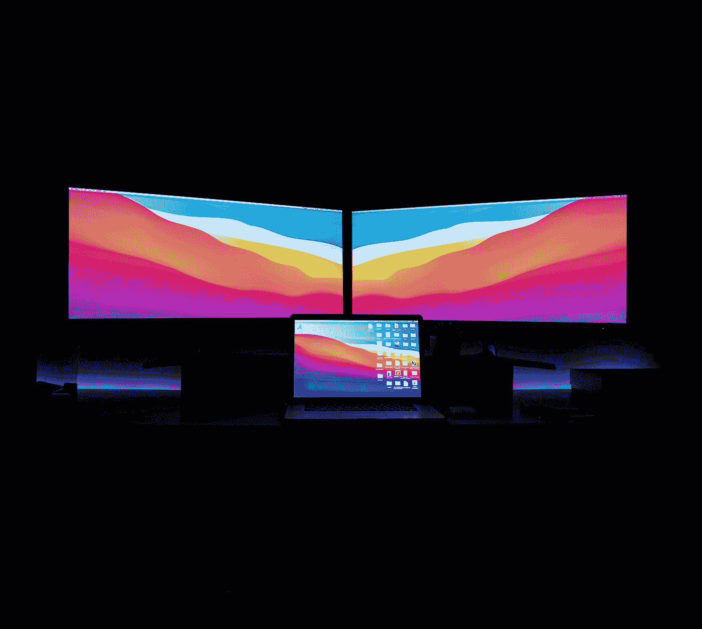

# 开发一个 App 不需要三屏！

> 原文：<https://levelup.gitconnected.com/you-dont-need-three-screens-to-develop-an-app-e42c9ebf0ac6>

## 屏幕阵列对环境不负责任的时尚…

英国开尔文设计公司在 [Unsplash](https://unsplash.com?utm_source=medium&utm_medium=referral) 上拍摄的照片

还记得我们摇着 12 英寸 CRT 显示器，屁股大得足以给一窝小猫和它们的妈妈保暖的日子吗？或许你不知道，但我知道。也许这让我变老了，但也让我变聪明了。是的，比液晶面板时代的所有孩子都聪明。这也使我能够说，大部分技术是在具有单个——并且以现代标准——小屏幕的工作站上开发的。这些监督者看到一些真正的核心工程正在进行。然而，当苹果在 2020 年推出 M1 时，大多数人都在抱怨什么呢？缺少三显示器支持！

## 你们都需要面对现实

很少有人会想到，也许，仅仅是也许，**入门级 M1 只支持双显示器是有原因的**。在 MacBook 的情况下，13 英寸的 Air 和 Pro 都是内置屏幕和一个额外的屏幕，iMac 24 英寸也是如此，而 Mac mini 的情况下，两个屏幕，一个通过 Thunderbolt，另一个通过 HDMI。愤世嫉俗者会声称，当然，这都是为了钱，而超级天真的人会说这都是为了环境和能源消耗。有趣的是，两组都是对的，但这两种观点都无关紧要，因为这是各种考虑的结合。

首先，苹果将希望保持其各种级别的设备阵容，无论是从营销角度还是为了提供资金价值。虽然 M1 机器能够以低得离谱的功耗提供大量的原始性能，但其目标受众是家庭休闲用户、学生、经常出差的专业人士，甚至是潮人。**这些用户类别中没有一个特别热衷于运行三屏幕设置。他们不需要，也负担不起，而且会认为这不切实际。**

但是当然，每个规则都有例外，你会发现一些专业人士确实想超越一个屏幕。像我这样的程序员就是一个极好的例子。这些年来，我在许多软件开发公司工作过，从小型到大型，从低预算到高预算，并且有机会拜访了许多其他公司。数据似乎表明，大多数人，大约 90%以上的软件工程师，最多使用两块屏幕。 IT 部门通常需要一个合理的理由来申请第三个。**理想的设置似乎是双屏幕设置，很少有软件工程师对此有异议。**它允许并行编码和运行代码，而无需拆分或切换桌面。

开发人员表现得像个大明星，抱怨需要额外的屏幕来提高工作效率，他们需要面对现实，因为第三块屏幕以任何可衡量的方式提高工作效率的情况极其罕见。**我可以理解一些家庭办公室的工作流程依赖于三个甚至四个屏幕，但没有证据表明同样的工作不能在两个屏幕上完成**。我自己尝试了三屏阵列设置，虽然额外的屏幕空间确实给了我更多的空间来忘记关闭窗口和应用程序，但 10 次中有 9 次最后出现在第三个屏幕上的不是我的电子邮件客户端、Apple Music，就是一个单独的终端窗口，如果有一个不错的 IDE 或代码编辑器，大多数时候这些窗口都是多余的。

## 你不负责任

但是，让我们忘记使用趋势和时尚，甚至忘记各个公司的 IT 人员会声称什么是规范。所有这些都是真正的第一世界问题，与全球悲剧相比，我们一次创造一个额外的屏幕。

我刚刚从一个 28 英寸的 4K 三星外部屏幕。就能源之星评级而言，它是 g 级。我使用的显示器是 27 英寸的苹果工作室显示器，评级为 e 级。虽然这没有什么值得大书特书的，但它仍然比三星的评级高两级。这意味着，它使用更少的电力。

 [## 忘记那些批评家吧，苹果工作室的展示令人兴奋

### 我只用了不到 30 分钟就确认了…

medium.com](https://medium.com/codex/forget-the-critics-the-apple-studio-display-is-mind-blowing-21cceaaa06bd) 

这对我的电费和环境都有好处。我保留了一些我辛苦赚来的钱，每年都让几棵树免于被砍倒，或者至少让国家电网的压力减轻一点，也许在微观上甚至有助于缓解正在发生的能源危机中的国家之间的紧张关系。

我知道上面的话听起来有点天真，但是请听我说完。想象一下，如果每个人都这样做。**想象一下，如果每个人都关心获得一台更节能的显示器，只在真正需要时才获得额外的屏幕**，并尽最大努力实现最多两个屏幕。

> 事实是，无论是你的小 React 应用程序，还是你的棱角分明的庞然大物，我保证你不需要从电网中吸取三台显示器的电力来设计或开发它。

据我所知，窗口可以调整大小、最小化甚至关闭。它们也可以叠加。让我提醒你。我们日常使用的许多工具都是在单屏幕系统上开发的。如果他们能做到，而且能获利，我们当然也能做到。

虽然盯着多达六个屏幕可能会让某些专业人士感觉更专业，但让我告诉你，不必要的肌肉弯曲是完全没有必要的。如果有什么不同的话**这只能表明你是多么远离办公室门外的现实**，让你不仅成为每个环保主义者的完美坏榜样，也成为花十分钟了解世界现状的普通简和乔的完美坏榜样。

 [## 通过我的推荐链接加入 Medium-Attila vágó

### 作为一个媒体会员，你的会员费的一部分会给你阅读的作家，你可以完全接触到每一个故事…

attilavago.medium.com](https://attilavago.medium.com/membership)  [## 不要从英特尔迁移到苹果芯片

### 请进行全新设置…

medium.com](https://medium.com/codex/dont-migrate-from-intel-to-apple-silicon-db60343d6fb4)  [## 在使用 M1 专业版六个月之后，结果出来了

### 16 英寸 MacBook M1 Pro 和 M1 Max 的 180 天回顾

medium.com](https://medium.com/codex/after-six-months-of-using-the-m1-pro-the-verdict-is-in-d112909c5731)  [## 你真的能在 M1 iPad Air 上开发应用吗？

### 裁决出来了。我尝试建立一个 iOS 和一个 web 应用程序…

levelup.gitconnected.com](/can-you-really-develop-apps-on-the-m1-ipad-air-66f1ef0677f3) 

*阿提拉·瓦戈——软件工程师，一次一行代码地改善世界。永远的酷呆子，代码和博客的作者。网络无障碍倡导者，乐高迷，黑胶唱片收藏家。喜欢精酿啤酒！*