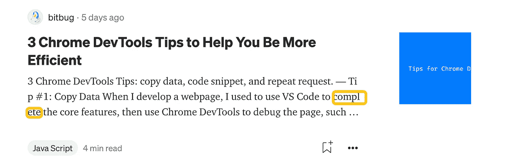

# 省略文本时不需要自动换行

> 原文：<https://levelup.gitconnected.com/you-dont-need-word-wrap-when-ellipsis-text-27307532a3c4>

## 断字可以满足所有情况

# 前言

您是否遇到过类似问题，当需要截断文本时，单词会被拆分:

断词演示

当我们使用`word-break:break-all`时会出现这个问题，我们可以通过用`word-wrap:break-word`代替`word-break:break-all`来解决这个问题:

你是否感到困惑，想知道断字和自动换行的区别？

# 什么是自动换行

`word-wrap`指定浏览器是否应该在单词中插入换行符，以防止文本溢出其内容框。它最初是一个非标准的、无前缀的微软扩展，由大多数浏览器实现。在 CSS3 中它已经被重命名为`[overflow-wrap](https://developer.mozilla.org/en-US/docs/Web/CSS/overflow-wrap)`。根据 [CSS3 规范](https://www.w3.org/TR/css-text-3/#propdef-overflow-wrap)，为了兼容，浏览器应该将`word-wrap`视为`[overflow-wrap](https://developer.mozilla.org/en-US/docs/Web/CSS/overflow-wrap)`属性的遗留名称别名。

下图显示了`word-wrap`属性的值(来自: [CSS 自动换行属性(w3schools.com)](https://www.w3schools.com/cssref/css3_pr_word-wrap.asp)):

1.  normal:默认值，仅在允许的断点处断字。
2.  破字:允许无法破解的单词被打破。

自动换行的行为

# 什么是断词

`word-break`指定浏览器是否应该在文本溢出内容框的地方插入换行符。基本上和`word-wrap`一样，但是支持更多的值(来自 [CSS 分词属性(w3schools.com)](https://www.w3schools.com/cssref/css3_pr_word-break.asp)):

1.  正常:默认值。使用默认换行符规则
2.  全断:为了防止溢出，可以在任何字符处断字
3.  全部保留:中文/日文/韩文(CJK)文本不应使用断词。非 CJK 文本行为与值`normal`相同
4.  断字:为了防止溢出，可以在任意点断字

`normal`和`keep-all`在 CJK 文字上有些区别。对于 CJK 字符，`break-all`和`break-word`的行为相同，但与非 CJK 单词不同。

`word-break: break-word`与`word-wrap:break-word`相同:

所以我们不需要`word-wrap`，**使用**，`**word-break**`，**就可以满足所有要求。**

# 结论

现代浏览器支持`word-break:break-word`，所以你不再需要`word-wrap:break-word`。我发现 Medium 在截断文本时使用`word-break`在列表页面中断开 word。

感谢您的阅读，希望它能帮助您编写更多可理解的代码。

# 参考

1.  [CSS 自动换行属性(w3schools.com)](https://www.w3schools.com/cssref/css3_pr_word-wrap.asp)
2.  [CSS 断词属性(w3schools.com)](https://www.w3schools.com/cssref/css3_pr_word-break.asp)
3.  来自[分词 CSS:层叠样式表| MDN(mozilla.org)](https://developer.mozilla.org/en-US/docs/Web/CSS/word-break)的演示，可以在[分词&自动换行(codepen.io)](https://codepen.io/bitbug/pen/MWVrPQE) 上测试