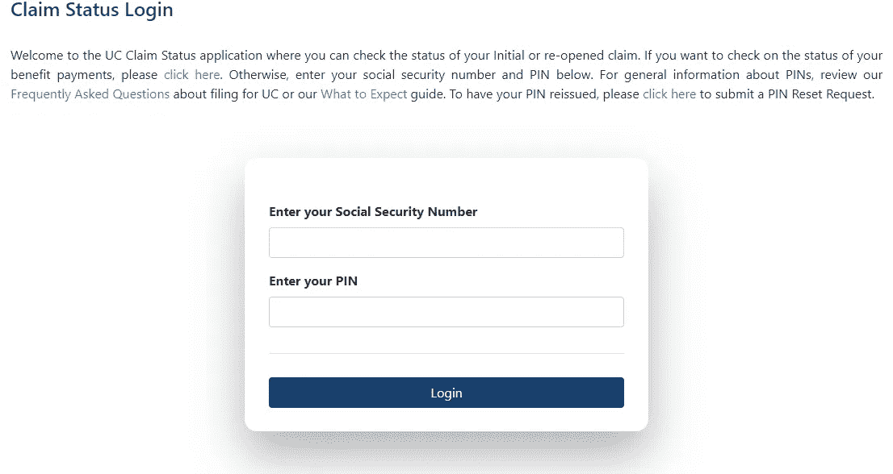
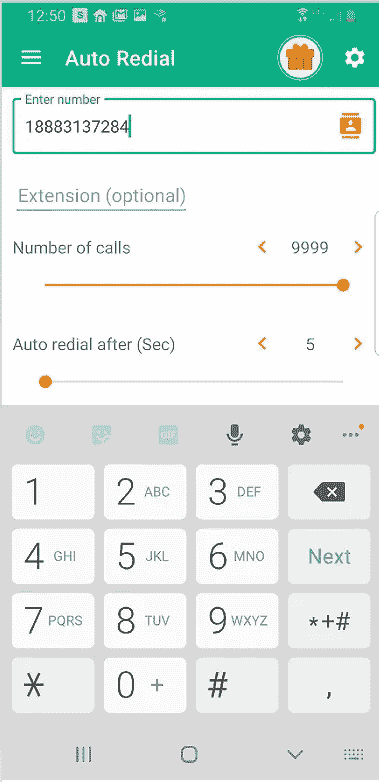
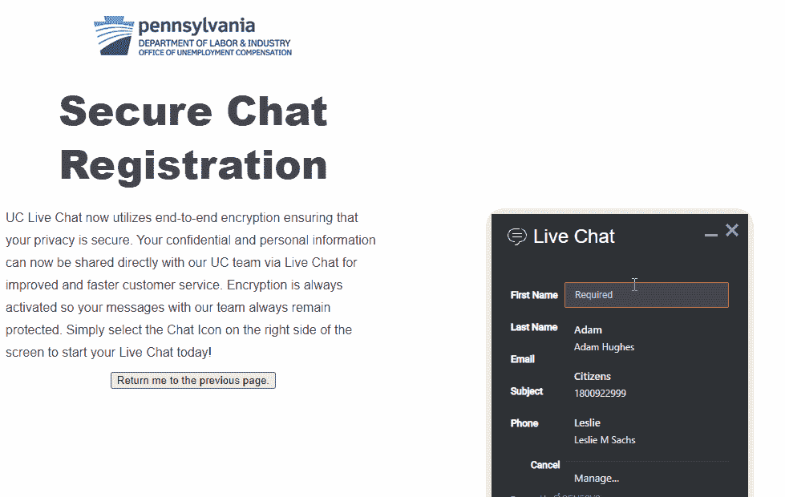
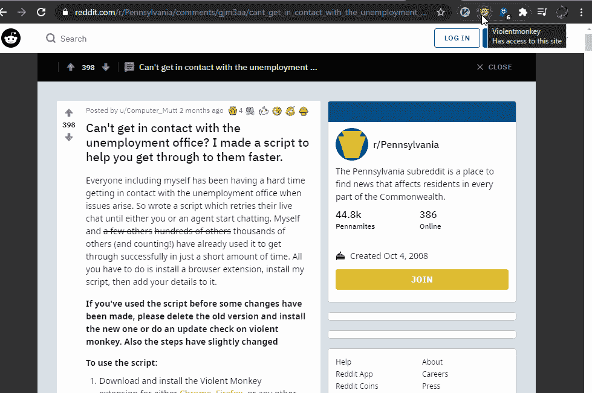
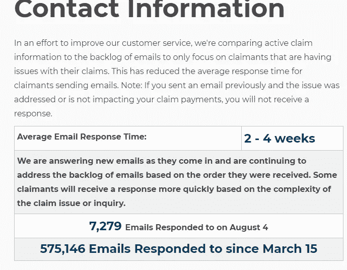
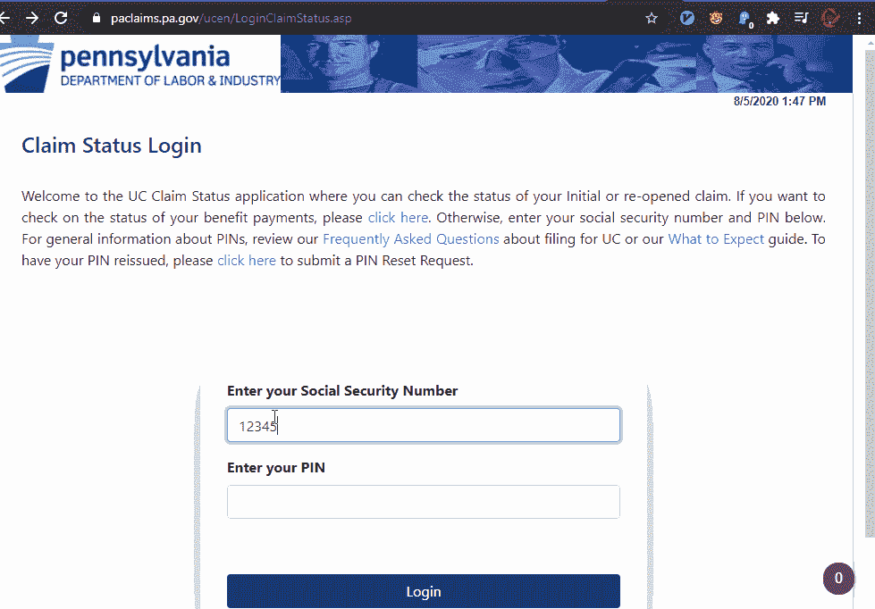
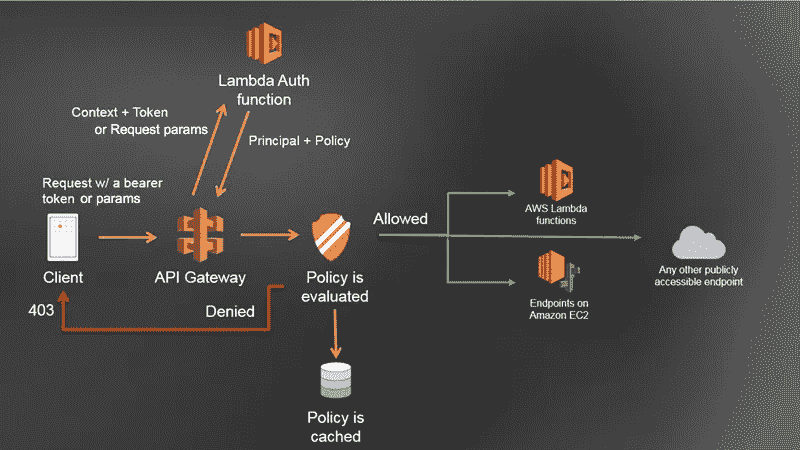
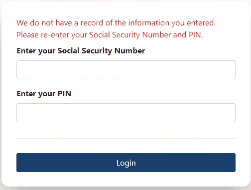
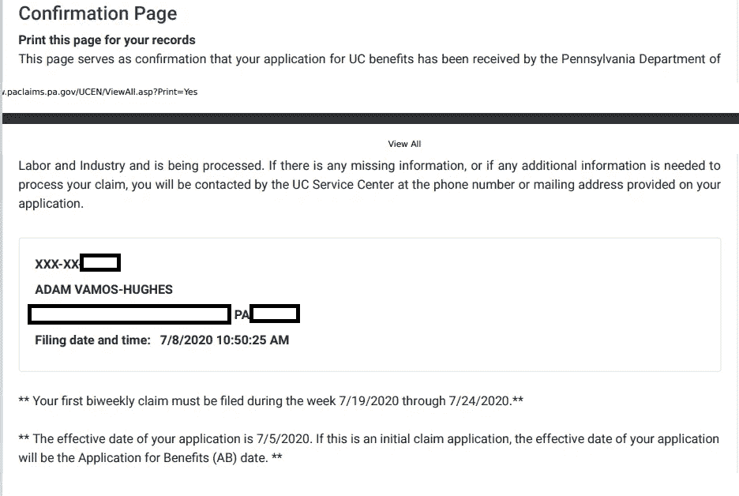

# 不得不成为一名黑客来获得失业补偿

> 原文：<https://levelup.gitconnected.com/you-have-to-become-a-hacker-to-get-unemployment-compensation-de7b384d640e>

## 你奶奶该怎么办？

唉——我可不想非得用我宾夕法尼亚州的 1337 H4X0R skillz。

**2019 年 8 月 10 日**更新:我确实收到了邮件中的 PIN 码，并且能够毫不费力地提交追溯的双周索赔。在这一点上，网站良好的用户体验值得称赞。

# 序

虽然 [60 年的核心失业系统](https://www.cnbc.com/2020/04/06/new-jersey-seeks-cobol-programmers-to-fix-unemployment-system.html)的状况确实是一个国家的尴尬，但我对承受灾难冲击并保持系统运转的工程师和员工表示感谢。他们是竭尽全力的重要员工，值得我们的尊重和耐心。除了庞大的交易量，他们还必须处理[失业欺诈](https://www.mcall.com/news/pennsylvania/mc-nws-pa-unemployment-identity-theft-scam-20200803-d6cn4bycmzacrdqgnq2lqbl5ia-story.html)和[不完整的系统(感谢 IBM)](https://www.inquirer.com/philly/blogs/inq-phillydeals/pa-wants-160m-back-ibm-reform-it-procurement-20171214.html) 。

此外，我对这里讨论的方法不感兴趣。但是由于面临着无法支付抵押贷款和医院账单的风险，我不得不考虑它们。从任何非法或邪恶的意义上来说，他们都不是真正的黑客。窃取数据，危害系统)，我希望他们能帮助别人。

还有一些技术含量较低的方法可以改善你的失业状况。例如，大多数州代表的网页都包含一个电子联系表格。也可以考虑去当地的失业办公室(是的，他们仍然存在)。除了传统的失业保险，还要注意其他项目，比如 COBRA(如果你支付差额，就可以保留雇主医疗保险)和 [PUA](https://www.uc.pa.gov/unemployment-benefits/file/Pages/Filing-for-PUA.aspx) (个体经营者失业保险)。

# 七月:多好的一个月

2020 年第一季度，我工作的创业公司做得很好。我们的销售额增加了；我们在成长。我们在招人。到了 7 月 7 日，我和其他 15 个人都被解雇了，而剩下的员工都接受了减薪，业务迅速转向新的收入来源。所以我在这里，博士，5 年以上的经验，新房子，妻子新诊断出患有罕见的血癌，没有收入，遣散费，或医疗保健。太好了。

申请[宾夕法尼亚失业](https://www.uc.pa.gov/Pages/default.aspx)是相当简单的，并给予信贷在应有的地方，*他们的网站实际上是相当功能*。申请过程简单明了；但是，需要联邦雇主标识号。输入错误会导致整个表格停止(进度无法保存)，所以我不得不多次申请，同时我的雇主会给我发来正确后缀的猜测。这最终搞砸了我的申请——稍后会详细介绍。申请之后，你就可以等待一个 4 位数的 PIN 码出现在邮件中。没有办法跟踪这一点，也没有办法检查您的应用程序的状态。PIN 应该在 7–10 天内到达。三个星期后，我们仍然在等待我们的，必须与他们取得联系。

没有一个普通邮件的 pin，就没有办法检查索赔状态或申请福利。不知道我的初始申请是否正在处理、未完成等…

## 电话系统自动拨号

最初，我每天给失业办公室打 20 次电话，每次都是忙音。做一些谷歌搜索，我意识到[人们实际上每天打失业热线 100 次，而且从来没有打通](https://www.pennlive.com/coronavirus/2020/04/pa-residents-furious-with-unresponsive-unemployment-office-busy-signal-no-live-chat.html)！

我下载了一个名为[自动重拨](https://play.google.com/store/apps/details?id=ru.lithiums.autodialer&hl=en_US)的免费应用程序，第二天就给他们打了 1500 次**，**一次也没打通！此时，我意识到我和妻子遇到了麻烦。

以 5 秒为间隔呼叫 PA 失业高达 10，000 次

最终，我通过了这种方式，但是看看我同时做的或几乎做的其他事情！

## 聊天系统 JavaScript 执行

PA 失业有一个完全无用的实时聊天功能。与大多数接受你的信息并把你放入队列的聊天窗口不同，这个窗口只是断开你的连接，要求在重试之前重新输入信息。想象一下手动填写你的姓名、电子邮件、SSN 等..重复 100 次，只是为了得到一个网络繁忙的信号。

PA 失业:输入信息，断开连接，重复-兄弟你甚至排队！？！？！

现代英雄 Reddit 用户`Computer_Mutt`创建了一个漂亮的 JavaScript 程序来自动化[聊天表单输入](https://www.reddit.com/r/Pennsylvania/comments/gjm3aa/cant_get_in_contact_with_the_unemployment_office/)。如果你是技术人员，它实际上很容易安装，但是一般的外行人没有机会！

1.  添加并启用一个名为暴力猴的 Chrome 浏览器扩展。
2.  将 Reddit 中的 JS 脚本复制到暴力猴子编辑器中。
3.  使用聊天字段的个人信息更新脚本，如名字/姓氏。
4.  将脚本关联到暴力猴子菜单中的聊天页面。
5.  导航到页面，瞧。该脚本将自动重试聊天。

用 JS 填写字段并自动重试。

尽管连续几天让这种情况持续了将近 20 个小时，我仍然没有打通，并且确信聊天窗口的另一端实际上没有人。

## 电子邮件自动化(不需要使用这个)

失业网站建议如果电话打不通就发邮件。整个七月，我这样做了几次，但从未得到回应，所以我考虑或许发送数百或数千封电子邮件...

基本上，它涉及一个 python 脚本和 AWS 简单电子邮件服务(SES)。SES 与现有帐户(如个人 GMAIL)集成，并通过它发送电子邮件。

AWS SES 鸟瞰图

我的理由是，如果我每 5 分钟发一封电子邮件，可能从不同的发件人地址发送，以欺骗垃圾邮件过滤器，也许我会得到回复。我决定不采用这种方法，因为电子邮件可能会以先到先服务的方式排队。因此，无论我发送多少，它们都不会被发现得更快，我只会堵塞系统。看起来像是徒劳的努力**、**，根据他们的帮助页面， [PA 失业似乎在电子邮件上尽了最大努力](https://www.uc.pa.gov/Pages/Contact-Us-UC-Benefits-Info.aspx)。

PA 失业网站上的每日横幅跟踪电子邮件响应。呀。

## 销断裂(也不需要使用这个)

去 3+周没有这个该死的蜗牛邮件 PIN，我决定只是尝试一个随机的 PIN，看看会发生什么。例如，考虑 SSN 123–45–6789 和 PIN 1234。

登录虚假帐户时出现异常响应

作为一名 web 开发人员，我注意到了几个特点:

1.  从按下登录到得到回应，大约花了 5 秒钟(很长时间)。
2.  回应了一个 500 内部服务器错误。

一个没有错误的系统会返回一个 400 错误，并附带一条有用的消息，比如“社会安全号无效”或“找不到登录”。此外，缓慢的响应时间让我相信 web 应用程序没有将授权过程与系统的实际业务逻辑完全分离。此外，我认为登录过程中的其他一些标准做法也不严格，例如，在速率限制或拒绝来自同一个 IP 地址的太多连续请求方面。

AWS 中的现代 web 堆栈示例，其中 Auth 由 API Gateway 和 Lambda 函数处理，这两者都独立于网站的其余部分，并且可以自动扩展以满足流量(即大量登录)。[https://docs . AWS . Amazon . com/API gateway/latest/developer guide/API gateway-use-lambda-authorizer . html](https://docs.aws.amazon.com/apigateway/latest/developerguide/apigateway-use-lambda-authorizer.html)

考虑到所有这些因素，可能有可能简单地尝试每一个可能的 4 位数 PIN (0000，0001，… 9998，9999)直到一个有效。他们的系统真的应该让这成为一个 8 或 12 位数的 PIN。

因为只有 10，000 种可能的组合，而且 web 请求可以并发发送，所以可能会在 10 分钟内尝试所有的组合，而不会给系统带来太大的压力。一个类似于 LiveChat 解决方案的暴力猴子脚本就足够了，或者使用 [Chrome dev 工具来记录登录 POST](https://developers.google.com/web/tools/chrome-devtools/network/reference) 请求，并从 Python 或 Postman 重新发送。

**更新:**似乎 500 错误是间歇性的，有时网站确实会返回有用的响应**，**所以也许我没有给予足够的信任。

一段时间后，得到了这个更有用的 4XX 错误。

# 奥古斯特:终于打通了

8 月 3 日上午 11 点，重拨应用程序终于接通了，*我坐在那里听了 2 个小时的电梯音乐*！一个非常有帮助的名叫丹妮尔的同事找到了我的申请。**显然，从提交之日起，它就一直处于未完成状态，从未开始处理**！这就是为什么别针一直没到…浪费了一个月。

在进一步分析之前，考虑一下这是多么严重的系统性失败。首先，他们的网站让我提交一份不完整的申请。Web 表单必须验证所有必需的信息都已输入，用户才能按提交。这里不是这样的，我甚至有确认收据！

成功提交申请后确认页面的一个片段，尽管明显缺少必需的信息字段！

第二个失败是可见性。因为 PA 失业网站没有帐户的概念(即用户名/密码登录)在收到 PIN 之前，我无法检查我的申请状态。但是，由于申请状态不完整，PIN 一直没有到。谈谈第 22 条军规。

此外，他们缺乏一个辅助的协调服务，可以注意到不完整的申请，并通过电子邮件或短信提醒申请人。*如果我没有调用 2000+次，我的应用程序会永远停留在那里吗*？MIA 还有多少这样的备案？这真的很可怕——**人们的生活可能会被这种无能给毁了！**

Danielle 最终更新了缺失的信息并提交了我的申请。正如我前面提到的，因为我的雇主的联邦身份证号码的问题，我不得不多次填写申请。在这样做的时候，我变懒了，而且一定是忽略了一些细节，导致了表格的不完整。所以请在提交申请前仔细审查你的申请。

## 所以至少我现在有钱了，对吧？

不，所有这些努力只是为了让我的第一个应用程序开始——这个过程对大多数人来说只需要 15 分钟。我仍然不得不等待难以捉摸的 PIN 和批准文件，更不用说“未来几天的电子邮件确认”…真的*天*？由于我去年在新泽西州工作，PA 和 NJ 系统必须在批准我的请求之前进行接口；这肯定会进一步拖延这一进程。有人向我保证，可以回溯索赔日期，以便弥补错过的申报期。如果幸运的话，以这样的速度，我将在 10 月份拿到我的第一张支票，那时我们的存款将会全部用完。到那时，我可能已经成为真正的黑客，为了生存不择手段…