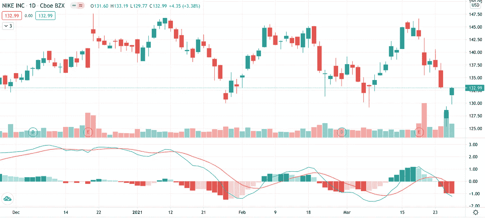
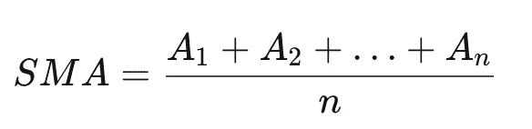
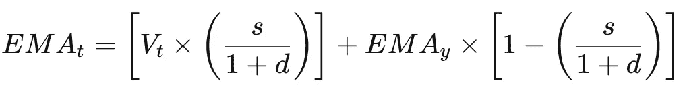
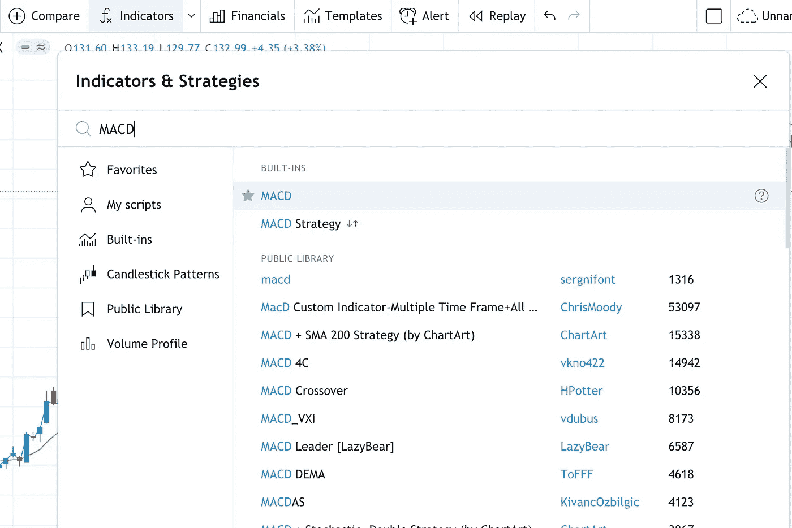
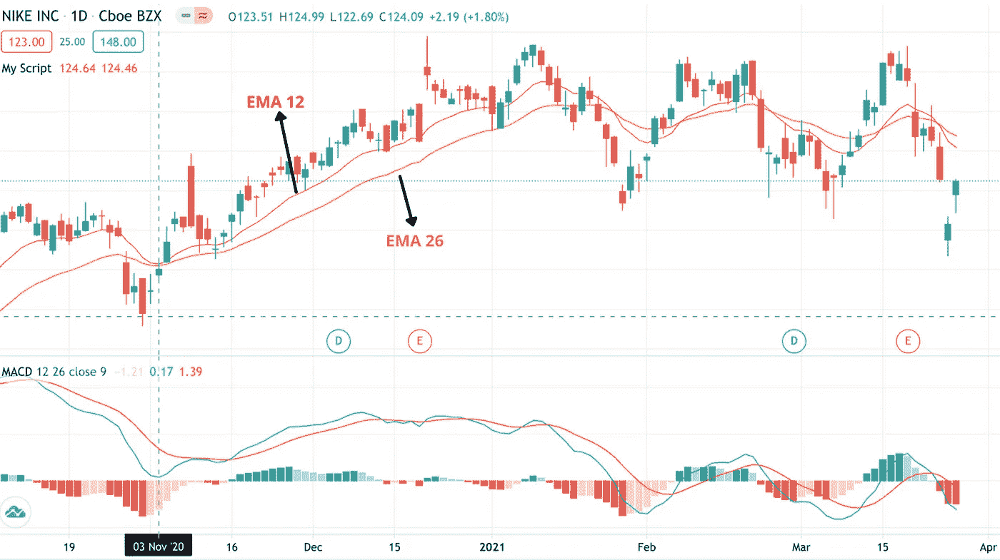
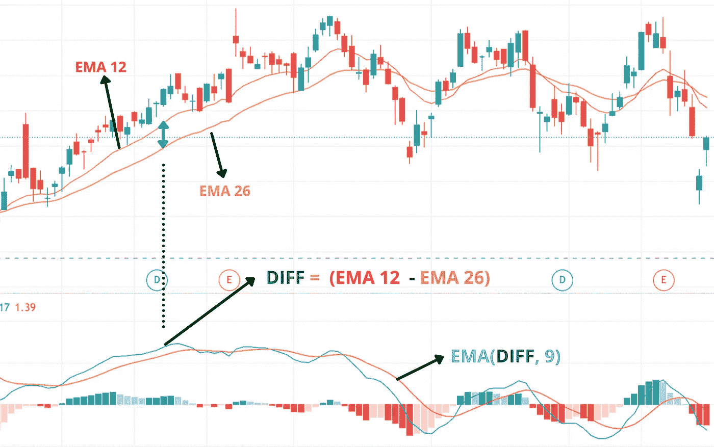
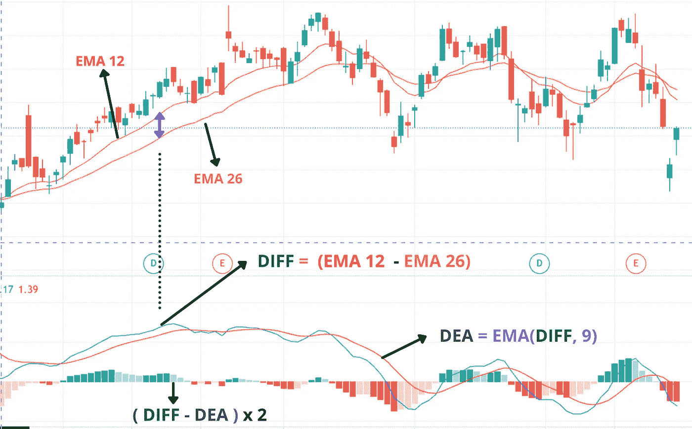
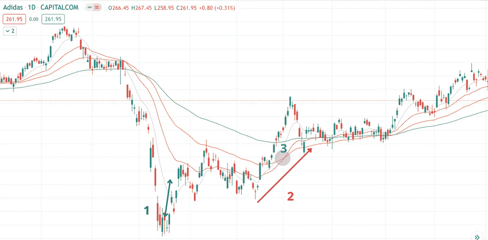

# 你刚刚在交易中滥用了 MACD 指标

> 原文：<https://levelup.gitconnected.com/you-just-misused-the-macd-indicator-for-your-trade-78fc3a599d16>

## 什么是 MACD 指标？先说要领。

## 简单的计算和简单的逻辑。然而被误解了。



**自拍:MACD 指示器**

# MACD？

移动平均线收敛发散，又名 **MACD** 。
三个主要术语:

*   **移动平均线**
*   **收敛条件**
*   **发散条件**

通俗地说，就是暗示了**两条** **移动平均线**的收敛和发散的条件，彼此的关系，以及最后但并非最不重要的**它们之间的距离**，这些都落在每一个特定的条件下(收敛&发散)。简而言之，所谓**偏向**。

我们根据 **26 期指数移动平均线** ( **均线**)减去 **12 期均线**来计算 MACD。

**移动平均线？**

*   简单移动平均线

被称为最简单的移动平均线。根据一组给定范围/周期值的算术平均值计算得出。简单移动平均的计算公式如下:



**参考:**[**Investopedia**](https://www.investopedia.com/)

**其中:
*A***=周期内平均值
***n***=时间段数

*   指数移动平均线

一种移动平均线，通过考虑高权重的**最近价格**来提供更多响应信息。首先，我们像上面的例子一样，在**特定时间段**内计算 **SMA** 。

接下来，我们通过公式:[2/( **选定时间段** + 1)]计算乘数，即加权均线的“平滑因子”。

例如， **25 日**移动平均线的乘数为[2/( **25** +1)]= 0.0769。这个平滑因子和之前的均线结合起来得到当前值。计算均线的公式如下:



**参考:**[**Investopedia**](https://www.investopedia.com/)

**其中:
*EMAt*** =今日 EMA
***Vt*** =今日值
***EMAy*** =昨日 EMA
***s*** =平滑因子
***d*** =天数

> ***EMAy 的第一个值应该是 0，因为没有前一个值。***

> 复杂？
> 
> 别担心，我们在 tradingview 中有现成的功能。

# 从图表→指标



**自拍:交易视图**

此外，我们编写了一些简单的 PineScript 来绘制 EMA-26 行的 **EMA-12** & **以便更好地参考。然后，我们通过点击 Pine 编辑器中的**“添加到图表”**按钮，将我们编写的脚本添加到图表中。**

```
//@version=4
study("My Script", overlay=true)ema12 = ema(close, 12)
ema26 = ema(close, 26)plot(ema12, color = color.red)
plot(ema26, color = color.orange)
```

## 容易吗？结果如下:



**自拍:交易视图**

# 下一步是什么？让我们打开 MACD 指标

**蓝线**表示 EMA-12 &和 EMA-26 之间的距离。我们可以通过从 EMA-12 中减去 EMA-26**得到特定时期的值。**

而**橙色线，**我们称之为**【信号线】**或 **DEA** 计算为均线 12 &均线 26 的差 **9 日均线**

```
**DIFF** = EMA12 - EMA26
OrangeLine = **EMA(DIFF, 9)**
```



**自拍:交易视图**

此外，MACD 指示器显示的**绿色直方图**代表 **DIFF & DEA** 之间的差异。通常，在大多数软件 MACD 指示器中，它带有一个乘数**来放大微小的变化，以便从演示中更容易看到。**

```
(DIFF - DEA) x 2(the multiplier) 
```



**自拍:tradingview**

# 一些快速回顾

*   DIFF = EMA12 **-** EMA26
*   DEA = EMA(差分，9)
*   DIFF **>** DEA:绿色直方图，反之亦然，红色直方图

# 消化

MACD 是一条较快的移动平均线 **(EMA12)** 和一条较慢的移动平均线 **(EMA26)之间的**距离**的指示:某种上涨/下跌趋势的强度**。
其次，它在比较****趋势的强度**和**它的 9 日均线(以前的移动平均值)**。**

**总而言之，MACD 指标为我们提供了一个趋势强度的深度展示，以及它如何从**变强到变弱，或者相反。****

**在大多数情况下，人们将其视为 **DIFF** & **DEA** 线收敛或发散后的趋势变化。但这可能是错误的！**

> **为什么？因为…趋势的力量≠趋势本身**

# **到那时是什么决定了趋势的变化？**

1.  **价格从均线以下转换到均线以上。**
2.  **均线跟着价格的脚步，在向上走。**
3.  **短期均线和中期均线之间的**向上**金叉。**

****

**自拍:tradingview**

**毫无疑问。以上显示了趋势变化的关键步骤。**

# **结论**

****MACD** 用于确定当前趋势的**强度**，而不是当前趋势的**变化**。**

**如果您对所使用的平台和 PineScript 基础知识的操作有任何疑问，请随时联系上一篇文章: [**“如何在 TradingView 中使用 PineScript 编写自己的交易指标？”**](https://medium.com/codex/how-to-write-your-own-trading-indicators-with-pinescript-in-tradingview-b970285a95bc) 或者你可能会在下面留下一些评论。**

> **我们都是一路走来学习的！**